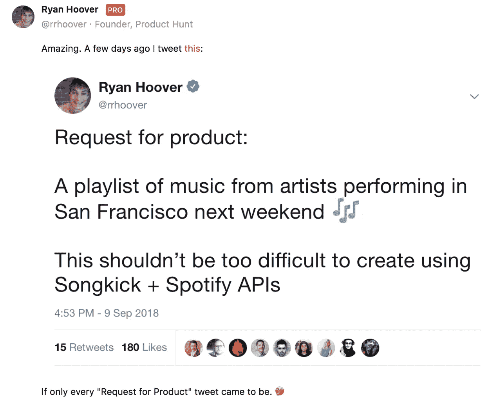
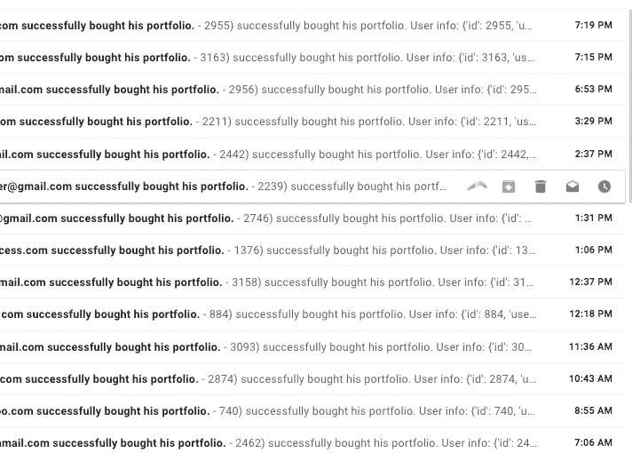
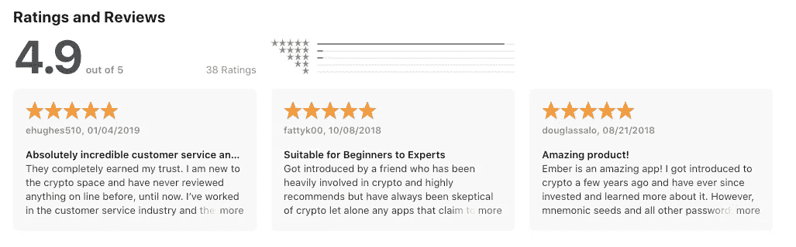
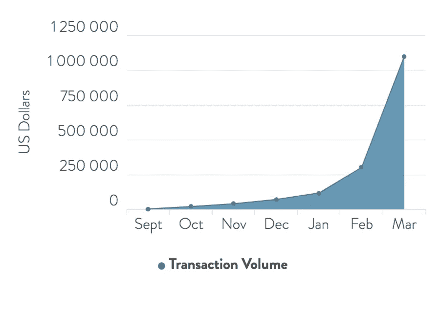

# 我们的加密货币初创公司在 5 个月内从 0 到 100 万美元。吸取的教训。

> 原文：<https://medium.com/hackernoon/0-to-1-million-in-5-months-for-our-cryptocurrency-startup-3c66fd370298>

"如果我们有太多的用户怎么办？"

一个我们在发布产品前天真地问过的问题。我认为总是有一些潜在的希望，这将是实际的情况，因此我们定位自己考虑和思考它。为此，经过深思熟虑，我们在产品中建立了一个安全措施，允许我们在用户超载的情况下“关闭”注册。上面写着这样的话:

> 因为注册人数很多。Ember 基金暂时不可用。请稍后再试。

不幸的是，我们没有将这个错误消息用于…

我们花了 2018 年的大部分时间在晚上和周末工作，构建这款应用程序，这一切导致了我们在 9 月下旬举行的大型产品搜索发布会。对于那些不熟悉的人来说，Product Hunt 是一个网站，建筑商每天都提交产品，社区投票将最有趣的产品排在最前面。想想 Reddit 上很酷的新科技产品。排名前五的项目吸引了成千上万的访问者，大量的曝光率，媒体甚至收购要约。我们为此准备了 6 周时间，联系了朋友和家人、产品搜索用户和前同事，试图为我们的发布争取支持。

这一天来了，我们都准备通宵工作，期待着我们会收到所有的流量。毕竟，我们知道我们在做什么…对吗？就在几周前，我们凭借[登上了排行榜的首位，这是一款我们只是为了好玩而一起开发的产品。](https://www.producthunt.com/posts/jam-hunt)

举个例子，在 Ember 基金[成立前几周，Product Hunt 的创始人 Ryan Hoover](https://medium.com/u/c2146664c8e4?source=post_page-----3c66fd370298--------------------------------) 在推特上发布了一个我们认为非常酷的产品创意。这是一个音乐探索应用程序。Mario & Guillaume(我在 Ember Fund 的联合创始人)熬夜到凌晨 5 点才完成，第二天就开始寻找产品。我们在晚上的大部分时间里都是第一名，最终排名第五，为这个网站带来了成千上万的下载量和浏览量。

我们欣喜若狂。这是我们的练习，我们知道如何到达列表的顶端。

让时间快进到 9 月底 Ember 基金推出的几周前。我们都挤在一起，确保 100 多项的清单都准备好了。

午夜罢工。我们张贴我们的产品。

我们疯狂地让我们的朋友和家人知道我们已经启动。我们花了几周时间点燃的电子邮件爆炸。上升的选票开始涌入，但有些不对劲。我翻遍了项目清单，但哪里也找不到我们。我检查了一遍，然后又一遍，然后又一遍…没什么。

> 我们的项目不知何故进入了垃圾邮件过滤器，并被完全从产品搜索中删除。

该算法将我们的项目标记为垃圾邮件(可能是因为向上投票的突然涌入)。当产品搜寻团队来拯救我们并让我们重新上线时(感谢 Nick &产品搜寻团队！)我们已经被埋没在名单的底部了。没有媒体，没有知名度，没有用户。那一周是艰难的一周。我们有三个用户的基金投资组合。

几个周末后，我出去见了一些老朋友，他们中的一些人正在建立和运营真正的对冲基金。他们对我们正在构建的东西很感兴趣，我告诉他们 Ember fund 是世界上每个人都可以使用的加密货币对冲基金 2.0。我告诉他们“不算太坏！”不好意思透露我们几周前失败了。感觉糟透了。

我认为这是很多人气馁的原因，有些人甚至放弃了。我很幸运，有一些富有弹性、创造力和无限勇气的共同创始人。所以我们喘不过气来，开始工作。

接下来的一个月，我们疯狂地试图找出下一步该做什么。压力很大。我们花了将近一年的时间来打造这个神奇的产品。我们是世界上第一个允许我们的用户完全访问他们的资金的移动产品**和**利用基金经理的智能来管理他们的密码。我们建造了革命性的东西！为什么没人咬？

事后看来，我们的时机真的很糟糕。这不是我们能够控制的，但当我们推出比特币时，它的价格已经跌至 6500 美元。几周后，BCH 福克惨败，BTC 再次下跌，这次几乎下跌了一半。人们此时并没有投资加密货币，尤其是散户投资者。

接下来要做的事情是想办法把这个词表达出来。脸书、谷歌和大多数大公司继续禁止加密货币公司在其平台上做广告。我投了一吨的媒体，似乎每个人都害怕写关于加密项目，其他人只是想让我们付费玩我们完全反对的游戏。我们花了 3500 美元买了一个约翰·麦卡菲的播客，结果也是彻底失败。

我们开始试图向有影响力的人推销我们的愿景。答对了。我们很幸运，两个非常有影响力的人相信我们正在建设的东西。第一个是 Marius Kramer，他是 Quora 上关于加密货币的头号作家，第二个是 T2 的 DataDash (Nicholas Merten)，他是 Youtube 上关于加密和投资的头号影响者。在这个行业中，我认为他们喜欢加密投资应用的想法，用户实际上持有自己的资产，而不是信任其他人来做。他们上船后，事情就开始了。我们还在为数不多的允许加密业务做广告的广告平台中发现了一个漏洞，并开始利用它来产生**，我们在**投入 1 美元就产生 3 美元。用户终于开始注册并试用该产品。

Should probably change to “his/her portfolio” since we actually have lot of women users…

我们希望与客户建立紧密的反馈回路，因此我们会回复每一份客户支持请求，我会将所有客户来电转接到我的个人手机上。人们会打电话来，我会毫无顾忌地告诉他们，他们正在和一位创始人聊天，我们是一个小团队。我们想照顾我们的用户，深入了解他们喜欢这个应用程序的什么，他们有什么痛点，并询问他们希望这个应用程序有什么功能。对我们来说，没有用户是太小的。我们学到了很多，并不断改进产品。我们建立了再平衡功能，通过你的银行链接和融资的能力，Android 支持，定制投资组合，以及许多其他基于用户反馈的功能。人们喜欢我们的产品以及我们在客户支持方面付出的努力。我们的主题是遵循硅谷的格言，快速行动，以追求完美为代价，打造用户想要的东西。我们通过客户服务积极地弥补了产品中的不足，并且取得了成效。

Our Apple Store reviews :)

从那时起，我们的增长开始突飞猛进。

如今，我们每个月的交易额远远超过 100 万美元，现在我们已经处理了数万笔交易。有些用户在这个平台上投入了超过 50，000 美元。感觉很好，但还有很多事情要做，现在赌注高得离谱。

我们离我们想去的地方和我们认为可以去的地方还很远，但是我们真的很自豪我们在几乎没有资源的情况下走了这么远。我们没有风险投资支持(*还没有*)，启动资金只有 15，000 美元。我们已经运行了超级精益，并专注于取悦和照顾我们的用户。

我们认为余烬真的很大。不仅是作为一个企业，而且是我们对人们的影响。我们希望公平竞争，并坚信我们可以将老练的专业投资者使用的金融工具提供给世界上的任何人。加密货币旨在使货币民主化，我们很高兴能够以一种保留原始精神的方式促进这一点:自我保管。

总结一下，以下是我学到的东西:

1.  没有人关心或会记得你的发布会。如果你失败了，不要让它影响你。拿起电话和人们交谈，弄清楚他们为什么喜欢或不喜欢你提供的东西，并制造他们想要的东西。是的，你已经有了狭隘的视野，所以去和人们聊天，找出你错过了什么重要的见解。
2.  遵循“快速构建，打破常规”的陈词滥调(也许不要像 Theranos 那样...)但是**用对客户支持的极高期望来弥补这一点**。我们的社区看到了我们对他们的承诺。我们在周六晚上发布功能，通常在几分钟或几个小时内回复他们，并尽可能确保他们感觉受到了照顾。我认为这建立了信任，事实上给了我们一个机会向他们展示当事情不按计划进行时，我们是如何尽心尽力地照顾他们。
3.  **利用约束来获得优势。**作为一个行业，我们被禁止在大型广告网络(谷歌、脸书等)上做广告。因此，我们必须发挥创意，通过我们的影响者找到其他营销方式。专注于有效的部分，无情地砍掉其他部分。从某些方面来说，这是塞翁失马焉知非福。尝试所有 10 个广告平台/不同的营销活动很容易，但实际上没有一个成功。
4.  **真实可信。我们真诚地相信我们正在做的事情，并且狂热地相信我们都可以拥有自己的资产，而不必信任第三方。我们所有的合作伙伴、客户、基金经理都认同这一愿景，并理解我们真的很关心这一点，似乎想帮助我们取得成功。**
5.  **保持谦逊。**

[Ember Fund](https://emberfund.app.link/hackernoon0to1million) 只需 100 美元，世界上任何人都可以像加密货币对冲基金一样进行投资。检查一下，让我知道你的想法。

我们发展迅速，正在招聘员工！如果你有兴趣在增长/营销、工程方面与我们合作，甚至在这里创造你自己的角色，请给我发电子邮件:emberfund.io 的 alex。

感谢阅读。