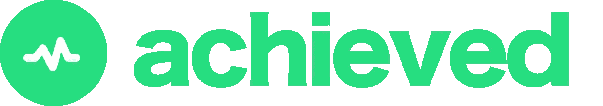
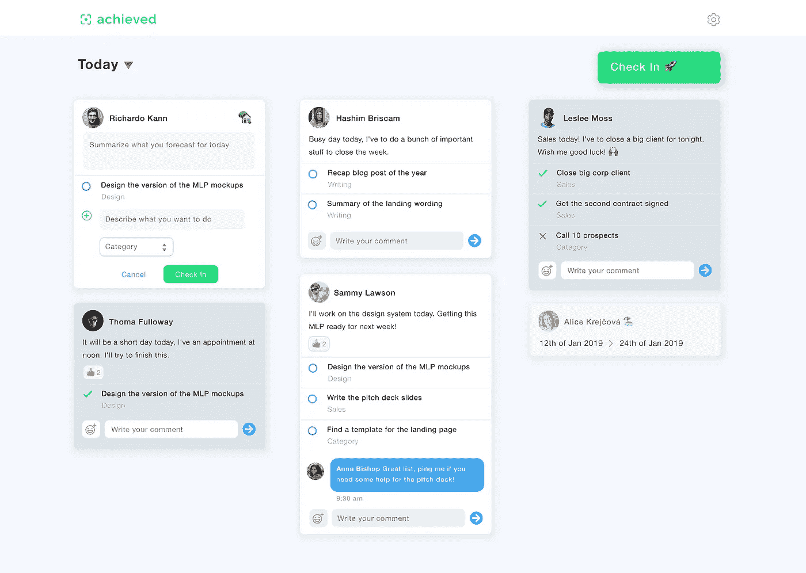

# 从构思到登陆页面，我们是如何实现的

> 原文：<https://medium.com/hackernoon/1-from-ideation-to-landing-page-9cf690afba32>

大家好，👋,

我们在 4 周前开始了我们的旅程，并且认为是时候与你们所有人分享发生在我们身上的事情，以及我们所学到的东西。

在开始之前，你可能想再看一遍我们的宣言。

**TL；博士**

> 实现帮助组织中的每个人。从同事互动到战略决策。我们帮助每个人专注于最重要的事情，调整他们的活动，接受挑战，并以理想的社会参与水平获得支持。
> 
> 作为技术爱好者，我们的目标是设计一个简单的解决方案来处理个人生产力和团队合作。我们希望这个工具简单、令人愉快且具有交互性；但是我们也希望它是异步的，这样人们就可以按照自己的时间来工作。
> 
> 结果是实现了，一个简单的工具来预测你的工作日和跟踪，一步一步，你的目标的实现情况。

# **第 1 阶段—确认客户需求🤓**

我们一开始采访了大约 20 到 30 个人，从企业主到团队成员到经理。我们还做了大量研究来绘制市场地图和评估潜在竞争。这一步至关重要，因为一开始我们脑子里有 5 个不同的商业想法，必须决定哪一个最有潜力…

除了两次采访，所有这些采访都证实了我们的理解，即人们对我们的想法有需求，但竞争不足以阻止我们追求它。所以，我们决定继续前进。小心…

# **第二阶段——思考🤯**

第一阶段的重点是我们的朋友网络和业务联系，所以下一步是向世界其他地方介绍我们的商业理念。🚀我们认为最好的方法是建立一个清晰简单的登陆页面，并拥有强大的社交媒体。

在设计我们的网站时，我们受到了当前创业趋势的启发，要有一个非常干净和轻量级的网站，有足够的视觉和文字来推销我们的想法。

尽管建立网站的过程本身非常简单明了，但它让我们考虑了更多与我们的品牌相关的复杂问题和选择:

*   产品名称
*   域名
*   标志；徽标
*   首次设计

对于早期创业公司来说，品牌化可能是最耗时的话题，但它绝对是必不可少的。品牌包括从公司名称和它的潜力到更具体的网站元素，包括它的基调、调色板、设计风格等等。

我们的主要关键词:**结盟、关注、目标、成就、承诺和庆祝** —我们决定如下:

*   简单明了的交流，短句，透明，没有废话的风格。
*   绿色和蓝色，这两种颜色被证明可以促进信任、雄心、专业精神、嬉戏和快乐的感觉。
*   最小化的应用程序设计。设计应该尽可能简单，让用户能够专注于自己的任务和同事的消息，而不会感觉到使用应用程序的沉重

## **产品名称**

这可能是最容易想到的一个了。我们想用一个大家都能理解的普通词。我们想用一个词来建立我们的应用概念和品牌。

对我们来说显而易见:

*   **达成**:你成功了的事情。
*   **成就**:成功了，值得庆祝！🎉
*   成功者:积累成功的人。

## **域名**

显然，[www.achieved.com](http://www.achieved.com)已经很贵了，这意味着我们必须想出一个替代方案。因此，我们决定购买[www.getachieved.com](http://www.getachieved.com)，它既实惠又好记。

## **标志**

设计一个标志可能是早期创业公司最耗时的任务之一。我们决定让它非常非常简单。

达成是关于一致性、焦点、目标、成就、承诺、庆祝等。我们想要一个反映这一点的标志。经过几次迭代，我们最终得到了这个结果:

www.getachieved.com

## **设计**

那是“哦嘘**”的时刻。🤯

酷，我们有想法，我们知道市场上有需求，我们有第一个网站的关键信息，我们有一个标志，但…我们没有任何实际的视觉放在我们的网站上。哎呀！

Achieved application dashboard

我们应用程序的第一个设计花了我们大约 2 周的时间。

# **第 3 阶段—构建(登录页面)🚧**

## **框架**

我们最初计划使用[独角兽平台](https://unicornplatform.com)，因为我们发现它确实很有吸引力，但我们不想在这一点上花任何不是绝对必要的钱。我们特意把预算控制在最低限度，只在域名和邮件服务器上花了钱。所以，我们最终决定使用[这个免费库](https://www.froala.com/)。

## **页面**

我们的目标是尽快发布网站，所以我们将页面数量限制到了最低限度。我们想要推销这个想法，列出它的好处，展示这个应用的特点，就是这样。一两周之后，我们决定再增加几页。

## **合法的☠️**

尽管这真的很无聊，但我们真的很关心拥有一家企业的法律方面。为了保护我们和用户，我们让人们必须阅读并接受我们的条款和条件，以及我们的隐私政策，如果他们想浏览我们的网站。

我们的建议是:在法律术语方面，不要试图重新发明轮子。通过快速浏览网页，你会发现大量防弹法律条款的使用。

# **第四阶段——社交媒体📢**

除了我们的网站，我们还创建了所有的社交媒体账户，开始建立粉丝群。

你可以在 [Twitter](https://twitter.com/Achievedai) 、[LinkedIn](https://www.linkedin.com/company/achievedai/)&[product hunt](https://www.producthunt.com/upcoming/achieved)上关注我们。

**在我们的下一篇文章中，我们将谈论我们在匿名情况下发展品牌声誉的技巧。**