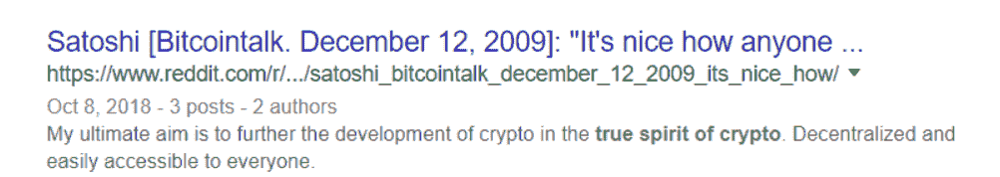
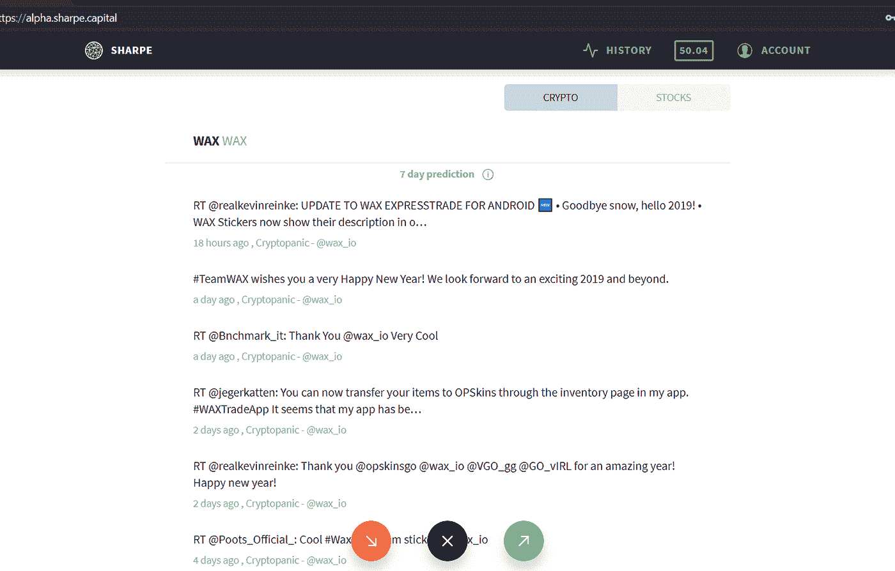
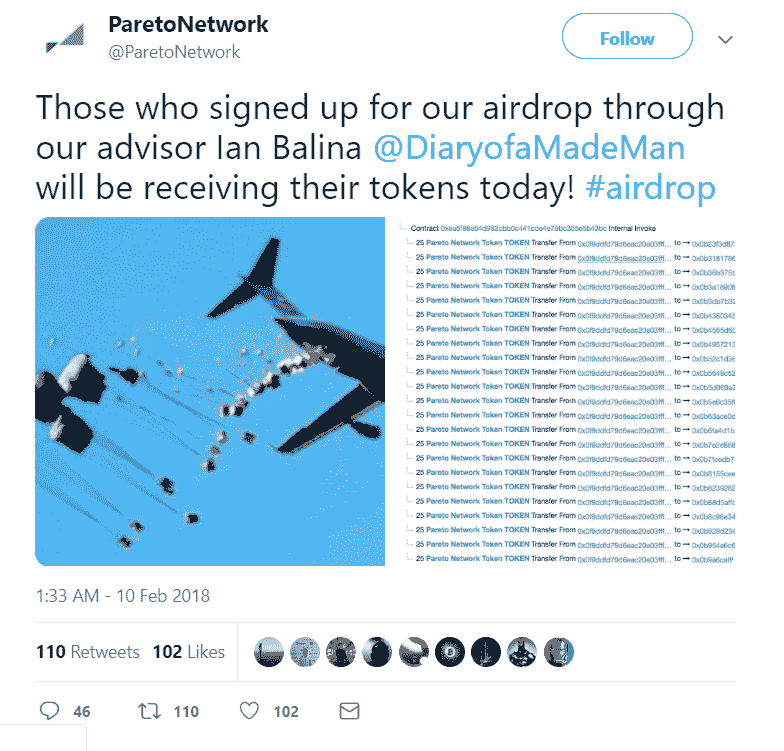
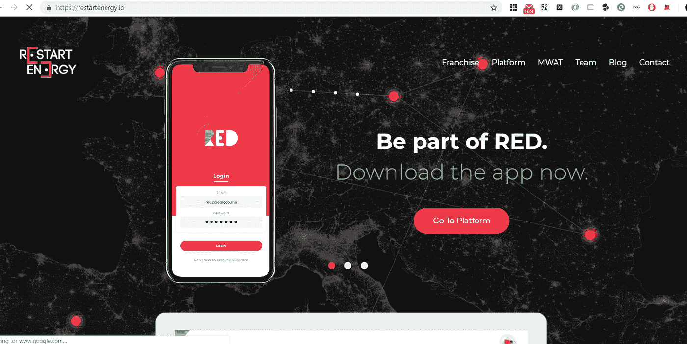
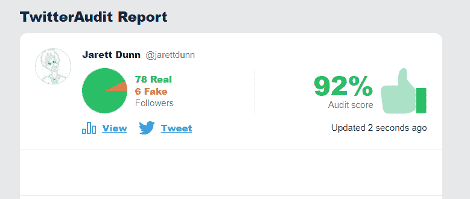
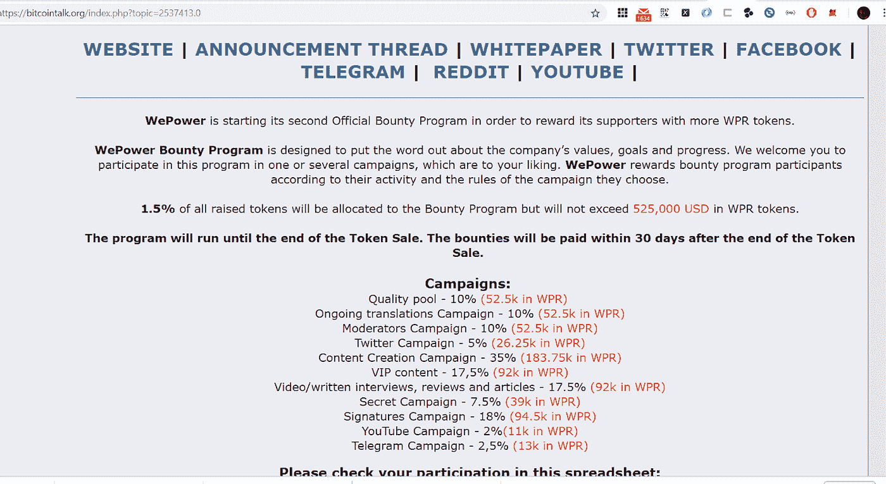
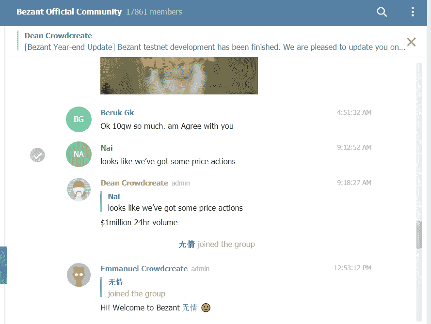
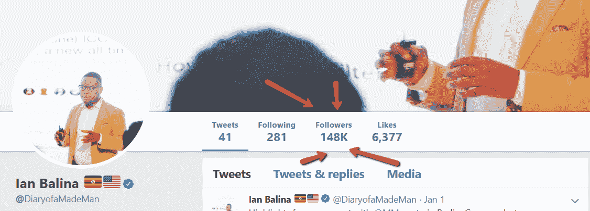
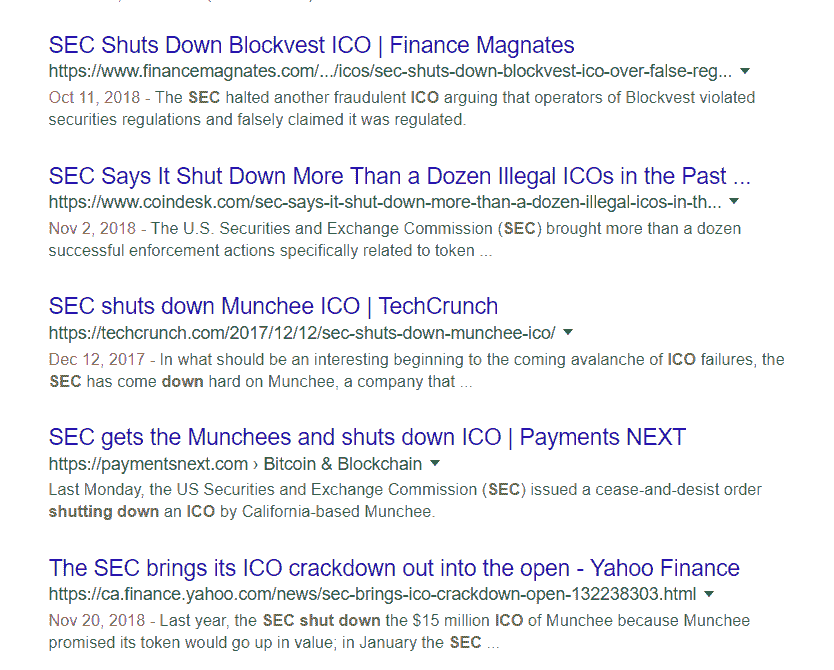

# 制胜 STO 营销战略的 10 大可行见解

> 原文：<https://medium.com/hackernoon/10-actionable-insights-for-a-winning-sto-marketing-strategy-1e6a3b1dc4c9>

证券代币发行是未来(和现在)的关键，提供真实的价值来换取融资，而无需 IPO。景观是不同的，全球和社区为重点，众包，开源主题比比皆是，并且[“真正的加密精神](https://www.reddit.com/r/Nerva/comments/9mgfuz/satoshi_bitcointalk_december_12_2009_its_nice_how/)”将比人们想象的更频繁地被提及。

STO 的关键营销因素是什么？一个人如何比那些未能筹集到资金的人表现得更好？

# 获奖项目

从潜在捐助者的全球舞台上成功筹集资金的关键是要有一个平台、项目或“一块馅饼”，与人们的需求、愿望和最终目标相一致。

那些可以创建工作演示或概念验证的 STO 介于 STO 之前的早期采用者、战略贡献者和 STO 常规众筹之间，它们处于最佳位置，既能留下深刻印象，又能满足潜在支持者对里程碑事件的不可抑制的渴望。[夏普资本在他们的销售阶段](https://www.prweb.com/releases/2017/11/prweb14904213.htm)做了一件令人敬畏的工作，在公众众筹销售之前证明了一个工作版本。

# 获胜团队(+顾问)

在分析你的产品时，潜在的社会影响者和精明的贡献者将“做你自己的研究”，这包括检查团队，看看他们以前一起取得过什么成功。他们会将之前的合作视为一个成功的因素，他们也会为顾问评估你的决定。它们增加价值了吗？他们会给你的组织和项目带来专业知识或追随者吗？[伊恩·巴里纳建议帕累托。例如，网络](https://twitter.com/paretonetwork/status/962258216473190401?lang=en)为了一个巨大的 tokenshare，把他们的项目暴露给他的大量加密追随者！

# 营销宣传材料:白皮书、网站、____ 平台

展示是关键。一个经过深思熟虑、精心翻译、精心展示的网站是赢得朋友和影响他人的第一招——之后，大多数潜在的支持者会彻底研究和审查你的白皮书，看看你是否掌握了竞争格局、潜在的挑战和收益的用途。关于拼写正确、开发精美的网站和营销宣传材料如何提高成功几率的研究[和著名报告](https://hackernoon.com/the-whitepaper-revolution-the-good-the-bad-and-the-sickening-438b51333fa)比比皆是。一家[顶级 STO 和 ICO 营销机构](https://crowdcreate.us/)将帮助您满足您在众筹销售过程中的所有营销相关需求。

# 社交媒体参与度

大多数人(和 STO 评论网站)会查看你的社交媒体，看看你是否被关注，是否有这些关注者的参与。获得 1 万名“真正的 Twitter 追随者”并不昂贵，但衡量成功的真正标准是增长是否是有机的，关注你的人是否参与了你的内容和信息——有机地向他们的追随者传播信息。

如果有人回复你的付费或有机(和定期，频繁！)社交媒体内容，给他们一个深思熟虑的回复是很重要的，不仅要回答他们的问题和担忧，还要解决无数幕后的“潜伏者”或稍后会回顾互动的问题。不这样做可能是灾难性的，[‘等等，又有 113 家初创企业停止在社交媒体上更新他们的现状……’](/@piotr_61543/the-fails-and-successes-in-ico-1300f6261c54)

# 吸引早期贡献者和支持者——奖金！

赏金活动是这本书里最古老的把戏之一:提供一个令牌分享，让人们在社交/博客平台上做自己的推广，产生流量，产生推荐和注册，并有可能找到更多的人来贡献。这是成功的 STO 营销战略的关键，因为它鼓励普通人通过你的项目获得更多的成功，通过推荐他们的朋友或追随者获得收入，并推广你的内容和平台，从而为你和你的团队带来更少的投资和更多的投资回报。

小心合规！一些国家不会因为吸引潜在贡献者并让他们用自己的资金或自己的非 B2B 追随者做广告而给予经济奖励。

[知名网站会推荐你在 btctalk 和其他地方找到多产和参与的赏金经理](https://hackernoon.com/what-should-your-ico-marketing-plan-look-like-in-2018-315135fe9851),读完我们对这个想法的推荐！

# 电报/不和谐社区管理

自从 Slack 辜负了 ICO 世界，无数人成为同一个 ol' Slack 骗局的受害者，该骗局是一个恶意用户创建了一封看起来像官方的电子邮件，其中有不同的指示，说明如何输掉你所有的钱，Telegram 和 Discord 加强了他们的游戏，为众筹社区提供支持。你会发现仍然有骗子，但他们的账户上有一些报告，你不会再看到他们——例如 Telegram，在一定时间内，在特定机器上创建一个或两个以上的账户非常困难，即使有 VPN 或代理之类的技巧。

[一家好的营销或参与公司会在你的社区频道上为你提供 WoW，MoM 有机增长报告，人们会蜂拥而至，对你的项目向 FOMO 和 FUD 发出电报或提出异议](https://crowdcreate.us/crypto-telegram-ico-community-management-crowdcreate/)——因此，拥有全天候的资源来处理所有这些人以及你真正的支持者和贡献者是至关重要的。请注意，成本不一定要像雇佣自己的内部 24/7 支持&参与团队那么高！ [ICO 电报管理](http://crowdcreate.us/)(尤其是那种你可以作为一揽子交易的一部分以低价买到的电报)是你战略中非常重要的一个方面。

# 公共关系

战略供稿者、秘密新闻机构和常规新闻媒体都有一个共同的特点:为了产生最佳效果，它们需要被手持和迎合。Forbes.com 认为公关是成功的 STO/ICO 的重要组成部分。有了一个好的公关代表、部门、外包机构或组织单位，你将拥有足够的资源来与这些中小型企业或大型组织打交道，这比试图将它与你的 18 000 项其他管理职责混为一谈会产生更好的结果。在你力所能及的地方委派和自动化，你最终会工作得更聪明而不是更努力！

# 与加密影响者合作

重要的是要记住，某些秘密影响者比你的普通影响者更有价值，所以在决定对谁的影响进行经济奖励时，“做自己的研究”很重要。一些人通过套利虚假的参与和虚假的追随者来换取 Eth 营销一个项目——确保回顾他们的社会历史，看看你是否注意到参与或追随者被购买的明确“转折点”。

有一些名字你可以立即信任(你的潜在贡献者也会信任)，但它们的成本也要高得多。有时，你会发现你的项目在某些个人或专业层面上与他们一致，他们可能愿意 FOMO，甚至建议你的项目。

我再一次提到 Ian Balina，[他的密码知识](https://www.patreon.com/ianbalina)收费极高——他的名字在密码界就像 PewDiePie 在游戏界一样广为人知。Ian 只是一个例子，Ivan on Tech 和无数其他人都有可以立即信赖的品牌。

# 法规遵循

遵守当地和国际法律和政策非常非常重要。如果出于某种原因，在这方面有任何疑问，这可能是致命的破坏。过去，对不遵从的恐惧粉碎了一些项目。

[这些人在 ICO](https://bitcointalk.org/index.php?topic=2026185.0) 前筹集了 5000 Eth，然后不得不关闭并退还每个人，据我所知，还没有一个类似的想法得到类似的众筹。可以想象，不允许美国、SG 等参与的非美国实体。，将能够成功地筹集大量资金，其想法是令牌可以在一个平台上使用，从共享的 Masternode 服务中获利(令牌持有者受益或要求支付令牌份额，从而使它们成为公用事业)。创意思维和/或企业结构在这里胜出！

# 最后，一个插头！

我们在 [Crowdcreate](https://www.crowdcreate.us/) ，经验丰富，熟悉 ICO 和 STO 的战略和营销，包括端到端的赏金活动管理。我们已经获得了洞察力和工作经验，以及支持我们优势的指标和数据。我们的成就包括在短短 3 个月内将客户的 [Telegram](https://www.crowdcreate.us/crypto-telegram-ico-community-management/) 频道扩大了 1000 %,并且我们已经支持了几十个组织，筹集了数千万美元。