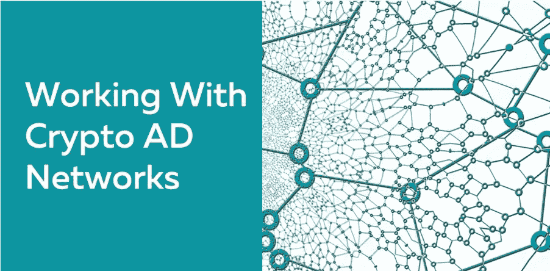
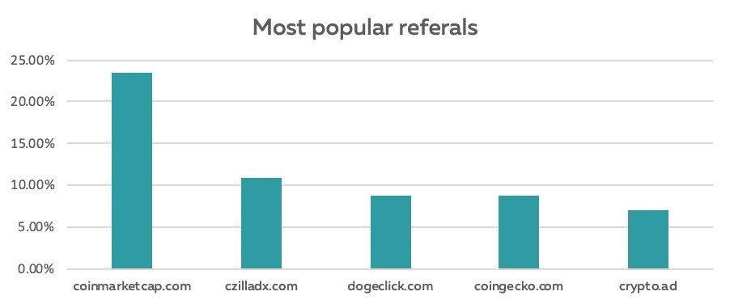

# 使用加密广告网络的 10 大优势

> 原文：<https://medium.com/hackernoon/10-advantages-of-using-a-crypto-advertising-network-a94178e7c815>

从六月开始，我负责 Squilla Capital 的市场营销，我们有两个令人兴奋的产品将于今年九月上市。因此，我必须制定一个营销策略。

正如你可能知道的，有许多类型的广告在不同的媒介或渠道中运行。有些是为了品牌知名度，有些是为了增加网站流量，有些是为了增加销量。但比如你在加密货币领域有业务，应该选择哪种媒介和渠道呢？使用谷歌服务可以吗？使用社交媒体广告可以吗？

为了弄清楚这一点，我分析了竞争对手的流量数据。

正如你所看到的，广告网络在那里有很强的影响力，然而，dogeclick 和 crypto.ad 基本上是付费用户访问网站的“冲浪”服务。它们有利于提升指标，但流量质量低，导致转化率低。

Coingecko 在他们的网站上有一个非常方便的自助广告经理，而你必须和一个经理交谈才能在 [CMC](http://coinmarketcap.com/) 上做广告。

但是，如果你现在需要发起一个针对加密人员的多样化活动，并且没有处理多个平台的问题，该怎么办呢？像 [Coinzilla](http://coinzilla.com/) 这样的广告网络有很多好处。

## 1.您的广告将只发布在行业网站上

目前有超过 500 个主要的加密网站在线，为至少 1.54 亿人服务(这是唯一的 BTC 地址的数量)。毫无疑问，每个拥有加密钱包地址的用户都活跃在至少一个加密相关的网站上。

## 2.你不必担心广告审批过程

你可能知道快速启动广告活动有多重要。即使我们谈论的是折扣、早起鸟，或者可能是计划中的新产品发布，如果活动不能在需要的时候开始，结果也会低于您的预期。

你可能知道，一段时间以来，加密货币广告在大多数广告网络中被禁止或限制。通过使用利基广告网络，你可以确信你的广告会很快被批准，你的活动不会受到延误。

**建议:在开始与广告网络合作之前，检查他们是否为你的活动提供现场支持。*

## 3.HTML5 横幅设计

通过使用加密广告网络，你会忘记横幅设计服务。大多数网络免费提供这项服务。完整的横幅广告将由经验丰富的网页设计专业团队设计，所以你可以肯定你会得到最大的横幅广告。

## 4.高质量的流量

通过使用加密广告网络，你会有很好的流量质量。在满足某些特定要求后，加密货币网站才会推广您的广告。所以，你可以忘记为低质量的网站支付高 CPMs 在利基广告网络中，它们根本不存在。

## 5.自助服务

您可以享受与其他大型网络相同的优质服务和客户界面体验。基本上，你可以完全控制你的广告，所以你可以做任何你想实时改变，所以优化过程是快速和

## 6.支持代理

这是一个很大的优势。利基广告网络为广告活动的发展提供实时支持。事实上，每个广告商都有一个专门的客户经理，随时准备解决可能出现的每一个问题。

## 7.多种广告选择

通过与您的客户经理讨论，您会发现多种广告方法，如本地横幅、标准 IAB 横幅和发布在行业顶级网站上的新闻稿。

写得好的话，新闻稿具有不可想象的力量。你可以让你的买家相信没有人比你更好，只需要几句台词。好的部分呢？——他们将永远留在那里。

## 8.加密货币支付

如果你选择与加密利基广告网络合作，你可以选择用比特币、以太坊或其他加密货币支付，如果需要的话。付款是安全的，匿名的。

## 9.更高的转化率

利基广告网络有更大的转换率，仅仅是因为横幅广告只放在利基网站上。最大的广告网络展示活动的点击率约为 0.10%。你可能会说那是可以的，但事实上，并没有那么好！同时，通过使用利基广告网络，你将获得更高的点击率(大约 0.15%-0.25%)。更高的 CTR 意味着你可以在同样的预算下获得更多的转化。

## 10.性价比高

利基网络上的广告活动可能是营销策略中最具成本效益的部分。可以实时看到结果，几乎每种情况下投资回报都有保障。

如果你是一个加密业务开发者，我们建议你在决定投资一般广告网络提供的营销之前三思。