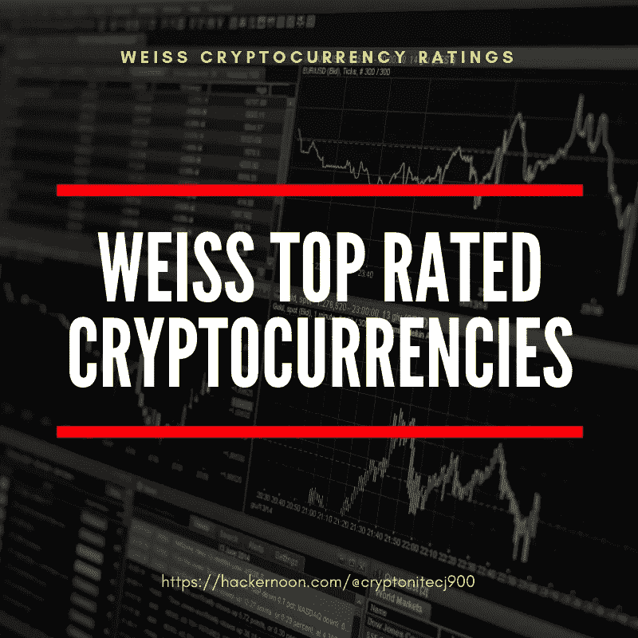
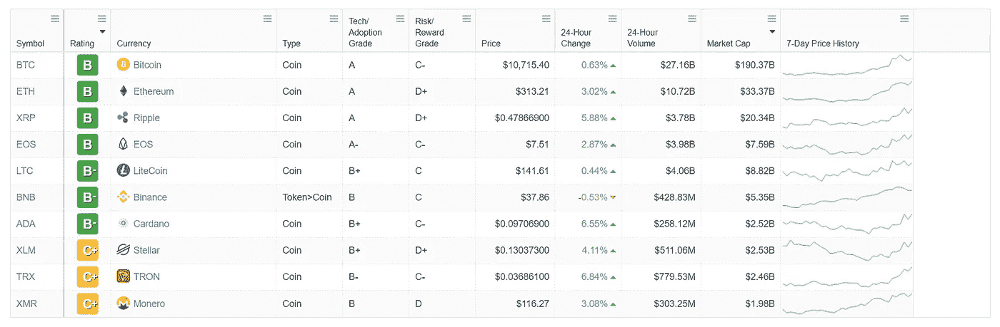
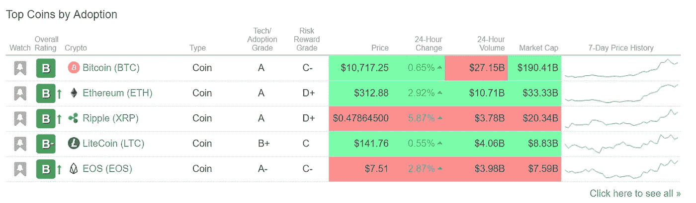
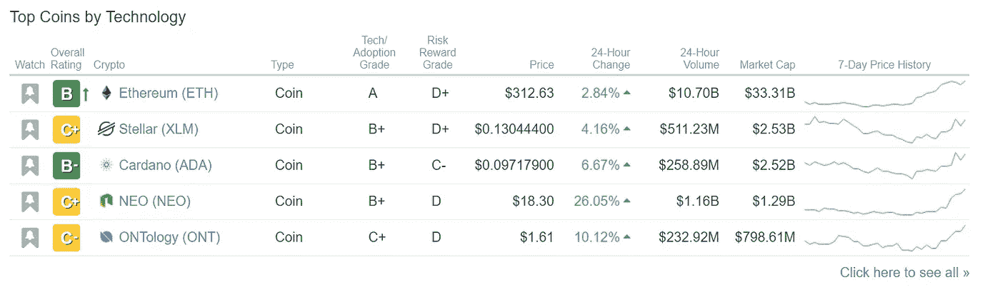
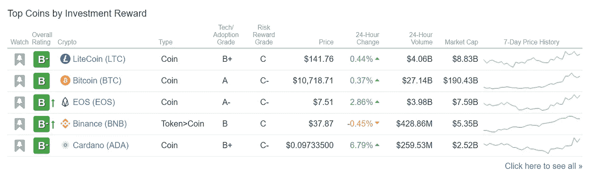
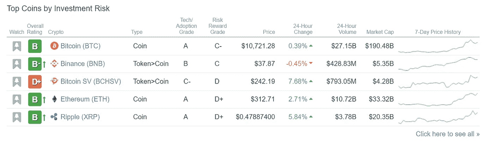

# 根据维斯投资评级，10 种“最佳”加密货币

> 原文：<https://medium.com/hackernoon/10-best-cryptocurrencies-according-to-weiss-investment-ratings-fb398cbd3d5>

[https://hackernoon.com/@cryptonitecj900](https://hackernoon.com/@cryptonitecj900)

## 领先的加密货币通过采用、技术、投资回报和风险进行评级

在本帖中，我们将看看一些领先的加密货币，以及根据金融和投资研究公司 Weiss Ratings 的说法，它们是如何排名的。

韦斯评级是基于客观的计算机模型，由复杂的算法和大量的数据驱动，在这个过程中排除了每个分析师的个人意见。

因此，根据维斯评级，被评级的实体总是得到完全客观和公正的对待。

韦斯评级公司因其客观性和准确性而受到国会议员、 [**美国政府问责局(【高】**](http://archive.gao.gov/t2pbat2/152669.pdf)和主要新闻机构的关注，因此他们绝对是关注加密货币市场的投资者需要记住的一家机构。

**韦斯评级公司根据四种模型对加密货币进行排名:**

1.  技术
2.  采用
3.  风险
4.  报酬

## A =优秀，B =良好，C =一般，D =弱，E =很弱。

让我们看看这家金融研究公司是如何对各种加密货币进行评分的。

## 总体评级排名前 10 位的加密货币:

1.  比特币(BTC)——第一种去中心化的加密货币，最受信任和最受欢迎的加密货币，被一些人视为价值储存手段。
2.  以太坊(ETH)——第一个区块链开发平台，比比特币更低的费用和更快的交易。
3.  Ripple (XRP) — 3 秒钟交易，费用不到 1 美分，与 100 多家银行合作在全球范围内转账。
4.  EOS(EOS)——图灵完整区块链开发平台，快速低成本交易。
5.  莱特币(LTC)——比比特币更快更便宜的交易。
6.  币安(BNB)——币安硬币将被用于币安 DEX，被视为一种价值储存手段。
7.  Cardano (ADA) —可扩展的区块链开发网络，每一次更新都由全球科学家团队进行同行评审。
8.  stellar(XLM)—2-3 秒钟的交易，费用不到 1 美分，也可用作区块链开发平台。就像 XRP 和以太坊的结合。
9.  TRON(TRX)——基于区块链的娱乐内容分享平台。
10.  monero(XMR)——专注于隐私的加密货币，允许用户匿名发送和使用货币。

## 被采用的五大加密货币

**1。比特币(BTC)**

比特币总体评级为“B”，技术/采用评级为“A”。毫不奇怪，比特币占据首位，而 BTC 是目前最成熟、最受信任的加密货币。

像微软、Expedia、赛百味、维珍银河和兰博基尼(Moonlambo？)都接受比特币。基于菲亚特的交易所也发挥了重要作用，每个基于菲亚特的交易所都为投资者提供比特币作为购买选择。

**2。以太坊**

以太坊在采用方面排名第二，总体评级为“B ”,在采用/技术方面为“A ”,与比特币相同。然而，它的风险/回报评级为“D+”，低于比特币的“C-”级。根据韦斯的算法，就风险回报比而言，比特币是一种比以太坊稍微安全的投资。

根据 DApp.com 的报告，以太坊是第一个也是最受欢迎的 DApp(去中心化应用)开发平台，有 72，422 人使用基于以太坊的 dapp[。](https://www.dapp.com/article/dapp-com-q1-2019-dapp-market-report)

分散交易所(DEX)占以太坊 DApp 交易量的一半以上，赌博 dapp 次之。游戏玩家是以太坊 DApp 最活跃的用户，占以太坊每日 DApp 用户群的 40%以上。

参考:[Dapp.com Q1 2019 年 Dapp 市场报告](https://www.dapp.com/article/dapp-com-q1-2019-dapp-market-report)

**3。涟漪(XRP)**

Ripple Labs 的 XRP 与以太坊一样，在采用方面获得“A ”,在风险与回报方面获得“D+”,位居第三。根据韦斯的说法，XRP 是一种和以太坊一样安全的投资，但比比特币风险略高。在 2017 年飙升超过 35，000%之后，XRP 已经证明对早期投资者来说非常有利可图。

当谈到采用时，Ripple 价值 3000 万美元的 MoneyGram 股票，并有机会在未来两年内再购买 2000 万美元。作为交易的一部分，速汇金将使用 XRP 的 Ripples xRapid 产品在几秒钟内以接近零的成本在全球范围内转账。

除了 MoneyGram 交易，Ripple 还与其他 200 家银行、初创公司和支付公司合作，其中包括桑坦德银行、巴克莱银行和汇丰银行等。

推荐人:[XRP 仍然是一个好的投资吗？这就是为什么我认为 XRP 仍然是一个很好的选择](https://hackernoon.com/is-xrp-still-a-good-investment-heres-why-i-believe-xrp-is-still-a-great-choice-b746051d413b)

这个 Google Sheet 文档列出了 Ripple 的合作关系和 RippleNet 实现: [Ripple 合作关系](https://docs.google.com/spreadsheets/d/1E1AcLBd_ykemoDAPwZsbl5f2wyrS7RhlAt94CrHXTAg/edit#gid=1168577263)

**4。莱特币**

Litecoin 在技术/采用方面获得“B+”评级，在风险和回报方面获得“C”评级，排名第四。莱特币是从比特币源代码中派生出来的，旨在提供比比特币本身更快的交易时间和更低的交易成本。

在采用方面，Litecoin 与区块链酒店预订平台 Travala.com 合作。作为交易的一部分，如果用户使用莱特币支付，他们的酒店预订成本可以减少 40%。鉴于 Travala 在数百个国家拥有近 60 万处房产，这种合作关系可能会对 Litecoin 的采用产生相当大的影响。

另一个可能有助于 Litecoin 采用的因素是它的原子交换技术，我将在这篇文章的“技术”部分描述。

**5。**EOS(EOS)

EOS 在技术/采用方面获得“A-”评级，在风险和回报方面获得“C-”评级，位列第五。

EOS 在其平台上构建了大约 281 个 dapp，其中大多数是赌博 dapp，其次是游戏 dapp 和 DEX。EOS 仍处于早期阶段，所以我们可能还需要一段时间才能看到 DApp 开发者和加密货币用户的采用率上升。

## 按技术划分的五大加密货币

**1。以太坊**

以太坊以“A”级排名第一。以太坊将智能合约和 DApps 带入了加密货币世界。

以太坊将过渡到以太坊 2.0，该版本将使用分片技术来解决困扰以太坊的可扩展性问题，尤其是在 2017 年期间，大量用户的交易堵塞了网络。

你可以在 Github 上找到更多关于 ETH 2.0 的信息:[以太坊/eth2.0-specs](https://github.com/ethereum/eth2.0-specs)

**2。恒星(XLM)**

恒星以“B+”评级位居第二。Stellar 在技术上就像是以太坊和 Ripple 的交叉。

Stellar 可以用来创建 DApps，发布智能合约，并创建类似于 Eth 的新令牌，同时像 XRP 一样，交易时间为 2 秒，交易成本不到 1 便士。

这吸引了担心以太坊可扩展性问题的开发人员，一个例子是 Mobius，它选择在 Stellar 网络而不是以太坊上运行它的 ICO。

**3。卡尔达诺(阿达)**

卡尔达诺排名第三，评级为 B+。Cardano 是一个区块链平台，仍处于早期阶段，所有开发都由全球科学家团队进行同行评审。

在这个时间点上，卡尔达诺只开发了它的加密货币 ADA，智能合约和 DApp 开发仍将被集成到卡尔达诺区块链。

看起来 Cardano 正在缓慢而稳定地避免遇到比特币和以太坊等成熟加密货币遇到的问题，可扩展性是第一代和第二代加密货币的主要问题。

Cardano 将成为第三代区块链中的一员，有望解决这个问题。

**4。尼奥(NEO)**

NEO 以“B+”的评级排名第四。NEO 一度被称为“中国的以太坊”，因为它是一个开发和智能合约平台，并且在短短一年内(2017 年 1 月至 2018 年 1 月)从不到 14 美分飙升至超过 100 美元。

将 NEO 放在个人钱包中也会产生气体，这是一种更加稀缺的加密货币，为 NEO 区块链提供动力，类似于 ETH 为以太坊区块链提供动力。这使得近地天体持有者可以赚取被动收入，因为只要拥有近地天体就可以产生气体，而无需用代币下注。

**5。ONTlogy (ONT)**

本体排名第五，评级为“C+”。本体旨在允许企业为其业务安装私有和公共区块链，例如，公司可以将敏感信息存储在私有的本体块上，并将其他信息存储在公共的新区块链上。

这将允许组织有效地管理不同类型的数据，根据数据是需要公开还是保留在公司内部来将数据分配给区块链。

## 投资回报排名前五的加密货币

**1。莱特币**

莱特币以“C”级排名第一。根据韦斯评级算法，就风险回报比而言，莱特币是一项公平的投资。

**2。比特币(BTC)**

比特币排名第二，评级为“C-”。比特币排在第二位，这可能是因为比特币经历了多次漫长的熊市，尽管其价值大幅增长。

根据 Weiss Ratings algorithms，就风险回报比而言，比特币是一种公平的投资。

**3。EOS (EOS)**

EOS 排名第三，评级为“C-”。韦斯评级公司的另一个“公平”评级，EOS 比其 ICO 价格上涨了约 7 倍，达到最高点的 21 倍，没有经历任何疯狂的波动。

EOS 往往会稳步上升和下降，给投资者足够的时间买入和套现。

**4。币安硬币(BNB)**

BNB 排名第四，评级为“C”。BNB 从 0.10 美元的原价上涨了约 375 倍，BNB 的增长也有所增加，这是因为在币安的首次交易所上市(IEO)需要 BNB 的用户参与。

BNB 也用于币安 DEX(分散交易所)的低市值加密货币。

根据韦斯评级算法，就回报风险比而言，BNB 获得了“公平”评级。

**5。卡尔达诺(阿达)**

ADA 排名第五，评级为“C-”。Cardano 获得了“公平”评级，ADA 在发布后不久就增长了 100 多倍，但价格已经下降，看起来将进入积累阶段。

## 投资风险排名前五的加密货币

**1。比特币(BTC)**

比特币排名第一，评级为“C-”。韦斯评级公司将谷歌的比特币视为风险相对较低的投资。

**2。币安(BNB)**

币安排名第二，评级为“C”。根据韦斯评级算法，BNB 比比特币风险高一点，但风险仍然相当低。

**3。比特币服务(BSV)**

比特币 SV 排名第三，评级为“D”(弱)。Weiss Ratings 对比特币 SV 的投资风险和总体得分给出了“弱”评级。韦斯评级算法将比特币 SV 视为一项高风险投资。

**4。以太坊**

以太坊排名第四，评级为“D+”。根据 Weiss Ratings 算法，这种加密货币存在风险，但仍优于其他未进入前十或前五的加密货币。总体评级为“B”(良好)。

**5。涟漪(XRP)**

XRP 排名第五，评级为“D+”。韦斯评级公司认为 XRP 的风险相当大，但它仍在前 5 名，总体评级为“B”(良好)。

随着比特币突破 10，000 美元，加密货币市场似乎正在慢慢走向牛市，投资者可能会发现根据实际采用情况、技术和风险/回报比来看待加密货币会有所帮助。

Weiss Ratings 看起来是一个良好的开端，评级本身对加密货币的价格产生了影响，例如，在 Weiss Ratings 对集中化的严重问题表示担忧后，EOS 的价格在 6 月份下跌了 20%。

> *你知道的越多，你的进展就越顺利。没有计划就是失败的计划*

## *我希望你喜欢这个故事，请随意查看下面的有用资源:*

*[**免费下载勇敢浏览器，每条广告通知赚 BAT**](https://brave.com/kxh360)*

*您可以在世界任何地方使用 [**CEX**](https://cex.io/r/0/up106280379/0/) 购买比特币、以太坊、XRP/瑞波、莱特币、比特币现金、Dash、比特币黄金、恒星/XLM 等等*

*你可以在欧洲任何地方使用 [**BitPanda**](https://www.bitpanda.com/?ref=3127933809251797450) 购买比特币、以太币、莱特币、卡尔达诺、NEO、BAT、IOTA、OmiseGo、EOS、创/TRX、比特币现金、Tezos、Monero 等等。*

*您可以使用 [**分类账硬件钱包存储数百种不同的加密货币。**](https://shop.ledger.com?r=4c54)*

*可以跟上我上 [**推特**](https://twitter.com/CryptoniteTweet) 和[**中**](/@cryptonitecj900) **。***