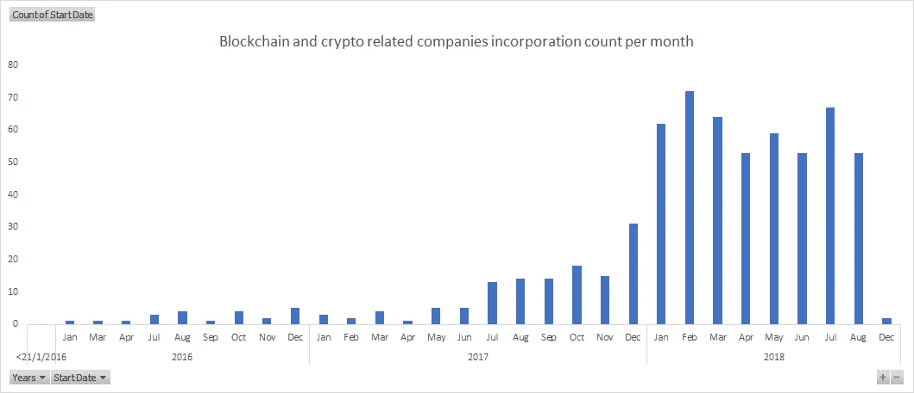
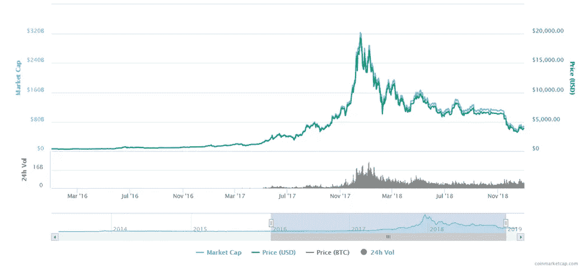

# 10 个确认——新加坡是加密货币和区块链公司的温床

> 原文：<https://medium.com/hackernoon/10-confirmations-singapore-is-the-hotbed-for-cryptocurrency-and-blockchain-companies-db89263c4fe2>

## 在新加坡注册的公司数量惊人，超过 634 家，总市值约 83 亿美元

新加坡被戏称为 2017 年至 2018 年 ICO 热潮中异常火爆的国家。由于在新加坡注册的公司的所有信息都是公开的，一次偶然的机会让我们研究了区块链和加密货币行业有多少公司在新加坡注册。请滚动到文章底部找到完整的数据集。数据集的分析可能包含分类错误，请自行研究。

我们发现，根据名称(供应链公司的链、区块链、链、币和过滤)，有 634 家在新加坡注册的公司可能与加密货币和区块链有关系。他们中的许多人还使用 62019 代码，规定他们的行业类型是软件开发。根据 [CoinMarketCap](http://coinmarketcap.com) 的数据，加密货币项目的总市值为 83 亿美元。排名前十的项目包括:Litecoin、Tron、币安、NEO、NEM、Tezos、Vechain、Ontology、Qtum、Bytom & Huobi。

Incorporation of blockchain and crypto related companies in Singapore count per month from Jan 2016 to Dec 2018

Price of Bitcoin as charted on CoinMarketCap.com for period of Jan 2016 to Dec 2018

从上面的可视化中，我们发现公司注册与比特币(按市值排名第一的加密货币)的价格有显著的相关性。值得注意的是，尽管价格下降，许多公司仍然继续在新加坡注册。

Cryptocurrency and blockchain projects with circulating market cap of higher than $10M registered in Singapore from 2016 to 2018

世界前 2000 种加密货币的市值为 132 亿美元，新加坡公司的加密货币项目占总市值的 6%。除了在交易所交易和流动的加密货币，其他一些著名的名字包括 Upbit，比特大陆，OKcoin，Fetch。AI，imToken & Coincheck。

你可以在这里查看完整的数据集:[https://docs . Google . com/spreadsheets/d/1 lk6 jdlylvyhuwdnr 7 gsjnnd 5 as 90 GH l8 iqdkyoy 1 _ 0/](https://docs.google.com/spreadsheets/d/1Lk6TJdlylVYhUWDnr7gSjnND5As90ghL8iqDKyoY1_0/edit?usp=sharing)
**提供的信息基于 OpenCorpData.com 和 CoinMarketCap.com
* *分类会有不准确之处，请自行研究
* * *如需数据集，请给我发电子邮件 Spencer+data @ hashtag . capital*

可以对数据集进行进一步分析，以引入创造的就业机会、社区影响、总收入和社交媒体声音份额的数据源。不管这些数字如何，很明显，新加坡已经因为前沿技术区块链和加密货币而闻名于世。新加坡应评估前沿技术的方法，并进一步吸引公司考虑将新加坡作为商业目的地，以保持竞争力。

我希望新加坡成为区块链和加密货币创新的活跃中心，你呢？

—
Hashtag Capital 是一家针对加密资产的多策略电子交易基金。Hashtag Capital 的合作伙伴支持了 CryptoAudiences、Counter Network、CryptoKitties、CoinMarketCap、Cobo、Chainrock、Akio Labs、PledgeCamp、EOSIO 等公司的发展。SG 和许多其他人在过去的两年里。