# 未来潜力巨大的 10 种加密货币

> 原文：<https://medium.com/hackernoon/10-cryptocurrencies-with-good-potential-in-the-future-92de946833fa>

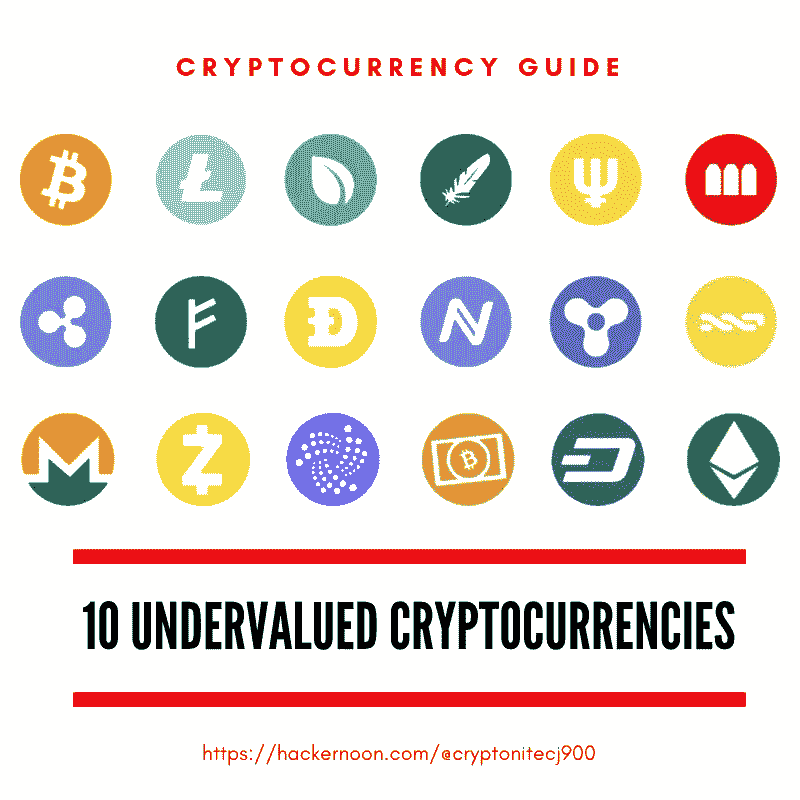

[https://hackernoon.com/@cryptonitecj900](https://hackernoon.com/@cryptonitecj900)

## 10 种具有改变游戏规则潜力的被低估的加密货币

## 注意:

我加了一个总结/TL；DR 到这个故事的结尾，但是我建议完整地阅读这个故事，以获得对提到的加密货币的更完整的理解。

# 走向复苏的市场

虽然一些人认为加密货币市场开始显示出稳定的迹象，但众所周知，该市场在 2018 年的大部分时间里一直在下滑。

当然，加密货币行业市值的下降通常会导致两种反应，痛苦的损失或乐观的机会。

正如你所看到的，整个加密货币市场在 2018 年和 2019 年都出现了巨大的下滑。

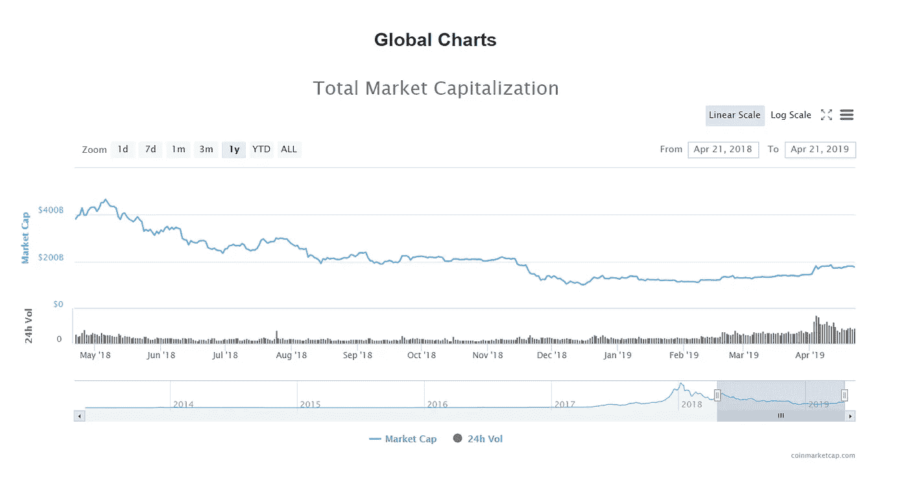

从上面的图表中可以看出，随着我们进入 2019 年，市场似乎正在稳步复苏。

我可以预见到 2020 年的缓慢复苏，一些替代硬币将获得巨大收益。

# 10 种被低估的加密货币

如果你对寻找潜力巨大的被低估的加密货币感兴趣，我们将在这里浏览其中的十种。

这些数字货币在看到历史高点后都遭受了重大损失，这让我们可以以更便宜的价格买入。

我们将看到的所有硬币都有伟大的领导者和团队，为实际问题提供具体的解决方案，并可能在未来看到有前途的投资回报。

请记住，我绝不是在提供或征求财务建议。

在购买或投资任何加密货币之前，务必收集尽可能多的信息。

好吧。让我们来看看十种潜力巨大、被低估的加密货币。

# **电力台账(POWR)**

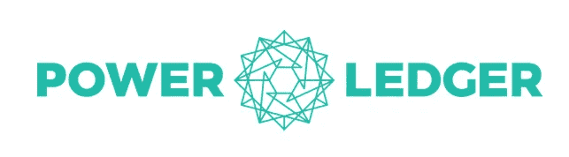

POWR 是一种专注于能源交易的加密货币。在这个平台上，拥有太阳能电池板的消费者可以向当地用户出售多余的能源。

Power Ledger 的目标是创造一个用户可以相互购买或出售电力的世界，而不是使用将能源推给消费者的发电站。

这将允许点对点的能源分配，没有中央公司控制价格。

这是通过电网完成的，或者通过简单地与另一个用户共享并完全绕过系统来完成。

## Power Ledger 旨在解决能源行业的 3 个问题:

*   随着世界慢慢转向绿色能源，帮助能源公司找到替代解决方案。
*   提供获取低成本能源的便利。目前的消费者仅限于中央集权企业提供的定价选择。
*   提供一种在开放市场上出售和分配多余能源的方式。

# **核视币(NCASH)**

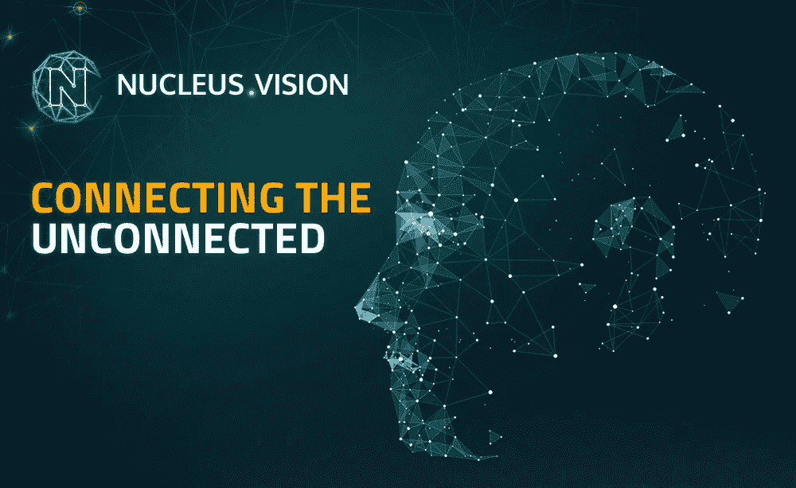

Ncash 是一种独特的加密货币，它将物联网(IoT)和零售融入到其产品中。他们有一些工作产品，其中一个产品是 ION IoT 传感器，它使零售店能够识别 200 米半径内的客户。它还能感知温度、压力、运动、速度和声音。

ION 将使用 Nucleus Vision 应用程序，因此零售商店可以根据特定客户的偏好，针对他们进行个性化促销。

Nucleus Vision 还计划对安全领域产生影响，通过其物联网传感器，Nucleus Vision 可以确定零售店或工作场所中的物体何时被盗。这类信息都安全地保存在区块链上。

Nucleus Vision 是平台，NCASH 是用于在其平台上进行交易的 toekn。

NCASH 是一个雄心勃勃的项目，有 4 个产品:

1.  离子物联网传感器
2.  神经元，深度学习平台:创建客户角色
3.  ORBIT，区块链信息交换
4.  nCash 实用程序令牌(crpyotucrrency)

这绝对是一种值得投资的加密货币。

# **底层(SUB)**

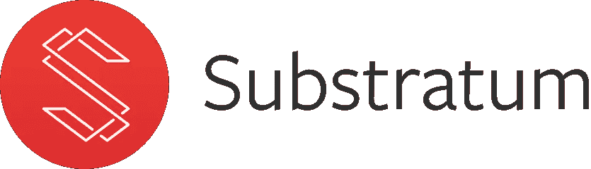

SUB 是 Substratum 项目的加密货币，该平台旨在建立去中心化、公平和自由的互联网，允许用户无限制地访问互联网及其内容。

这解决了中央互联网提供商能够合法地限制网速、屏蔽数据、网站和内容的问题。这将向全世界平等地开放互联网，任何国家的人都可以平等地访问相同的内容。

像中国这样的国家有中国的防火长城，阻止访问像 YouTube 这样的简单网站，Substratum 旨在解决这样的问题。

有了 Subtratum 网络，任何拥有计算机的人都可以在 Subtratum 上打开网络，与同一网络上的另一台计算机共享他们的计算能力。

任何人都可以托管应用程序或网站，并获得 SUB 作为贡献其计算能力的奖励。这种激励将有助于提高底层平台的参与度。

SUB 本质上将为自由和去中心化的互联网提供动力，就像比特币为去中心化的点对点货币提供动力一样。

# **纳米(NANO)**

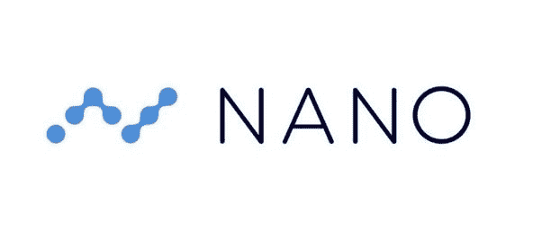

NANO (formelly RaiBlocks)是一种近即时、零手续费(免费)交易的加密货币。像比特币和以太坊这样的其他加密货币需要“挖掘”，并且每个块只能传输一定量的数据(以兆字节为单位)。

NANO 不需要挖掘，它使用一种叫做 Block Lattice 的技术，每个用户都有自己的区块链。这一点在这个故事中有更多的报道:[这种加密货币有潜力增长超过 100 倍](/@cryptonitecj900/this-cryptocurrency-has-the-potential-to-increase-over-100x-81a6a4ac6759)

通过 Block Lattice 技术，Nano 能够进行不产生任何费用的即时交易。此外，借助 Nano 的平台，**可以同时完成无限数量的交易。**

对于大多数其他加密货币，每笔交易都必须经过许多矿工的确认，但是，对于 NANO，只需要进行两笔交易:

*   “发送”交易，从发送方扣除资金。
*   “接收”交易，将资金记入收款人的贷方。

NANO 正在解决许多阻碍加密货币大规模采用的巨大问题:可扩展性、高费用和缓慢的交易。NANO mega 在 2017 年牛市期间出人意料地从 8 美分(0.08 美元)飙升至 34 美元。

# **万链(万)**

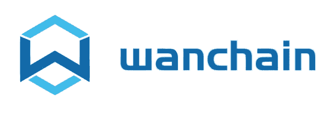

Wanchain 旨在为金融领域的数字资产创建一个新的分发平台。数字资产目前的问题是，它们不能转移到不同于其来源的区块链平台(例如，数字资产不能从以太坊转移到 NEO)。

Wanchain 希望建立一座桥梁，为数字金融资产提供在不同区块链之间无缝移动的能力。

由于数字资产，如未来收益权和忠诚度积分登记，不能在不同的区块链之间共享，这给试图采用区块链技术的企业带来了问题。

这就是 Wanchain 介入的地方，Wanchain 将使数字资产在不同的区块链之间无缝移动成为可能。

但这不是这个项目能做的全部。Wanchain 还可以:

*   使用可选的隐私功能隐藏被转移资产的价值。这对于不希望公众接触机密财务信息的公司来说是有益的。
*   创建新令牌并在其网络上启动 ICO。
*   推出智能合约。

如果资产的数字化成为未来的一件大事，万链将处于非常有利的位置

# **图标(ICX)**

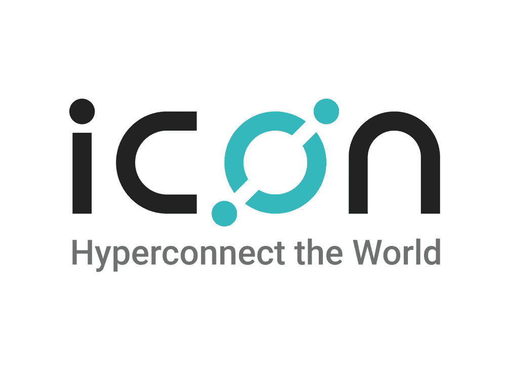

区块链技术面临的最大挑战之一是不同区块链之间缺乏连通性。ICON 是一个项目，旨在建立不同系统、平台和区块链之间的连接。

ICX 背后的想法是，它将为不同的部门和行业定义不同的网络。例如:

*   保险业会有自己的区块链
*   健康记录会有自己的区块链，等等。

因此，ICX 将在需要时存储和传输跨越不同区块链的数据。这将使不同的区块链能够相互通信。

ICON 是一个非常雄心勃勃的项目，想要连接世界。横跨区块链的通信能力是一项对许多行业都具有颠覆性的技术。

ICX 可以在企业层面极大地改变和增加区块链技术的采用。虽然这个平台仍处于早期阶段，但它可能会在不久的将来快速增长。

# **尼奥(NEO)**

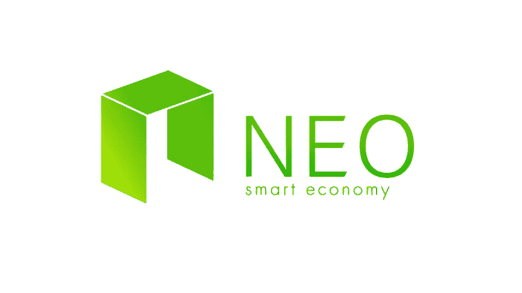

尼奥最初被一些人认为是“以太坊黑仔”这个智能经济平台可以通过其智能合同技术将资产数字化。那是什么意思？这意味着数字资产可以在 NEO 的平台内进行自我管理、交换或分发。

资产的数字化利用了在新区块链上创建的 dapps。因此，智能合约可以将所有权从一个人转移到另一个人。这种所有权可以是任何真实世界的项目。它可能是一辆汽车，食物，财产，或任何数量的其他资产。如果物品可以数字化，就可以在 NEO 的生态系统上交易。

也许 NEO 最吸引人的特点是，随着它的不断发展，它正在确保其数字资产证书完全符合全球法规。

将来，您可能会使用 NEO 来:

*   轻松跨境交易物品，同时避免过高的费用。
*   轻松买车或买房，无需中间人或相关费用。
*   轻松共享数字资产。
*   预订假期或旅行时避免高额费用。

是时候让我们的经济开始反映我们生活的数字时代了。智能经济仍然离我们很远，但像 NEO 这样的加密货币将有助于使这成为现实。

显而易见，NEO 在智能经济的未来占有一席之地，随着这种数字货币的持续增长，关注它是有意义的。

# **蜡(WAX)**

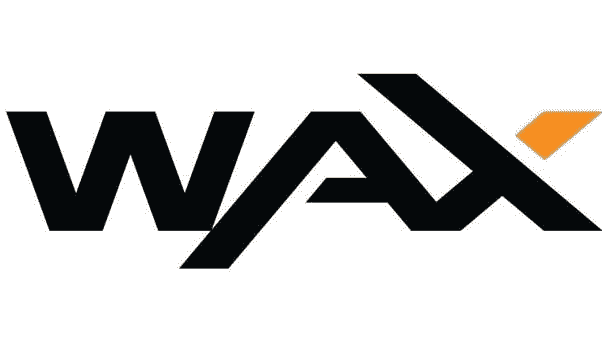

WAX 代表全球资产交易，是一个数字游戏资产的国际市场。游戏玩家可以在游戏领域使用这种数字货币，但这个平台做什么呢？为了更好地理解这一点，重要的是要知道玩家每年在游戏中的物品上花费 500 亿美元。玩家经常在游戏过程中获得这些物品。

WAX 背后的想法是，用户可以出售他们用 WAX 代币赢得的游戏内物品。然后，用户可以拿着代币，通过加密货币交易所将代币出售，或购买其他游戏内物品。

WAX 的生态系统解决了巨大市场中的一个大问题。可能有数百万的游戏玩家愿意用他们辛辛苦苦挣来的游戏中的物品来换取现金，或者用其他游戏中的物品进行交易。

问题在于集中的交易所，以及在一个分散的行业中缺乏信任。WAX 想解决这些问题，所以玩家有选择。

WAX 平台为一个正在进行的问题提供了一个创造性的解决方案，看看这种数字货币如何能够获得游戏玩家的采纳将是一件有趣的事情。

该团队将专注于获得更多的市场份额，同时提供一个平台的吸引力，使他们能够交易他们的游戏内物品。观察这种加密货币的发展将会非常有趣。

# **POE . et**

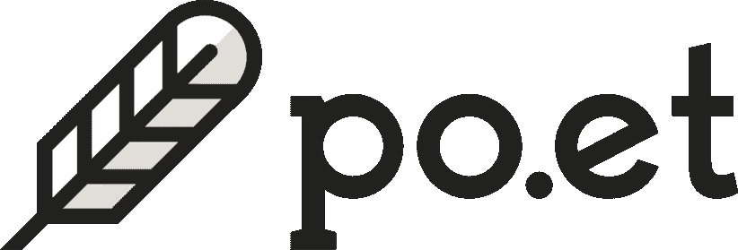

在今天的网络世界里，复制和再分发内容成为你自己的是非常容易的。POE 加密货币希望建立一个保护在线内容的平台。借助其不变的区块链，创作者可以为他们的内容打上时间戳。在声明生效的情况下，POE 会让确认作者身份变得轻而易举。

对内容创作者来说幸运的是，你不能在区块链上隐藏任何东西。每一个动作都被跟踪，并留下不可改变的记录，每个人都可以看到。这意味着任何试图复制或声称内容是自己的人很快就会被抓到。

使用区块链作为许可系统将会创造一个比目前的版权保护方案更有效的系统，而且出版商和作者也更容易注册他们的作品。POE 的平台适用于所有类型的媒体，而不仅仅是书面文字。因此，随着用户参与的增加，POE 的价值也会增加。

创作者还可以创建自己的个人市场，并通过使用他们的 POE 令牌参与其他市场。如果他们创作的内容足够受欢迎，收入就会源源不断，因为每次访问请求都会获得小额支付。

# **瓦比(WABI)**

WaBi 是一种加密货币，专注于供应链和忠诚度计划跟踪。使用 WaBi，用户可以跟踪他们的产品从制造工厂一直到零售商店的货架。通过 WaBi 区块链，WaBi 记录并跟踪产品的每一步。

WaBi 的目标是减少假冒，但他们的平台也可以减少缺陷产品引起的疾病和死亡。产品通过数据输入点存放在 WaBi 区块链上，并在整个供应链过程中被跟踪。

有形资产和数字资产通过 RFID 技术联系在一起，WaBi 称之为 Walimai。在整个旅程中，RFID 标签安全地连接到产品上，并且标签被设计成如果被篡改就会破裂。

WaBi 使用物联网和区块链技术为消费者提供他们打算消费的产品的完整历史。在我看来，这是一个具有巨大潜力的雄心勃勃的项目。

# summary/TL；博士:

下面是我们研究的加密货币的快速总结:

1.  POWR:分布式能源。
2.  NCASH:零售和物联网加密货币。
3.  SUB:去中心化互联网。
4.  纳米:零费用和即时交易。
5.  万:金融资产区块链平台。
6.  ICX:区块链和系统之间的互操作性。
7.  NEO:资产数字化、智能合约平台和被动收入。
8.  WAX:数字游戏资产市场
9.  POE:基于区块链的许可和文案
10.  WABI:物联网，供应链跟踪和管理

对于对投资加密货币感兴趣的人，你可以在****上找到上述加密货币，在那里你可以用比特币(BTC)或以太坊(ETH)购买它们，如果你没有，你可以从 [**CEX**](https://cex.io/r/0/up106280379/0/) 获得它们。****

## ******我希望这个故事对你有所帮助******

****我希望我的故事对你有用，欢迎在 [Hackernoon](https://hackernoon.com/@cryptonitecj900) 上关注我。更多故事，你也可以在 [Twitter](https://twitter.com/cryptonitetweet) 上关注我。****

****[**还可以免费下载勇敢浏览器，看广告赚 BAT。**](https://brave.com/kxh360)****