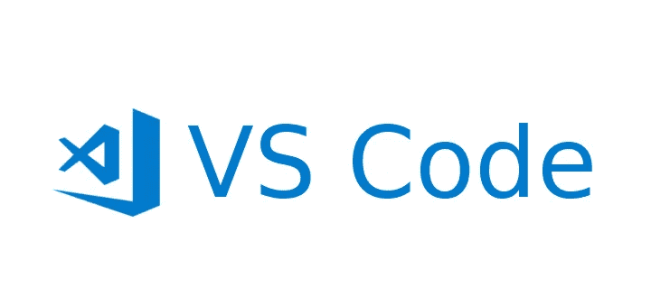
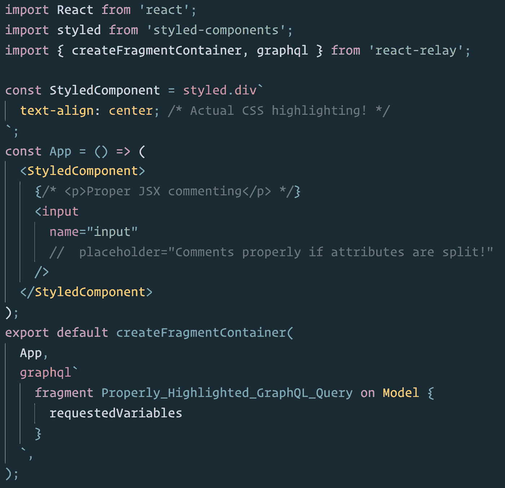
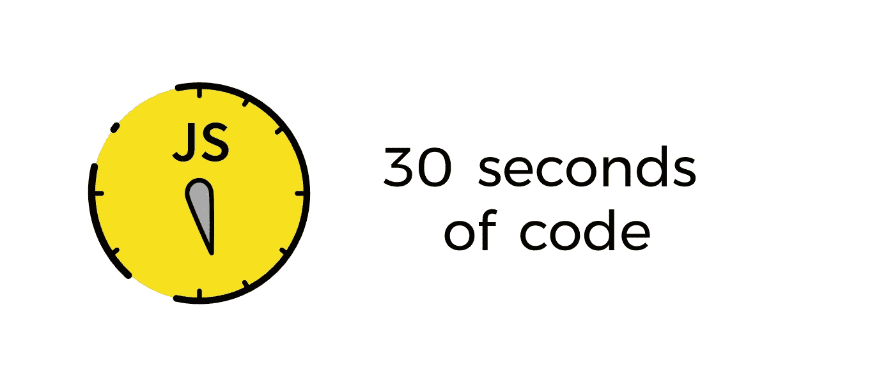
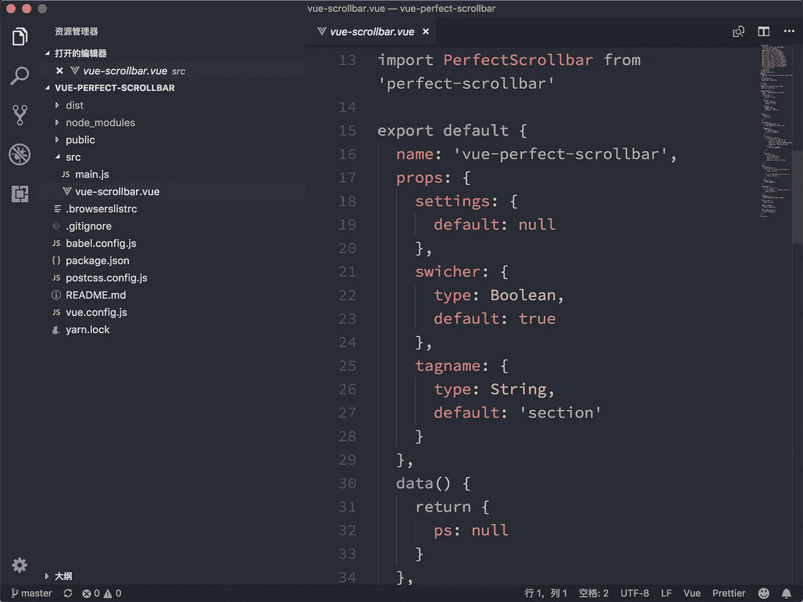
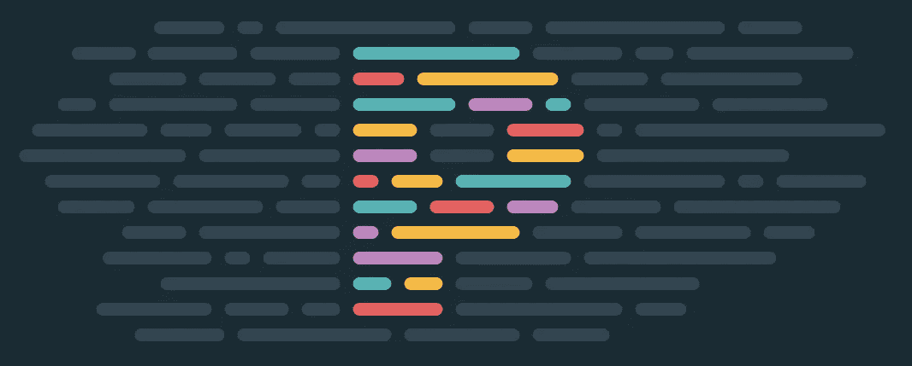

# 2019 年 JavaScript 开发者的 10 个基本 VS 代码扩展

> 原文：<https://medium.com/hackernoon/10-essential-vs-code-extensions-for-javascript-developers-in-2019-e8320e3f421e>

对于什么样的代码编辑器是最好的，什么样的配置是最高效的，你遇到的每个程序员都会有稍微不同的看法。我们中的许多人已经花费了无数的时间来为我们选择的代码编辑器尝试不同的扩展，配置设置，在代码编辑器之间来回切换，并试图获得适合我们的开发环境。

我是 Atom 的粉丝已经有几年了，但是去年我转向了 VS 代码，感觉非常好。我更喜欢性能，但我也认为 VS Code 的市场和 Atom 的市场一样好。因此，这里是我的首选扩展，可能有助于提高您的生产力，或者只是让您的 VS 代码体验更好一点。

## 10.Quokka.js

**类别:**调试

[Quokka.js](https://marketplace.visualstudio.com/items?itemName=WallabyJs.quokka-vscode) 是 JavaScript 和 TypeScript 的游乐场。它会在您键入代码时立即运行您的代码，并在代码编辑器中显示各种执行结果。虽然我认为 Quokka 是一个非常酷的调试、测试和原型工具，但它对我来说并不重要，因为它可能会分散我为代码的某些部分编写正确测试的注意力，但我仍然不时地使用它。

## 9.Fira 代码

**类别:**字体

Fira Code 是最好的连字编程字体之一，一旦你习惯了它，它可以帮助你更快地扫描代码。把它设置成你的编辑器的字体比安装一个扩展要多花几个步骤，但是一点也不难。如果你想让你的代码看起来更好，给同事留下深刻印象，或者只是让那些比较操作符看起来更容易，这绝对值得一试。

## 8.巴别塔 JavaScript

**类别:**语法高亮

[Babel JavaScript](https://marketplace.visualstudio.com/items?itemName=mgmcdermott.vscode-language-babel) 感觉就像是你安装 VS 代码的时候就应该有的东西。它支持 ES201x、React 和 JSX 语法高亮显示，我想这是大多数使用任何现代 web 应用程序的人都希望拥有的。最初看起来可能没什么，但从长远来看确实有所不同。

## 7.REST 客户端

**类别:**测试

REST client 可能是我使用过的最好的扩展之一，因为它允许你发送 HTTP 请求并直接在 VS 代码中查看响应。我非常喜欢 Postman，但是我也更喜欢在一个环境中保存尽可能多的东西，所以 REST client 在拥有一个测试我的 API 的功能性工具和不必离开我的代码编辑器之间达到了完美的平衡。

## 6.30 秒的代码

**类别:**片段

[30 秒代码](https://marketplace.visualstudio.com/items?itemName=30-seconds.30-seconds-of-code)是我碰巧维护的同名项目[的官方扩展。虽然我确信还有许多其他的代码片段扩展，但这是我最喜欢的一个，因为其中代码片段的数量和多样性。短小精悍的功能性 ES6 代码片段——我还想从代码片段扩展中得到什么呢？](https://github.com/30-seconds/30-seconds-of-code)

## 5.实时服务器

**类别:**调试

[Live Server](https://marketplace.visualstudio.com/items?itemName=ritwickdey.LiveServer) 为您提供了一种从 VS 代码提供静态和动态页面的简单方法，同时它还支持动态重载。如果你熟悉 Chrome 的 Web Server 或者任何做类似事情的 npm 包，你应该看看这个。

## 4.吉特朗斯

**类别:** git

GitLens 是最流行的 VS 代码扩展之一，在我看来，也是最有用的。责备，代码作者，活动热图，最近的变化和历史只是它提供的一些功能。如果你在一个不止一个贡献者的仓库上工作，这是你应该有的。

## 3.一个黑暗职业

**类别:**主题

[One Dark Pro](https://marketplace.visualstudio.com/items?itemName=zhuangtongfa.Material-theme) 将 Atom 标志性的 One Dark 主题带入 VS Code。我个人认为这是我使用过的最完美、最不紧张的主题之一，所以很自然地，我一从 Atom 移植到 VS 代码就安装了它。我知道这有点个人偏好，而且 VS 代码有一些现成的不错的主题，但是我认为你应该试一试。

## 2.埃斯林特

**类别:**短绒

[ESLint](https://marketplace.visualstudio.com/items?itemName=dbaeumer.vscode-eslint) 把最流行的 JavaScript linter 变成了 VS 代码扩展。如果你已经在你的项目中使用了 ESLint，抓住这个扩展，让它发挥它的魔力。如果你不是，认真地说，你应该尝试林挺你的代码——也许尝试这个扩展为你做一些工作？

## 1.较美丽

**类别:**格式化程序

[更漂亮](https://marketplace.visualstudio.com/items?itemName=esbenp.prettier-vscode)不需要太多的介绍。它是一个固执己见的代码格式化程序，变成了 VS 代码的扩展。如果你想让你的代码更漂亮(双关语)，你应该考虑安装这个方便的小扩展。

*感谢您阅读这个故事！如果你喜欢，可以考虑给它一两下掌声！*