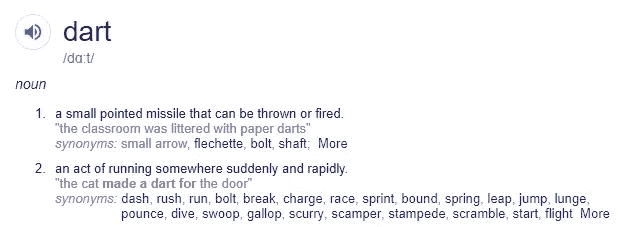

# 学习 Dart 的 10 个好理由

> 原文：<https://medium.com/hackernoon/10-good-reasons-why-you-should-learn-dart-4b257708a332>

## Dart 为许多现有开发人员所熟悉，这要归功于它的面向对象和语法。如果您已经了解 C++、C#或 Java，您可以在短短几天内使用 Dart 提高工作效率。

Photo by [Will Porada](https://unsplash.com/photos/Zlli7ptD8fg?utm_source=unsplash&utm_medium=referral&utm_content=creditCopyText) on [Unsplash](https://unsplash.com/search/photos/dart?utm_source=unsplash&utm_medium=referral&utm_content=creditCopyText)

A Quick Google Search

玩笑归玩笑，Dart 是 2k19 中你能学到的最好的语言之一。也是很好的第一语言，(至少在我看来比 Java 简单)。我有机会学习 Dart，以便从事一个新的项目，我非常喜欢这门语言，所以我想为它创建一个完整的教程。我以前尝试过很多语言，但从来没有爱上过任何一种。

> **Dart** 是一种[通用编程语言](https://en.wikipedia.org/wiki/General-purpose_programming_language)，最初由 [Google](https://en.wikipedia.org/wiki/Google) 开发，后来被 [Ecma](https://en.wikipedia.org/wiki/Ecma) (ECMA-408)批准为标准。它用于构建 [web](https://en.wikipedia.org/wiki/World_Wide_Web) 、[服务器](https://en.wikipedia.org/wiki/Server_(computing))、桌面和移动应用。— [维基百科](https://en.wikipedia.org/wiki/Dart_(programming_language))

# TLDR；

我建议你阅读整篇文章，但如果你时间紧迫，那就不要难过。以下是重点。

0.飞镖真的很灵活
1。Dart 拥抱开源生态系统
2。飞镖很容易学。Dart 是一种很好的第一语言。镖有很大的工具支持
5。Dart 是一种健壮的语言。省道确保生产率
7。飞镖是扑
8 使用的。Dart 背后是一家科技巨头。Dart 高效地解决了许多问题

# Dart 是如何开始的

2011 年 10 月 10 日，谷歌的两名工程师在 GOTO 大会上发布了“ [Dart](http://www.dartlang.org/) ”，这是一种全新的编程语言，旨在帮助开发者构建网络应用。Dart 1.0 于 2013 年 11 月 14 日发布。

和往常一样，谷歌的每一件产品都受到科技界的极大关注。说实话，最初的 Dart 项目从一开始就处于停滞状态，(因为最初，他们希望 Dartlang 取代 Javascript，或者像 CoffeeScript 一样工作)。但是从那以后发生了很多变化。现在 Dart 背后的主要焦点已经转移，Dart 正在广泛的项目中实施。

无论如何，我们不要对 Dart 为什么和如何开始做太多的详细描述。重点是，今天的 Dart 已经远远超出了最初的设想。听起来很熟悉，对吧？Javascript 也变成了那样。但与 Javascript 不同，从语言的角度来看，Dart 要好得多。如果你想知道为什么你应该关心 Dart，那么请继续阅读。

# 0.Dart 真的很灵活。

***(因为列表从 0 开始)***

Dart 是一种非常灵活的编程语言，因为您可以编写代码，然后在任何地方运行它，而没有任何限制。

用飞镖和 Flutter 写的移动 app 是跨平台的原生 app；所以它们既可以在 Android 上运行，也可以在 iOS 上运行(比如 React Native、Xamarin 等。).你甚至可以编写 web 应用程序，这些代码可以在任何浏览器上运行。从开发人员的角度来看，语言的灵活性和可移植性非常重要。毕竟，谁不想能够编写一些代码并在尽可能多的平台上运行呢？

一旦你熟悉了一般的面向对象原则，用 Dart 编码就很自然了。尽管如此，全功能编程在 Dart 中是 100%可实现的。Dart 中带有 async/await 和“Future”的异步编程是一致和谐的。如果你是一个单元测试人员，那么对你来说是个好消息，因为 Dart 内置了对单元测试的支持；无需添加新的库或框架。

Javascript 遵循无类型哲学，因为根据 JS，无类型意味着灵活性。但是开发者经常说太多的灵活性会杀死你的软件。有时候你想和类型打交道，而有时候不想。有了 Dart，只要您愿意，就可以做到这一点。有了 Dart，你就可以两全其美，还可以在必要的时候切换到另一个世界。😄

# 1.Dart 拥抱开源生态系统。

> *55%的开发者说他们正在为开源项目做贡献。—数字海洋，2018*

开发者喜欢开源。事实上，整个技术行业都爱上了开源技术。Dart 在第一天就通过拥抱开源生态系统赢得了世界各地许多开发人员的心。

Dart 看起来像是 Java 的直接竞争对手，Java 是谷歌现在有问题的专有语言，在许多方面，Dart 比 Java 好一千倍。

说到 Dart SDK，如果你有想法，可以自己实现，也可以提交提案。如果你看到一个 bug，你可以立即报告，或者自己修复。这是专有语言无法做到的。这就是为什么，很多时候，随着时间的推移，专有软件变得停滞不前和陈旧。但是开源软件总是充满活力的。

当您使用 Dart 时，您不像在 Java 中那样需要很多东西:

1.  *你不需要关心许可问题*
2.  没有人会因为你使用这种语言而起诉你
3.  *你可以忘记仅仅因为使用编程语言而向任何人或任何公司付费*

> 甲骨文最近[宣布](https://java.com/en/download/release_notice.jsp)他们将从 2019 年开始对“商业、商业或生产”使用的 Java 标准版 8 收费。要获得所有新的更新和漏洞修复，你需要按用户数量或每个处理器付费。

[随着两大科技巨头](https://www.wired.com/story/the-case-that-never-ends-oracle-wins-latest-round-vs-google/)之间的持续争斗，越来越多的公司试图稳妥地转向 OSS。毕竟，当你投入所有的精力和专业知识来开发和销售一个产品，并日以继夜地工作时，你最不希望看到的就是你的钱都到了其他公司的银行账户上。

# 2.飞镖很容易学。

学习语言需要时间、努力和耐心。这不仅仅是学习这门语言，还包括它的生态系统、与之相关的术语、为这门语言获得合适的工具和 SDK，然后转向该语言可用的流行框架和库。即使学了那么多流行语言像 C，Python，Javascript(加上 Typescript)，Go，PHP 等等。我必须承认，即使是现在，一想到要学习一门新语言，我就不寒而栗。

但是当我不得不学习 Dart 时，我意识到它已经是多么容易和熟悉了。事实上，正如许多开发人员对 Dart 所说:

> 你可能已经认识达特了。

如果您已经有了一些任何语言的编程经验(甚至不必是 OOP 语言)，那么您在几周内就可以在 Dart 中获得相当高的效率。我并不是说 Dart 中没有新的东西，但是 Dart 中引入的新思想非常直观，并且不会花太长时间来掌握。

*   **Dart 是强静态类型的，支持类型推断:**类型推断是指自动检测[编程语言](https://en.wikipedia.org/wiki/Programming_language)中表达式的[数据类型](https://en.wikipedia.org/wiki/Data_type)。自动推断类型的能力使许多编程任务变得更容易，让程序员可以自由地省略[类型注释](https://en.wikipedia.org/wiki/Type_signature)，同时仍然允许类型检查。从这篇[维基百科文章](https://en.wikipedia.org/wiki/Type_inference)中了解更多关于类型推断的知识。这使得开发人员更容易过渡到 Dart，而不管他们的编程背景如何。点击了解更多关于[镖型系统的信息。](https://dart.dev/guides/language/sound-dart)
*   Dart 语法很简单:即使在第一次拍摄时，Dart 语法看起来也非常熟悉。即使你以前没有见过 Dart 代码，也可以很容易地理解它，而无需费力。Dart 语言结构良好，所以如果你已经知道 C、Java 或 C#，那么 Dart 将会非常容易。

# 3.Dart 是很好的第一语言。

虽然我没有把 Dart 作为我的第一门编程语言来学习，但我认为它肯定是一门非常好的语言，应该在学习任何其他语言之前学习。我希望我出道时达特在那里。

首先，Dart 入门是*容易*。如果你只是尝试一下，你甚至不需要安装任何东西。只需通过浏览器点击[标靶网址](https://dartpad.dartlang.org/)。其次，Dart 团队有非常好的介绍和教程，文档也非常可靠。他们自己的教程很容易理解，谷歌确保任何人都可以尽可能容易地开始使用 Dart。最后，语法很简单，这个社区已经很了不起了，有越来越多的人来 Dart。此外，由于 Dart 与 Javascript 非常兼容，越来越多的 Javascript 开发人员发现它很容易过渡。

因此，由于语言和开发人员之间几乎没有摩擦，Dart 拥有一门语言需要快速发展和被采用的所有特性。

# 4.Dart 拥有强大的工具支持。

Dart 拥有丰富的工具支持。几乎所有主流的文本编辑器和 IDE 都支持 Dart 语言。可以使用 Webstorm、IntelliJ IDEA、Android Studio 等重型 ide，也可以使用 VS Code、Sublime text、VIM、Emacs、Atom 等简单编辑器。所以你可以自由选择你喜欢的编辑器。

对于所有可用于 Dart 的工具，请点击[链接](https://www.dartlang.org/tools)。

# 5.Dart 是一种健壮的语言。

Dart 作为一种语言，是非常健壮的。由 Google 创建，其主要目的是利用基于 C 的面向对象编程语言，如 C#和 Java。因为它也是一种通用编程语言，所以编译速度快且简洁。

> Dart 是一种开源的、纯面向对象的、可选类型的、基于类的语言，它对函数式编程和反应式编程都有很好的支持。

与 C#或 Java 不同，Dart 一点也不臃肿。事实上，它是一种相对简单、现代和高效的语言。它是一种像 C 一样的编译语言，所以它比 Java 要快得多。Dart 也比 Javascript 快大约 2 倍。它是类型安全的，用 AOT 和 JIT 编译器编译(要了解它的好处，请继续阅读)。要了解更多关于速度对比的信息，请点击查看此链接。

从语言的角度来看，Dart 相当健壮。它快速、可靠、高效，而且由于被一家科技巨头大量使用，在社区中的采用率正在飙升。如果你想了解 Dart 在谷歌(和其他公司)内部的使用程度，那么[可以点击这个链接](https://www.dartlang.org/community/who-uses-dart)。

# 6.Dart 确保生产率。

除了简单之外，Dart 非常重视生产力。谁不想用更少的代码做更多的事情呢？

首先，清晰、直观、简洁和简单的语法使 Dart 语言非常高效。此外，对强类型检查的内置支持使它非常适合拥有大型开发团队的大型项目。Dart 也有大量的库和框架。您不必在每次想要实现新功能时都重新创建轮子。这样节省了很多时间。另外，您所需要做的就是从文档中添加一些代码，然后就可以开始了。这会让你更有效率。

就语言而言，尽管 Dart 是完全面向对象的，但您可以将它作为一个全功能的工具来使用。此外，它没有什么奇怪的地方，就像 Javascript 一样。因此，您可以用同一种语言进行面向对象或函数式编程。(极乐😊)

# 7.飞镖由扑击使用。

只有当 Flutter 项目开始变得越来越流行时，开发人员才真正对 Dart 感兴趣。尽管 Dart 是一种令人惊叹的语言，从诞生之日起就有很棒的生产力工具和令人惊叹的文档，但是当它没有被大公司用于生产时，谁会仅仅关心这种语言呢？但是现在，在学习 Dart 之后，你可以用它做一些有意义的工作。现在公司都在用 Flutter，默认情况下，开发者在生产中用 Dart，**。此外，有一个庞大的开发人员社区，他们渴望与 Dart 分享他们的知识、经验和学习之旅。如果你还没有开始学习 Dart，我相信现在正是时候。**

我强烈推荐你阅读这篇发表在 Hackernoon 上的文章[来理解为什么 Google 在他们的 Flutter 项目中使用 Dart 语言。请注意，Flutter 确实是谷歌的一个革命性项目。众所周知，谷歌启动了 Flutter 项目来取代脸书的 React Native。事实上，谷歌团队理所当然地承认，Flutter 的灵感来自 React Native。](https://hackernoon.com/why-flutter-uses-dart-dd635a054ebf)

React 本地开发人员发现开始使用 Flutter 非常容易，因为他们现有的所有知识都很容易翻译。我曾经自己用 React Native 开发应用程序，并且我发现从第一天开始在 Flutter 中就非常容易高效。但是，我必须说，Flutter 已经不仅仅是一个移动开发 SDK。特别是，[随着蜂鸟项目](https://www.youtube.com/watch?v=5SZZfpkVhwk)的宣布，Flutter 让[真正跨平台](/flutter-io/hummingbird-building-flutter-for-the-web-e687c2a023a8)成为可能。所以，当 Flutter 使共享相同的代码库(完全或部分)成为可能时，我相信开发者会开始更加重视 Dart。

# 8.Dart 背后是一家科技巨头。

当你投入大量时间学习新技术时，你会对该技术的过去、现在和未来格外谨慎。在花了几个月的时间学习新东西后，你最不希望看到的就是技术变得陈旧、过时或脱离行业标准。

就 Dart 语言而言，你可以担心其他任何事情，但你绝对不要担心语言本身的开发和维护。Dart 是 Google 内部发展最快的语言之一，被 Adwords、Flutter、Fuchsia、AngularDart 等内部产品使用。在谷歌之外，阿里巴巴、Adobe、MailChimp、JetBrains 等公司都在生产中使用这种语言。

通常，可以看到公司提出新的语言，但保留它们的专利。由于 Dart 从一开始就是开源的，开发人员甚至不必担心许可问题和所有这些无聊的事情。假设，即使谷歌破产(是的，保持微笑)，由于 Dart 是开源的，它应该不会轻易倒下。

# 9.Dart 高效地解决了很多问题。

Dart 既可以编译 [AOT](https://en.wikipedia.org/wiki/Ahead-of-time_compilation) 也可以编译 [JIT](https://en.wikipedia.org/wiki/Just-in-time_compilation) 。Flutter 利用了这一点，因为使用 JIT 编译加快了开发速度(通过热重装之类的方式),而 AOT 编译在发布时提供了更好的优化。Flutter 让 devs 更高效的部分原因是它默认启用了热重载。如果你是一个 Java 或 Swift 开发人员，并且你以前已经检查过 React Native，那么你就知道热重载特性是多么有用。热重装节省了大量时间，从而提高了生产率。

Dart 似乎以一种非常高效的方式完成了它的工作。我知道你在想什么，“Javascript 已经很棒了，它解决了我能想到的每一个问题，我可以用它做任何事情，所以我为什么要在乎呢？”嗯，事实上，我自己就是一个 javascript 开发者，我非常热爱 JS 生态系统。但是我还没有盲目到拒绝特定任务的最佳工具。Javascript 从来没有被如此频繁地使用过。它是一种简单的脚本语言，只是为了在浏览网站时增加一些交互性而创建的。现在 Javascript 实际上是万能的。你开发 web 应用程序、移动应用程序、桌面应用程序、服务器，并用它们做各种疯狂的事情。首先，我们使用 Javascript 的方式从来就不是我们想要的。

但是 Dart 不一样。从一开始，Dart 背后的团队就抱着跨平台的心态接近 Dart。Dart 比 Javascript 更有效地解决了很多问题，因为它就是为了解决这些问题。

> 然后，即使 JS 在服务器上相当成功，但它并不是真正为此而设计的。Dart 是——这意味着在其他方面，它以*隔离*的形式具有真正的并行性。它们[应该]是轻量级的，所以您应该能够运行很多，它们确实运行在真正的线程上，并且没有锁定，只有异步消息传递(如果您问，那么是的，Dart 中的隔离很大程度上是受 Erlang 的启发)。——[拉迪斯拉夫·索恩](https://www.quora.com/profile/Ladislav-Thon)在 Quora 上的部分回答

# 结论

我开发应用程序和从事项目已经有很长时间了。为你的工作获得报酬感觉很好，但这不是你唯一想要的，不是吗？Dart 让开发人员的体验变得如此流畅，以至于开发人员和 dart 语言之间几乎没有摩擦。

> 大多数优秀的程序员从事编程不是因为他们期望得到报酬或得到公众的奉承，而是因为编程很有趣。——莱纳斯·托瓦尔兹

Dart 正在迅速取代对其他臃肿语言的需求。又快又好拿。这是一个伟大的工具，解决了很多问题，并确保生产力。**那么，我们就用它吧。**

> 你可能不认为程序员是艺术家，但编程是一个极具创造性的职业。是基于逻辑的创意。
> 
> —约翰·罗梅洛

这里有一首让你感觉更好的诗:

> *玩飞镖的时候，大家都同意，
> 稳稳的手才是你需要的。*
> 
> *好眼力，完美站姿。
> (因为飞镖不是碰运气的游戏！)*
> 
> 互联网

## 结尾部分

您想在列表中添加更多内容吗？在评论中发表你的看法或通过 [Linkedin](https://www.linkedin.com/in/fuad/) 或 [Twitter](https://twitter.com/___fuad) 与我联系。如果你喜欢这篇文章，我肯定会感谢一些掌声。毕竟，谁不喜欢掌声呢？😄

你可以在 [Medium](/@nafis.fuad) 、 [Linkedin](https://www.linkedin.com/in/fuad/) 和 [Twitter](https://twitter.com/___fuad) 上关注我，以便在我发布新帖子时获得通知。

我到底是谁，我在做什么？

> 嗨，我是纳菲斯·福阿德。我是一名全栈开发人员，也是一名设计和开发 web &移动应用的创意人员。当我不写代码的时候，我会写一些关于技术、企业家精神、商业、生产力等等的东西。对于开发，我一般前端用 React、Vue，后端用 Node.js、Express、GraphQl。在我爱上 Flutter 之前，我一直在使用 React Native 的移动应用程序。如果你想和我一起工作，或者只是想打个招呼，请不要犹豫给我发电子邮件或者在这里留言