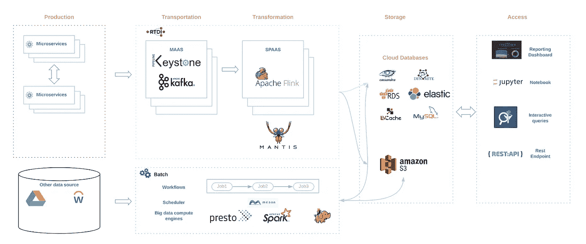
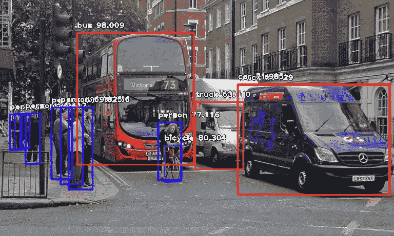
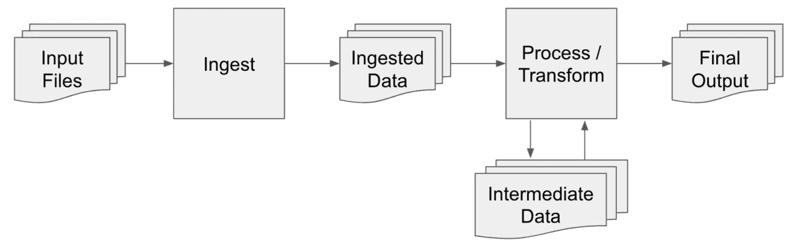
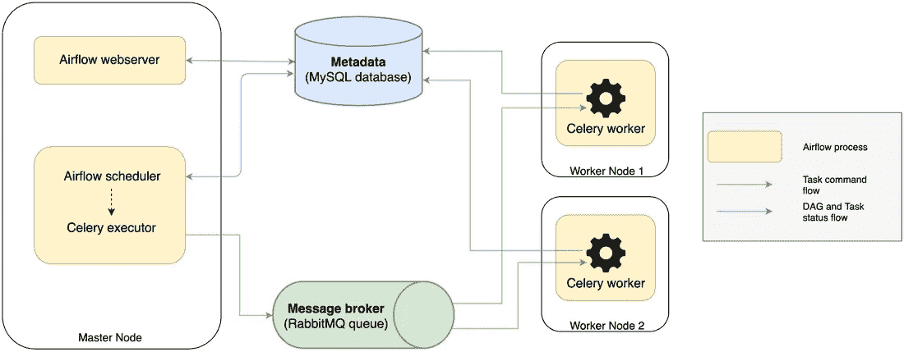

# 关于数据科学和数据工程的 10 篇好文章

> 原文：<https://medium.com/hackernoon/10-great-articles-on-data-science-and-data-engineering-d5abdf4a4a44>

数据科学和编程是如此迅速发展的专业，以至于很难跟上来自谷歌、优步、网飞和一个工程师的所有文章。在过去的几周里，我们一直在阅读一些文章，并希望分享我们在 2019 年 4 月这一周的一些顶级博客帖子！

我们希望你喜欢这些文章。

# **在网飞建立和扩展数据谱系**

作者:[林迪](https://www.linkedin.com/in/di-lin-b3b37b26/)，[吉里什·林加帕](https://www.linkedin.com/in/girish-lingappa-309aa24/)，[吉特德·阿斯瓦尼](https://www.linkedin.com/in/jitenderaswani/)

**想象一下**你自己是一个受数据启发的决策者，盯着仪表板上的指标，准备做出一个关键的业务决策，但停下来问了一个问题——“我可以自己运行一个检查来了解这个指标背后的数据吗？”
现在，假设你是一名软件工程师，负责一项微服务，发布一些面向客户的关键服务(如计费)所使用的数据。您将对数据进行结构性更改，并想知道您的服务下游的哪些人和什么会受到影响。

[点击此处了解更多信息](/netflix-techblog/building-and-scaling-data-lineage-at-netflix-to-improve-data-infrastructure-reliability-and-1a52526a7977)

# **DeepMind 和谷歌:控制人工智能之战**

2010 年 8 月的一个下午，在旧金山海湾边上的一个会议厅里，一位名叫戴密斯·哈萨比斯的 34 岁伦敦人走上了舞台。

[此处阅读更多](https://www.1843magazine.com/features/deepmind-and-google-the-battle-to-control-artificial-intelligence?utm_campaign=Data_Elixir&utm_source=Data_Elixir_226)

# **学习数据科学:我们喜爱的资源从免费到不免费**

今天，我们想介绍一些我们最喜欢的数据科学资源。顾名思义，这些资源将从免费到不免费。有些人喜欢买书，有些人喜欢在线课程。所以我们创建了这个数据资源列表，从书籍到课程，从免费到不免费。

数据科学有许多方面。统计、数据清理、编程、系统设计，实际上……几乎任何与数据相关的事情都取决于公司的规模。

[阅读更多何](https://www.coriers.com/learning-data-science-our-favorite-resources-from-free-to-not/) re

# **物体检测用 10 行代码**

由[摩西·奥拉芬瓦](https://towardsdatascience.com/@guymodscientist)

人工智能的重要领域之一是计算机视觉。计算机视觉是计算机和软件系统的科学，可以识别和理解图像和场景。计算机视觉也是由图像识别、物体检测、图像生成、图像超分辨率等多方面组成。

[在此阅读更多内容](https://towardsdatascience.com/object-detection-with-10-lines-of-code-d6cb4d86f606)

# **阿帕奇气流如何在芹菜工人身上分配工作**

由[雨果·莱姆](https://blog.sicara.com/@HugoLime)

发现当 [Apache Airflow](https://airflow.apache.org/) 通过 [RabbitMQ](https://www.rabbitmq.com/) 队列对[芹菜](http://www.celeryproject.org/)工人执行任务分配时会发生什么。

Apache Airflow 是一个创建工作流的工具，比如 AWS 上的[提取-加载-转换管道](https://blog.sicara.com/automate-aws-tasks-boto3-airflow-hooks-593c3120e8fc)。工作流是任务的有向无环图(DAG ),而 Airflow 能够在节点集群上分配任务。让我们看看它是如何做到这一点的。

[在这里阅读更多内容](https://blog.sicara.com/using-airflow-with-celery-workers-54cb5212d405)

# **用 Google 相册捕捉特殊视频瞬间**

录制难忘时刻的视频与朋友和爱人分享已经变得很平常。但是，任何一个拥有相当大的视频库的人都会告诉你，浏览所有的原始镜头，寻找完美的剪辑，以重温或与家人和朋友分享，这是一项非常耗时的任务。
[此处阅读更多](https://ai.googleblog.com/2019/04/capturing-special-video-moments-with.html)

# **优步案例研究:为您的 Apache Spark 作业选择正确的 HDFS 文件格式**

作者斯科特·肖特

为了在我们的平台上创造更好的用户体验，我们的地图数据收集团队成员使用专用的移动应用程序来收集图像及其相关元数据，以[增强我们的地图](https://www.uber.com/info/mapping/)。例如，我们的团队捕捉街道标志的图像，以[提高我们地图数据的效率和质量](https://eng.uber.com/maps-metrics-computation/)，从而促进更无缝的旅行体验…

[点击此处了解更多](https://eng.uber.com/hdfs-file-format-apache-spark/)

# 您创建了一个机器学习应用程序。现在确保它是安全的。

由本·洛里卡[和迈克·劳基德斯](https://www.oreilly.com/people/4e7ad-ben-lorica)制作

在最近的一篇[帖子](https://www.oreilly.com/ideas/deep-automation-in-machine-learning)中，我们描述了建立一个可持续的机器学习实践需要什么。所谓“可持续”，我们指的是不仅仅是概念或实验证明的项目。

[点击此处阅读更多内容](https://www.oreilly.com/ideas/you-created-a-machine-learning-application-now-make-sure-its-secure?utm_campaign=Data_Elixir&utm_source=Data_Elixir_223)

# **制定数据科学职业框架**

由[亚当·麦克尔希尼](/@adam.m.mcelhinney)

在 Uptake，数据科学家是我们工作的核心。为此，我们有一个好的定义是非常重要的:数据科学家做什么；如何评估数据科学家的绩效；数据科学家如何在职业生涯中取得进步。一旦你有了这些定义，它们就可以作为你所有招聘、发展、薪酬、离职和晋升决定的基础。

[在这里阅读更多](/uptake-tech/developing-a-data-science-career-framework-2d2c61e7f6a1)

# **使用 ML 解释工具和技术诊断心脏病**

由[罗布·哈兰德](https://www.linkedin.com/in/rob-harrand-1529731/)

在机器学习的所有应用中，使用黑盒来诊断任何严重的疾病总是很难实现。如果模型的输出是特定的治疗过程(可能有副作用)，或者手术，或者没有治疗，人们会想知道**为什么**。

该数据集给出了许多变量以及患有或不患有心脏病的目标条件。下面，首先在一个简单的随机森林模型中使用数据，然后使用 ML 解释工具和技术研究该模型。
[此处阅读更多](https://www.kaggle.com/tentotheminus9/what-causes-heart-disease-explaining-the-model/notebook?utm_medium=email&utm_source=intercom&utm_campaign=datanotes-2019)

非常感谢您的阅读。如果你有兴趣获得我们最喜欢的文章的更新，那么在这里注册每周简讯。