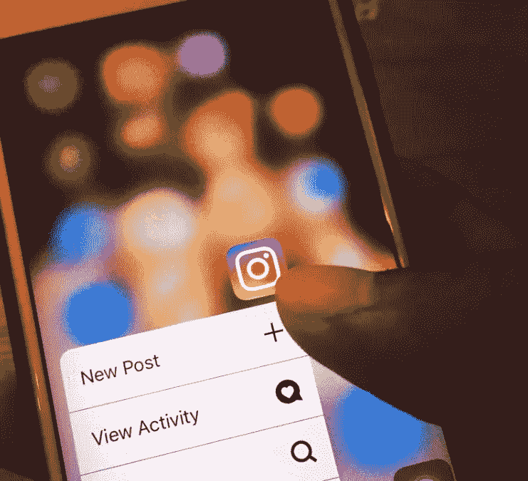

# 8 个 Instagram 工具来增加你客户的受众

> 原文：<https://medium.com/hackernoon/10-instagram-tools-to-grow-your-clients-audience-2f4e0c28dc48>

Photo credit: Canva.com

Instagram 易于使用，这也是它在全球拥有 10 亿用户的原因。但经营客户的活动需要深思熟虑的策略，如发布精彩内容、吸引关注者和建立关系。

这些工具可以让 Instagram 活动自动化，还可以扩大你的客户在网上的影响力。[social rocker](http://socialrocketer.com/)最近发布了一份 IG 工具列表，其中包括:

## 1)Hashtagsforlikes.co

三分之一的 IG 内容没有标签。然而，这些是任何社交策略的关键:没有它们，内容是看不见的。用关键词标记帖子有助于用户发现相关或有趣的材料。这让他们*避免*所有的数字噪音。

那么哪些标签是最好的呢？Hashgtagsforlikes.co 关注趋势并提供有用的建议。最好的关键词可以提高你客户的曝光率。

## **2)缓冲器**

一个成功的活动需要你检查哪些是有效的，哪些是无效的。特定的帖子可以吸引一定的人群，而其他帖子可能会导致缺乏兴趣。深入挖掘，找出原因。这样做会提高你的营销预算的投资回报率。

Buffer 是一款先进的社交管理工具，可以让你深入了解自己的搞笑内容。查看帖子覆盖范围的分析，哪些策略是有效的，等等。

## **3)众火**

伟大的原创内容会吸引粉丝。但是你可能会时不时地想把东西和外部材料混在一起。

Crowdfire 跨多个平台(包括 Instagram)工作，帮助营销人员在网络上找到相关内容。用户可以直接从其仪表板上发布原创材料。

## **4)萌芽社交**

Sprout Social 是一个分析工具，提供 IG 活动的见解和社交信号。营销人员应该做出明智的决定:当你明白为什么一些视频比其他视频表现更好，为什么某些故事在特定时间有更多的浏览量，以及为什么特定的标签表现更好，你就可以相应地调整策略。

营销人员知道的越多，他们就越能重复成功的公式，并最大限度地提高预算的有效性。

## **5)图标正方形**

与其他分析和管理工具一样，Iconosquare 允许营销人员安排帖子和评估内容的表现。这对于监控客户的竞争对手并确定他们的立场也很实用。

能够回答这样的问题:其他 Instagram 用户在做什么，我应该效仿或避免？我客户的受众对什么帖子最感兴趣？

## **6)社交病毒式传播**

[社交病毒](https://socialgoneviral.com/)将你与一位搞笑成长专家联系起来，这位专家可以处理竞选活动的细节问题。这包括喜欢别人的帖子，这样你就可以专注于其他活动。社交病毒可以帮助你获得真正的追随者。

## **7) Kapwing**

Instagram 是一个以图片和视频为主的平台。虽然标题是必不可少的，但人们喜欢看和观看事物。然而，制作视频可能更具挑战性，因此 Kapwing 可以帮助您创建高质量的内容并吸引观众。它还提供调整视频格式和特殊效果的软件。

## **8) Bigbangram**

吸引注意力可能很棘手。你应该喜欢哪些帖子，喜欢几个？然而，像这样的策略不仅仅是喜欢和评论。他们还要求追随和不追随正确的人。Bigbangram 使用机器人瞄准相关用户，以增加您客户的社交存在。

成功的搞笑活动需要很多努力，但是创新可以让你的工作变得更容易。在竞争激烈的环境中，节省时间有助于你发展和改善社交策略的其他方面。哪些 Instagram 工具可能会帮助你的客户？