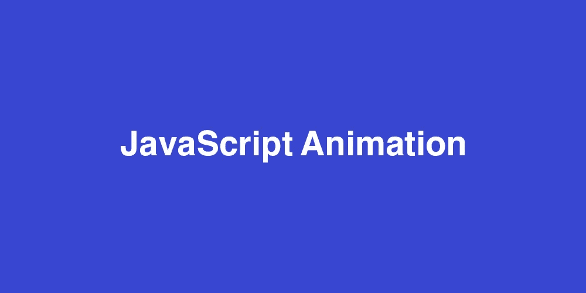
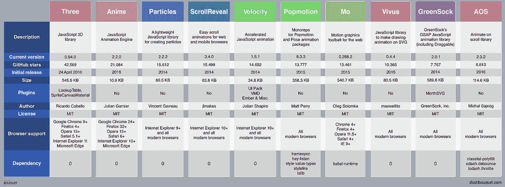

# 接下来的 10 个 JavaScript 动画库

> 原文：<https://medium.com/hackernoon/10-javascript-animation-libraries-to-follow-ee193196776>

现代网站的客户端以高质量的动画为食，这导致了对 JavaScript 动画库需求的增加。幸运的是，供应似乎与需求相匹配，有很多选择。然而，选择使用哪一个库可能会引起很多麻烦。许多库有潜力在一年中变得更好，并将成为创作动画的首选解决方案。

下面我们来看看 2018 年要关注的十大 JavaScript 动画库。

# [三个 j](https://github.com/mrdoob/three.js)

## 52 285 ★

在这个列表中排名第一和最受欢迎的动画库(有超过 900 个项目贡献者)，我们有三个 JS。八年后仍然很强大，三 JS 仍然是一个强大的动画工具。依赖于 WebGL，三个 JS 可以用来构建运行在 web 浏览器上的美妙的 3D 计算机图形。三个 JS 的特征包括但不限于立体效果、透视和正交照相机、几何工具如平面、立方体、球体、圆环体。然而，这个库的一个缺点是，一些开发人员发现它使用起来很慢。

**安装:**

使用 NPM，下面的命令可以用来安装三个 JS。

`**npm install three**`

更多信息可从 [**官网**](https://threejs.org/) 或 [**npm 网站**](https://www.npmjs.com/package/three) 获取。

# [动漫 JS](https://github.com/juliangarnier/anime)

## 31 381 ★

作为三个 JS 的可能替代品，我们将动漫 JS 列为这个列表中的第二位。由 Julian Garnier 创建，Anime JS 是你见过的最快的动画库之一。动漫 JS 与 DOM 配合流畅，支持 Chrome、Firefox、Opera、Safari、Internet Explorer 10+等主流 web 浏览器。这个库包括但不限于以下功能，CSS 转换动画 CSS 转换，SVG 动画线，时间轴同步多个实例。动漫 JS 吸引开发者的一点是它非常轻量级。

**安装:**

使用 NPM，下面的命令可以用来安装动漫 JS。

`**npm install animejs**`

更多信息可以从 [**官网**](http://animejs.com/) 和 [**npm 网站**](https://www.npmjs.com/package/animejs) 获取。

# [粒子 JS](https://github.com/VincentGarreau/particles.js)

## 19 269 ★

我们要看的第三个库是粒子 JS 库。由 Vincent Garreau 创建，Particles JS 是一个动画专用的 JavaScript 库，用于用点和线创建精彩的动画。如前所述，这个库用于创建看起来像粒子的动画。因此，它允许开发者改变粒子的密度、颜色、不透明度、形状和大小。但是，由于它只适用于粒子背景，因此不适合创建其他类型的动画。

**安装:**

使用 NPM，以下命令可用于安装粒子 JS。

`**npm install particlesjs**`

更多信息请访问 [**官网**](https://vincentgarreau.com/particles.js/) 或 [**npm 网站**](https://www.npmjs.com/package/particlesjs) 。

# [ScrollReveal JS](https://github.com/jlmakes/scrollreveal)

## 17 645 ★

ScrollReveal JS 在我们的列表中排名第四，就像之前讨论的 Particles JS 一样，它也是一个动画专用的 JavaScript 库。用于创建惊人的滚动动画，ScrollReveal JS 是一个轻量级的工具(它没有任何依赖性)并且非常容易使用，因为“自然语言”用于发送创建动画的指令。ScrollReveal JS 可以很好地处理 DOM 节点、多个容器、异步内容，并支持 3D 旋转。你可能得到的最好的滚动动画工具，它支持许多网络浏览器，只要它们支持 CSS 转换和 CSS 过渡。

**安装:**

使用 NPM，下面的命令可以用来安装 ScrollReveal JS。

`**npm install scrollreveal**`

更多信息可以从 [**官网**](https://scrollrevealjs.org/) 和 [**npm 网站**](https://www.npmjs.com/package/scrollreveal) 获取。

# [速度 JS](https://github.com/julianshapiro/velocity)

## 16 053 ★

下一个令人惊叹的动画库是 Velocity JS。很多用户界面设计师的心上人。这个工具使得简单地使用 HTML 和 SVG 来创建强大的网络动画变得容易。Velocity JS 可以用来滚动浏览器窗口，甚至撤销之前的动画。这是为数不多的独立于强大的 jQuery 框架的动画工具之一，尽管它使用与 jQuery 的$相同的 API。动画()。WhatsApp 和 MailChimp 等服务都是这个奇妙工具的已知用户。

**安装:**

使用 NPM，以下命令可用于安装 Velocity JS。

`**npm install velocity-animate**`

更多信息可以从 [**官网**](http://velocityjs.org/) 和 [**npm 网站**](https://www.npmjs.com/package/velocity-animate) 获取。

# [Popmotion JS](https://github.com/Popmotion/popmotion)

## 16 881 ★

Popmotion 排名第六。PopMotion 是一个类似于动漫 JS 的库，可以用来制作精彩的浏览器动画。这个库还具有诸如指针跟踪、弹簧物理、3D 对象动画等功能，并且可以很好地创建功能性的、反应性的动画。

**安装:**

使用 NPM，以下命令可用于安装 Popmotion JS。

`**npm install popmotion**`

更多信息可从 [**官网**](https://popmotion.io/) 或 [**npm 网站**](https://www.npmjs.com/package/popmotion) 获取。

# [莫 JS](https://github.com/legomushroom/mojs)

## 14 777 ★

与 Popmotion JS 类似，Mo JS 在榜单上排名第七。一个用于创建网页动画的简单的库。它很容易学习，因为创建者 Oleg Solomka 已经创建了许多教程和演示来帮助初学者快速入门。Mo JS 还具有创建圆形、多边形、矩形、直线等形状的功能。Mo JS 可能看起来简单易用，但它能够构建真正复杂的动画图形网络动画。

**安装:**

使用 NPM，以下命令可用于安装 Mo JS。

`**npm install mo-js**`

更多信息可以从 [**官网**](http://mojs.io/) 和 [**npm 网站**](https://www.npmjs.com/package/mo-js) 获取。

# [Vivus JS](https://github.com/maxwellito/vivus)

## 11 803 ★

Vivus JS 在这份榜单上排名第八。如果您正在寻找一个很棒的库来使用这个列表中的 SVG，那么 Vivus JS 是最好的选择，尤其是对于初学者。这个库也非常快，并且是轻量级的，因为它没有依赖性。除了使用 SVG，Vivus JS 还可以用来创建精彩的按钮，还有很多其他令人惊叹的动画可供使用。

**安装:**

使用 NPM，下面的命令可以用来安装 Vivus JS。

`**npm install vivus**`

更多信息可登陆 [**官网**](https://maxwellito.github.io/vivus/) 和 [**npm 网站**](https://www.npmjs.com/package/vivus) 。

# [绿袜子 JS](https://github.com/greensock/GreenSock-JS)

## 9 387 ★

忽略它在这个列表中的位置，GreenSock 通常被称为 GSAP(green sock Animation Platform ),是列表中最受欢迎的库之一。

格林斯托克的速度快，效率高，这也是它被珍视的原因之一。这个伟大的库也可以在很大范围的 web 浏览器上很好地工作，并且没有依赖性。

**安装:**

使用 NPM，以下命令可用于安装 GreenSock JS。

`**npm install gsap**`

更多信息可以从 [**官网**](https://greensock.com/) 和 [**npm 网站**](https://www.npmjs.com/package/gsap) 获取。

# [AOS](https://github.com/michalsnik/aos)

## 9 638 ★

因此，虽然本文中讨论的其他库严重依赖于 JavaScript，但 AOS(滚动动画)比 JavaScript 更依赖于 CSS。使用 AOS，开发人员可以在向下滚动时动画显示页面元素，然后在向上滚动时将动画恢复到之前的状态。这个库还附带了许多预定义的事件，可以由滚动事件触发。

**安装:**

使用 NPM，下面的命令可以用来安装动画滚动。

`**npm install aos**`

更多信息可以从 [**官网**](https://michalsnik.github.io/aos/) 和 [**npm 网站**](https://www.npmjs.com/package/aos) 获取。

# 包装它

这就是了。制作精美动画的十大 JavaScript 库。你使用过这些库吗？你对用户体验有什么看法吗？或者有没有你认为应该上榜却没有上榜的图书馆？大家说说吧。

[**9 个最好的 JavaScript 图表库**](https://dashbouquet.com/blog/frontend-development/10-javascript-animation-libraries-to-follow-in-2018)

[*安东·沙利尼科夫*](https://www.linkedin.com/in/anton-shaleynikov-45812a1/) 撰写