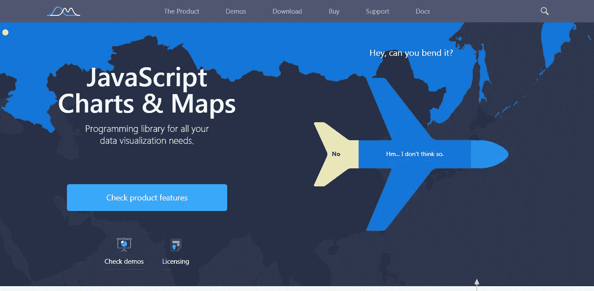
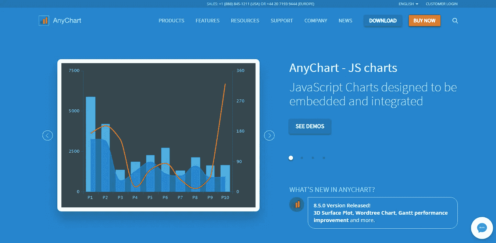
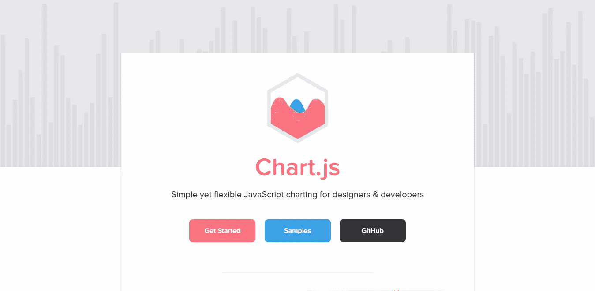
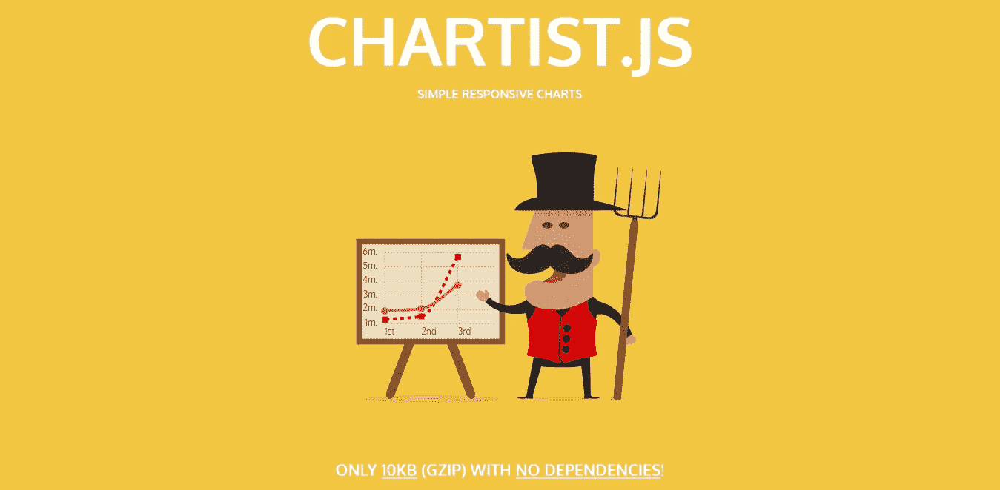
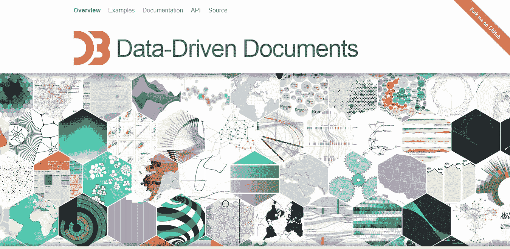
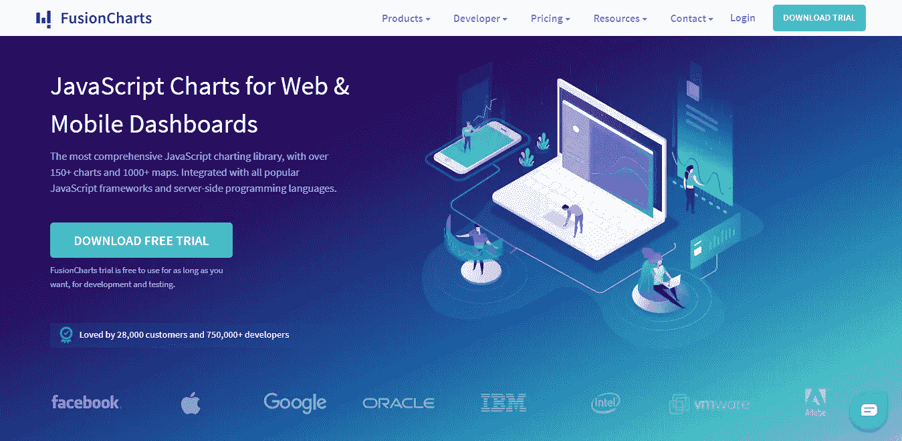
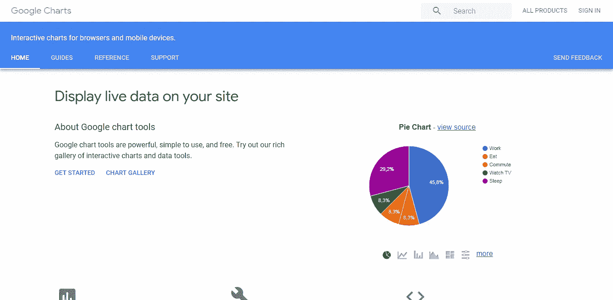
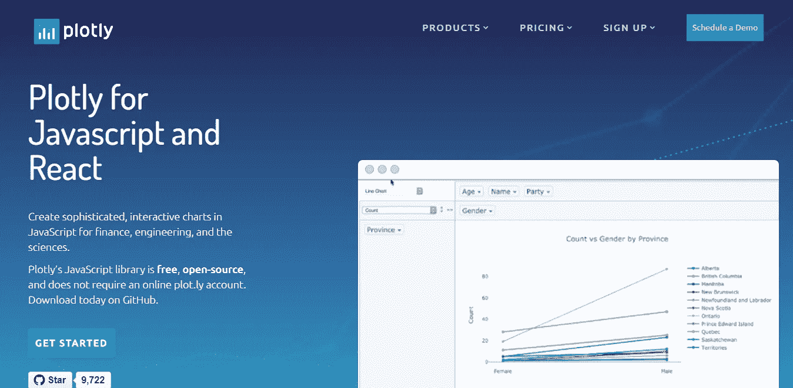
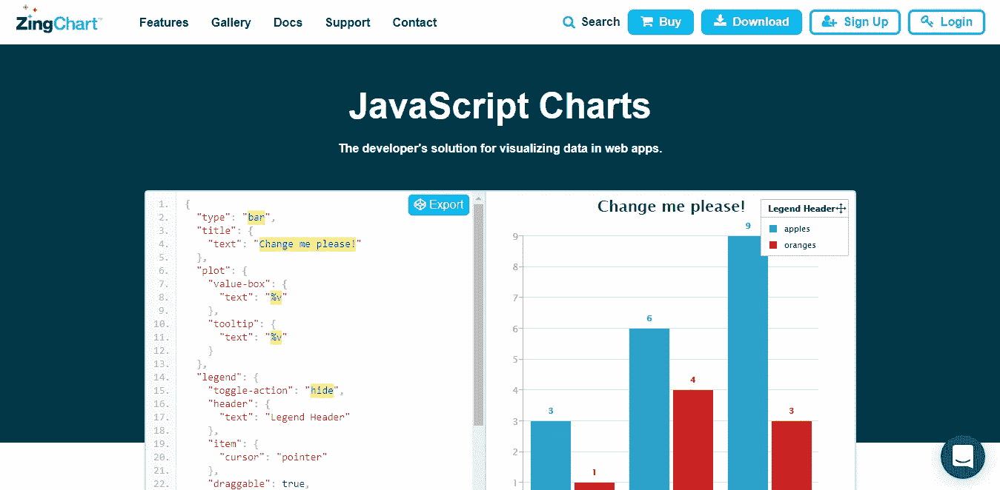

# 满足各种数据可视化需求的 10 大 JavaScript 图表库

> 原文：<https://medium.com/hackernoon/10-javascript-charting-libraries-data-visualization-b77523d23372>

> 图表有魔力。曲线轮廓揭示了一个完整的情况——流行病、恐慌或繁荣时代的生活史。曲线通知头脑，唤醒想象力，令人信服。
> ***―***[***亨利·哈伯德***](https://en.wikipedia.org/wiki/Henry_D._Hubbard)

如今，数据量呈指数级增长，我们看到的信息越多，处理起来就越困难。这就是为什么我们需要数据可视化——在图表和仪表板中，最好是交互式的。它帮助我们人类节省了大量的时间和精力来查看、分析和理解数据，并在此基础上做出正确、明智的决策。

在现代 HTML5 web 中，人们很难否认 JavaScript 是最通用和最简单的可视化数据技术。因此，如果你是一名前端 web 开发人员，你要么已经知道 JS 图表是关于什么的，要么你的第一个任务就是制作它们(很快)。

有许多 JavaScript 图表库[存在，每一个都有其特定的优点和缺点。为了让你的生活更轻松，我决定告诉你我最喜欢的。**我认为以下 10 个是创建图表的最佳 JS 库**并且可以真正帮助解决一个或另一个特定的数据可视化任务，无论是基础的还是高级的。请跟随我并查看它们，以确保您了解它们的基本知识，并且没有错过对您当前或下一个大项目有用的内容。](https://en.wikipedia.org/wiki/Comparison_of_JavaScript_charting_libraries)

话不多说，让我们来认识一下用于数据可视化的顶级 JS 库吧！

# amCharts

**amCharts** 是一个 JavaScript 图表库，当您需要一个简单而又灵活的数据可视化解决方案时，它会很有帮助。

## 关键特征

*   相当多的图表类型，包括地图和甘特图。
*   向下钻取功能以及其他强大的交互选项。
*   包含所有需要的方法的文档写得很好，但是从我的角度来看，它不太方便使用。
*   牛逼的图表动画。
*   可以与 React、Angular、Vue、Ember 等集成。
*   WordPress 插件是可用的。
*   导出为图像或 PDF。
*   实时图表、完全定制和 W3C 认可的辅助功能。
*   授权客户优先获得全面支持。
*   客户:微软、亚马逊、易贝、NASA、三星、Yandex、美国电话电报公司等。

## 定价

任何使用都是免费的，但所有图表都将包含一个小的品牌链接。要删除链接，您需要购买付费许可证(180 美元起)，这也让您可以获得优先支持。

## 了解更多关于 amCharts 的信息

*   [官网](http://amcharts.com/)
*   [文档](https://docs.amcharts.com/)
*   [下载](http://amcharts.com/download)

# 任意图表

AnyChart 是一个健壮的、轻量级的、功能丰富的 JS 图表库，支持 SVG/VML 渲染。它实际上给了 web 开发人员一个很好的机会来创建任何不同的图表，这将有助于根据所看到的内容做出决策。

## 关键特征

*   80 多种 JS 图表类型，包括基本图表、股票图表、地图以及甘特图和 PERT 图。
*   多种方式设置数据:XML，JSON，CSV，JS API，Google Sheets，HTML Table。
*   深入图表数据。
*   现成的股票技术分析指标和注释(绘图工具)。
*   丰富的文档、API 和友好的支持。
*   可以集成 Angular、Oracle APEX、React、Elasticsearch、Vue.js、Android、iOS 等。Qlik 中的仪表板和应用程序开发人员可以利用现成的 Qlik Sense 专用扩展。
*   许多示例和仪表板，以及一个带有代码自动完成功能的专用平台。
*   老浏览器支持。
*   将图表导出为各种格式，包括 PDFJPG、PNG 或 SVG 图像；XLSX 或 CSV 文件中的图表数据。
*   客户:甲骨文、微软、花旗、三星、诺基亚、美国电话电报公司、福特、大众、洛克希德·马丁等。

## 定价

带水印的版本是免费的。为了摆脱品牌，以及将 AnyChart 用于任何商业目的，有必要购买许可证(49 美元起)。

## 了解更多关于 AnyChart 的信息

*   [官网](https://www.anychart.com/)
*   [文档](https://docs.anychart.com/)
*   [下载](https://www.anychart.com/download/)

# Chart.js

Chart.js 是一个简单但非常灵活的数据 JavaScript 库，广受 web 设计者和开发者的欢迎。对于那些不需要大量图表类型和定制功能，但希望图表看起来整洁、清晰、信息丰富的人来说，这是一个非常好的基本解决方案。

## 关键特征

*   8 种图表类型:折线图、面积图、条形图、饼图、雷达图、极坐标图、气泡图和散点图。
*   所有图表类型都可以自定义和动画化，当在线使用时，所有图表都可以响应。
*   功能可以通过使用插件来扩展。
*   文档是好的。
*   通过堆栈溢出支持。
*   浏览器支持 IE9+。

## 定价

一个免费的开源 JS 图表库。在麻省理工学院许可下发布。

## 了解有关 Chart.js 的更多信息

*   [官网](https://www.chartjs.org/)
*   [文档](https://www.chartjs.org/docs/)
*   [下载](https://github.com/chartjs/Chart.js/releases/latest)

# Chartist.js

**Chartist.js** 是一个开源的、非侵入性的 js 库，它也可以用来创建漂亮的响应图表。一般来说，Chartist 适用于那些需要非常简单的图表(折线图、条形图或饼图)以及对数据可视化要求不高的人。好的外观，在这种情况下不需要有很多很棒的功能。

## 关键特征

*   只有 3 种图表类型:折线图、条形图和饼图。
*   很棒的动画。
*   API 文档包含所有必要的信息，但是使用起来不太方便，需要很长的滚动条来导航。
*   允许使用插件来扩展功能。
*   使用 SVG 绘制图表(未来兼容)。
*   老浏览器支持。

## 定价

开源，各种使用免费。

## 了解有关 chartist.js 的详细信息

*   [官网](https://gionkunz.github.io/chartist-js/)
*   [文档](https://gionkunz.github.io/chartist-js/getting-started.html)
*   [下载](https://github.com/gionkunz/chartist-js/tree/develop/dist)

# D3.js

**D3.js** 是一个强大的开源 JavaScript 库，用于数据可视化。至今在 GitHub 上已经被叉了两万多次。基本上，D3 更像是一个框架，而不是一个库。这很可能不是那么简单的工作，这在开始看起来很关键。但是外面有很多有用的信息资源。最后，你可以从头开始得到如此棒的可视化和任何种类的图形，让 D3 完全值得。

## 关键特征

*   支持多种图表类型，远远超过绝大多数其他 JavaScript 图表库(例如 Voronoi 图)。
*   陡峭的学习曲线。不如列表上的一些商业库清晰明显(比如 AnyChart)。但是有很多教程，API 真的很牛逼。
*   结合了强大的可视化组件和数据驱动的 DOM 操作方法。
*   使用浏览器内的元素检查器易于调试。
*   上百个例子。
*   曲线生成函数。
*   拖放。

## 定价

D3 是一个开源的图表 JavaScript 库，各种使用都是免费的。

## 了解更多关于 D3.js 的信息

*   [官网](http://d3js.org/)
*   [文档](https://github.com/d3/d3/wiki)
*   [下载](https://github.com/d3/d3/releases/latest/)

# FusionCharts

**FusionCharts** 是另一个很好的交互式图表库，拥有数百个现成的图表。图表接受 JSON 和 XML 数据格式，并通过 HTML5/SVG 或 VML 呈现。

## 关键特征

*   数十种图表类型，包括 2D 和 3D，以及覆盖各大洲的 950 多张地图。
*   动画和完全互动的图表和地图。
*   用于 ASP.NET、PHP 和 Ruby on Rails 的服务器端 API。
*   兼容 jQuery、Angular、PHP、ASP.NET、React Native、Django、React、Ruby on Rails、Java 等。
*   相当详细的用户指南和 API 参考。
*   许多样品和仪表板可供检查。
*   老浏览器支持。
*   出口到巴布亚新几内亚，JPG 或 PDF 格式。
*   通过知识库和社区论坛提供支持。
*   对许可证持有者的无限制优先级支持。
*   客户:苹果、IBM、谷歌、英特尔、微软、PayPal、甲骨文、Adobe 等。

## 定价

非商业用途免费，商业用途付费(497 美元起)。

## 了解有关 FusionCharts 的更多信息

*   [官网](https://fusionchart.com/)
*   [文档](https://www.fusioncharts.com/dev)
*   [下载](https://www.fusioncharts.com/download)

# 谷歌图表

**Google Charts** 对于不需要复杂定制、更喜欢简单稳定的项目来说是一个绝佳的选择。

## 关键特征

*   这些图表基于 HTML5/SVG 和 VML。
*   许多样品和仪表板可供检查。
*   所有图表都是交互式的，有些也是可平移/可缩放的。
*   全面的文档。
*   老浏览器支持。
*   通过 FAQ、GitHub 和论坛提供支持。

## 定价

许可是免费的，但是库不是开源的。它不允许你在你的服务器上存放谷歌的 JS 文件，所以如果你有一些敏感数据，它可能不适合你。

## 了解有关谷歌图表的更多信息

*   [官网](https://developers.google.com/chart/)
*   [文档](https://developers.google.com/chart/interactive/docs/)
*   [下载](https://developers.google.com/chart/interactive/docs/basic_load_libs)

# 高图表

**Highcharts** 是最全面、最流行的基于 HTML5 的 JavaScript 图表库之一，以 SVG/VML 呈现。它是轻量级的，支持多种多样的图表类型，并确保高性能。

## 关键特征

*   使用纯 JavaScript，数据可以外部加载。
*   强大的文档、API 参考和社区展示。
*   深入图表数据和其他交互选项。
*   可与 React、Angular、Meteor 一起使用。NET，iOS 等。
*   导出为巴布亚新几内亚，JPG，PDF 或 SVG 格式。
*   通过论坛和堆栈溢出支持免费版用户，高级电子邮件和 Skype 支持仅适用于拥有相应许可证的商业用户。
*   顾客:Visa，雅虎！、脸书、推特、Groupon、诺基亚、爱立信、万事达、Yandex 等。

## 定价

非营利组织免费使用。商业用途付费(50 美元起)。

## 了解有关高图表的更多信息

*   [官网](https://highcharts.com/)
*   [文档](https://www.highcharts.com/docs)
*   [下载](https://www.highcharts.com/blog/download)

# Plotly.js

**Plotly.js** 是一个高级 JavaScript 库，免费开源。它是建立在 D3.js 和 WebGL 之上的，所以可以用来创建许多不同的图表类型，包括 3D 图表和统计图。

## 关键特征

*   20 种图表类型，可嵌入网站或用于创建动态演示。
*   通过将图表抽象为声明性的 JSON 结构，用作 Python、R 和 MATLAB 的基于浏览器的图表库。
*   丰富的 API 文档。
*   好动画。
*   使用反应。
*   向巴布亚新几内亚和 JPG 输出海图；EPS、SVG 和 PDF 可通过订阅获得。
*   很多不同的样本要检验。
*   允许使用 Excel 电子表格，或连接到您的数据库。
*   支持论坛。

## 定价

开源的免费图书馆。

## 了解有关 Plotly.js 的更多信息

*   [官网](https://plot.ly/javascript/)
*   [文档](https://plot.ly/javascript/)
*   [下载](https://plot.ly/javascript/getting-started/#download)

# 辛查特

ZingChart 是制作交互式响应图表的有用工具。该库快速灵活，允许轻松管理大数据和生成包含大量数据的图表。

## 关键特征

*   支持 30 多种图表类型。
*   完全可定制的 CSS 风格。
*   兼容 jQuery，Angular，Node.js，PHP 等。
*   实时数据，快速呈现任何大小的数据集。
*   数据可以通过 JS 对象、JSON、CSV、PHP、AJAX 或 MySQL 加载。
*   完整但非常易读的 API。
*   通过 ZingChart 帮助中心、堆栈溢出、电子邮件和聊天提供免费和高级支持。
*   客户:微软、波音、Adobe、苹果、思科、谷歌、阿尔卡特等。

## 定价

品牌许可免费提供对 ZingChart 库的完全访问。商业用途需要付费许可(199 美元起)。

## 了解更多关于 ZingChart 的信息

*   [官网](http://zingchart.com/)
*   [文档](http://zingchart.com/docs/)
*   [下载](http://zingchart.com/try/)

# 结论

我列出了最好的 JavaScript 图表库，至少是我认为最好的。很难对它们进行全面的比较。每一种都有自己的优点和缺点，这取决于谁将使用它以及它的确切用途。

当然，有一些特性使一个库比另一个库更快、更漂亮或更灵活。但是最终，不管这个列表包含什么库，总的赢家总是满足您特定需求的那个。对于不同的人和公司，最佳 JS 图表库的选择也可以不同。

我的建议是——去看看这些顶级的库，因为无论何时你需要 JS 图表，无论是什么项目，你都很有可能找到一个或几个最合适的。更长的列表，请看维基百科上的[对比。](https://en.wikipedia.org/wiki/Comparison_of_JavaScript_charting_libraries)

如果您需要在交互式地图中可视化数据，关注地理趋势、关系、连接、流量等等，欢迎您阅读我之前的文章，关于创建地图图表的[最佳 JavaScript 库](https://onextrapixel.com/8-javascript-libraries-for-interactive-map-visualizations/)。

祝您度过愉快的一天，并使用 JavaScript 实现精彩的数据可视化！