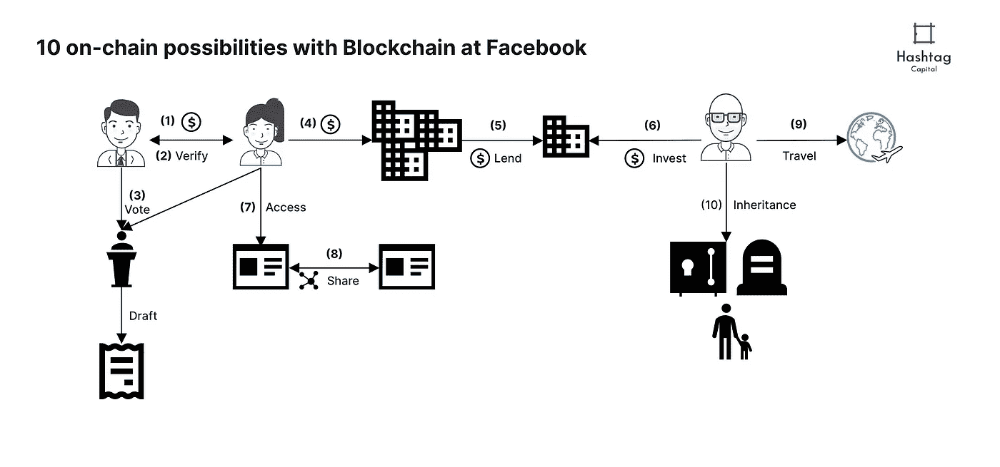
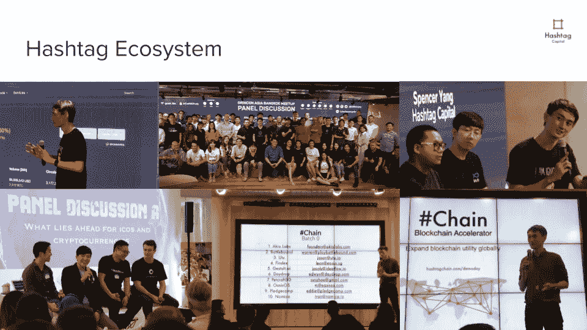

# 脸书区块链应用的 10 种可能性

> 原文：<https://medium.com/hackernoon/10-possibilities-for-blockchain-applications-for-facebook-a9ae7a41f3e5>

## 无缝支付、全球身份和验证、投资和继承

华尔街日报将脸书的区块链项目命名为天秤座项目(Project Libra )( T1 ),接近了万事达卡和维萨卡等盟友。据说，麻省理工学院的[克里斯蒂安·卡塔利尼](https://www.coindesk.com/mit-economist-christian-catalini-said-to-be-working-on-facebooks-crypto-push)正在研究脸书的加密货币。我们知道马克·扎克伯格的两个顶级助手确实在这个团队中——大卫·马库斯和凯文·韦尔。脸书正在积极招聘[区块链的职位。](https://www.facebook.com/careers/jobs/?q=blockchain)我对加密货币的长期效用和区块链技术的采用感到兴奋。这是一个关于 10 个连锁可能性的推测，脸书的努力可以为全球公民提供动力。你有什么看法？

Image 1: 10 on-chain possibilities with blockchain at Facebook by Hashtag Capital

## 1.点对点支付

有了脸书美元支持的加密货币，用户可以互相支付餐费、房租和任何需要的东西。文莫可能会嫉妒。

## 2.对等身份验证

这是一个全球化和互联的世界，社区和个人可以相互验证身份，以确保坏人被淘汰。经过验证的身份将在他们的名字上有一个复选标记，并注明验证号。对等体被激励只与具有强验证身份的其他对等体打交道。

## 3.投票和授权

为了让社区继续向前发展，对我们来说，在社区、聚会小组、社交俱乐部和组织中做每一个决定和投票都是愚蠢的。社区中的每个人都应该能够直接授权或投票决定对他们有利的提案和草案。

## 4.货物和服务的发票和付款

企业可以为他们的产品和服务向用户开发票和收费。他们还应该能够无缝地支付员工工资、报税和执行各种财务职能。

## 5.贷款和使用信贷

企业应该能够自动扩展信用额度，并在与其他企业合作时有付款期限。这将实现更高效的业务运营。

## 6.投资证券

普通公民和合格投资者应该能够通过智能合约进行投资，并获得他们所投资企业的证券。

## 7.访问任何电子服务、游戏、应用程序

使用他们的身份，公民可以验证和登录电子服务，游戏和应用程序。他们可以选择只有在他们的验证身份被认证时才具有个性化的体验。

## 8.与第三方电子服务、游戏、应用程序共享和检索数据

如果一个游戏需要来自另一个服务的用户照片，用户应该能够验证和授予一次性共享或检索的权限。如果没有经过验证的身份认证，服务将无法执行此类操作。

## 9.使用他们的全球身份进行旅行和移民

有了他们的身份，他们可以使用他们的移动设备和私人密钥在移民处或办理航班登机手续时验证自己。这样做可以让他们顺利通过快速入境柜台。公共旅行记录可供各国查阅。

## 10.资产和信息继承

通过公民的验证身份可获得的一切都将按照公民的偏好进行编程继承。拥有的资产、信息、服务、证券都可以轻松传递。

脸书有很多可能性可以尝试。收养会有障碍。我们对未来几年加密货币和区块链技术的大规模采用肯定感到兴奋。

Hashtag Capital 是一家多策略加密资产电子交易基金。我们从量化加密货币资产交易和战略投资中捕捉阿尔法。我们通过运行非营利加速器计划和社区活动来回馈加密货币和区块链社区。网址:

**

*Hashtag Capital community involvement*