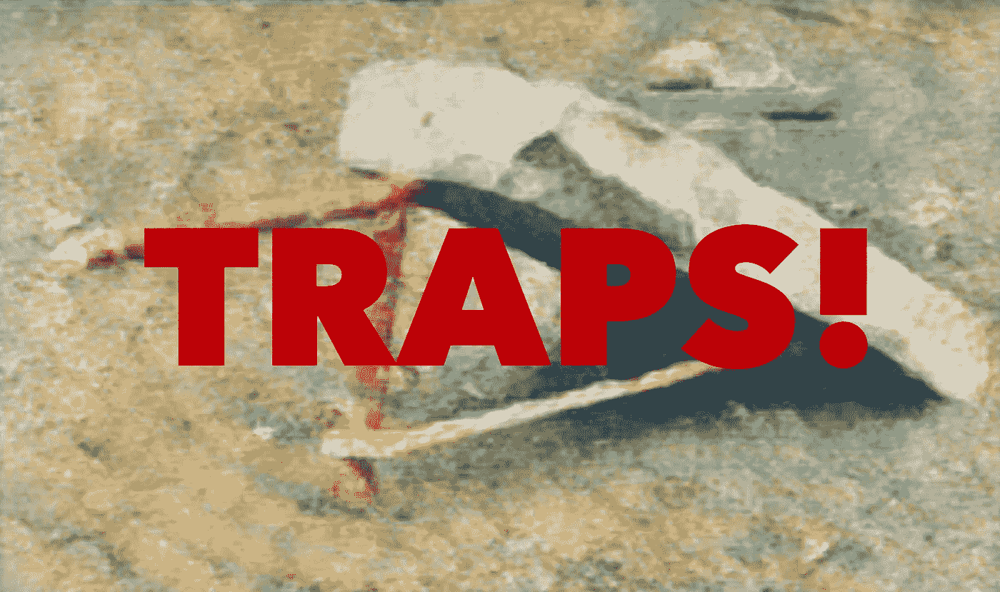

# 10 个产品开发陷阱

> 原文：<https://medium.com/hackernoon/10-product-development-traps-2de02bc358bd>

这些不是“规则”，而是*倾向*。我们似乎倾向于一个方向，并且必须积极地抵消这种倾向。这些年来，我(反复地)陷入了其中的每一个，并且观察到极其精明的产品开发人员也是如此。你如何避免它们？有两点很突出:1)可视化工作并限制正在进行的工作，2)让团队成员安全地指出紧张、缺乏一致性等。

我正在写一本书，涵盖这些陷阱和更多。[你可以在这里查看](https://docs.google.com/document/d/1oNIcstoV0wbEeOBITIG5XP1lbbugaNj7AfoIe0zI7Ss/edit?usp=sharing)。我喜欢你的评论。

1.  我们**低估了**我们实际正在进行的工作量以及(高 WIP)对流程、质量和交付价值的影响……并且**高估了**并行化工作的价值
2.  我们**低估了**依赖、约束、移交、评审等带来的阻力。…并且**高估了**我们驾驭它们、玩俄罗斯方块和穿针引线的能力
3.  我们**低估了**“正常工作”和“照常营业”类型工作的影响……并且**高估了**我们在不严重影响流程的情况下解决这些问题的能力
4.  我们**低估了**当前团队在支持、信任、安全和放下过去的不满方面所能做的……而**高估了**顾问、“新面孔”和流程修正的价值
5.  我们**低估了**创造持久的共同理解的难度以及理解退化的速度……并且**高估了**我们与一次性会议“结盟”的能力
6.  我们**低估了**晚收敛的价值……并且**高估了**我们将小计划小组的理解与“他们开始时的团队”同步的能力
7.  我们**低估了**高质量对未来价值流的积极影响……而**高估了**偷工减料和提前发货的增量价值
8.  我们**低估了**不同观点、想法、配对、群体等的价值。…并且**高估了**通过将工作外包给个人(个人积压)获得的效率收益
9.  我们**低估了**与新功能相关的非工程成本…并且高估了单个功能成就/破坏产品的程度(相对于整体体验)
10.  我们**低估了**追求冒险/不确定机会的潜在价值……而**高估了**“确定的事情”的价值

用这个表格有什么要补充的(低估…高估)？请在评论中让我知道。