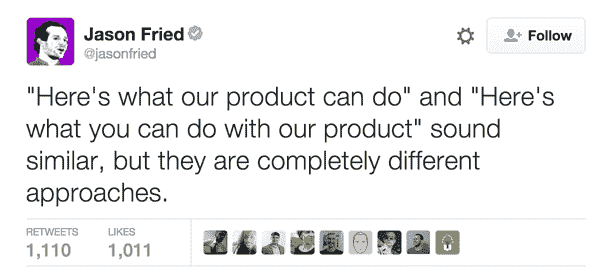

# 在 2019 年加入任何加密货币交易平台之前需要注意的 10 件事

> 原文：<https://medium.com/hackernoon/10-things-to-note-before-onboarding-on-any-cryptocurrency-trading-platform-in-2019-d986544c6876>

入职是将你的产品或服务的用户变成活跃客户的过程。一家公司要想赢得新客户，其入职流程必须是一流的。在这个世界上，人们可以预计高达 90%的加密货币初创公司会失败，要成为成功的 10%将需要额外的努力。

相同的原则指导着各种各样的入职流程。但由于加密货币的独特性，强调它是必要的。尽管现在数字货币越来越受欢迎，但由于加密货币和区块链的复杂性质，许多人仍然不知道它们是如何工作的。

应该注意的是，当涉及到入职时，组织只能有指导原则，而不能有硬性规定。这是因为每家公司都有自己独特的方式，必须根据自己的优势领域调整策略。

这里有 10 个原则可以帮助企业轻松地将流量转化为转化率和销售额。

***简约***

加密货币和区块链典型的复杂性质令许多人望而却步，并减缓了其采用速度。因此，加密货币平台，特别是为企业、投资者和个人提供革命性解决方案的加密平台，如果专注于简单性，将具有巨大的优势。这不仅仅是设计上的简单，而是使用平台的整个过程。新用户不应该在看到你的产品时感到不知所措，否则他们会离开。

***顾客为王***

在规划入职流程时，使用一个根据用户需求量身定制的流程。您可以通过使用不同的分析方法以及跟踪您平台上的客户行为来确定这一点。

> 说到加密货币，人们真的只想买卖这种货币。任何没有意义的贡献都是垃圾。

***主动研究和分析***

在你开始计划入职之前，也许是浪费你的努力之前，花大量的时间做一些市场调查是有好处的。确定确保你的产品成长的环境和市场。了解潜在客户的需求。

找出你的竞争对手做错的事情，并把它们作为你的卖点。即使在开始后，也要进行分析，以了解哪些行动会导致转化，以及是否有必要做出改变。不知道这一点是要避免的[入职错误之一](https://www.helpscout.com/blog/user-onboarding-mistakes/)。

***展示和讲述***

入职不仅仅是让用户开始使用你的产品；而是以一种简单且非侵入性的方式向他们展示。比起太多无聊又费力的屏幕浏览，简短的视频教程和动画更能有效地解释你想要的一切。

你知道你的产品有多值钱，它能做什么，但真正的问题是:你的客户知道吗？

**黠 **

对于加密货币平台来说，确保新用户快速熟悉你提供的服务是非常重要的。虽然你会有许多专业的新用户，但考虑到你的用户群中有很大一部分是加密货币新手。

因此，围绕向他们介绍您的平台的功能来构建您的入职培训。这就是为什么你必须保持入职非常简单的原因。

***与你的用户互动***

入职不应该仅仅是一个组织的过程。用户也应该积极参与。在展示和讲述时，要求用户重复所解释的过程会带来更好的体验。

***组建论坛***

社区(包括线上的)都很好。你可以创建一个使用你的交易平台的人的网络，给他们一个讨论、寻求帮助和开玩笑的渠道。在线论坛给人们一种归属感，使用户更有可能成为终身客户。

***个性化吧***

即使有一个完美的入职流程，它也不会让你的产品的每个用户都满意。因此，让每个人的体验变得独特和个性化是很重要的。这并不意味着创建一个不同的入职流程(真的吗？)就是说要保证这个过程给用户留下一些影响。你肯定知道他们是怎么说第一印象的。确保你了解你的顾客。像 Matt Sornson 这样的高管认识到了使入职个性化的重要性。

***请求反馈***

是的，它仍然有效。但是如前所述，保持事情简单和简短。当你给你的客户一长串问题时，不要让他们觉得他们是在考试。你可以让他们给你的产品打分并留下评论，但要确保这也是一种非侵入性的方式。

***卖点***

构建您的卖点，说明与您交易将如何帮助客户。没有人真的想知道你的软件能做什么，如果它的特性最终对他们没有帮助的话。几年前，Basecamp 的 Jason Fried 在推特上总结道:

***结论***

许多人会犯这样的错误:当用户注册了你的产品的付费订阅时，入职就结束了。这在某种程度上是对的，但忽视之后的一切是一场灾难。即使在签约之后，入职仍在继续，你应该给他们好的待遇。顾客是上帝，对吗？