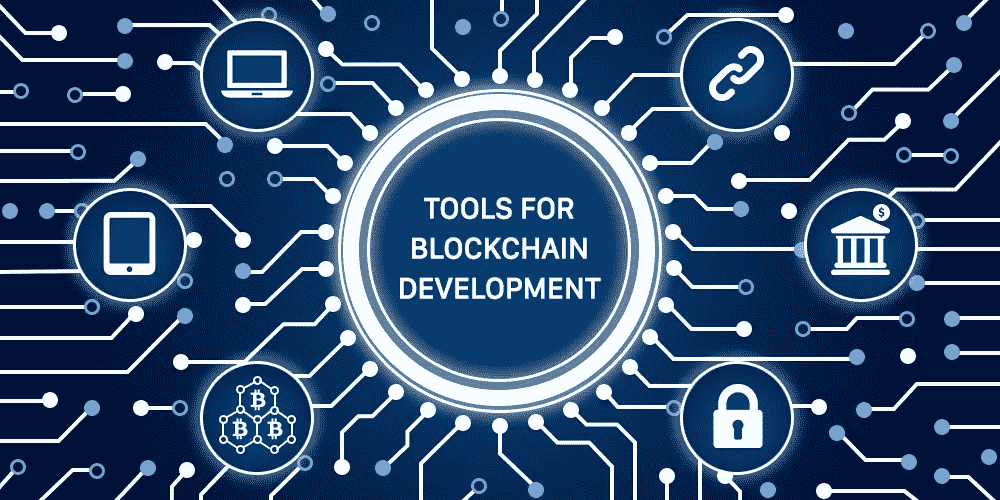
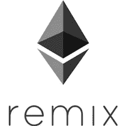
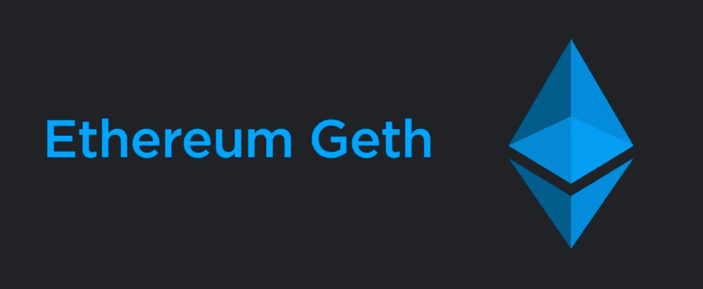
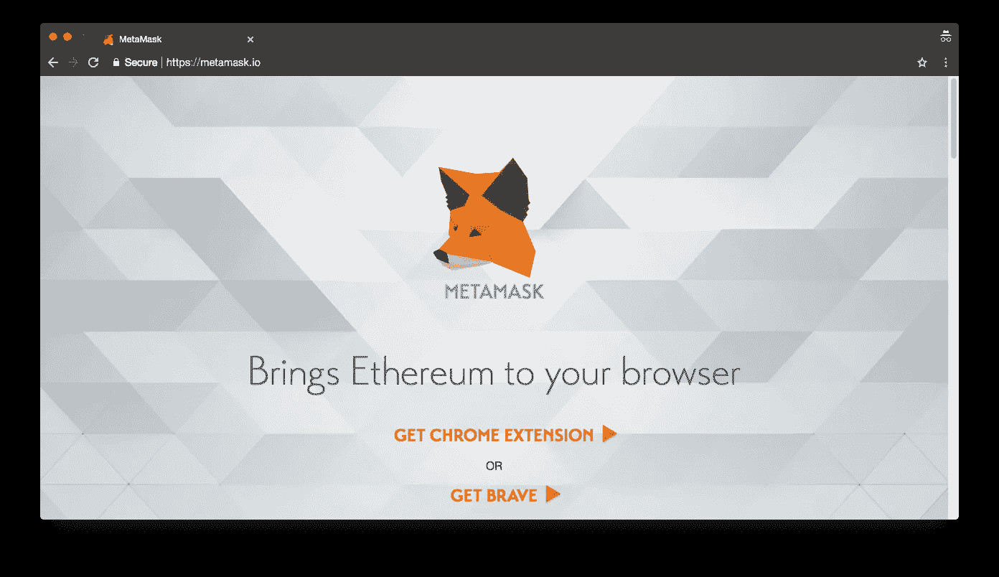
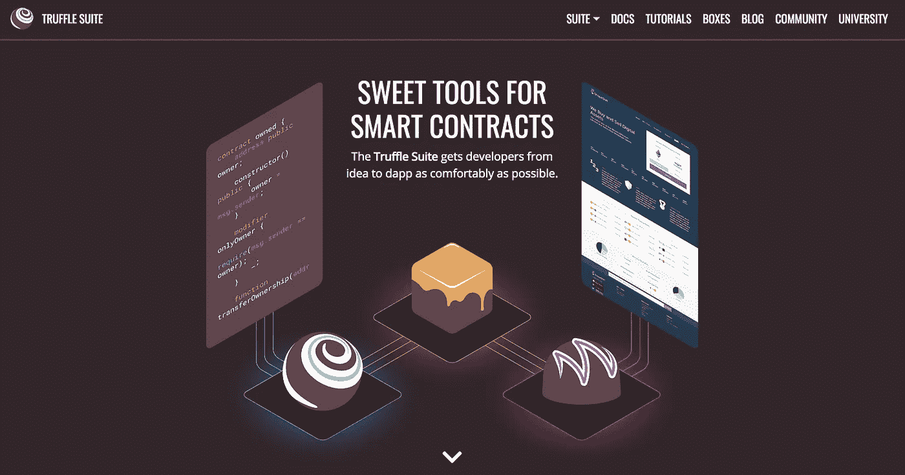

# 区块链开发的 10 个工具

> 原文：<https://medium.com/hackernoon/10-tools-for-blockchain-development-67f862a03a36>



[区块链](https://dashbouquet.com/blog/blockchain/blog/blockchain/blockchain-solutions-the-way-to-transform-your-business-processes)虽然大多数人都是通过比特币等加密货币知道的，但它的用途远不止为加密技术提供动力。最近，许多公司已经想出了将这项技术投入使用的创新方法，从将其用作分散投票系统到管理全球航运系统。

甚至像 IBM 和三星这样的大公司也采用了它。因此，人们对 it 的兴趣自然会带来对区块链开发人员的需求。事实上，根据 Upwork 的一份[报告，区块链恰好是其平台上增长最快的技能，超过了 TensorFlow 和机器学习等技能，位列前 20 名。这意味着区块链开发者有很多工作机会。](https://www.upwork.com/blog/2018/05/fastest-growing-skills-upwork-q1-2018/)

区块链不仅仅用于处理事务或存储值。一些区块链有能力执行被称为智能合同的程序。智能合同是一种数字合同，可以帮助你以自由透明的方式交换金钱、财产或任何有价值的东西，而不需要中间人。

如果你有兴趣成为其中一员并开始一个区块链项目，这里有 10 个被区块链开发者普遍使用的工具。当然不止这些，这些只是更受欢迎而已。

# 排名第一的混音 IDE



以太坊有很多用于编写和部署智能合约的工具。最容易使用的工具之一是基于浏览器的 IDE，称为 Remix。Remix 可以用一种叫做 Solidity 的编程语言来编写、调试、测试和部署智能合约——稍后会详细介绍。

[Remix](https://remix.ethereum.org/) 是用 Javascript 写的，是开源的，因此所有人都可以免费使用。你可以查看他们的文档[这里](https://remix.readthedocs.io/en/stable/)了解更多信息。

# #2 文本编辑器

除了上面提到的工具，像微软开发的 [Visual Studio Code](https://code.visualstudio.com/) 、 [Atom.io](https://atom.io/) 、 [Sublime Text](https://www.sublimetext.com/) 等文本编辑器都可以用来编写和编辑 Solidity 文件。

# #3 坚固性


在这一点上，你开始想知道什么是可靠。Solidity 是一种面向接触的编程语言，用于编写在各种区块链平台上执行的智能合同，以太坊就是其中之一。

Solidity 具有与众所周知的 JavaScript 编程语言相似的语法，并增强了以太坊虚拟机。你可以[阅读文档](https://solidity.readthedocs.io/en/v0.4.24/)。

# # 4 SoLC——可靠性编译器

就像许多其他编程语言一样，Solidity 也有一个编译器。它将以 Solidity 编写的智能合同翻译成以太坊虚拟环境可以理解的格式。

有两种可靠性编译器。Solc 是用 C++编写的，Solc-js 是用 Emscripten 从 C++交叉编译成 Javascript 的。

虽然 Solc 和 solc-js 都是作为 Solidity 编译器工作的，但应该注意的是，Solc-js 比 Solc 稍慢一些。然而，它使得像 Remix 和 Pragma 这样的平台能够顺利工作。

Solc 可以用下面的命令安装在 Ubuntu 上:

```
sudo add-apt-repository ppa:ethereum/ethereum 
sudo apt-get update 
sudo apt-get install solc
```

solc 的 windows 二进制文件可以在这里获得[。](https://github.com/ethereum/solidity/releases)

# #5 土壤

作为一名区块链开发人员，安全性是开发中非常重要的一部分。重要的是你的 solidity 代码没有安全漏洞，这就是 Solium 的用武之地。

Solium 是一个设计用来帮助格式化你的 solidity 代码以及修复你的代码中的安全问题的工具。因此，它可以确保你的代码格式正确，易于阅读，并检查漏洞。你可以在他们的 [Github 页面](https://github.com/duaraghav8/Ethlint)上找到更多信息。

要使用 Solium，您需要使用 npm 进行安装:

```
npm install -g solium 
solium -V
```

# #6 平价


编译之后，您必须建立一个开发环境，以便在以太坊区块链上部署您的合同。为了与区块链互动，你需要一个以太坊客户端，这就是奇偶校验的需要。

[奇偶校验](https://www.parity.io/)是与区块链互动的最快、最安全的方式之一。它是由以太坊前 CTO Gavin Wood 创建的，用 Rust 编程语言编写。

奇偶校验直接集成到 web 浏览器中。它允许用户访问以太网和基本令牌钱包功能。它还充当以太坊 GUI 浏览器，允许访问以太坊网络的所有功能，包括 dApps(分散式应用程序)。

# 第七名

除了奇偶校验，你还可以尝试 Geth，它也是一个类似奇偶校验的以太坊客户端。在新手中很受欢迎。Geth 也称为 Go 以太坊，是用 Go 编程语言编写的。Geth 可用于许多平台，包括 Windows 和 Linux。



在 Linux 上，它可以通过 PPA 安装，如下所示:

```
sudo apt-get install software-properties-common 
sudo add-apt-repository -y ppa:ethereum/ethereum 
sudo apt-get update 
sudo apt-get install ethereum
```

Windows 和 Mac OS 用户也可以在这里[下载](https://geth.ethereum.org/downloads/)。

# #8 元掩码

如果您想通过浏览器简单地访问区块链，元掩码是一个非常好的选择。这是一个 chrome 扩展，它极大地改善了其他人如何在区块链上与你的分散式应用程序进行交互。



[MetaMask](https://metamask.io/) 通过托管几个节点来做到这一点，这意味着您不需要在您的设备上有一个节点。你所需要做的就是向他们注册一个账户，你就自动连接到他们的一个节点上了。

MetaMask 允许您在浏览器上运行分散的应用程序，并可用于保护钱包，确保用它们进行的交易是安全的。

# #9 [松露](https://truffleframework.com/)

Truffle 是构建智能合约的工具。这是一个开发套件，旨在使区块链开发更容易，确保开发人员能够轻松地构建分散的应用程序。



这个强大的框架允许开发人员使用像 Mocha 和 Chai 这样的工具来执行自动化测试，还可以执行脚本化的部署和迁移。你可以在 [Github](https://github.com/trufflesuite/truffle) 上查看松露。

Truffle 可以通过以下命令使用节点包管理器进行安装:

```
npm install -g truffle
```

# # 10 DAppBoard


[dapboard](http://dappboard.com/)是以太坊智能合约的分析平台。这是以太坊区块链探索者。DAppBoard 是一个基于网络的分析服务，旨在监控和分析以太坊区块链上的智能合约活动。

通过 DAppBoard，你可以看到智能合约和去中心化应用程序是如何被世界使用的。您还可以获得分散式应用程序的用户数量信息，或者合同处理了多少以太网。

# 结论

总之，除了这里提到的，还有很多区块链工具。所以你可能需要也可能不需要，这取决于你的项目。其他值得一提的强大工具还有 [GanacheCLI](https://github.com/trufflesuite/ganache-cli) 、 [EtherScripter](https://etherscripter.com/) 和 [Embark](https://github.com/embark-framework/embark) 等等。

我希望这篇文章已经帮助您了解了可用于区块链开发的工具。快乐区块链发展！干杯。

[*安东·沙利尼科夫*](https://www.linkedin.com/in/anton-shaleynikov-45812a1/) 撰写