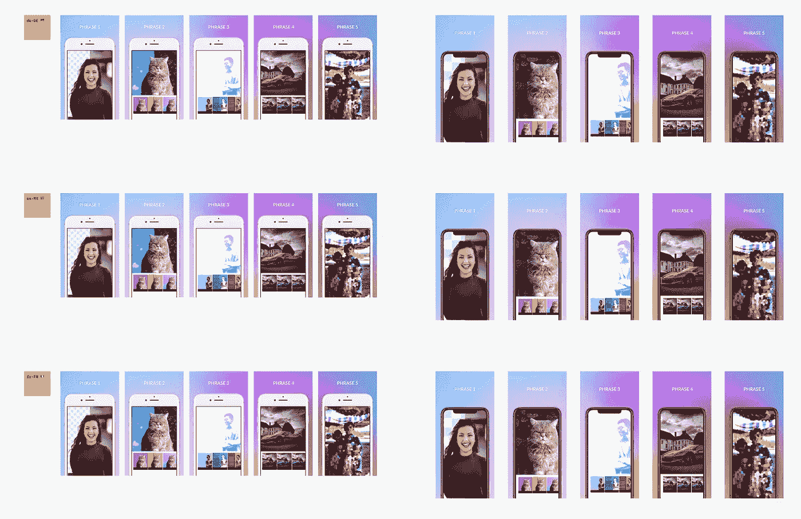
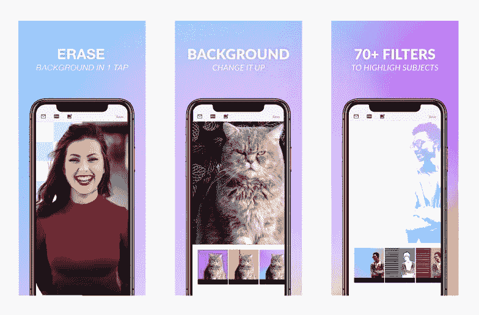

# 两周内发布 iOS 应用的 10 个工具

> 原文：<https://medium.com/hackernoon/10-tools-to-ship-an-ios-app-in-2-weeks-f33ee90fd1ea>

## iOS 应用尽快

我刚刚推出了 [BG](https://itunes.apple.com/us/app/photo-background-changer/id1455009060?mt=8) (现在叫[摄影室](http://photoroom.app))。这是一个理解你的图像的图像助手，我们相信它将改变人们编辑图像的方式！它从几个简单的任务开始，例如擦除背景或对象，选择对象而不是对任何人都没有意义的层。机器学习在设备 GPU 上本地运行，速度快得惊人！它甚至可以通过 iPhone XS 神经引擎在[视频](https://twitter.com/matthieurouif/status/1126575118812110854)上实时工作。关于这个应用程序，我已经说得够多了…

从我们在 GitHub 上写下第一行代码到在 App Store 上发布，BG 的第一个版本花了两周时间。如果你有合适的工具，你可以工作得非常快！所以如果你是移动开发的新手，这篇文章可能会对你有所帮助。

# **编程—经典之作**

**0。XCode:** 这个不言而喻。

[**1。GitHub**](https://github.com) **:** 没有版本控制工具你做不了多少事情。如果你不喜欢 octocat，请使用任何其他竞争对手。

[②**。浪子**](https://fastlane.tools) **:** 使用这款移动开发运营工具，将您的应用毫不费力地提交到应用商店。鉴于我使用的工具，我向 OneSky 推荐[这个 fastlane](https://github.com/danielkiedrowski/fastlane-plugin-onesky) 插件。

[**3。cocoa pods**](https://cocoapods.org):Swift 的移动依赖管理器。大家都在用。大多数情况下，它允许您为以下工具或其他开发人员导入和管理名为“pods”的库。下面大部分工具其实都是豆荚。

[**4。Firebase**](https://firebase.google.com) :使用 Firebase 的云服务设置起来非常简单。您可以轻松地将您的用户帐户存储在那里。它还包括功能标记、AB 测试、稳定性分析、推送通知。而且大部分都是免费的。

# **走向全球**

[**5。OneSky**](https://www.oneskyapp.com) **本地化文本:**我喜欢 OneSky，因为我在 4 年的翻译中从未出现过一个编译错误(我们之前在 GoPro 使用过)。有一个带有注释和翻译版本的协作系统。我推荐使用 [fastlane](https://github.com/danielkiedrowski/fastlane-plugin-onesky) 自动下载和上传翻译。此外，为翻译人员添加上下文截图。多亏了 fastlane，我们能够以几百美元的价格运送 14 种语言的 BG。

OneSky 的 API 并不完美，网站可以快 10 倍。如果你有更好的方法，请与我分享——我很乐意尝试！

[**6。Figma**](https://www.figma.com/) **轻松本地化设计** : Figma 的目的是勾画出 Google Docs 对于 Word 的意义。它是在线的，具有内置的协作和版本控制。在线优先使得免费重用私有&公共模板变得容易。例如，[这里有一个模板可以轻松测试和导出 iOS 图标](https://www.figma.com/resources/assets/ios-app-icon-template/)，另一个模板可以导出 140 个[截图](https://www.figma.com/file/HdLwisQBYf6d5XxvC5CoTe/App-Store-Screenshots-iPhone-Localized)(我在这里公开了 14 种语言和 2 种 iOS 设备格式)。

Figma 背后的天才们将类和实例的概念作为产品的核心。然后重用多种语言和屏幕截图大小的组件变得非常简单。

我还使用 Figma 来创建应用程序的设计

# 处理付款

[**7。T21 是镇上新的酷家伙。我记得几年前，包括应用内支付在内，一个应用的开发时间增加了一倍——更不用说订阅了。RevenueCat 是移动的条纹；它节省时间。一开始我有点怀疑，但是他们做了错误处理和网络报告的所有繁重工作(你不必再像在 iTunes 上那样等一天)。然后，您还可以将它们与您的分析和 CRM 服务同步。**](https://www.revenuecat.com)

*大加分:对于一个 iOS 应用来说绝对是太棒了！当你穿过站台时，我想它会变得很神奇。在 GoPro，处理跨多个平台(移动和网络)的订阅是一件非常棘手的事情。*

# 应用商店页面

**Figma** 又来了。如前所述，Figma 是当今最好的工具，可以轻松地为多个屏幕进行 14 种语言的本地化。[链接到我的模板这里](https://www.figma.com/file/HdLwisQBYf6d5XxvC5CoTe/App-Store-Screenshots-iPhone-Localized)。

Screenshot automation with Figma

[第八期**。Mojo**](http://mojo.video) :视频预告&入职。Mojo 是一个非常棒的应用程序，可以在 Instagram 上创建专业的故事。事实证明，预览和入职并不是一个遥远的故事，你可以为你的应用程序使用 Mojo。你可以为你的应用预览创建漂亮的动作设计。他们甚至有一个 iPhone 框架，你可以在那里粘贴你的应用程序的截屏。

*提示 1:使用类似于* [*一个*](https://github.com/morizotter/TouchVisualizer) *的触摸可视化窗格显示触摸交互。*

*提示二:我的 app 预览(* [*你可以在这里看到*](https://twitter.com/matthieurouif/status/1110852776014348288) *)在第二次审核时被拒绝，因为它使用的是 Mojo 的 iPhone 框架模板。您可能还需要对视频进行重新编码，以匹配 iTunes 格式(Mojo 在音频轨道上有一个 bug)。*

技巧 3:对于入职培训，我在每页上使用了一个 Mojo story 和一个 UIPageViewController。我对结果非常满意。

BG onboarding made with a simple UIPageViewController and videos from Mojo app

# 了解你的客户

[**9。振幅**](https://amplitude.com) **用于分析**:振幅是迄今为止最好的面向用户的分析工具。如果你真的想了解你的用户，这是显而易见的。它围绕留存率、渠道和活跃用户进行优化，这些是对以用户为中心的公司来说唯一重要的指标。Mixpanel 非常类似，但更专注于大型跨平台公司。我也尝试过 Localytics，但它实际上是一个 CRM 工具，分析部分只是营销，说他们是一个交钥匙解决方案。

[**10。对讲机**](https://www.intercom.com) **与你的用户交谈**:打造伟大产品的首要规则是与你的客户交谈。振幅给你一个定量的概述；对讲机给出了一个定性的概述。许多应用程序使用电子邮件进行反馈，但这太正式了，而且电子邮件在移动设备上仍然是一个难题。你想要创造一个反馈尽可能随意的环境，以获得最真实的反馈。因为没有什么比聊天界面更好了，对讲机是这里最好的工具。然而，对讲机不是移动优先的工具；许多特性来自于网络优先的方法。我希望你可以创建本地调查——例如，移动小工具，建议预先写好的答案，等等。

*提示:振幅、对讲机和 RevenueCat 使用相同的用户 id (* [*厂商标识符*](https://developer.apple.com/documentation/uikit/uidevice/1620059-identifierforvendor) *以尊重隐私)。然后你就可以在振幅和 RevenueCat 中对付费用户或非常活跃的用户进行细分，并通过对讲机与他们交谈。*

感谢阅读！我希望这些工具中的一个或多个对您有所帮助。此外，请随意鼓掌分享这个词——如果你能给 BG 一次机会，我将不胜感激。你可以在这里下载[。](https://itunes.apple.com/us/app/photo-background-changer/id1455009060?mt=8)

[弗朗切丝库·桑托尼](/@Francescu)关于工具的建议。