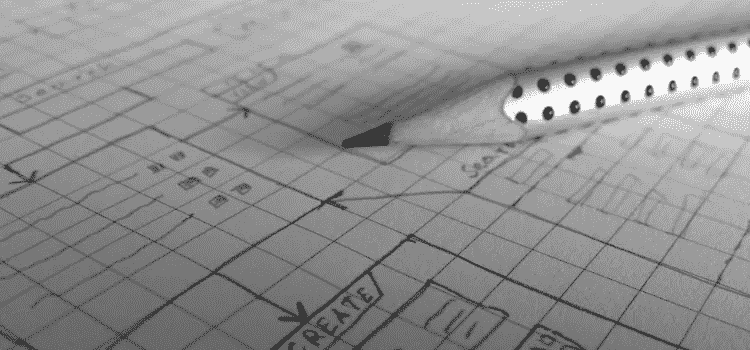

# 打造糟糕电子商务网站的 10 种方法

> 原文：<https://medium.com/hackernoon/10-ways-to-make-a-terrible-ecommerce-website-cc4d6e4b68>

# 1.糟糕的配色方案

你在网站上选择的颜色非常重要。记住颜色会对人产生心理影响，所以你要记住你的调色板。请记住，计算机屏幕上的颜色与打印出来的颜色不同。避免使用非常大面积的亮色，如红色、黄色、橙色和淡粉色，因为这对眼睛来说很难。

选择调色板时，要考虑色彩理论的基本原则。在谷歌上输入“色环”这个词，改成 basic。看看其他选定的网站，看看他们使用什么样的颜色。你可以从柯勒或科洛沃斯等网站上获得调色板的灵感。

# 2.Flash 页面

Flash 网站可能非常有吸引力，但是如果你不在娱乐行业，由于许多原因，它不会非常有效。首先，Flash 页面加载速度很慢，尤其是在您没有使用快速互联网连接的情况下。网民关注度很低。如果你的网站不能在 8 秒或更短的时间内加载，它就不能。此外，Flash 网站因为没有内容被机器人抓取，对搜索引擎排名不利。但是避免 flash 网站的最大原因是它们会分散访问者的注意力。

看看最大的电子商务网站，注意到它们都没有 Flash 页面。为什么不是因为零散客户不买。如果你用你的网站来推广或销售业务，你需要在内容和用户之间有最少的差距。所以，坚持使用普通的 HTML 页面。

# 3.混乱的导航

确保网站导航清晰，易于追踪。许多新手设计师会犯这样的错误:试图在导航中推送许多链接。许多选项让用户感到困惑，他们经常离开网站去寻找点击的地方。让导航更容易。不要在主导航中留下 5 到 7 个类别。

在[下拉菜单的侧边栏](https://www.w3schools.com/howto/howto_css_dropdown.asp)和网站更深层的页面中使用额外的导航。避免想象中的悬浮在菜单上的动画导航，看看他们可以去哪里。此外，如果您使用的是下拉菜单，请确保单击“确定”。没有什么比不能点击下拉菜单更令人沮丧的了。

# 4.不兼容的文本格式

有时候，为了让网站更有吸引力，一些网站的设计在 Nubebit 项目中使用了不同的字体。不幸的是，这种方法让网站看起来很业余。不要对整个网站的正文和页眉使用一种或两种不同的字体。另外，要和字体大小保持一致。正文部分不要少于 11 分，尤其是如果你的网站吸引年长的收件人。正文的理想大小范围是 12 到 14 磅。大小和副标题比正文高 2 到 4 磅。因此，对于 12 磅的正文，标题的长度应该在 14 到 16 磅之间，主标题的长度应该在 18 到 20 磅之间。

# 5.使用模糊的字体

你想在你的网站上避免花哨的模糊字体有两个原因。第一个原因是它们很难阅读，你想为浏览你网站的人保留所有内容。另一个原因是，如果浏览网站的人没有你想下载到你电脑上的字体，他会看到不同的字体。这意味着你失去了对网站外观的控制。

现在你可以设置一个备份字体，这意味着如果你没有下载第一个字体，它会转到下一个你指定的字体。现在你可以使用特殊的字体，但不建议这样做，因为每个字体的大小都不一样。这意味着你永远无法完全控制你的网站的外观。

# 6.拥挤或无组织的项目

最好的布局是简单干净的。抵制把所有东西都扔到你网站上的冲动。如果所有这些都没有出现在一个页面上，用户就不会错过任何东西。还是那句话，给人很多视觉上的选择，会混淆，会走开，而不是从一个拥挤的地方滚动。在你的布局中加入大量的空白。在呼吸室的视觉元素之间允许眼睛聚焦在单个元素上。

# 7.不可读的文本

互联网上通常的配色方案是黑底白字。虽然这个计划具有创建出现在页面“pop”中的东西的效果，但是它也很难阅读。最易读的文本配色方案是白色背景上的黑色或深棕色文本。

你也应该避免在白色上使用非常浅的棕色文字。虽然这是几年前网页设计的所有愤怒，阅读对比少的文本可能是困难的。在白色配色方案上移动传统的黑色将使文本人人可读。

# 8.背景中繁忙的图案

被占据的背景非常分散注意力，也冲击了互联网的最初几天。任何保存在繁忙背景上的项目都将丢失。尤其是文字的话。纠结于纯色、柔和渐变或微型图案的背景。他们会在没有任何权力的情况下，给你的项目适当的利益。

# 9.糟糕的客户服务

如果客户服务真的很差，很少有人会从你的服务中受益。假设您的订单有问题，想要联系在线客户代表。如果你和这个人聊天，而她真的很生气或者没有和你正确交流，你还会再访问这个网站吗？

# 10.交易不安全

通过信用卡或网上银行账户进行交易的人在网站上应该感到安全。如果网站不安全，人们会损失金钱，这可能是一个问题。不应该有任何用户可以指出的错误。这种错误降低了电子商务网站的市场价值。

*文章* [*来源*](http://www.wpconquer.com/ecommerce-website-design-mistakes-to-avoid-in-2019/)