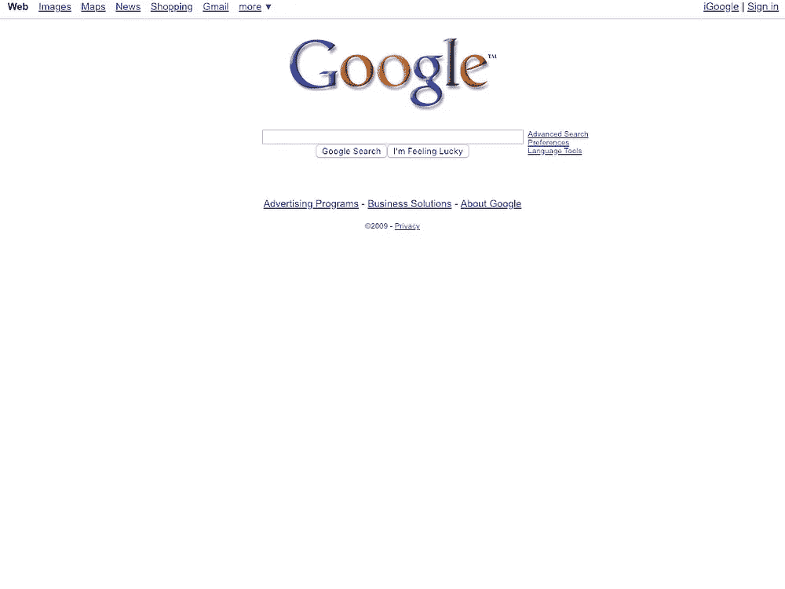
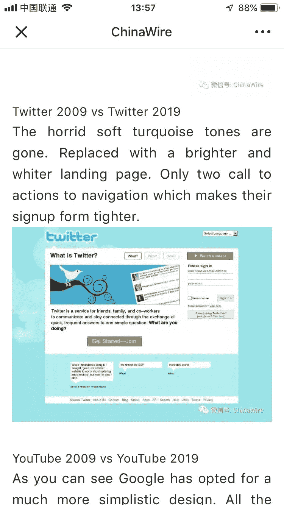

# 在过去的十年里，谷歌、推特、Youtube、脸书和 Reddit 在中国发生了怎样的变化

> 原文：<https://medium.com/hackernoon/10-year-challenge-how-popular-websites-have-changed-in-china-6f27dd0ce1ba>

## 令人兴奋的是，十年后中国的网站会发生什么变化。

Brought to you from here in Shanghai. Images provided by my Chinese internet connection and [Arun Venkatesan](https://twitter.com/zhenpixels)

# 谷歌 2009 vs 谷歌 2019

正如你所看到的，谷歌选择了一个更加简单的设计。它让人想起了过去，想起了拨号调制解调器和电脑涡轮按钮的时代。谷歌因其对空白的大量使用而闻名，即使十年过去了，它仍然保持着自己的风格。

A much simpler two-tone colour scheme. Bold and memorable.

# 推特 2009 vs 推特 2019

可怕的柔和蓝绿色调消失了。替换为更亮更白的登录页面。只有两个操作调用来导航，这使得它们的注册表单更紧凑。很少有网站可以吹嘘自己有这样一个有效的渠道。

The new Twitter produces less outrage than the older one.

# YouTube 2009 vs YouTube 2019

所有的杂物、文字和视频……都不见了。不再有令人分心的混乱，YouTube 终于解决了浏览和推荐的问题。这可能有助于解决他们与反社会者之间的问题。

Just like the animators and smaller content creators. Gone.

# 2009 年脸书对 2019 年脸书

十年来，脸书的布局仅略有改变。直到最近的事态发展。少忧郁，少社交，少行动。这是社交网络平台中出现的一种趋势。隐私一直是脸书关心的问题，但这可能对解决这个问题有很大帮助。

Those still using Facebook in 2019 will find the new layout tricky to understand.

# Reddit 2009 vs Reddit 2019

Reddit 的标志性布局将功能置于设计之上。Redditors 击退了可怕的新设计……它似乎是所有可怕的社交网络布局的某种变种混合体。然而，他们无法抗拒这种不令人惊讶的变化。

Reddit have disregarded all feedback on their design, as always, and instead decided on this.

我们对中国网站十年挑战的总结到此结束。我希望这是信息和有用的。

为了真实地了解西方流行网站在过去 10 年中的变化。[看看这篇博文](https://www.arun.is/blog/10-year-challenge/)。

我是推特上的 [@SobeyHarker](https://twitter.com/sobeyharker) 。如果你发了这篇文章，别忘了提到我，这样我才能感谢你。

此外，感谢您 [@China_wire](https://twitter.com/china_wire) 将我的内容加入您的微信账号。最佳创新。下一次将会感激一个信用或来源。

正如你所看到的，他们没有包括“之后”的截图，所以这个笑话失败了。干得好，伙计们。

ChinaWire showcasing that they don’t understand humour.