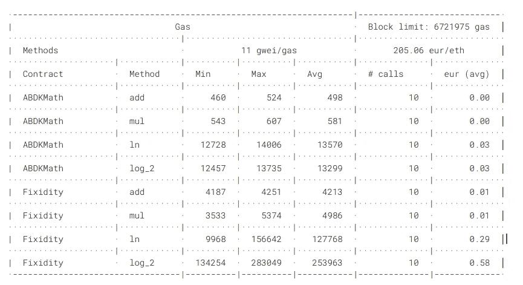

# 10 倍更好的可靠性定点数学

> 原文：<https://medium.com/hackernoon/10x-better-fixed-point-math-in-solidity-32441fd25d43>

## 使用这个库花十分之一的汽油在你的定点数学上。


Save time and money for your users.

> “技术什么都不是。重要的是你对人们有信心，相信他们本质上是善良和聪明的，如果你给他们工具，他们会用这些工具做很棒的事情。”—史蒂夫·乔布斯

# 介绍

最近我们[为以太坊智能合约发布了一个定点数学库](/cement/fixed-point-math-in-solidity-616f4508c6e8)。我们为推动智能合约开发的发展感到非常自豪，并且我们在[媒体](http://www.medium.com)首页上以区块链和加密货币为主题。

嗯，这个来自 ABDK consulting 的[用于 solidity smart contracts 的定点数学库甚至更好。它使用一小部分气体来运行大多数方法，并支持更多的函数，如平方根和指数。](https://github.com/abdk-consulting/abdk-libraries-solidity)

代码本身也更干净，这要归功于一个数字表示，它允许更轻松地检测溢出。相比之下，我们的实现现在感觉相当沉重。

# 代码分析

主要区别在于，ABDK 库以存储在 int128 中的 64.64 位格式表示定点数。这种数字表示在代码本身中有解释。

```
/**
* Smart contract library of mathematical functions operating with
* signed 64.64-bit fixed point numbers. Signed 64.64-bit fixed point
* number is basically a simple fraction whose numerator is signed
* 128-bit integer and denominator is 2**64\. As long as denominator 
* is always the same, there is no need to store it, thus in Solidity
* signed 64.64-bit fixed point numbers are represented by int128
* type holding only the numerator.
*/
```

这允许将两个 int128 定点数相加或相乘，并将结果存储到 int256 中，从而使中间溢出成为不可能。一旦乘法完成，如果结果数超过 2**128，我们将知道它不再适合我们的 64.64 位表示，我们只是恢复。

使用二进制表示还允许使用位移操作符，我认为使用位移操作符比使用十进制操作符要便宜得多。

这个溢出保护乘法的实现有多棒:

```
function mul (int128 x, int128 y) internal pure returns (int128) {
    int256 result = int256(x) * y >> 64;
    require (result >= MIN_64x64 && result <= MAX_64x64);
    return int128 (result);
}
```

唯一的限制是 ABDK 不能原样表示高于 2⁶⁴的值。在加密货币领域，than 意味着它不能处理超过 19 位的令牌操作*，也不能代表超过 184 亿个令牌的金额。调整 64.64 表示可以通过减少小数部分来增加整数部分的限制，反之亦然。

**编辑:不真实，ABDK 中的限制。数学对库可以处理哪些令牌没有影响。见评论。*

# 性能试验

聪明是有回报的。下面是在[固定性](https://github.com/CementDAO/Fixidity)和 [ABDK](https://github.com/abdk-consulting/abdk-libraries-solidity) 中运行加法、乘法和对数所需气体的比较。为了找到这些值，我将对库的调用包装在一个契约中，该契约将结果作为事件返回。这包括事务中的库调用，因此它们有一个 gas 开销。

```
pragma solidity ^0.5.0;
import “../ABDKMath64x64.sol”;contract ABDKMathMock {
    event ValueCalculated(int256 output); … function add (int128 x, int128 y) public {
        emit ValueCalculated(ABDKMath64x64.add(x, y));
    } …}
```

为了得出实际的方法成本，我必须调整 eth-gas reporter 返回的值，减去基础交易成本的 [21000 gas 和事件](https://ethereum.github.io/yellowpaper/paper.pdf)的 2000 gas。以下是 eth-gas-reporter 的报道:



Gas use comparison between ABDK and Fixidity.

平均而言，使用 ABDK 的所有操作都是使用固定性的 gas 成本的 10%,并且我假设计算性能也更好。对于迭代方法和高值，差异甚至更大。

# 结论

尽管增加了复杂性和成本，但定点数学在智能合约中仍有真正的用途。Mikhail Vladimirov 为 ABDK 实现了一个非常聪明和高效的库，极大地降低了在智能契约中使用定点数学的成本。

我们在实现 [CementDAO](http://www.cementdao.com) 时的一个顾虑是计算稳定性既慢又昂贵。其他竞争的 stablecoins 具有不太先进的稳定机制，但同时也提供了更好的性能。

在我们的下一次产品迭代中，我们将以更低的成本获得更好的稳定性机制。你不爱开源吗？