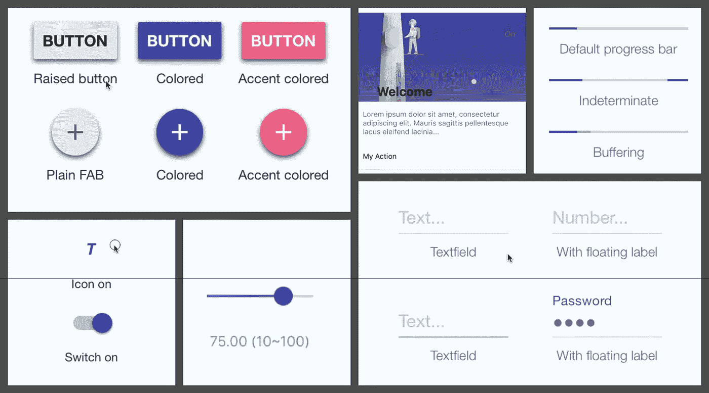
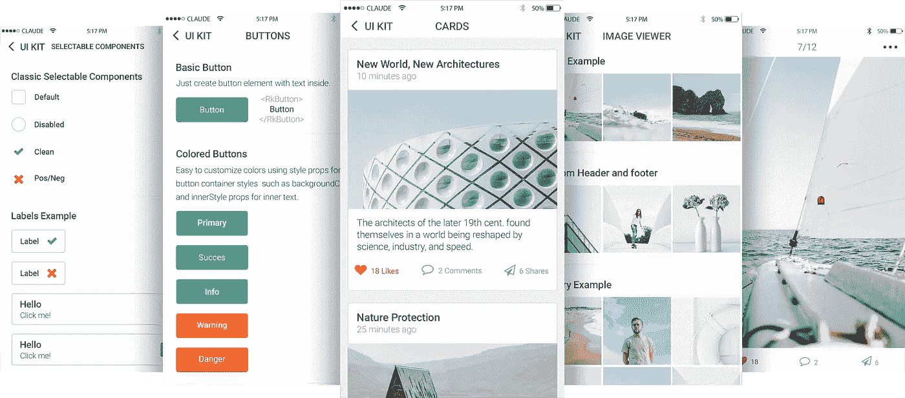
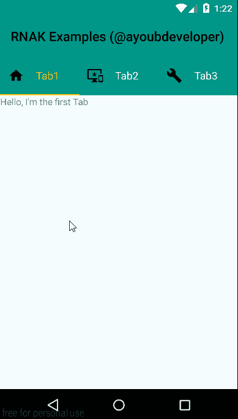
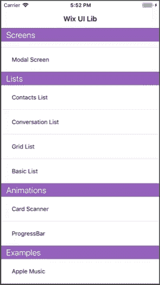
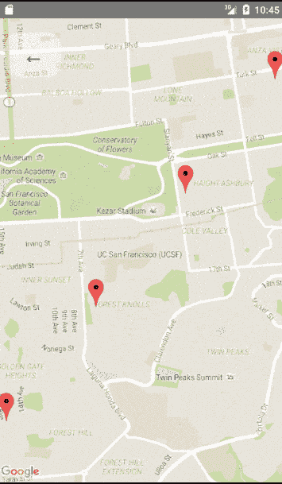
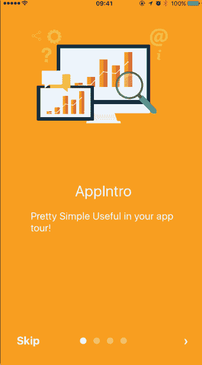

# 11 趋势反应本机 UI 组件

> 原文：<https://medium.com/hackernoon/11-react-native-ui-components-you-should-know-in-2019-75404e6c9a00>

随着移动应用需求的增加，大量企业正在将重心转向[移动应用开发](https://www.vtnetzwelt.com/services/mobile-app-development/)。

新的[技术](https://www.vtnetzwelt.com/technology-stack/)、平台和框架的引入使得移动应用开发者能够创建革命性的移动应用。

[跨平台应用开发](https://www.vtnetzwelt.com/services/mobile-app-development/cross-platform-app-development/)最近很受欢迎，因为它使开发人员能够用单一代码库为 Android、iOS、Windows 等多个平台开发应用。

[React Native](https://www.vtnetzwelt.com/technology-stack/react-native-app-development/) 是脸书推出的最著名的移动应用开发交叉平台之一，拥有最大的活跃开发者社区之一。React 是一个高效、灵活和声明性的 JavaScript 库，用于开发用户界面。它让开发人员可以用称为“组件”的小而孤立的代码片段组成复杂的 ui。

# 反应特征

*   **组件—**它可以帮助你在大型项目中维护你的代码。React 是关于组件的。
*   **单向数据流和 Flux—**React 使用 Flux 实现单向数据流，Flux 是一种有助于保持数据单向的应用程序架构。

# 反应本机 UI 组件

React Native 鼓励您使用隔离的组件来构建应用程序的 UI。使用库和 UI 工具包来构建应用程序要容易得多，因为这样可以节省时间，加快开发速度。

有很多 React 原生 UI 组件可供入门。在这里，我列出了您应该知道的 11 个 React 原生 UI 组件。该列表没有对任何框架进行排名，并且是以随机方式列出的。

我错过了什么吗？请随意评论并添加您自己的建议。

# 反应天然材料工具包

凭借 4175 颗星和 507 个叉，React Native Material Kit 为您的应用带来材料设计。它有一组 UI 组件，只需几行代码就可以快速、轻松地将材质设计引入到应用程序中。

React 本地材料套件提供的不同组件——

*   小跟班
*   卡片
*   装货
*   滑块
*   文本字段
*   棒形纽扣

请随意尝试—[https://github.com/xinthink/react-native-material-kit](https://github.com/xinthink/react-native-material-kit)

# 反应原生矢量图标

拥有 10，063 颗星星和 1119 个分叉，react-native-vector-icons 是一个完全可定制的图标库，用于您的移动应用程序，支持 NavBar/TabBar/ToolbarAndroid。这些矢量图标易于扩展，也易于集成到您的应用程序项目中。

更多详情，请点击此处—[https://github.com/oblador/react-native-vector-icons](https://github.com/oblador/react-native-vector-icons)

# REACT 原生 UI 小猫

拥有 3345 颗星和 459 个分支，React Native UI Kitten 是一个移动框架，提供容易定制的元素。虽然有很多独立的组件可用，但很少有框架可以将常用的组件作为一个具有相同 UI 设计的包来提供。

UI Kitten 旨在填补这一空白，促进移动应用开发，以便您可以将更多精力放在业务上，而不是视图合成上。

更多详情请点击此处—【https://github.com/akveo/react-native-ui-kitten 

# 洛蒂为反应土著

lottie-react-native 拥有 10，489 颗星星和 929 个叉子，使开发人员能够在他们的应用程序中发布美丽的动画，而无需重新创建它们。Lottie 是一个移动库，可以在移动设备上解析 Adobe After Effects 动画。

更多详情，请点击此处—[https://github . com/react-native-community/Lottie-react-native](https://github.com/react-native-community/lottie-react-native)

# 玉米片用户界面套件

拥有 1752 颗星星和 103 个叉子，React Native 的 Nachos UI 套件提供了预编码的 30+ UI 组件，随时可用。这些组件完全可以根据您的要求定制。Nachos UI 套件提供的不同组件包括徽章、气泡、按钮、卡片、转盘、复选框、输入、滑块、微调按钮等等。

请随意尝试—[https://github.com/nachos-ui/nachos-ui](https://github.com/nachos-ui/nachos-ui)

# 处女反应

拥有 1349 颗星和 89 个分支，React Virgin 是 React Native 的样板 UI 工具包。React Virgin 提供了漂亮的 React 原生 UI 套件，提供不同的组件，包括水平列表、垂直列表、按钮、标题、网格视图、聊天气泡、加载器。

更多详情请访问—[https://github.com/Trixieapp/react-virgin](https://github.com/Trixieapp/react-virgin)

# REACT 原生 ANDROID 套件

react-native-android-kit 拥有 105 颗星和 17 个分叉，提供了 Android UI 组件和模块的集合。该工具包的主要目的是为开发者提供 React 原生核心团队尚未实现的 Android 原生组件。该套件支持 Android 设计支持库中的一些组件，还包括—

1。TableLayoutAndroid
2。ButtonAndroid
3。浮动按钮安卓
4。颜色
5。可拉伸
6。演示
7。待办事项

更多详情，请访问—[https://github.com/adbayb/react-native-android-kit](https://github.com/adbayb/react-native-android-kit)

# REACT 本机 UI 库

react-native-ui-lib 拥有 1370 颗星和 150 个分支，是一个 ui 组件库，提供了广泛的组件，如 ActionBar、ActionSheet、按钮、卡片、复选框、对话框、图像、ListItem、TabBar 等等。

关于 UI 组件的完整列表，你可以查看链接—[https://github.com/wix/react-native-ui-lib](https://github.com/wix/react-native-ui-lib)

# 反应原生地图

react-native-maps 拥有 8739 颗星星和 2650 个分支，为您的 Android 或 iOS 应用程序提供地图组件。该套件提供了不同类型的组件 API，如 MapView、Marker、Callout、Polygon、Polyline、Circle、Overlay。

完整详情请点击此处—[https://github.com/react-native-community/react-native-maps](https://github.com/react-native-community/react-native-maps)

# REACT NATIVE 天才聊天

react-native-gifted-chat 拥有 6627 颗星和 1881 个叉，是您的应用程序的完整聊天 UI 解决方案。它提供完全可定制的组件，多行文本输入，头像，复制信息到剪贴板，附件选项等。

请随意尝试—[https://github.com/FaridSafi/react-native-gifted-chat](https://github.com/FaridSafi/react-native-gifted-chat)

# REACT 原生应用简介

拥有 2507 颗星星和 475 个分叉，react-native-app-intro 使你能够在你的 Android & iOS 应用上添加视差效果欢迎页面。该组件基于 react-native-swiper。

更多详情，请点击此处—[https://github.com/FuYaoDe/react-native-app-intro](https://github.com/FuYaoDe/react-native-app-intro)

# 摘要

这些是您可以在 React 本机应用程序中使用的众多可用 UI 组件中的少数几个。如果您仍然找不到您需要的 React 本地组件，那么您可以[向我们的专家请求回调](https://www.vtnetzwelt.com/contact-us/)。

了解 VT Netzwelt 如何帮助您在[用适当的开发过程、更快的迭代、错误报告等构建更好的应用。](https://www.vtnetzwelt.com/technology-stack/react-native-app-development/)

*原载于 2019 年 1 月 8 日*[*www.vtnetzwelt.com*](https://www.vtnetzwelt.com/mobile-application-development/react-native-ui-components/)*。*