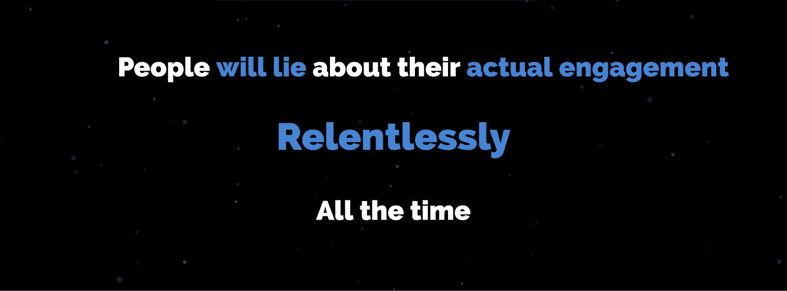
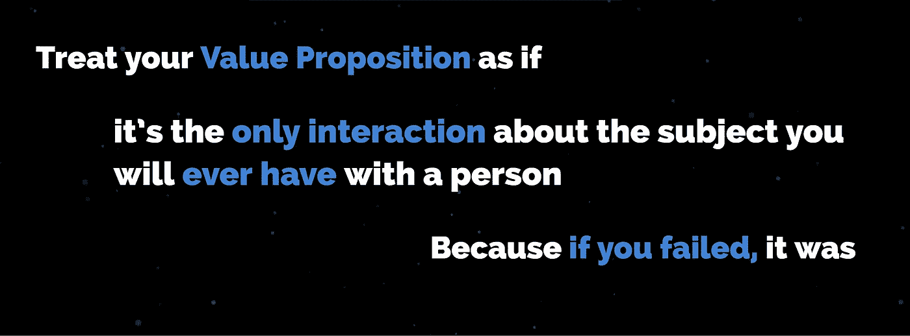

# 11 个让科技创业公司止步不前的价值定位错误

> 原文：<https://medium.com/hackernoon/11-value-proposition-errors-that-keep-entrepreneurs-at-the-kiddie-table-8aa168e9c9e0>

## 你的项目描述不能“点击”的地方

我们倾向于认为仅仅有一个创新的解决方案就足够了。一个伟大的想法本身就可以改变世界，如果我们正确地制造我们的产品，人们就会开始使用它们。

## 如果这是真的，85%的初创公司不会在成长阶段失败。

创造东西很有趣。研磨并把它放在那里通常不是。很难让人们认同我们的愿景，营销是一个数十亿美元的行业，这是有原因的。

这就是为什么我们向广告、设计思维、用户体验等领域的专家付费——所有这些专业领域的花费都是值得的。

但是有件事比所有其他的宣传工作都重要。

只有企业家和他/她信任的 Viziers 能处理的事情。

经常被忽视的增长驱动力，它会影响您的战略决策。

## 输入价值主张

当有人问你你的项目是关于什么的时候，这是你口中说出的第一句话。你的商业计划、网站、新闻稿和其他大部分东西上都贴满了这个东西。

是你向另一个人承诺逗留是值得的。

然而，我们倾向于花很少的时间来定义这个承诺。

一旦我们定义了它，我们很少回来调整和改进。

精心设计的价值主张创造化学效应。他们开始说“哦，我要学习更多。让我来探究一下这种“反应”。

与普遍的看法相反，设计糟糕的产品并不会让人失去兴趣。没有人会对它们有负面反应。他们不会在意的。

## 没有人会停下来告诉你，你没能引起他们的兴趣。

他们的目光会变得呆滞。灯熄灭了。

*   他们会点头说“*这很有趣*”，但不会再报复你。
*   如果他们正在浏览你的网站，他们会想“*好吧，酷*”然后关闭标签。
*   如果他们正在阅读你的商业计划，他们会想“*我应该以后再研究这个”*然后把它当成一个咖啡座。

你明白了。最令人沮丧的是，它制造了一种虚假的希望感。希望有一天他们会看到光明并重新回到光明中。

## 他们不会的。以下是发生这种情况的 11 个原因:

1.  ***像一些无用的企业口号一样设计价值主张。***

当科技企业家和初创公司创始人试图表现得像大公司时，我很伤心。各位，你们负担不起。打了几个耳光，大意是“我们在乎！诚实和透明！“价值承诺是企业为了显得友好和没有威胁而做的事情。

这显然不是你引起兴趣的方式。

*2。* ***大言不惭(“第一”、“最好”、“最快”)，却没有证据和地位来支持。***

这个很简单。人类对此有嗅觉。我们进化来评估我们的环境，本能地寻找他人的弱点和虚伪。这并不意味着你在撒谎——这意味着你无意中触发了人们原始的、潜意识的牛市探测器。

是的，我们甚至通过短信做到这一点。意识到这一点。

3. ***让你的陈述脱离目标受众。***

又是一个大的。我知道这听起来像是一个非常基本的营销建议，类似于“ *brah，就像，知道你在和谁说话，伙计。瞄准，哟*”。

但这通常是我们说的听起来很聪明的话。很少有企业家能告诉你他们的目标受众实际上是怎么想的，他们的日常生活是什么样子，他们的恐惧和挫折是什么。

当他们可以的时候，大多数人仍然把他们的思想集中在他们的项目上。

4. ***声称要“颠覆”、“创新”或“改变”行业。***

这没有任何价值承诺。

我知道这听起来像是真的，但是你必须解释为什么这些都是好东西，它们意味着什么。你要么开始给我下定义，要么开始争论。

无论哪种方式，都不会立即“点击”那里。

改变是可怕和危险的。在柏拉图的形式世界中，颠覆和创新是抽象的概念。

人们无法想象这些东西能解决他们眼前的任何痛苦。

*5* 。 ***没有提供* *独特的区别于其他几十个试图解决类似问题的人。***

为什么我应该选择亚马逊而不是其他电子商务商店？因为他们在世界各地运送超过 4500 万件产品，我可以在那里找到所有的东西。

我知道这不是一个公平的比较。是个例子。

你可能在做其他人做的事情，但是你的特质是独一无二的。梵高是唯一一个割掉自己耳朵的画家。

不，我不建议通过自残脱颖而出。

6. ***把所有东西和厨房水槽扔进你的前几句话里。***

不顾一切地快速给出你的解决方案和项目描述来表达你的观点是行不通的。这有一个原因:

*信息过载*你可能擅长多任务处理，但是你的短期记忆是有容量的。一段时间后，大脑会阻止传入的信号。

这就是为什么你不记得你回家路上看到的所有广告牌。

7。 ***从不提供关心的理由。***

这可能是第一个。这就是为什么大多数价值主张缺乏记忆性和快速性。他们不会让接待他们的人参与进来。

> “有活下去的理由的人几乎可以忍受任何事情”

看看我，自命不凡地引用尼采。不过，很合适。如果我明白你的项目为什么重要，我会购买你后来提供的几乎任何解释。除非你说是外星人做的。

尽管也有人会相信这一点。

*8。* ***过分关注你的产品/服务/创业公司/团队。***

真正的谈话时刻，朋友们。每个人都知道你很了不起，但他们想知道你能为他们做些什么。他们不希望你说的第一句话是以自我为中心的。

谈判是我们对手世界中的一步。

在进入你的生活故事之前，请表现出一些礼貌。

9. ***甘冒拒人于千里之外的风险。***

这是初创公司创始人从大公司学到的另一个不好的特质。有时候，你必须砍掉 40%的潜在客户，才能在另外 60%的客户中获得巨大的转化率。

这意味着要将你的信息聚焦到一部分市场上。

剧透:被排除在外的人从一开始就不是你的潜在客户。

*10。* ***永远不要将副总裁与你的总体战略和潜在客户的旅程联系起来。***

企业家、营销机构和雇佣的奴才会帮助他们。不幸的是，在现代环境中，营销人员关注的是数字，而不是策略。

他们很少考虑方向和更大的战略。

我总是对我的客户说，没有使命，KPI 是没有用的。信息技术的进步是你衡量他们成功的标准。

大多数人已经有了这些，但是从来没有把它和他们的价值承诺联系起来。

*11。* ***懦弱者的主张。***

出于对一切神圣事物的热爱，不要用虚假的谦虚和贬低自己的重要性来为难自己。原因与列表中的第 1 和第 9 条相同。

你他妈的负担不起。

与拥有固定客户群的大公司相比，不参与对你的伤害更大。记住这一点。

## 好了，我现在已经做好准备了。

I don't have this much pizzazz, but a man can dream.

我知道这不是动词。

这是一种存在状态。在对一些人抑制他们潜力的方式感到沮丧之前，我只能在这种状态下呆足够长的时间。

因为这些错误，我们正在失去创新者。

如果你读到这里，你就会明白一个坚实的价值主张是多么重要。进行一场十字军东征，打造一个或重建你现有的，围绕它建立一个策略，然后创造一些伟大的东西。

如果你需要我的帮助，打电话到 https://alexpartin.com 找我