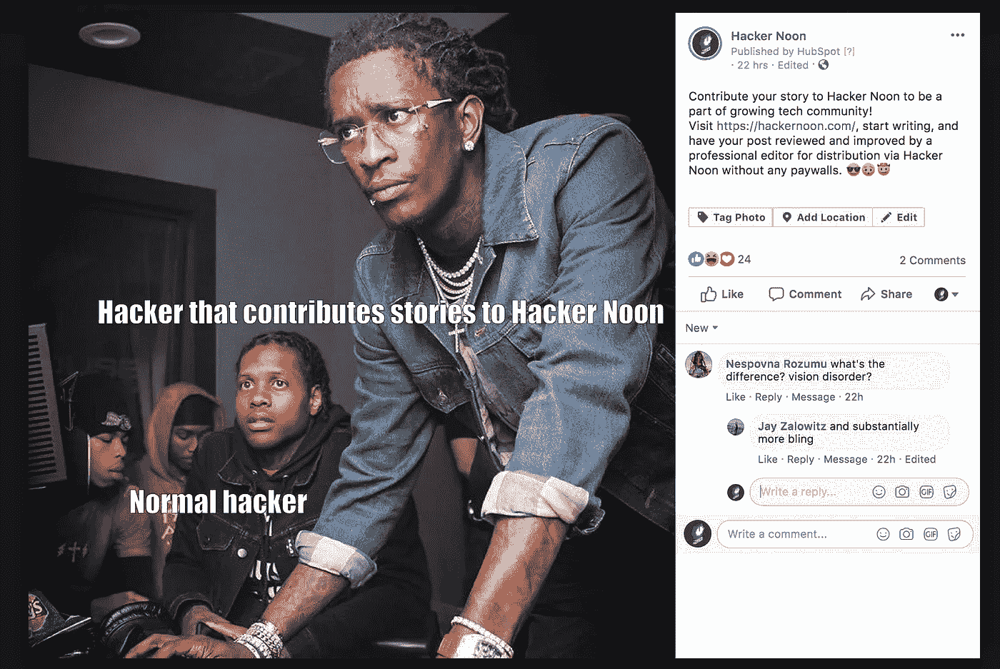

# 12 个特色技术故事

> 原文：<https://medium.com/hackernoon/12-featured-technology-stories-5cf4bf102115>

## 8 月 5 日至 13 日:编辑推荐:

# 我们相信数学。你知道吗？或者你应该？

*“几天前，我最喜欢的艺术家之一，卡洛斯·克鲁兹-迭斯去世了。他被认为是动态艺术的创始人之一，这种艺术通过观众的视角来提供运动的幻觉。他对艺术有一种科学的、近乎数学的态度，并对色觉的物理学和生理学做了大量研究。*

-创始人，Airwave.io: [**奥利维耶·德容—特雷霍**](https://hackernoon.com/@Olivier)

# [禅宗的随机梯度下降原理](https://hackernoon.com/zen-of-stochastic-gradient-descent-principle-pj1p83vsb)

*“避免分析瘫痪的好方法。”*

Modelchimp 的创始人；数据科学 9 年: [**萨米尔·马德哈万**](https://hackernoon.com/@samzer)

# [监控资本主义和社交领域的下一步是什么？](https://hackernoon.com/whats-next-for-surveillance-capitalism-and-social-domains-123bc83a6706)

“一位心理学家对数字隐私侵犯为何、如何以及何时困扰我们的观点。”

-社会心理学博士。斯坦福大学访问学者，ERA CSO:
[**安伯·卡泽尔**](https://hackernoon.com/@ambercazzell)

# [关于莱特兄弟精确风洞数据之旅](https://hackernoon.com/how-the-wright-brothers-conquered-the-skies-with-data-8kj23aek)

当然，我们都知道莱特兄弟是可控飞行的先驱。然而，你知道为什么来自俄亥俄州代顿的两个飞行爱好者成功了吗？这是两个 20 世纪人类数据的不可思议的故事。”

-负责 Atlan 数据发布的人类: [**Ayswarrya**](https://hackernoon.com/@ayswarrya)

**但首先:*

✅50 科技工业奖。
**✅457 提名者。
✅45,000+投票到此为止。**

[**投票还剩 2 天。**](https://noonies.hackernoon.com/)

[**# noones 2019**](https://noonies.hackernoon.com/)，与 [**流**](http://bit.ly/2NYm3t5) 合作呈现。8 月 20 日星期二公布了获奖者。 [**现在投票**](https://noonies.hackernoon.com/)

# 更多顶级科技故事

[***骇客正午的编辑团队***](https://help.hackernoon.com/app/page/1Z_Cuj70j_ziQCI3joAfx-O2ls6EizBZvg4mjPbNUWSc) ***是*** [***对质量重于数量采取强硬路线***](https://mailchi.mp/hackernoon/hacker-noon-bitcoin-manifesto?e=832258ab2c) ***本周:只有最好的才会晋级。*** [***在这里了解更多我们的投稿指南***](https://help.hackernoon.com/app/page/1gRbkfKlrfqztzZDQzHGp4v2U0G36alVmE7iODP4d9rg) ***。***

# [从前的东方——一个产品经理的故事](https://hackernoon.com/once-upon-a-time-in-the-east-a-product-manager-story-fr5i3wzy)

*“根据* ***帕累托原理*** *或 80/20 法则，认为一个系统中 80%的结果来自 20%的原因。一个微小的变化就能提升收入或体验，带来最佳投资回报。”*

-产品经理@Ketto、@Flyrobe、@ Amazon:[**Kumar Shubham**](https://hackernoon.com/@thatproductguy)

# [如何有效管理年轻产品经理](https://hackernoon.com/how-to-effectively-manage-young-product-managers-jc26v3z66)

“不要试图让他们喜欢你。”

-产品经理: [**Aahan Bhatt**](https://hackernoon.com/@aahan)

**🏆** [**为 2019 年度产品经理**](https://noonies.hackernoon.com/award/cjxvplwud4etv0b99rd2zmgwj)**[**# noones**](https://noonies.hackernoon.com/)**！****

# **[工作机会共享经济的未来:人类决定。AI 支持。区块链付费。](https://hackernoon.com/the-future-of-job-opportunity-sharing-economy-human-decides-ai-supports-blockchain-pays-ip1aj30b8)**

**求职公告板仍然依赖于 20 世纪 90 年代的想法和技术**

**-区块链爱好者；开发者；作家: [**基里尔**](https://hackernoon.com/@ks.shilov)**

# **[人工智能炒作如何让我们停留在“美好的旧时光”](https://hackernoon.com/a-modern-romance-how-ai-hype-keeps-us-in-good-old-daysfor-men-6mra38zo)**

**“我是一个浪漫的人，但人工智能算法已经朝着虐待关系的方向发展——除了亿万富翁、直升机旅行和安全词。”**

**-Founder @ frauen loop . org:[**docstefflbauer**](https://hackernoon.com/@docstefflbauer)**

****🏆** [**为 2019 年度 AI 年度作家**](https://noonies.hackernoon.com/award/cjxvnn8n64bnz0b997pxxiph4)**[**# noones**](https://noonies.hackernoon.com/)**投上你的一票！******

# ****Z 一代将如何为他们消费的内容付费？****

****“到 2020 年，Z 世代(90 年代中期以后出生，年龄在 18-24 岁之间的人)将占到消费者的 40%，出版商应该担心他们最大的读者群从来不知道一个你必须为新闻付费的世界吗？”****

****——mar feel 内容编辑:[**乔恩**](https://hackernoon.com/@JonFletcher)****

# ****[要不要远程工作？这就是问题](https://hackernoon.com/to-remote-or-not-to-remote-that-is-the-question-z73w3qu2)🤔****

*****“有些大三学生容易钻牛角尖，不敢提问，需要同事/经理面对面的指导和安慰。为了成为一名优秀的远程工作者，你需要成为一名 100%优秀的沟通者，并首先习惯这种工作方式。”*****

****——技术爱好者: [**米利卡·马克西莫维奇**](https://hackernoon.com/@mmaksimovic)****

******🏆** [**为 2019 年全球最具生产力的远程团队**](https://noonies.hackernoon.com/award/cjxvsz6576k8u0b40czyb7xhj)**[**# noones**](https://noonies.hackernoon.com/)**！********

# ****[走向数字化:虚拟现实/增强现实技术如何塑造当今的电子商务](https://hackernoon.com/going-phygital-how-vrar-technology-shapes-the-ecommerce-today-1e2e330ct)****

****“通过让消费者看到某些物品如何符合他们的偏好，AR 提供了接近真实的产品可视化，无论是衣服还是室内设计物品。”****

****——内容战略家在 QA 疯狂: [**亚娜**](https://hackernoon.com/@yana)****

# ****创业公司:脉搏调查是愚蠢的。****

****“它们不是员工敬业度危机的解决方案。他们是问题的一部分。”****

****——[**布伦南·麦克伊奇兰**](https://hackernoon.com/@i_am_brennan)****

******🏆** [**投票给**](https://noonies.hackernoon.com/) **2019 的** [**最精彩 Startu**](https://noonies.hackernoon.com/award/cjxvsz6576k8u0b40czyb7xhj)[**p**](https://noonies.hackernoon.com/)**2019 的**[**# noones**](https://noonies.hackernoon.com/)**！******

********

****好运无处不在，
[**娜塔莎**](https://twitter.com/hackernoontech) 从 [**黑客中午**](https://hackernoon.com/)****

## ****附言:想定制你从我们这里收到什么样的邮件？ [**管理您的主题偏好**](https://hackernoon.us19.list-manage.com/profile?u=b48b0ec2173fecf2586c00e80&id=fa796741e6&e=[UNIQID])****

## ******P.P.S .你可以访问**[**HackerNoon.com**](http://HackerNoon.com)**，点击** [**开始**](http://auth.hackernoon.com) **“让你的科技故事得到评论，以便发表。******

********