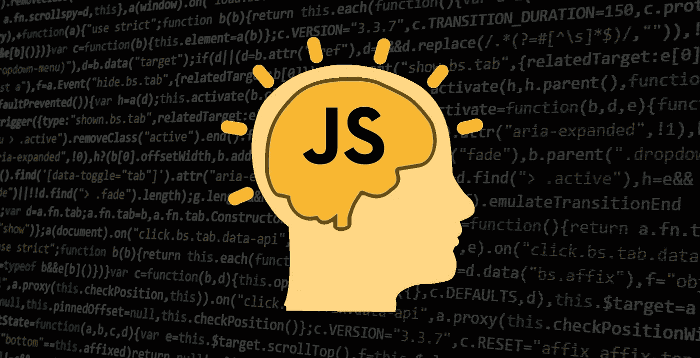

# 提升 JavaScript 技能的 12 个概念

> 原文：<https://medium.com/hackernoon/12-javascript-concepts-that-will-level-up-your-development-skills-b37d16ad7104>



JavaScript 是一种复杂的语言。如果您是任何级别的 JavaScript 开发人员，理解它的基本概念是很重要的。本文讨论了 12 个概念，这些概念对于任何 JS 开发人员来说都是非常重要的，但绝不代表 JS 开发人员应该了解的全部内容。

如果你喜欢这篇文章，请为它鼓掌👏(还是 50！)来帮助传播消息！

我会在一个名为 [JS Tips & Tidbits](https://github.com/nas5w/javascript-tips-and-tidbits) 的 Github 资源库中不断更新这个列表。请明星⭐和分享，如果你想跟进！

***

## 通过注册我的免费时事通讯，在您的收件箱中获得快速 JavaScript 技巧！

***

# 1.值与参考变量赋值

理解 JavaScript 如何给变量赋值是编写无 bug JavaScript 的基础。如果您不理解这一点，您很容易编写无意中更改值的代码。

JavaScript *总是*按值分配变量。但是这一部分**非常**重要:当赋值是 JavaScript 的五个原语类型(即`Boolean`、`null`、`undefined`、`String`和`Number`)之一时，实际值被赋值。然而，当赋值为`Array`、`Function`或`Object`时，会分配一个对存储器中对象的*引用。*

示例时间！在下面的代码片段中，`var2`被设置为等于`var1`。因为`var1`是一个原始类型(`String`)，所以`var2`被设置为等于`var1`的`String`值，并且可以认为在这一点上与`var1`完全不同。因此，重新分配`var2`对`var1.`没有影响

```
let var1 = 'My string';
let var2 = var1;var2 = 'My new string';console.log(var1);
// 'My string'
console.log(var2);
// 'My new string'
```

让我们把这个和对象赋值比较一下。

```
let var1 = { name: 'Jim' }
let var2 = var1;var2.name = 'John';console.log(var1);
// { name: 'John' }
console.log(var2);
// { name: 'John' }
```

如果您期望像原语赋值这样的行为，您可能会看到这是如何引起问题的！如果您创建了一个无意中改变了对象的函数，这可能会变得特别糟糕。

# 2.关闭

闭包是一种重要的 JavaScript 模式，用于对变量进行私有访问。在本例中，`createGreeter`返回一个匿名函数，该函数可以访问所提供的`greeting`“Hello”对于所有未来的使用，`sayHello`将获得此问候！

```
function createGreeter(greeting) {
  return function(name) {
    console.log(greeting + ', ' + name);
  }
}const sayHello = createGreeter('Hello');
sayHello('Joe');
// Hello, Joe
```

在更真实的场景中，您可以设想一个初始函数`apiConnect(apiKey)`，它返回一些使用 API 键的方法。在这种情况下，`apiKey`只需要提供一次，不再需要。

```
function apiConnect(apiKey) {
  function get(route) {
    return fetch(`${route}?key=${apiKey}`);
  } function post(route, params) {
    return fetch(route, {
      method: 'POST',
      body: JSON.stringify(params),
        headers: {
          'Authorization': `Bearer ${apiKey}`
        }
      })
  } return { get, post }
}const api = apiConnect('my-secret-key');// No need to include the apiKey anymore
api.get('http://www.example.com/get-endpoint');
api.post('http://www.example.com/post-endpoint', { name: 'Joe' });
```

# 3.解构

不要被 JavaScript 参数析构所迷惑！这是从对象中干净地提取属性的一种常见方式。

```
const obj = {
  name: 'Joe',
  food: 'cake'
}const { name, food } = obj;console.log(name, food);
// 'Joe' 'cake'
```

如果要以不同的名称提取属性，可以使用以下格式指定它们。

```
const obj = {
  name: 'Joe',
  food: 'cake'
}const { name: myName, food: myFood } = obj;console.log(myName, myFood);
// 'Joe' 'cake'
```

在下面的例子中，析构用于将`person`对象干净地传递给`introduce`函数。换句话说，析构可以(并且经常)直接用于提取传递给函数的参数。如果你熟悉 React，你可能以前见过这个！

```
const person = {
  name: 'Eddie',
  age: 24
}function introduce({ name, age }) {
  console.log(`I'm ${name} and I'm ${age} years old!`);
}console.log(introduce(person));
// "I'm Eddie and I'm 24 years old!"
```

# 4.扩展语法

一个让人迷惑但相对简单的 JavaScript 概念是 spread 操作符！在下面的例子中，`Math.max`不能应用于`arr`数组，因为它不接受数组作为参数，而是接受单个元素作为参数。扩展操作符`...`用于将单个元素从数组中取出。

```
const arr = [4, 6, -1, 3, 10, 4];
const max = Math.max(...arr);
console.log(max);
// 10
```

# 5.Rest 语法

我们来谈谈 JavaScript rest 语法。您可以使用它将传递给函数的任意数量的参数放入一个数组中！

```
function myFunc(...args) {
  console.log(args[0] + args[1]);
}myFunc(1, 2, 3, 4);
// 3
```

# 6.数组方法

JavaScript 数组方法通常可以为您提供难以置信的、优雅的方式来执行您需要的数据转换。作为 StackOverflow 的贡献者，我经常看到关于如何以某种方式操作对象数组的问题。这往往是数组方法的完美用例。

我将在这里介绍一些不同的数组方法，它们是由相似的方法组织起来的，这些方法有时会被混在一起。这个列表一点也不全面:我鼓励你回顾并练习 MDN (我最喜欢的 JavaScript 参考资料)上讨论的所有内容[。](https://developer.mozilla.org/en-US/docs/Web/JavaScript/Reference/Global_Objects/Array#)

**map、filter、reduce** 围绕 JavaScript 数组方法`map`、`filter`、`reduce`有些混乱。这些是转换数组或返回聚合值的有用方法。

*   **map:** 返回数组，其中每个元素都按照函数的指定进行转换

```
const arr = [1, 2, 3, 4, 5, 6];
const mapped = arr.map(el => el + 20);console.log(mapped);
// [21, 22, 23, 24, 25, 26]
```

*   **filter:** 返回函数返回 true 的元素数组

```
const arr = [1, 2, 3, 4, 5, 6];
const filtered = arr.filter(el => el === 2 || el === 4);console.log(filtered);
// [2, 4]
```

*   **减少:**累加函数中指定的值

```
const arr = [1, 2, 3, 4, 5, 6];
const reduced = arr.reduce((total, current) => total + current);console.log(reduced);
// 21
```

**find，findIndex，indexOf** 数组方法`find`、`findIndex`和`indexOf`经常可以合并使用。如下使用它们。

*   **find** :返回第一个符合指定条件的实例。不会继续查找任何其他匹配的实例。

```
const arr = [1, 2, 3, 4, 5, 6, 7, 8, 9, 10];
const found = arr.find(el => el > 5);console.log(found);
// 6
```

再次注意，虽然`5`之后的所有内容都符合标准，但只返回第一个匹配的元素。这实际上非常有帮助，当你找到一个匹配时，你通常会`break`一个 for 循环！

*   **findIndex** :这与`find`的工作方式几乎相同，但是它返回的不是第一个匹配元素的*索引*。以下面的例子为例，为了清楚起见，它使用了名称而不是数字。

```
const arr = ['Nick', 'Frank', 'Joe', 'Frank'];
const foundIndex = arr.findIndex(el => el === 'Frank');console.log(foundIndex);
// 1
```

*   **indexOf:** 的工作方式几乎与`findIndex`相同，但它不是将函数作为参数，而是采用一个简单的值。当你有更简单的逻辑，不需要用函数来检查是否有匹配时，可以用这个。

```
const arr = ['Nick', 'Frank', 'Joe', 'Frank'];
const foundIndex = arr.indexOf('Frank');console.log(foundIndex);
// 1
```

**push，pop，shift，unshift** 有很多很棒的数组方法来帮助以有针对性的方式从数组中添加或删除元素。

*   **push:** 这是一个相对简单的方法，将一个项添加到数组的末尾。它就地修改数组，函数本身返回添加到数组中的项。

```
let arr = [1, 2, 3, 4];
const pushed = arr.push(5);console.log(arr);
// [1, 2, 3, 4, 5]
console.log(pushed);
// 5
```

*   从数组中移除最后一项。同样，它会就地修改数组。函数本身返回从数组中移除的项。

```
let arr = [1, 2, 3, 4];
const popped = arr.pop();console.log(arr);
// [1, 2, 3]
console.log(popped);
// 4
```

*   **shift:** 从数组中移除第一个项目。同样，它会就地修改数组。函数本身返回从数组中移除的项。

```
let arr = [1, 2, 3, 4];
const shifted = arr.shift();console.log(arr);
// [2, 3, 4]
console.log(shifted);
// 1
```

*   **unshift:** 将一个或多个元素添加到数组的开头。同样，它会就地修改数组。与许多其他方法不同，函数本身返回数组的新长度。

```
let arr = [1, 2, 3, 4];
const unshifted = arr.unshift(5, 6, 7);console.log(arr);
// [5, 6, 7, 1, 2, 3, 4]
console.log(unshifted);
// 7
```

**splice，slice
这些方法或者修改或者返回数组的子集。**

*   **拼接:**通过移除或替换现有元素和/或添加新元素来更改数组的内容。此方法就地修改数组。

下面的代码示例可以读作:在数组的位置`1`处，移除`0`元素，插入`b`。

```
let arr = ['a', 'c', 'd', 'e'];
arr.splice(1, 0, 'b')
```

*   **slice:** 从指定的开始位置和结束位置之前返回数组的浅表副本。如果没有指定结束位置，则返回数组的其余部分。重要的是，这个方法**并不**就地修改数组，而是返回所需的子集。

```
let arr = ['a', 'b', 'c', 'd', 'e'];
const sliced = arr.slice(2, 4);console.log(sliced);
// ['c', 'd']
console.log(arr);
// ['a', 'b', 'c', 'd', 'e']
```

**排序**

*   **排序:**根据提供的函数对数组进行排序，该函数采用第一个元素和第二个元素参数。就地修改数组。如果函数返回负数或 0，则顺序保持不变。如果为正值，则元素顺序会被交换。

```
let arr = [1, 7, 3, -1, 5, 7, 2];
const sorter = (firstEl, secondEl) => firstEl - secondEl;
arr.sort(sorter);console.log(arr);
// [-1, 1, 2, 3, 5, 7, 7]
```

唷，你都看到了吗？我也没有。事实上，在写这篇文章的时候，我不得不大量参考 MDN 文档——这没关系！只要知道有什么样的方法可以让你达到 95%的目标。

# 7.发电机

不要害怕`*`。生成器函数指定下次调用`next()`时产生什么`value`。可以有有限数量的产出，之后`next()`返回一个未定义的`value`，或者使用一个循环得到无限数量的值。

```
function* greeter() {
  yield 'Hi';
  yield 'How are you?';
  yield 'Bye';
}const greet = greeter();console.log(greet.next().value);
// 'Hi'
console.log(greet.next().value);
// 'How are you?'
console.log(greet.next().value);
// 'Bye'
console.log(greet.next().value);
// undefined 
```

使用一个无限值生成器:

```
function* idCreator() {
  let i = 0;
  while (true)
    yield i++;
}const ids = idCreator();console.log(ids.next().value);
// 0
console.log(ids.next().value);
// 1
console.log(ids.next().value);
// 2
// etc...
```

# 8.相同运算符(`===`)与相等运算符(`==`)

一定要知道 JavaScript 中标识操作符(`===`)和相等操作符(`==`)的区别！`==`运算符将在比较值之前进行类型转换，而`===`运算符在比较之前不会进行任何类型转换。

```
console.log(0 == '0');
// true
console.log(0 === '0');
// false
```

# 9.对象比较

我看到 JavaScript 新手犯的一个错误是直接比较对象。变量指向内存中对象的引用，而不是对象本身！实际比较它们的一种方法是将对象转换成 JSON 字符串。但是这有一个缺点:对象属性顺序没有保证！比较对象的一个更安全的方法是引入一个专门进行深度对象比较的库(例如 [lodash 的 isEqual](https://lodash.com/docs#isEqual) )。

以下对象看起来相等，但实际上它们指向不同的引用。

```
const joe1 = { name: 'Joe' };
const joe2 = { name: 'Joe' };console.log(joe1 === joe2);
// false
```

相反，下面的计算结果为 true，因为一个对象被设置为等于另一个对象，因此指向同一个引用(内存中只有一个对象)。

```
const joe1 = { name: 'Joe' };
const joe2 = joe1;console.log(joe1 === joe2);
// true
```

请务必回顾上面的值与引用部分，以充分理解将一个变量设置为另一个指向内存中对象引用的变量的后果！

# 10.回调函数

太多人被 JavaScript 回调函数吓倒了！它们很简单，举个例子。`console.log`函数被作为回调传递给`myFunc`。当`setTimeout`完成时，它被执行。这就是全部了！

```
function myFunc(text, callback) {
  setTimeout(function() {
    callback(text);
  }, 2000);
}myFunc('Hello world!', console.log);
// 'Hello world!'
```

# 11.承诺

一旦你理解了 JavaScript 回调，你很快就会发现自己陷入了嵌套的“回调地狱”这就是承诺帮助的地方！将异步逻辑包装在承诺中，成功时使用`resolve`，失败时使用`reject`。用“然后”处理成功，用`catch`处理失败。

```
const myPromise = new Promise(function(res, rej) {
  setTimeout(function(){
    if (Math.random() < 0.9) {
      return res('Hooray!');
    }
    return rej('Oh no!');
  }, 1000);
});myPromise
  .then(function(data) {
    console.log('Success: ' + data);
   })
   .catch(function(err) {
    console.log('Error: ' + err);
   });

// If Math.random() returns less than 0.9 the following is logged:
// "Success: Hooray!"
// If Math.random() returns 0.9 or greater the following is logged:
// "Error: On no!"
```

# 12.异步等待

一旦你掌握了 JavaScript 承诺的诀窍，你可能会喜欢上`async await`，它只是承诺之上的“语法糖”。在下面的例子中，我们创建了一个`async`函数，在这个函数中我们`await`了`greeter`承诺。

```
const greeter = new Promise((res, rej) => {
  setTimeout(() => res('Hello world!'), 2000);
})async function myFunc() {
  const greeting = await greeter;
  console.log(greeting);
}myFunc();
// 'Hello world!'
```

# 结论

如果您不知道这 12 个概念中的任何一个，那么您很可能在 JavaScript 知识方面已经有了一点进步！如果你都知道，那么希望这是一个练习和增长知识的机会。你认为还有哪些概念很关键？请在评论中告诉我。