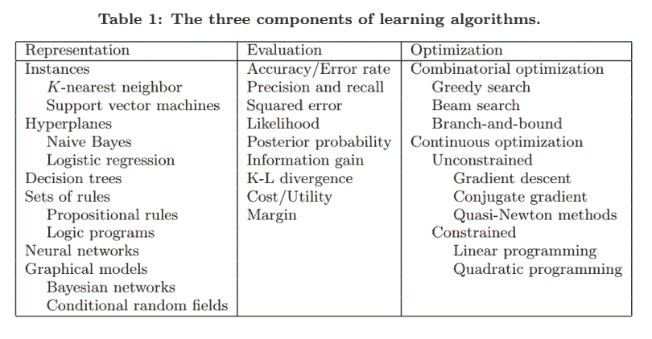
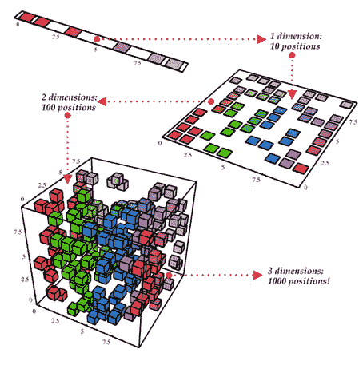
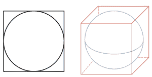
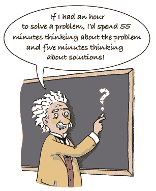
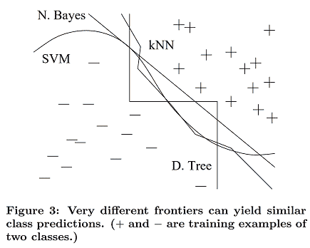
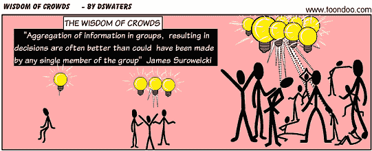
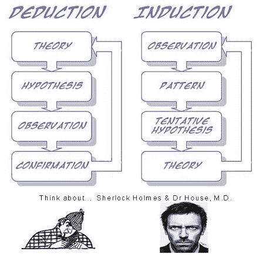
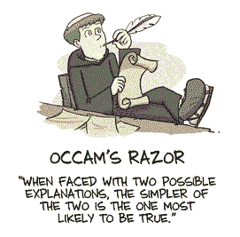
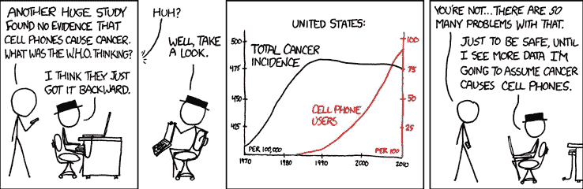

# 来自 ML 研究者和从业者的 12 条重要经验

> 原文：<https://medium.com/hackernoon/12-key-lessons-from-ml-researchers-and-practitioners-3d4818a2feff>

机器学习算法有望通过从数据中学习来找出如何执行重要任务，即在没有明确告诉做什么的情况下从例子中归纳。这意味着数据量越大，这些算法能处理的棘手问题就越多。然而， ***开发成功的机器学习应用*** 需要相当多的在教科书或机器学习入门课程中很难找到的“黑艺术”。

我最近偶然发现了[教授 Pedro Domingos](https://homes.cs.washington.edu/~pedrod/) 的一篇伟大的研究论文，该论文汇集了机器学习研究人员和实践者的经验教训。在这篇文章中，我将和你一起浏览这些课程。

准备了解:**要避免的陷阱、要关注的重要问题以及一些常见问题的答案**。

# 1.学习=表示+评估+优化

你有一个应用程序，你认为机器学习可能很适合它。现在，一旦进入机器学习的世界，就有成吨的学习算法可用，每年还有数百种算法发表。用哪个？

在这个巨大的空间中不迷失的关键是理解所有学习算法的配方由三个核心成分组成:

*   **表示:**输入数据，即要使用的特征，学习器和分类器必须用计算机能理解的语言来表示。学习者可能学习的分类器集合被称为学习者的*假设空间*。如果分类器不在假设空间中，它就不能被学习。

***澄清说明*** *:我们所说的* ***量词 vs 学习者*** *是什么意思？假设你有训练数据，从这些数据中使用一个程序来构建另一个程序(一个模型),例如决策树。学习者将是从输入数据构建决策树模型的程序，而决策树模型将是分类器(能够为输入数据的每个实例提供预测输出的东西)。*

*   **评估:**需要一个评估函数来区分好的分类器和坏的分类器。算法内部使用的评估函数可以不同于我们希望分类器优化的外部评估度量(为了便于优化，以及由于后面讨论的问题)
*   **优化:**最后，我们需要一种方法在分类器中进行搜索，以便我们可以挑选出最好的一个。优化技术的选择是学习者效率的关键。开始使用现成的优化器是很常见的。如果需要，您可以在以后用定制设计的替换它们。

下表显示了这三个组件的一些常见示例。

# 2.重要的是概括

机器学习的根本目标是 ***在训练集*** 中的例子之外进行泛化。因为，无论我们有多少数据，我们都不太可能在测试时再次看到那些精确的例子。在训练中做得好很容易。新手最容易犯的错误就是在训练数据上测试，产生成功的错觉。如果选择的分类器然后在新的数据上被测试，它通常不比随机猜测好。所以， ***从一开始就把一部分数据放到一边*** ，只在最后用它来测试你选择的分类器，然后在整个数据上学习你最终的分类器。

当然，隐瞒数据会减少可用于培训的数量。这可以通过进行 ***交叉验证*** 来缓解:将你的训练数据随机分成(比方说)十个子集，保留每个子集，同时对其余的子集进行训练，对每个学习过的分类器在其没有看到的例子上进行测试，并对结果进行平均，以查看特定参数设置的效果如何。

# 3.仅有数据是不够的

当目标是一般化时，我们会遇到另一个主要后果:不管你有多少数据，光有数据是不够的。假设我们想从一百万个例子中学习一个包含 100 个变量的布尔函数(是/否分类)。这意味着两个⁰⁰-10⁶的例子，它们的类别你不知道。在手头没有更多信息的情况下，这怎么能比掷硬币更好呢？

听起来我们被困住了，对吗？幸运的是，我们想要在现实世界中学习的函数并不是从所有数学上可能的函数集中统一得出的！事实上，非常一般的假设——就像类似的例子有类似的类——是机器学习如此成功的一个重要原因。

这意味着 ***领域知识和对数据的理解*** 对于做出正确的假设非常重要。学习中对知识的需求不应令人惊讶。机器学习不是魔术；它不可能无中生有。它所做的是用更少的资源获得更多。像所有工程一样，编程是一项繁重的工作:我们必须从头开始构建一切。学习更像耕作，让大自然做大部分的工作。农民将种子和养分结合起来种植作物。学习者 ***将知识与数据*** 结合，成长程序。

# 4.过度拟合有很多面

过拟合问题是机器学习的难题。当您的学习者输出一个对训练数据 100%准确但对测试数据只有 50%准确的分类器时，实际上它可以输出一个对两者都有 75%准确的分类器，它已经过度拟合了。

机器学习中的每个人都知道过度拟合，但它以许多形式出现，不会立即显而易见。理解过拟合的一种方法是将泛化误差分解为 ***偏差*和*方差*** *。*

偏见是一个学习者倾向于 ***持续地学习同样错误的东西*** 。方差是学习随机事物的 ***趋势*** 与真实信号无关。通过下图中的飞镖类比可以更好地理解这一点:

例如，线性学习者具有高偏差，因为当两个类之间的划分不是清晰的超平面时，学习者不能正确地归纳关系。决策树没有这个问题，因为它们的学习方法很灵活。但另一方面，它们可能会受到高方差的影响——在同一任务的不同训练数据集上学习的决策树往往非常不同，而事实上它们应该是相同的。

现在，如何处理过度拟合？

***交叉验证*** 在这里可以派上用场，例如通过使用它来选择决策树的最佳大小来学习。然而，请注意，这里又有一个陷阱:如果我们使用它进行太多的参数选择，它本身可能会开始过拟合，我们又回到了同样的陷阱。

除了交叉验证之外，还有许多方法来对抗过度拟合。最流行的一种是在评估函数中增加一个 ***正则化*** 项。另一种选择是执行像卡方这样的统计显著性测试，以分析增加更多的复杂性是否对类别分布有任何影响。这里重要的一点是，没有特定的技术“解决”过拟合问题。例如，我们可以通过陷入相反的欠拟合误差(偏差)来避免过拟合(方差)。同时避免这两者需要学习一个完美的分类器，没有一种技术总是做得最好*(没有免费的午餐)*。

# 5.直觉在高维空间失效

过拟合之后，机器学习最大的问题就是 ***维数灾难*** *。*这个表达式意味着，当输入是高维时，许多在低维中工作良好的算法变得难以处理。随着示例的 ***维度(即特征的数量)*** 的增长，正确概化变得更加困难，因为固定大小的训练集覆盖了输入空间的一小部分(可能的组合变得巨大)。但这正是机器学习既必要又困难的原因。正如你在下图中看到的，即使我们从一维过渡到三维，区分不同例子的工作似乎开始变得越来越难——在高维空间中，所有的例子看起来都一样。

这里的普遍问题是，我们来自三维世界的直觉在高维空间中让我们失望。例如，高维度橙子的大部分体积在果皮中，而不是果肉！

更令人难以置信的是:如果恒定数量的例子均匀分布在一个高维超立方体中，并且如果我们通过在一个超立方体中刻划它来近似一个超球体，那么在高维空间中，几乎所有超立方体的体积都在超球体之外。这是个坏消息。因为在机器学习中，一种类型的形状通常由另一种类型的形状来近似。

***澄清说明*** *:如果你被所有的“超立方体的炒作”搞糊涂了，超立方体里面的超球体，在二维和三维看起来是这样的:*

因此，正如你现在所理解的，在二维或三维空间中构建分类器很容易，但在高维空间中，很难理解正在发生的事情。这反过来又使得设计一个好的分类器变得困难。事实上，我们经常陷入这样一个陷阱，认为收集更多的特征没有坏处，因为在最坏的情况下，它们不会提供关于类的新信息。但事实上，它们的好处可能会被维数灾难盖过。

***带走*** :下次当你考虑添加更多功能时，一定要考虑到当你的维度变得太大时可能出现的潜在问题。

# 6.特征工程是关键

最后， ***机器学习项目有的成功，有的失败。有什么区别？*轻松**最重要的因素是**的*特性用到*的**。如果你有许多独立的特性，并且每一个都和这个类有很好的关联，那么学习就很容易。另一方面，如果类是基于一个在使用之前需要以复杂的方式处理成分(特性)的配方，事情会变得更困难——特性工程基本上就是从现有的特性中创建新的输入特性。

很多时候，原始数据甚至不是以可供学习的形式出现的。但是你可以从中构造出可以用于学习的特征。事实上，这通常是机器学习项目中大部分努力的方向。这通常也是最有趣的部分之一，直觉、创造力和“黑色艺术”与技术一样重要。

第一次接触机器学习的人通常会惊讶于在一个机器学习项目中实际花在机器学习上的时间是如此之少。但是，如果你考虑到收集数据、整合数据、清理数据和预处理数据是多么耗时，以及在功能设计中可以进行多少尝试和错误，这是有道理的。此外， ***机器学习不是构建数据集和运行学习器的一次性过程*** ，而是运行学习器、分析结果、修改数据和/或学习器并重复的迭代过程。学习通常是最快的部分，但那是因为我们已经掌握得很好了！特征工程更难，因为它是特定领域的，而学习者可以是通用的。当然，机器学习的圣杯之一是自动化越来越多的特征工程过程。

# 7.更多的数据胜过更聪明的算法

假设您已经构建了尽可能好的特征集，但是您得到的分类器仍然不够准确。你现在能做什么？主要有两个选择:
设计一个更好的学习算法，或者收集更多的数据(更多的例子，可能还有更多的原始特征)。机器学习研究人员会努力改进设计，但在现实世界中，最快的成功之路往往是获得更多数据。
根据经验，拥有大量数据的愚蠢算法胜过拥有少量数据的聪明算法。

在计算机科学中，通常两个主要的有限资源是时间和内存。在机器学习中，还有第三个:训练数据。在这三者中，目前主要的瓶颈通常是时间——有大量的数据可用，但没有足够的时间来处理这些数据，所以这些数据没有被使用。这意味着 ***实际上更简单的分类器*** 最终会到达终点，因为复杂的分类器需要太长的学习时间。

使用更聪明的算法最终没有给出更好的结果的部分原因是因为在一天结束时，他们都在做同样的事情——所有的学习者本质上都是通过将附近的例子分组到同一个类中来工作的；关键的区别在于“附近”的含义当我们有非均匀分布的数据时，即使复杂的学习者可以产生非常不同的边界来分类结果，他们仍然 ***最终在重要区域*** (具有大量训练示例的区域，因此也是大多数文本示例可能出现的区域)中做出相同的预测。正如你在下图中看到的，无论是一条奇特的曲线、一条直线还是一个阶梯式的边界，我们最终都会得到相同的预测:

作为一个规则， ***先尝试最简单的学习者*** (比如先朴素贝叶斯后逻辑回归，先 k 近邻后支持向量机)。更复杂的学习者是诱人的，但他们通常更难使用，因为他们有更多的旋钮需要你去转动以获得好的结果，因为他们的内部更像是黑盒。

# 8.学习许多模型，而不仅仅是一个

在机器学习的早期，人们努力尝试许多学习者的许多变化，仍然只选择最好的一个。但是后来研究人员注意到，如果我们不选择找到的最佳变体，而是组合许多变体，结果会更好——通常好得多——并且对用户来说没有额外的努力。创建这样的*模型* ***集合*** 现在非常普遍:

*   在称为 ***打包****的最简单技术中，我们使用相同的算法，但在原始数据的不同子集上对其进行训练。最后，我们只是平均答案或通过某种投票机制将它们组合起来。*
*   *在 ***助推****中，学习者被逐一按顺序训练。每一个后续的都将大部分注意力放在被前一个错误预测的数据点上。我们继续下去，直到我们对结果满意为止。**
*   **在 ***堆叠****中，不同独立分类器的输出成为新分类器的输入，新分类器给出最终预测。***

***在网飞奖中，来自世界各地的团队竞相打造最佳视频推荐系统。随着比赛的进行，团队发现他们通过将他们的学习者与其他团队结合起来获得了最好的结果，并合并成越来越大的团队。冠军和亚军都是超过 100 名学习者的组合，将这两个组合结合起来进一步改善了结果。 ***在一起更好！******

****

# **9.理论上的保证并不像它们看起来那样**

**机器学习论文充满了理论保障。我们应该如何看待这些保证？归纳法在传统上与演绎法形成对比:在演绎法中，你可以保证结论是正确的；在入职培训中，所有的赌注都是无效的。最近几十年的主要发展之一是认识到，事实上，如果我们愿意接受概率保证，我们可以对归纳的结果有保证。**

****

**例如，我们可以保证，如果给定足够大的训练集，我们的学习者将很有可能要么返回一个概括得很好的假设，要么无法找到一致的假设。**

**另一种常见的理论保证是，给定无限数据，保证学习者输出正确的分类器。在实践中，由于我们之前讨论的偏差-方差权衡，如果给定无限数据，学习者 A 比学习者 B 好，则 B 通常比给定有限数据好。**

**理论保证在机器学习中的主要作用 ***不是作为实际决策的标准*** 而是作为理解算法设计的来源。**

# **10.简单并不意味着准确**

**在机器学习中，奥卡姆剃刀通常被认为是指，给定两个具有相同训练误差的分类器，两个分类器中较简单的一个可能具有最低的测试误差。**

****

**但这不是真的，我们之前看到了一个反例:即使在训练误差已经达到零之后，通过增加分类器，增强集成的泛化误差继续改善。与直觉相反，一个模型的参数个数与其过拟合的倾向 之间没有 ***的必然联系。也就是说，在机器学习中，更简单的假设仍然是首选，因为 ***简单本身就是一种美德*** 而不是因为它意味着准确。*****

# *11.可表现并不意味着可学习*

*一个函数可以被表示出来，并不意味着它可以被学习。例如，标准决策树学习者不能学习比训练样本更多的叶子的树。*

*给定有限的数据、时间和记忆，标准学习者只能学习所有可能函数的极小子集，这些子集对于具有不同表征的学习者是不同的。因此，这里的关键是，尝试不同的学习者 (并可能结合他们)是值得的。*

# *12.相关性并不意味着因果关系*

*我们都听说过相关性并不意味着因果关系，但人们仍然经常倾向于认为相关性意味着因果关系。*

**

*通常，学习预测模型的目的是将它们用作行动指南。如果我们发现啤酒和尿布经常在超市一起买，那么 ***也许*** 把啤酒放在尿布区旁边会增加销量。但是除非我们做一个实际的实验，否则很难判断这是不是真的。相关性 ***是一种潜在因果联系的标志*** ，我们可以把它作为进一步调查 的 ***指南，而不是作为我们的最终结论。****

# *结论*

*像任何学科一样，机器学习有很多“民间智慧”，可能很难获得，但对成功至关重要。感谢多明戈斯教授，我们今天获得了一些智慧。希望本演练对您有所帮助。请在下面的评论区告诉我你的想法。*

# ***喜欢用直观的方式学习 ML 概念？***

**本文原载于我的* [***ML 博客***](https://towardsml.com/) *。在那里查看我的其他作品，并且不要错过最新的！**

# *参考资料和进一步阅读*

*   *[原论文](https://homes.cs.washington.edu/~pedrod/papers/cacm12.pdf)*
*   *[教授的深入研究之书:大师算法](https://www.amazon.com/dp/0465065708/ref=asc_df_04650657081553943600000?tag=shopzilla0d-20&ascsubtag=shopzilla_rev_484-20;15546255828613203600910070301008005&creative=395261&creativeASIN=0465065708&linkCode=asn)*