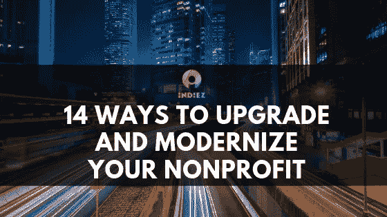

# 14 种方法升级和现代化你的非营利组织

> 原文：<https://medium.com/hackernoon/14-ways-to-upgrade-and-modernize-your-nonprofit-9c211ab0b975>

## 在快速发展的非营利领域，保持新鲜感和相关性是一场持久战。升级和现代化你的企业是保持领先地位和吸引支持者的最佳方式。

14 ways to upgrade and modernize your nonprofit

所有的企业都需要发展以保持相关性。定期更新你的非营利组织将使你的[组织](https://hackernoon.com/tagged/organization)保持在行业的前沿，现代化你的[业务](https://hackernoon.com/tagged/business)流程将使你在竞争中领先。

作为一个非营利组织，虽然定期更新你的方法是必要的，但是你需要始终把你的核心使命放在任何变化的中心。关键是要平衡创新的需求、支持者的期望和你的品牌形象。

非营利组织如何实现这一目标？

# 1.做你的研究

考虑你的市场和你的竞争对手。问问你自己:你的企业在哪里遇到困难或落后了？看看你的竞争对手在做什么，考虑一下你的捐助者和合作伙伴想要什么和需要什么。你是否尽了最大努力，你能做些什么来改进？

# 2.去杂波

不带感情色彩地看待你的生意。**坦诚面对那些不起作用的事情**采取大胆的行动，清除那些无用的东西。这可能是任何事情，从杂乱的工作场所到不必要的会议，不再向捣乱的团队成员反映你的目标的项目。

# 3.改进你的营销

市场营销的世界变化如此之快，以至于一个不太灵活的组织可能会错过重要的变化。在市场营销中保持领先是至关重要的，对于一个现代公司来说，这意味着跟上社交媒体的趋势。

**了解最新的必须使用的社交渠道意味着你正在以最相关和最新的方式与潜在的新捐赠者接触。这对于赢得年轻支持者尤为重要。**

# 4.调整你的语调

每个企业都会随着时间的推移做出改变，以反映不断变化的市场。这不仅适用于商业方法，也适用于品牌声音。当你的内容感觉陈旧时，不要害怕改变它。语言可以约会。重温以前的文章，确保它们仍然令人耳目一新，并调整你的语气，以反映你现在的样子，而不是五年前的样子。

# 5.评估网站设计

除了保持内容的新鲜，如果你几年没有更新你的网站设计也是至关重要的。虽然保持品牌设计的一致性很重要，就像品牌文案一样，**定期重新评估你的网站外观仍然是一个好主意，以确保它反映了你当前的品牌方向**。

# 6.考虑摄影

在看设计的同时，别忘了摄影。一张图片有时比文字更有效，尤其是带有情感内容的图片。与心灵对话的网页需要有效的照片来赋予文本生命。免费的图片网站可能不足以让你从竞争对手中脱颖而出。使用一个有才华的摄影师可以使你的内容的力量有很大的不同。

# 7.聚焦 UX 设计

你的网站的整体用户体验会影响访问者对你的产品的态度以及他们对你的组织的看法。用户体验(UX)设计的重点是提高网站的可访问性和可用性。

好的 UX 设计意味着访问者可以浏览你的网站，快速方便地找到他们想要的东西。伟大的 UX 设计意味着访问者会停留在你的网站上，做你想让他们做的事情，无论是捐款、报名参加活动还是订阅你的时事通讯。

**通过创建一个用户友好的网站结构，并在你的内容中包含精心定位的行动号召(CTA ),你将有最好的机会把新访客变成固定的支持者。**

优秀的 UX 设计并不容易，但这正是一个专家团队可以帮助的地方。Indiez 可以组建一个技术专家团队，他们完全知道你的 UX 网站应该如何运作，以带来你需要的结果。

# 8.升级软件

虽然有效的 UX 设计是必不可少的，使用正确的软件是另一个确保你的非营利组织现代化的方法。技术可以将您的组织推向新的领域。对于自动化来说尤其如此。

例如，利用客户关系管理(CRM)软件，通过使用关于支持者行为的数据分析来提高保留率，可以帮助升级您的沟通策略。

# 9.走向数字化

许多非营利组织仍然发出过多的文书工作。将您的整个业务数字化，包括您的业务通信，将有助于使您的组织现代化。考虑放弃纸张，完全在网上进行你的捐赠、付款、活动预订、会议和其他与你的商业实践相关的预定活动。

# 10.走向绿色

道德行为和[环保解决方案是现代商业的最高境界](https://blueandgreentomorrow.com/environment/go-green/why-going-green-good-for-business/)。这不仅仅是一种趋势，而是一种全新的生活方式。对于非营利组织来说，意识到绿色承诺——并被视为意识到这些问题——是至关重要的。

绿色承诺与将你的企业 100%数字化是携手并进的，因为废纸通信是一个大禁忌。无论你从事什么行业，**让你的支持者知道你对可持续发展的承诺，并公开分享你的绿色证书。**

# 11.简化

简单几乎总是最好的。帮助你的捐助者支持你，列出一份预先准备好的清单，供他们在捐赠时选择。这简化了整个过程，加快了捐赠的速度，并使您的平台更加用户友好。你可以提供特别策划的套餐，包括捐款金额和特殊会员福利。始终保持表格易于查找，设计简单，填写快速。

# 12.使用数据分析

不要忘记数据分析对您业务所有领域的重要性。分析你的数据，了解你可以从哪里改善组织的运作，从你的筹款努力到你的营销和网站设计。**数据分析可以帮助你看到哪些是可行的，哪些是不可行的**，**，这样你就可以决定你需要在哪些地方升级和改进**。

# 13.努力创新…

为了让你的非营利组织尽可能做到最好，你必须不断创新你的业务。微妙的重塑让你的组织保持新鲜感，而不会改变你的核心身份。这些创新提醒人们，你们是一个不断发展的组织，时刻掌握着脉搏，你们的支持者会对你们对不断变化的市场环境做出明智反应的能力充满信心。

# 14.…但不要疏远

尽管变化对增长至关重要，但重要的是不要疏远你的老支持者。熟悉感很安全。与你原来的身份和方法相去甚远可能会让一些人感到不舒服，而年长的支持者在处理财务问题时更可能相信传统的方法。

努力平衡对现代创新的需求和对你现在和过去的品牌身份以及支持者需求的理解。这将帮助你**接触新的事物，同时利用你已经建立起来的信任和影响力。**

**加粗**

准备好重新评估您当前的设置并做出大胆的改变，以便升级和现代化您的组织。通过与技术、营销和设计的最新趋势保持联系，并将其与品牌意识和对支持者期望的理解相结合，你的非营利组织将永远是行业领导者。

准备好让您的业务更上一层楼了吗？今天就和 [Indiez](http://www.indiez.io) 聊聊我们如何利用最新的技术解决方案帮助您实现非营利组织的现代化。