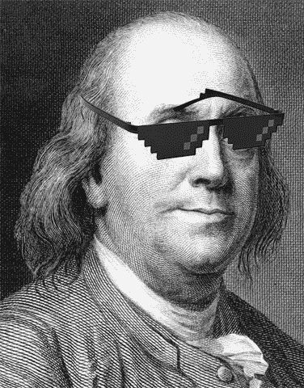
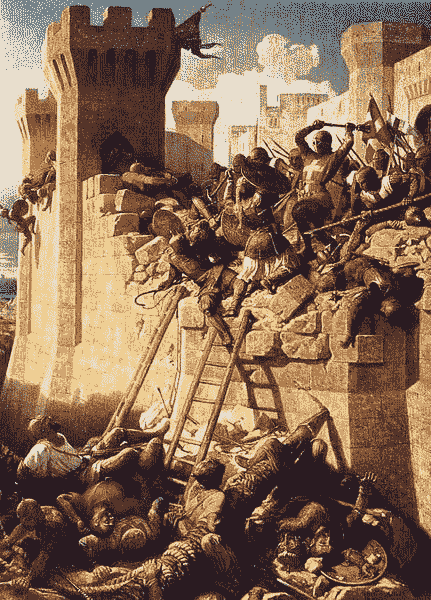
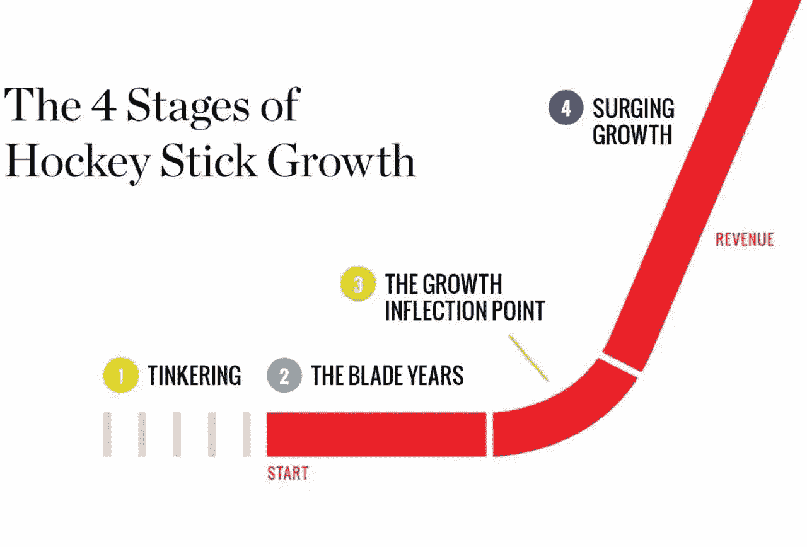
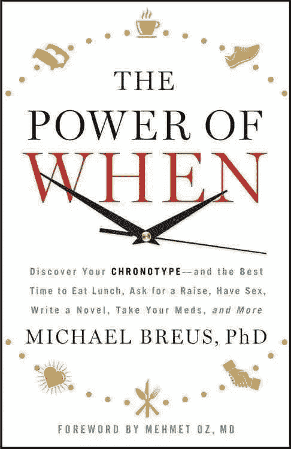
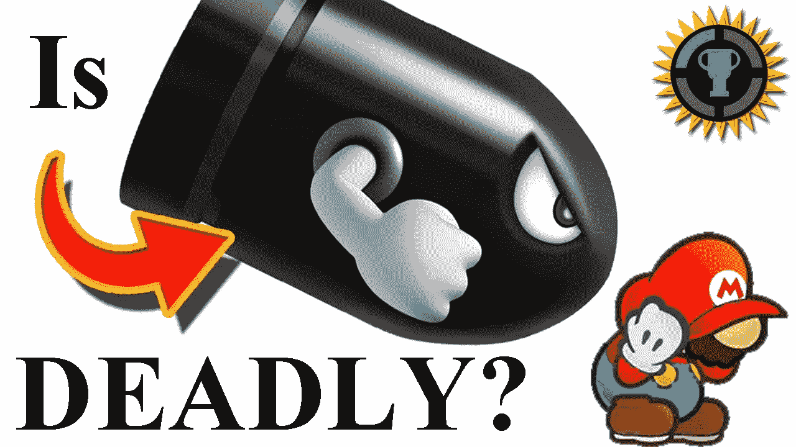

# 下载这些书，粉碎生活

> 原文：<https://medium.com/hackernoon/15-books-to-read-in-2019-a-list-for-techies-product-people-and-health-nuts-6e5f0f8d8c2a>

嘿，你好，

我去年读了一些好的，想分享一下那些让我的一年变得更好的。我从事技术工作，但对健康、心理学、行为经济学等更感兴趣。呆在网站周围，回来查看更多的书籍评论。不过现在，让我们来看看我去年读过的那些让我的一年变得更好的书。

Benjamin says reading is cool!

**Ken koci enda 的创意精选**

是的…必不可少的陈词滥调史蒂夫乔布斯的书。我知道——第一个也是。但是给我一个机会，这其实是曾经做过 iPad 键盘的工程师写的。他详细介绍了苹果产品团队的互动，以及他们是如何运作的。自 2010 年 iPads 首次亮相以来，苹果已售出 3.2 亿台，因此肯的工作确实产生了相当大的影响。这比美国活着的人还多。如果你从事产品工作，这本书是必读的。看看一个有远见的人经营他的公司的方式。[在这里点菜。](https://amzn.to/2U7EgCZ)

**肖恩·埃利斯《黑客成长》**

这是我迟交的许多书中的一本。这本书充满了可行的建议，以及图表，以支持所讨论的方法的实际结果。我的副本上写满了笔记，以及从 Sean 提供的见解中获得的灵感。我是 [Reforge](https://www.reforge.com/) 的[陈楚翔](https://twitter.com/andrewchen)和[凯西·温特斯](https://twitter.com/onecaseman)的忠实粉丝，他们很好地引用了这部电影。我决定拿起它，就再也放不下了——如果你对成长感兴趣，这是必不可少的。[点此处。](https://amzn.to/2DnRKVu)

史蒂文·普莱斯菲尔德的《艺术的战争》

最近迷上了内容创作。史蒂文做了一件伟大的工作，打破了你成为伟大的创造者所需要摧毁的壁垒。[点这里。](https://amzn.to/2MjcP6t)

Those people fighting are your thoughts.

**雷德·霍夫曼闪电战**

我还没有完成这个，但无论如何我会把它扔在这里。说到讲故事，里德是个十足的坏蛋。我虔诚地听他的播客“音阶大师”。如果你喜欢以高速发展公司的想法，那就去看看吧。[点这里。](https://amzn.to/2T1sQAk)

If you want to `send it`, you may as well read how others have `sent it` :)

**Jason Fried 和 David 返工**

基地营的家伙们因为他们有争议的工作方式受到了很多抨击。这与山谷中每个人所宣扬的完全相反，我很喜欢。这本书很深入，对工作采取了完全不同的态度，以及完成工作的方法。这些人还写了更多，包括我读过的《远程》。读完这篇文章后不久，我的工程副总裁[凯尔](https://github.com/kayleg)和我决定颠覆我们的流程。现在，我们效仿本书中教授的许多方法。我们变得敏捷。[在这里点菜。](https://amzn.to/2MrTNuN)

**由杰森·弗兰德和大卫遥控。**

工作不一定要在办公室里完成。管理者不再需要坐在椅子上，现在他们可以成为实干家。你猜对了，远程工作。Basecamp 由分布在美国各地的团队组成。Jason 和 David 很好地解释了他们的流程，以及他们如何在大多数员工远程工作的情况下继续运营一家盈利的公司。[点这里。](https://amzn.to/2MrTSP7)

道格·麦戈夫医学博士的《科学的身体》

我读了很多关于健身和健康的书——这是一本了解不同运动基础的好书。当然，你可以在网上查找不同的练习，或者购买一个计划..但这对我来说还不够。我很好奇所有这些肌肉群是如何相互协作的。如果你是一个健康迷，拿起这个。[点此处。](https://amzn.to/2CAFwHx)

**迈克尔·布鲁斯博士的《当的力量》**

如果你在了解你的身体，以及你应该什么时候做某些事情，这是一个好主意。我们都知道有些人是夜猫子，有些人是早起的人。这家伙把它分解成一门科学。如果你是这种类型的人，在这个时候做这些任务——非常具体的，可操作的建议。这本书谈到了时间类型——这是无数物理过程中潜在昼夜节律的行为表现。他谈了很多关于睡眠的事情。看看这个。[点这里。](https://amzn.to/2U2LqIn)

**受马蒂·卡甘的启发**

这是任何项目经理的必读之作。讲述了产品成长的不同阶段，是我全年读过的最好的产品书籍。它从顶级科技公司的经验开始，讨论合适的人，然后深入到产品故障。[订单在此](https://amzn.to/2W5WM04)

**高增长手册**作者 Elad Gil

寻找很多关于创业公司的不同话题？首席执行官的角色，管理董事会，招聘，雇用，管理，建立一个执行团队，营销和公关…你明白了。很多很多关于创业公司从 10 到 10，000 的信息。总的来说，这是一本很棒的书，可以用来浏览，而不是一本封面对封面的书。[在这里点菜。](https://amzn.to/2FKaxMa)

**10 条不变的营销法则**阿尔赖兹&杰克·特劳特

如果你对营销有任何兴趣，这是必须的。它很好地打破了我们都很熟悉的公司的不同的营销“法则”。苹果。一个特别有趣的是感知定律。营销不是产品之战，而是认知之战。我是通过收听大卫·格哈特[和大卫·卡塞](https://twitter.com/davegerhardt)[的精彩播客《寻求智慧》得到这份推荐的。](https://twitter.com/dcancel)[点此处。](https://amzn.to/2T5QT0X)

大卫·阿斯普雷的《防弹》

我从读到这里就坐上了防弹咖啡列车，没有回头。大卫在保持营养信息的趣味性方面做得非常好。他对生物黑客有点兴趣，也就是服用补充剂，每天做一些事情来增加大脑的行为。这是第一本把我送进兔子洞的书，是生物黑客。如果你想活得更久，读读他的书。[点这里。](https://amzn.to/2FOF77I)

Bulletproof coffee is tasty and gets the day going.

《肉是给娘们吃的:给想变得健康、踢屁股和出名的男人的指南》,作者约翰·约瑟夫

当我凝视着我的书柜，从我今年读过的书中挑选推荐时，我想知道这本书是怎么出现的。我一定读过一些博客文章，说肉对你有多可怕。不管怎样，这个名字本身就开始了这本书的节奏。我很少找到一本我爱不释手的书。这是迄今为止最好的素食主义者…我读过的唯一一本素食主义者的书。"走过停尸房，直奔蔬菜店."这样的意象。在这里点菜..

布拉德·弗罗斯特的原子设计

如果你是产品，你必须阅读这一点。我不在乎你是设计师、工程师还是产品经理。Brad 出色地打破了他在 UI 设计背后的哲学。结果是更干净、更一致的产品，让用户更满意。每个人都想要更快乐的用户。[在这里点菜。](http://atomicdesign.bradfrost.com/)

**为触摸而设计&负责任的响应式设计，**斯科特·杰尔和乔什·克拉克

这些书绝对钉如何设计触摸，以及负责任的反应设计。如果你是 UX 研究员、用户界面设计师或产品设计师，你应该高度考虑阅读这些。它们分解事物，并给你在移动和响应项目中与开发人员合作所需的印章。[点这里。](https://abookapart.com/)

# 感谢阅读——在 [twitter 上关注我的想法。](https://twitter.com/parkerrex)