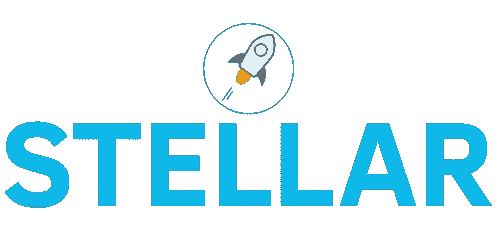
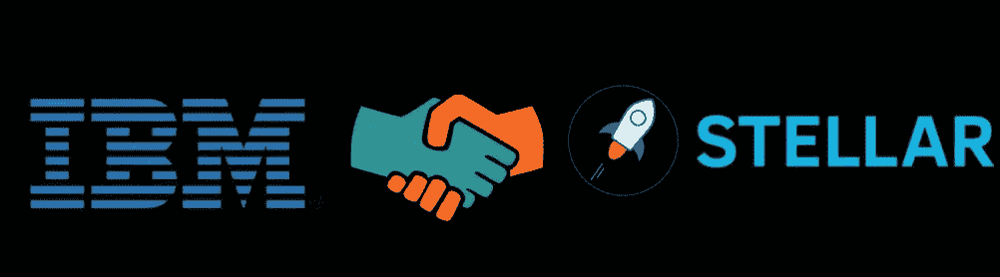
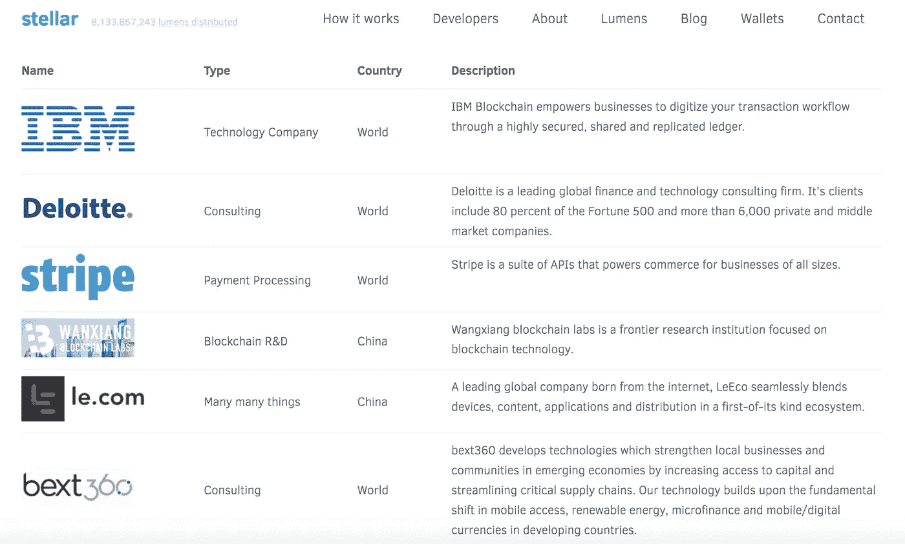
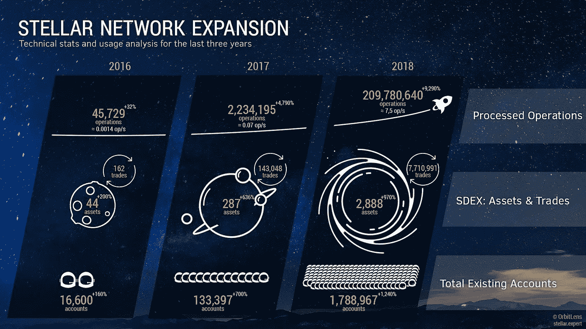

# 恒星集团实现全球金融机构现代化的 15 种方式

> 原文：<https://medium.com/hackernoon/15-ways-stellar-is-modernizing-global-financial-institutions-96219c12b892>

每当我不得不走进银行时，我都会感到害怕。我不喜欢这种体验的每一个方面，从受污染的灯光、长长的队伍、缺乏隐私，到他们探究我为什么想存取我的钱的态度。这是一场噩梦，但这只是问题的一小部分。

世界当前的金融基础设施充斥着低效率，导致交易成本高、资金流动速度慢和缺乏全球包容性。这些差距限制了社区的发展，并使数十亿人得不到充分的金融服务。我最喜欢的解决这些问题的项目之一是恒星基金会。他们意识到，社会需要一个向任何人开放的全球金融网络，拥有像互联网一样的速度和资金转移成本，并确保交易的完整性。我认为，它们提供了新的元素，可以扩大或增强现有的金融体系，实现全球金融基础设施的现代化。

# 基础知识:

1.  恒星项目**始于 2014 年 7 月**，总部位于**三藩市。**
2.  Stellar 是一个**开源、分散的协议，用于数字货币到法定货币的转移，允许任何一对货币之间的跨境交易。**
3.  区块链上的数字货币单位被称为**流明。**
4.  **股票代码:XLM**
    价格:$ 0.10
    市值排名:7
    市值:2026558238
    流通供应量:19127012671 XLM
    最大供应量:104642624134 XLM
    24 小时交易量:90391551

# 团队:

1.  明星队由传奇人物杰德·麦卡勒带领。他之前的工作包括创建第一个比特币交易所 Mt. Gox，以及共同创立 Ripple。
2.  恒星的首席技术官是尼古拉斯·巴里。在 Stellar 之前，他曾在微软和 Salesforce 帮助构建大型系统。
3.  Stellar 核心团队拥有另外 7 名区块链开发人员和工程师。
4.  商业开发人员、战略家和营销人员也是核心团队的成员。
5.  恒星计划的顾问包括:

*   帕特里克·科利森:Stripe 的首席执行官
*   **海军拉维康德:**安杰利派的创始人
*   山姆·奥特曼:Y Combinator 的总裁

# 增长驱动因素:

1.  Stellar 使用一种新的共识模型，称为**联邦拜占庭协议(FBA)** 。FBA 能够通过**法定切片**克服不利条件，这意味着如果足够数量的节点得出交易有效的结论，就可以达成共识。**切片将系统捆绑在一起**，类似于现在单个网络的对等和传输决定统一互联网的方式。
2.  FBA 为**Stellar Consensus Protocol(SCP)**设置了确认和验证交易的阶段，这允许它同时享有**四个关键属性:**

— **分散控制**。任何人都可以参与，没有中央权力机构规定达成共识需要谁的批准。

— **低延迟。**在实践中，节点可以在人类期望的网络或支付交易的时间尺度上达成共识，即最多几秒钟。

— **灵活信托。用户可以自由信任他们认为合适的任何一方的组合。例如，一个小型非营利组织可能在保持大得多的机构诚实方面发挥关键作用。**

— **渐近安全。**安全依赖于数字签名和散列族，它们的参数可以实际调整，以抵御具有难以想象的巨大计算能力的对手。

4.与以太坊的 25 TPS 相比，Stellar 网络每秒可以处理超过 1000 个事务。

5.Stellar 已经与 IBM 建立了强大的合作伙伴关系，帮助他们开发他们的**区块链世界线产品或通用支付系统**。 **IBM 的区块链分部**也**确认他们将使用 Stellar Lumens (XLM)** 作为支付基础设施的记账单位。

6.恒星基金会最近让纽约金融监管机构批准了流明的交易，这意味着流明不被视为证券。

7.StellarX 是一个基于 Stellar 的零费用分散加密交易所，已经于 9 月份全面推出供公众使用。StellarX 将自己定位为菲亚特 onramp，允许个人直接从美国银行账户存入美元。他们正在推销类似于 Robinhood 的 StellarX，因为 Stellar 承诺为他们的用户退还所有网络费用。

8.通过 Stellar/IBM 的合作， **IBM 已经与数十家私人银行和中央银行建立了合作关系**，尤其是在亚太地区。IBM 的区块链解决方案负责人声称，他们**非常接近于帮助一家中央银行将法定货币转移到恒星区块链**。IBM 和 Stellar 的合作很有可能取代破旧的 SWIFT/IBAN 支付基础设施。

9.可再生能源初创公司**veri dium**正与 **IBM 和 Stellar 合作，对全球碳信用市场进行标记。Veridium 正致力于将他们的本地令牌 VERDE 与石油和天然气交易平台相集成，以实现碳排放抵消过程的自动化。**

10.基于恒星的项目，**据点**，正在帮助为网络开发**美元稳定币。Stronghold 接受美元形式的存款，并可以在 Stellar 网络上发行任何类型的代币，包括比特币、以太坊和美元。Stronghold 还与 PrimeTrust 合作以获得资金，这有助于项目合法化。**

11.**欧洲汇款公司 Tempo** 成功过渡到恒星网络。这意味着任何拥有 XLM 的人都可以直接从一个超级钱包里通过 Tempo 网络汇款。这项服务正在菲律宾进行测试，菲律宾是世界上最大的汇款市场之一。

此外，Tempo 与 Stellar 的合作可能意味着 Stellar 现在是拥有最大现实世界网络的加密货币。 Tempo 在欧洲有 **300 个地点**销售 lumens，他们的网络目前活跃在 **120 个国家，被 195，000 个分支机构使用。**

12.基于 Stellar 网络的其他著名区块链项目: **Open Garden、TillBilly、Slice、Sure Remit、Smartlands、Chynge、Modius。**都在做很酷的事情来拓展恒星网络。

13.Stellar 通过收购链执行了一次**聪明的收购，现在被称为星际。Chain 允许 Stellar 网络拥有支付渠道，使双方能够私下、即时、安全地进行交易。这些转移不收取费用，因为它们不在主链上执行。**

15.Stellar 还与印度顶级银行和金融服务提供商印度工业信贷投资公司(ICICI) 达成了**正式合作。印度是世界上人口最多的国家之一，大多数人都没有银行账户，这为恒星集团提供了一个非常有利的战术优势。**流明很可能成为印度无银行账户人群交易的重要过渡货币。****

# 逆风:

1.  Stellar 确实面临着来自另一家区块链初创公司 Ripple 的真正竞争。然而，这个领域还处于早期，所以这两个项目可以共存和发展。
2.  这个项目的成功不仅取决于 Stellar 的产品有多好，还取决于它是否对用户友好。换句话说，他们是否能够降低进入门槛，引入技术含量较低的人才。
3.  由于监管总是会落后于创新，数字货币领域未来可能会受到新监管的约束。

# 结论:

Stellar 项目通过实现全球金融轨道的现代化，正在改变跨境支付的工作方式。这使得金融机构可以在几秒钟内发送和结算支付，同时消除了阻碍众多全球社区发展的低效问题。
通过利用 Lumens，Stellar 能够集成支付指令消息，结算提议的交易，并以传统银行业务的一小部分成本近乎实时地交换价值。

**要了解更多信息，请访问我的网站:**

[www.MasiDigitalVentures.com](http://www.MasiDigitalVentures.com)