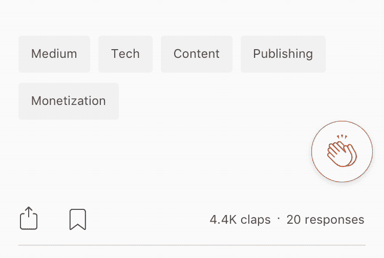

# 150 门顶级编程课程将于 2019 年启动

> 原文：<https://medium.com/hackernoon/150-top-rated-programming-courses-to-kickoff-2019-d7db4f886ca0>

## 有史以来最受好评的编程课程

编程和开发是世界上要求很高的技能。编程和软件开发的知识可以成为改变一生的职业。随着 web 开发、移动应用程序开发、机器学习、数据科学、数据工程、聊天机器人开发、人工智能、前端开发、后端开发等技术领域出现的数百万新机会，学习新技能总是必要的。

从数以百万计的在线课程中寻找和挑选最佳课程是一项非常单调的任务。这需要很多时间和努力。这些课程列表是根据类别分类的，对那些想开始新的[编码](https://hackernoon.com/tagged/coding)技能而又不想花时间去找合适的课程的人很有帮助。

[**QuickCode Plus**](https://www.quickcode.co/best-programming-courses) 将帮助你发现你应该开始学习的最佳编程课程，而不必浪费时间从数百万的在线课程中选择课程。这些课程是根据它们的评级和评论挑选出来的。这有助于保持质量。

# 深度学习

## [深度学习](https://click.linksynergy.com/deeplink?id=BuGceriufQM&mid=40328&u1=quickcode&murl=https%3A%2F%2Fwww.coursera.org%2Fspecializations%2Fdeep-learning)

如果你想打入 AI，这个专精会帮你做到。

⭐*:4.9/5*(40271 分)

## [神经网络和深度学习](https://click.linksynergy.com/deeplink?id=BuGceriufQM&mid=40328&u1=quickcode&murl=https%3A%2F%2Fwww.coursera.org%2Flearn%2Fneural-networks-deep-learning)

本课程是深度学习专业化的一部分。

⭐ *: 4.9/5* (共 41638 个)

## [深度学习 A-Z:动手人工神经网络](https://click.linksynergy.com/deeplink?id=Fh5UMknfYAU&mid=39197&u1=quickcode&murl=https%3A%2F%2Fwww.udemy.com%2Fdeeplearning%2F)

向两位机器学习和数据科学专家学习用 Python 创建深度学习算法。包括模板。

⭐ *: 4.5/5* (共 16746 个)

## [用 Python 进行深度学习的 TensorFlow 完全指南](https://click.linksynergy.com/deeplink?id=Fh5UMknfYAU&mid=39197&u1=quickcode&murl=https%3A%2F%2Fwww.udemy.com%2Fcomplete-guide-to-tensorflow-for-deep-learning-with-python%2F)

了解如何使用 Google 的深度学习框架— TensorFlow with Python！用尖端技术解决问题！

⭐ *: 4.4/5* (共 8322 个)

## [用 PyTorch 实用深度学习](https://click.linksynergy.com/deeplink?id=Fh5UMknfYAU&mid=39197&u1=quickcode&murl=https%3A%2F%2Fwww.udemy.com%2Fpractical-deep-learning-with-pytorch%2F)

使用 PyTorch 加速您的深度学习，py torch 通过 python 优先的框架涵盖了深度学习的所有基础知识。

⭐ *: 4.2/5* (共 736 个)

## [深度学习简介](https://click.linksynergy.com/deeplink?id=BuGceriufQM&mid=40328&u1=quickcode&murl=https%3A%2F%2Fwww.coursera.org%2Flearn%2Fintro-to-deep-learning)

本课程是高级机器学习专业的一部分。

⭐ *: 4.6/5* (共 655 个)

## [使用 Python 进行数据科学和机器学习——动手实践！](https://skillshare.eqcm.net/c/1137078/298081/4650?u=https%3A%2F%2Fwww.skillshare.com%2Fclasses%2FData-Science-and-Machine-Learning-with-Python-Hands-On%2F1263657127)

数据科学家是收入最高的工作之一，平均收入

2，503 人(总入学人数)

## [使用 Python 的深度学习和神经网络](https://skillshare.eqcm.net/c/1137078/298081/4650?u=https%3A%2F%2Fwww.skillshare.com%2Fclasses%2FDeep-Learning-and-Neural-Networks-with-Python%2F45606211)

如果你已经有了一些 Python 的经验，这个课程将会用你需要知道的所有主要话题来揭开这个令人兴奋的领域的神秘面纱。

1，058 人(总入学人数)

# 机器学习

## [机器学习](https://click.linksynergy.com/deeplink?id=BuGceriufQM&mid=40328&u1=quickcode&murl=https%3A%2F%2Fwww.coursera.org%2Flearn%2Fmachine-learning)

斯坦福大学的机器学习。机器学习是让计算机在没有明确编程的情况下行动的科学。

⭐*:4.9/5*(86089 分)

## [机器学习专业化](https://www.coursera.org/specializations/machine-learning)

构建智能应用程序。在四门实践课程中掌握机器学习基础知识。

⭐ *: 4.6/5* (共 7904 个)

## [高级机器学习专业化](https://click.linksynergy.com/deeplink?id=BuGceriufQM&mid=40328&u1=quickcode&murl=https%3A%2F%2Fwww.coursera.org%2Fspecializations%2Faml)

深入探究现代人工智能技术。你将教计算机看、画、读、说、玩游戏和解决工业问题。

⭐ *: 4.6/5* (共 655 个)

## [在谷歌云平台专业化上使用 TensorFlow 进行机器学习](https://click.linksynergy.com/deeplink?id=BuGceriufQM&mid=40328&u1=quickcode&murl=https%3A%2F%2Fwww.coursera.org%2Fspecializations%2Fmachine-learning-tensorflow-gcp)

用谷歌云学习 ML。端到端 ML 的真实世界实验。

⭐ *: 4.6/5* (共 2054 个)

## [用 Python 进行机器学习](https://click.linksynergy.com/deeplink?id=BuGceriufQM&mid=40328&u1=quickcode&murl=https%3A%2F%2Fwww.coursera.org%2Flearn%2Fmachine-learning-with-python)

本课程是 IBM 数据科学专业认证专业化的一部分。

⭐ *: 4.7/5* (共 323 个)

## [机器学习 A-Z:数据科学中的动手 Python&R](https://click.linksynergy.com/deeplink?id=Fh5UMknfYAU&mid=39197&u1=quickcode&murl=https%3A%2F%2Fwww.udemy.com%2Fmachinelearning%2F)

向两位数据科学专家学习用 Python 和 R 创建机器学习算法。包括代码模板。

⭐ *: 4.5/5* (共 64222 个)

# 以太坊&坚固

## [以太坊和坚固性:完整的开发者指南](https://click.linksynergy.com/deeplink?id=Fh5UMknfYAU&mid=39197&u1=quickcode&murl=https%3A%2F%2Fwww.udemy.com%2Fethereum-and-solidity-the-complete-developers-guide%2F)

使用以太坊、Solidity 和智能合约来构建基于区块链的生产就绪型应用。

⭐ *: 4.6/5* (共 6957 个)

## [使用 Solidity 创建以太坊&区块链应用](http://"https://www.eduonix.com/affiliates/id/160-10732)

了解以太坊、Solidity、DAO、ICO、比特币、Altcoin、网站安全、Ripple、Litecoin、智能合约、app。

⭐ *: 4.5/5* (共 143 个)

## 以太坊大师&可靠性编程:构建现实世界的应用

深入以太坊&坚固编程。循序渐进的 ERC20 Token、ICO、拍卖、筹款、彩票、IPFS

⭐ *: 4.7/5* (共 70 个)

# 数据科学

## [数据科学](https://click.linksynergy.com/deeplink?id=BuGceriufQM&mid=40328&u1=quickcode&murl=https%3A%2F%2Fwww.coursera.org%2Fspecializations%2Fjhu-data-science)

约翰霍普金斯大学的数据科学。提出正确的问题，操作数据集，并创建可视化的交流结果。该专业涵盖了您在整个数据科学中需要的概念和工具

⭐ *: 4.5/5* (总计 16797)

## [用 Python 应用数据科学](https://click.linksynergy.com/deeplink?id=BuGceriufQM&mid=40328&u1=quickcode&murl=https%3A%2F%2Fwww.coursera.org%2Fspecializations%2Fdata-science-python)

密歇根大学专业的 5 门课程通过 python 编程语言向学习者介绍数据科学

⭐ *: 4.5/5* (共 8110 个)

## [IBM 专业化认证的高级数据科学](https://click.linksynergy.com/deeplink?id=BuGceriufQM&mid=40328&u1=quickcode&murl=https%3A%2F%2Fwww.coursera.org%2Fspecializations%2Fadvanced-data-science-ibm)

数据科学、机器学习和人工智能专家。成为 IBM 认可的数据科学、机器学习和人工智能专家。

⭐ *: 4.4/5* (共 180)

## [带 R 的统计](https://click.linksynergy.com/deeplink?id=BuGceriufQM&mid=40328&u1=quickcode&murl=https%3A%2F%2Fwww.coursera.org%2Fspecializations%2Fstatistics)

在本专业中，您将学习分析和可视化 R 中的数据，创建可再现的数据分析报告，展示对统计数据统一性的概念性理解

⭐ *: 4.7/5* (共 2544 个)

# 前端开发

# 角度 Js

## [角度 7(以前为角度 2) —完整指南](https://click.linksynergy.com/deeplink?id=Fh5UMknfYAU&mid=39197&u1=quickcode&murl=https%3A%2F%2Fwww.udemy.com%2Fthe-complete-guide-to-angular-2%2F)

掌握 Angular (Angular 2+，包括 Angular 7)并使用 Angular.js 的继任者构建令人惊叹的反应式 web 应用程序

⭐ *: 4.6/5* (共 67859 个)

## [角度&节点 JS —平均堆叠导轨](https://www.eduonix.com/affiliates/id/160-10549)

通过构建一个真实的应用程序，了解如何将 Angular 前端连接到 NodeJS & Express & MongoDB 后端。

⭐ *: 4.7/5* (118 条评论)

## [使用 Angular](https://www.eduonix.com/affiliates/id/160-10680) 构建一个完整的 CMS 应用

通过构建一个真实世界的应用程序来掌握 Angular 中的职业发展。学习基础，角度和材料设计。

⭐ *: 4.6/5* (154 条评论)

# 反应 Js

## [React 16.6 —完整指南(包括 React 路由器& Redux)](https://click.linksynergy.com/deeplink?id=Fh5UMknfYAU&mid=39197&u1=quickcode&murl=https%3A%2F%2Fwww.udemy.com%2Freact-the-complete-guide-incl-redux%2F)

投身其中，从头开始学习 React！了解 Reactjs、Redux、React Routing、动画、Next.js 基础知识以及更多内容！

⭐ *: 4.7/5* (共 25855 个)

## [现代 React with Redux【2019 更新】](https://click.linksynergy.com/deeplink?id=Fh5UMknfYAU&mid=39197&u1=quickcode&murl=https%3A%2F%2Fwww.udemy.com%2Freact-redux%2F)

掌握 React v16.6.3 和 Redux 用 React 路由器、Webpack、Create-React-App。包括钩子！

⭐ *: 4.5/5* (总共 37267 个)

# Vue Js

## [Vue JS 2 —完整指南(包括 Vue 路由器& Vuex)](https://click.linksynergy.com/deeplink?id=Fh5UMknfYAU&mid=39197&u1=quickcode&murl=https%3A%2F%2Fwww.udemy.com%2Fvuejs-2-the-complete-guide%2F)

Vue JS 是一个非常棒的 JavaScript 框架，用于构建前端应用程序！VueJS 混合了最好的角度+反应！

⭐ *: 4.7/5* (共 21168 个)

## [Vue.js 2 学院:循序渐进学习 Vue](https://skillshare.eqcm.net/c/1137078/298081/4650?u=https%3A%2F%2Fwww.skillshare.com%2Fclasses%2FVue.js-2-Academy-Learn-Vue-Step-by-Step%2F976397920)

通过学习当今最热门的 Javascript 框架之一 Vue.js，让您的 HTML、CSS 和 Javascript 技能更上一层楼！

*   总入学人数- 405 名学生

## [VueJS 2 完整指南](https://www.eduonix.com/affiliates/id/160-10542-0-QC10)

Vuejs 2 教程是一个前端编程框架，帮助从基础开始学习，它是 angular 2 和 Reactjs 框架的结合。

⭐ *: 4.7/5* (161 条评论)

# 以打字打的文件

## [理解打字稿](https://click.linksynergy.com/deeplink?id=Fh5UMknfYAU&mid=39197&u1=quickcode&murl=https%3A%2F%2Fwww.udemy.com%2Funderstanding-typescript%2F)

不要把 TypeScript 的用法限制在 Angular 2！了解基础知识、其功能、工作流程以及如何使用它！

⭐ *: 4.6/5* (共 6101 个)

## [用 Angular 2](https://www.eduonix.com/affiliates/id/160-10546) 从头学打字

使用 Angular 2 从头开始学习 TypeScript，并接触实际使用 TypeScript 的实例。

⭐ *: 4.6/5* (165 条评论)

# Redux

## [Advance React and Redux:从认证到部署](https://click.linksynergy.com/deeplink?id=Fh5UMknfYAU&mid=39197&u1=quickcode&murl=https%3A%2F%2Fwww.udemy.com%2Freact-redux-tutorial%2F)

关于高级 React 和 Redux 概念的详细演练—身份验证、测试、中间件、HOC 和部署。

⭐ *: 4.7/5* (共 7132 个)

## 【React Web 开发人员完整课程(带 Redux)

了解如何使用 React v16、Redux、Webpack、React-Router v4 等构建和启动 React web 应用程序！

⭐ *: 4.7/5* (共 8592 个)

## [完整的 React Native 和 Redux 课程](https://click.linksynergy.com/deeplink?id=Fh5UMknfYAU&mid=39197&u1=quickcode&murl=https%3A%2F%2Fwww.udemy.com%2Fthe-complete-react-native-and-redux-course%2F)

从零开始开发 iOS 和 Android 应用程序-以惊人的速度构建完整的原生移动应用程序！

⭐ *: 4.5/5* (共 21108 个)

# 游戏开发

# 一致

## [完成 C# Unity 开发者 2D:学习代码制作游戏](https://click.linksynergy.com/deeplink?id=Fh5UMknfYAU&mid=39197&u1=quickcode&murl=https%3A%2F%2Fwww.udemy.com%2Funitycourse%2F)

游戏开发和设计。学习 C#中的 Unity 2018。你的第一个 7 2D 团结网络，Mac 和 PC 游戏。包括 Tilemap。

⭐ *: 4.6/5* (共 51329 个)

## [完成 C# Unity Developer 3D:学习编码制作游戏](https://click.linksynergy.com/deeplink?id=Fh5UMknfYAU&mid=39197&u1=quickcode&murl=https%3A%2F%2Fwww.udemy.com%2Funitycourse2%2F)

游戏开发和设计。使用 Unity Engine 学习 C#。你的第一个网络，Mac 和 PC 的 3D 游戏。

⭐ *: 4.6/5* (共 7794 个)

## 【Unity 游戏开发终极指南(2018.2.x)

与 Unity Technologies 合作创建:通过开发 2D 和 3D 游戏来学习 C#，这是一个全面的指南。

⭐ *: 4.5/5* (共 5194 个)

## [Unity 2017 初学者课程](https://click.linksynergy.com/deeplink?id=Fh5UMknfYAU&mid=39197&u1=quickcode&murl=https%3A%2F%2Fwww.udemy.com%2Funity-2017-beginners-course%2F)

准备开始创建自己的游戏。

⭐ *: 4.3/5* (共 23 个)

## [用 Unity 游戏引擎开发大师游戏第 1 卷](https://skillshare.eqcm.net/c/1137078/298081/4650?u=https%3A%2F%2Fwww.skillshare.com%2Fclasses%2FMaster-Game-Development-With-Unity-Game-Engine-Volume-1%2F1728926899)

即使在第一册之后，你将能够创造你自己的游戏，但是每下一册或每堂课都会让你越来越好。

*   总入学人数- 2，010 名学生

# 虚幻引擎

## [虚幻引擎 C++开发者:学 C++做电子游戏](https://click.linksynergy.com/deeplink?id=Fh5UMknfYAU&mid=39197&u1=quickcode&murl=https%3A%2F%2Fwww.udemy.com%2Funrealcourse%2F)

从基础开始学 C++。让你的前 4 个视频游戏在虚幻引擎，堡垒之夜背后的引擎。互动教程。

⭐ *: 4.5/5* (共 29206 个)

## [虚幻引擎 4:完全初学者教程](https://click.linksynergy.com/deeplink?id=Fh5UMknfYAU&mid=39197&u1=quickcode&murl=https%3A%2F%2Fwww.udemy.com%2Funreal-engine-4-the-complete-beginners-course%2F)

学习视频游戏开发&如何使用 UE4 从头开始设计游戏。

⭐ *: 4.4/5* (共 2808 个)

## [虚幻引擎 4:如何开发你的前两款游戏](https://click.linksynergy.com/deeplink?id=Fh5UMknfYAU&mid=39197&u1=quickcode&murl=https%3A%2F%2Fwww.udemy.com%2Funreale4%2F)

Epic Games-Approved:学习虚幻编辑器，掌握游戏玩法框架，使用蓝图编程，无需编码。

⭐ *: 4.5/5* (共 6439 个)

# ***移动开发***

# 机器人

## [完整的 Android N 开发者课程](https://click.linksynergy.com/deeplink?id=Fh5UMknfYAU&mid=39197&u1=quickcode&murl=https%3A%2F%2Fwww.udemy.com%2Fcomplete-android-n-developer-course%2F)

通过构建包括优步、Whatsapp 和 Instagram 在内的真实应用程序，使用 Android 7 牛轧糖学习 Android 应用程序开发！

## [用 Java 和 Android Studio 掌握 Android 应用开发](https://click.linksynergy.com/deeplink?id=Fh5UMknfYAU&mid=39197&u1=quickcode&murl=https%3A%2F%2Fwww.udemy.com%2Fmaster-android-7-nougat-java-app-development-step-by-step%2F)

通过学习 Android 应用程序开发来改善您的职业选择。掌握 Android Studio，立即构建您的第一款应用

⭐ *: 4.5/5* (共 5071 个)

## [Android O&Java——完整的 Android 开发训练营](https://click.linksynergy.com/deeplink?id=Fh5UMknfYAU&mid=39197&u1=quickcode&murl=https%3A%2F%2Fwww.udemy.com%2Fandroid-app-development-with-java%2F)

从头到尾学习 Android O app 开发。学习用 Java 编写代码，同时构建有趣的 Android O 项目。

⭐ *: 4.5/5* (共 4529 个)

## [完整的 Android 开发者课程——从初级到高级！](https://skillshare.eqcm.net/c/1137078/298081/4650?u=https%3A%2F%2Fwww.skillshare.com%2Fclasses%2FThe-Complete-Android-Developer-Course-Go-From-Beginner-To-Advanced%2F466793153)

欢迎来到完整的 Android 开发者课程:从初级到高级！

1，892 人(总入学人数)

# 科特林

## [科特林安卓版:从初级到高级](https://click.linksynergy.com/deeplink?id=Fh5UMknfYAU&mid=39197&u1=quickcode&murl=https%3A%2F%2Fwww.udemy.com%2Fdevslopes-android-kotlin%2F)

Kotlin 是 Android 上一种表达性强、简洁而强大的开发语言。开始学习你需要知道的一切

⭐ *: 4.5/5* (965 条评论)

## [Kotlin 初学者:用 Kotlin 学习编程](https://click.linksynergy.com/deeplink?id=Fh5UMknfYAU&mid=39197&u1=quickcode&murl=https%3A%2F%2Fwww.udemy.com%2Fkotlin-course%2F)

从头开始学科特林！掌握面向对象和惯用的 Kotlin 来实现编码项目和 Android 应用程序！

⭐ *: 4.4/5* (1040 条评论)

## [完整的 Android Kotlin 开发者课程](https://click.linksynergy.com/deeplink?id=Fh5UMknfYAU&mid=39197&u1=quickcode&murl=https%3A%2F%2Fwww.udemy.com%2Fthe-complete-kotlin-developer-course%2F)

学习如何使用 Kotlin 制作在线游戏和 Android O 应用程序，如神奇宝贝、twitter、井字游戏和记事本

⭐ *: 4.1/5* (4629 条评论)

## [Kotlin Android 开发大师班—使用 Android Oreo](https://www.eduonix.com/affiliates/id/160-10702)

从零开始学习 Kotlin 1.2，Android 开发，Android Studio & IntelliJ IDEA。用 Kotlin 构建 Android 应用程序。

⭐ *: 4.5/5* (140 条评论)

# 反应自然

## [反应本土——实用指南](https://click.linksynergy.com/deeplink?id=Fh5UMknfYAU&mid=39197&u1=quickcode&murl=https%3A%2F%2Fwww.udemy.com%2Freact-native-the-practical-guide%2F)

使用 React Native 和您的 React 知识，并利用您的 web 开发技能来构建原生 iOS 和 Android 应用程序。

⭐ *: 4.6/5* (共 3802 个)

## [反应原生:高级概念](https://click.linksynergy.com/deeplink?id=Fh5UMknfYAU&mid=39197&u1=quickcode&murl=https%3A%2F%2Fwww.udemy.com%2Freact-native-advanced%2F)

掌握 React Native 的高级主题:动画、地图、通知、导航等！

⭐ *: 4.5/5* (总共 3313 个)

## [在 React 本地教程中构建本地移动应用](https://www.eduonix.com/affiliates/id/160-10632)

本 React native 教程是帮助您从头构建自己的原生 iOS 和 android 应用程序的实用指南。注册以增加您的反应知识

⭐ *: 4.7/5* (168 条评论)

# 迅速发生的

## [iOS 11&Swift 4——完整的 iOS 应用开发训练营](https://click.linksynergy.com/deeplink?id=Fh5UMknfYAU&mid=39197&u1=quickcode&murl=https%3A%2F%2Fwww.udemy.com%2Fios11-app-development-bootcamp%2F)

从头到尾学习 iOS 11 App 开发。使用 Xcode 9 和 Swift 4。包括完整的 ARKit 和 CoreML 模块！

⭐ *: 4.6/5* (共 27585 个)

# Xamarin

## [Xamarin Forms:用 C#构建原生跨平台应用](https://click.linksynergy.com/deeplink?id=Fh5UMknfYAU&mid=39197&u1=quickcode&murl=https%3A%2F%2Fwww.udemy.com%2Fxamarin-forms-course%2F)

学习使用你现有的 C#技能为 Android、iOS 和 Windows 构建本地移动应用

⭐ *: 4.5/5* (共 5702 个)

## [完整的 Xamarin 开发者课程:iOS 和 Android！](https://click.linksynergy.com/deeplink?id=Fh5UMknfYAU&mid=39197&u1=quickcode&murl=https%3A%2F%2Fwww.udemy.com%2Fcomplete-xamarin-developer-course-ios-and-android%2F)

使用 Xamarin Forms、Xamarin Classic、Azure 移动应用服务、Rest 等构建跨平台 Android 和 iOS 应用。

⭐ *: 4.3/5* (共 1094 个)

# 飞镖和飘动

## [学扑&飞镖打造 iOS &安卓应用](https://click.linksynergy.com/deeplink?id=Fh5UMknfYAU&mid=39197&u1=quickcode&murl=https%3A%2F%2Fwww.udemy.com%2Flearn-flutter-dart-to-build-ios-android-apps%2F)

用于构建原生 iOS 和 Android 应用的 Flutter SDK 和 Flutter 框架的完整指南。

⭐ *: 4.6/5* (共 2298 个)

## [Flutter&Dart——完整的 Flutter App 开发教程](https://click.linksynergy.com/deeplink?id=Fh5UMknfYAU&mid=39197&u1=quickcode&murl=https%3A%2F%2Fwww.udemy.com%2Fflutter-dart-the-complete-flutter-app-development-course%2F)

使用单一代码库构建 iOS 和 Android 应用程序——了解 Google 的 Flutter 移动开发框架。

⭐ *: 4.5/5* (共 1600)

## [飞镖和颤振:完整的开发者指南](https://click.linksynergy.com/deeplink?id=Fh5UMknfYAU&mid=39197&u1=quickcode&murl=https%3A%2F%2Fwww.udemy.com%2Fdart-and-flutter-the-complete-developers-guide%2F)

用 Flutter 和 Dart 构建移动应用需要知道的一切，包括 RxDart 和动画！

⭐ *: 4.6/5* (共 1012 个)

## [Flutter&Dart——完整的 Flutter App 开发教程](https://www.eduonix.com/affiliates/id/160-10762)

使用单一代码库构建 iOS 和 Android 应用程序—了解 Google 的 Dart 和 Flutter 移动开发框架。

⭐ *: 4.6/5* (128 条评论)

# AR 套件

## [完整的 ARKit 课程——构建 11 个增强现实应用](https://click.linksynergy.com/deeplink?id=Fh5UMknfYAU&mid=39197&u1=quickcode&murl=https%3A%2F%2Fwww.udemy.com%2Fios-augmented-reality-the-complete-course-on-arkit%2F)

通过在 iOS 11 和 Swift 4 中使用 ARKit 构建 11 个高级 AR 应用程序，成为 iOS 增强现实开发者。

⭐ *: 4.5/5* (共 1498 个)

# 编程；编排

# 长生不老药

## [完成仙丹和凤凰训练营](https://click.linksynergy.com/deeplink?id=Fh5UMknfYAU&mid=39197&u1=quickcode&murl=https%3A%2F%2Fwww.udemy.com%2Fthe-complete-elixir-and-phoenix-bootcamp-and-tutorial%2F)

使用 Elixir 和 Phoenix 掌握函数式编程技术，同时学习构建引人注目的 web 应用程序！

⭐ *: 4.6/5* (共 3398 个)

# 戈朗

## [Go:完全开发者指南(Golang)](https://click.linksynergy.com/deeplink?id=Fh5UMknfYAU&mid=39197&u1=quickcode&murl=https%3A%2F%2Fwww.udemy.com%2Fgo-the-complete-developers-guide%2F)

掌握 Go 编程语言(Golang)的基础和高级特性。

⭐ *: 4.5/5* (共 5676 个)

## [使用 Google 的 Go (golang)编程语言进行 Web 开发](https://click.linksynergy.com/deeplink?id=Fh5UMknfYAU&mid=39197&u1=quickcode&murl=https%3A%2F%2Fwww.udemy.com%2Fgo-programming-language%2F)

向一位拥有超过 15 年教学经验的计算机科学大学教授学习 Web 编程。

⭐ *: 4.5/5* (共 2515 个)

## [学习如何编码:谷歌的 Go (golang)编程语言](https://click.linksynergy.com/deeplink?id=Fh5UMknfYAU&mid=39197&u1=quickcode&murl=https%3A%2F%2Fwww.udemy.com%2Flearn-how-to-code%2F)

终极综合课程——对初学者和有经验的开发人员都是完美的。

⭐ *: 4.5/5* (共 7437 个)

# Java 语言(一种计算机语言，尤用于创建网站)

## [面向软件开发人员的 Java 编程大师班](https://click.linksynergy.com/deeplink?id=Fh5UMknfYAU&mid=39197&u1=quickcode&murl=https%3A%2F%2Fwww.udemy.com%2Fjava-the-complete-java-developer-course%2F)

学习这门课的 Java，成为一名电脑程序员。获得有价值的核心 Java 技能和 Java 认证。

⭐ *: 4.6/5* (总计 60832)

## [Java 基础——面向完全初学者](https://skillshare.eqcm.net/c/1137078/298081/4650?u=https%3A%2F%2Fwww.skillshare.com%2Fclasses%2FJava-Basics-For-Complete-Beginners-%25E2%259C%2585%2F330257664)

这门 Java 课程就是从这里开始的，但前提是你要点击注册按钮。试一试吧，你不会有任何损失，反而会有所收获！

*   总入学人数- 1，971 名学生

## [完整的 Java 9 大师班——从初学者到专家](https://www.eduonix.com/affiliates/id/160-10634)

学习 Java 8 和 Java 9 构建 JavaFX、Springboot 和 Vaadin Java 应用程序。包括高级 Java 概念。

⭐ *: 4.4/5* (163 条评论)

# 计算机编程语言

## [完整的 Python Bootcamp:在 Python 3 中从零到英雄](https://click.linksynergy.com/deeplink?id=Fh5UMknfYAU&mid=39197&u1=quickcode&murl=https%3A%2F%2Fwww.udemy.com%2Fcomplete-python-bootcamp%2F)

像专业人士一样学习 Python！从基础开始，一直到创建自己的应用程序和游戏！

⭐ *: 4.5/5* (共 109343 个)

## [完整的 Python & PostgreSQL 开发者课程](https://click.linksynergy.com/deeplink?id=Fh5UMknfYAU&mid=39197&u1=quickcode&murl=https%3A%2F%2Fwww.udemy.com%2Fthe-complete-python-postgresql-developer-course%2F)

构建 9 个项目——掌握 Python 和 PostgreSQL 两项基本的现代技术。

⭐ *: 4.4/5* (共 2596 个)

## [Python 3:Python 编程初学者指南](https://skillshare.eqcm.net/c/1137078/298081/4650?u=https%3A%2F%2Fwww.skillshare.com%2Fclasses%2FPython-3-A-Beginners-Guide-to-Python-Programming%2F821742951)

从这里开始您的 Python 之旅。

*   总入学人数- 1，043 名学生

# ***网页开发***

# HTML 和 CSS

## [网络开发者训练营](https://click.linksynergy.com/deeplink?id=Fh5UMknfYAU&mid=39197&u1=quickcode&murl=https%3A%2F%2Fwww.udemy.com%2Fthe-web-developer-bootcamp%2F)

学习 web 开发唯一需要的课程——HTML、CSS、JS、Node 等等！

⭐ *: 4.6/5* (共 101162 个)

## [完整的 Web 开发者课程 2.0](https://click.linksynergy.com/deeplink?id=Fh5UMknfYAU&mid=39197&u1=quickcode&murl=https%3A%2F%2Fwww.udemy.com%2Fthe-complete-web-developer-course-2%2F)

通过使用 HTML、CSS、Javascript、PHP、Python、MySQL 等构建 25 个网站和移动应用程序来学习 Web 开发！

⭐ *: 4.5/5* (总计 43090)

## [高级 CSS 和 Sass: Flexbox、网格、动画等等！](https://click.linksynergy.com/deeplink?id=Fh5UMknfYAU&mid=39197&u1=quickcode&murl=https%3A%2F%2Fwww.udemy.com%2Fadvanced-css-and-sass%2F)

互联网上最先进和现代的 CSS 课程:主 flexbox，CSS 网格，响应设计，等等。

⭐ *: 4.8/5* (共 8877 个)

## [2019 年的完全网络开发者:零到精通](https://click.linksynergy.com/deeplink?id=Fh5UMknfYAU&mid=39197&u1=quickcode&murl=https%3A%2F%2Fwww.udemy.com%2Fthe-complete-web-developer-in-2018%2F)

用 HTML、CSS、Javascript、React、Node.js、机器学习&更多，学会编码，成为 2019 年的 web 开发者！

⭐ *: 4.7/5* (共 14527 个)

## [高级 Web 开发人员训练营](https://click.linksynergy.com/deeplink?id=Fh5UMknfYAU&mid=39197&u1=quickcode&murl=https%3A%2F%2Fwww.udemy.com%2Fthe-advanced-web-developer-bootcamp%2F)

学习 React 16、Redux、D3、ES2015、测试、CSS Flexbox、动画、SVG、AJAX 等等！

⭐ *: 4.4/5* (共 5107 个)

## [手工编写你的第一个网站:HTML 和 CSS 基础知识](https://skillshare.eqcm.net/c/1137078/298081/4650?u=https%3A%2F%2Fwww.skillshare.com%2Fclasses%2FHand-Coding-Your-First-Website-HTML-and-CSS-Basics%2F1483893097)

有没有想过制作自己的定制网站？这门课讲述了如何用 HTML 和 CSS 从头开始制作一个网站——你不需要任何经验。

*   总入学人数- 4，977 名学生

# 姜戈

## [Python 和 Django 全栈 Web 开发者训练营](https://click.linksynergy.com/deeplink?id=Fh5UMknfYAU&mid=39197&u1=quickcode&murl=https%3A%2F%2Fwww.udemy.com%2Fpython-and-django-full-stack-web-developer-bootcamp%2F)

学会用 HTML、CSS、Bootstrap、Javascript、jQuery、Python 3、Django 搭建网站！

⭐ *: 4.5/5* (共 14072 个)

## [Django 2.1 & Python |终极 Web 开发训练营](https://click.linksynergy.com/deeplink?id=Fh5UMknfYAU&mid=39197&u1=quickcode&murl=https%3A%2F%2Fwww.udemy.com%2Fthe-ultimate-beginners-guide-to-django-django-2-python-web-dev-website%2F)

建立三个完整的网站，学习后台和前端网络开发，并使用数字海洋在线发布您的网站

⭐ *: 4.6/5* (共 1447 个)

## [Python 电子商务|构建 Django 电子商务网络应用](https://click.linksynergy.com/deeplink?id=Fh5UMknfYAU&mid=39197&u1=quickcode&murl=https%3A%2F%2Fwww.udemy.com%2Fpython-ecommerce-build-a-django-ecommerce-web-application%2F)

通过一步一步地学习构建自己的电子商务应用程序来启动您的业务。

⭐ *: 4.6/5* (共 1504 个)

## [姜戈项目:了解姜戈建筑项目](https://www.eduonix.com/affiliates/id/160-10476)

在本 Django 教程中，您将学习如何安装 Django 框架&如何从头开始构建数据库驱动的网站。

⭐ *: 4.4/5* (165 条评论)

# 瓶

## [用 Flask 和 Python 实现 REST APIs】](https://click.linksynergy.com/deeplink?id=Fh5UMknfYAU&mid=39197&u1=quickcode&murl=https%3A%2F%2Fwww.udemy.com%2Frest-api-flask-and-python%2F)

用 Python、Flask、Flask-RESTful 和 Flask-SQLAlchemy 构建专业的 REST APIs。

⭐ *: 4.5/5* (共 4397 个)

# GraphQL

## [GraphQL with React:完整的开发人员指南](https://click.linksynergy.com/deeplink?id=Fh5UMknfYAU&mid=39197&u1=quickcode&murl=https%3A%2F%2Fwww.udemy.com%2Fgraphql-with-react-course%2F)

通过使用 React 和 Node 构建真正的 web 应用程序来学习和掌握 GraphQL。

⭐ *: 4.6/5* (共 4186 个)

# java 描述语言

## [完整的 JavaScript 课程 2018:搭建真实的项目！](https://click.linksynergy.com/deeplink?id=Fh5UMknfYAU&mid=39197&u1=quickcode&murl=https%3A%2F%2Fwww.udemy.com%2Fthe-complete-javascript-course%2F)

掌握市面上最全的 JavaScript 课程！项目，挑战，测验，ES6+，OOP，AJAX，Webpack。

⭐ *: 4.6/5* (共 31077 个)

## [完整 JavaScript & ES6 教程—(包括 ES7 & React)](https://click.linksynergy.com/deeplink?id=Fh5UMknfYAU&mid=39197&u1=quickcode&murl=https%3A%2F%2Fwww.udemy.com%2Fes6-in-depth%2F)

ES6 上最深入的课程。从 JavaScript 开始，深入到 ES6，甚至更多(Webpack、ES7 和 React)！

⭐ *: 4.3/5* (共 2255 个)

## [完整的 JavaScript 工具包:编写更干净、更快、&更好的代码](https://skillshare.eqcm.net/c/1137078/298081/4650?u=https%3A%2F%2Fwww.skillshare.com%2Fclasses%2FThe-Complete-JavaScript-Toolkit-Writing-Cleaner-Faster-Better-Code%2F1962091348)

通过这本深入的指南成为 JavaScript 专家，了解每个开发人员都应该知道的新的基本工具和技术！

*   总入学人数- 1，117 名学生

# 拉勒韦尔

## [拉韦勒项目:了解拉韦勒 10 号楼项目](https://www.eduonix.com/affiliates/id/160-10485)

学习 Laravel 5，顶级 PHP 框架，包括如何在本 Laravel 5 教程中安装 Laravel 5 框架&基础。

⭐ *: 4.9/5* (159 条评论)

## [面向初学者的 Laravel 5.5 成为开发高手](https://www.eduonix.com/affiliates/id/160-10577)

使用我们的 laravel 5.5 教程从头开始构建高级有趣的 web 应用程序。

⭐ *: 4.5/5* (171 条评论)

# 节点 Js

## [node . js 开发者完全教程(第二版)](https://click.linksynergy.com/deeplink?id=Fh5UMknfYAU&mid=39197&u1=quickcode&murl=https%3A%2F%2Fwww.udemy.com%2Funderstand-nodejs%2F)

通过使用 Node、Express、MongoDB、Mocha 等构建真实世界的应用程序来学习 Node.js！

⭐ *: 4.6/5* (共 24785 个)

## [学习和理解节点 j](https://click.linksynergy.com/deeplink?id=Fh5UMknfYAU&mid=39197&u1=quickcode&murl=https%3A%2F%2Fwww.udemy.com%2Funderstand-nodejs%2F)

深入 NodeJS 的引擎盖下。学习 V8、Express、均值堆栈、核心 Javascript 概念等等。

⭐ *: 4.5/5* (共 18893 个)

## [Node.js:构建 RESTful APIs 的完整指南(2018)](https://click.linksynergy.com/deeplink?id=Fh5UMknfYAU&mid=39197&u1=quickcode&murl=https%3A%2F%2Fwww.udemy.com%2Fnodejs-master-class%2F)

从安装到生产，学习使用 Node、Express 和 MongoDB 构建快速、可扩展和安全的 RESTful 服务

⭐ *: 4.6/5* (共 3357 个)

## 【React 的节点:全栈网络开发

使用 NodeJS、React、Redux、Express 和 MongoDB 构建和部署 fullstack web 应用程序。

⭐ *: 4.6/5* (共 7296 个)

## [通过建立 12 个项目学习 Nodejs](https://click.linksynergy.com/deeplink?id=Fh5UMknfYAU&mid=39197&u1=quickcode&murl=https%3A%2F%2Fwww.udemy.com%2Flearn-nodejs-by-building-10-projects%2F)

在构建真实世界的应用程序时成为 Nodejs 开发专家。

⭐ *: 4.1/5* (共 1507 个)

# 服务器端编程语言（Professional Hypertext Preprocessor 的缩写）

## [面向 Web 开发的 PHP 编程](https://www.eduonix.com/affiliates/id/160-10583)

注册&通过这篇 php 编程教程获得关于如何使用 php 进行 web 开发的重要培训。

⭐ *: 4.5/5* (162 条评论)

# 春天

## [春天&初学者冬眠(包括 Spring Boot)](https://click.linksynergy.com/deeplink?id=Fh5UMknfYAU&mid=39197&u1=quickcode&murl=https%3A%2F%2Fwww.udemy.com%2Fspring-framework-5-beginner-to-guru%2F)

Spring 框架 5:学习 Spring 核心、Spring AOP、Spring MVC、Spring 安全、Spring REST、Spring Boot 和 Hibernate。

⭐ *: 4.5/5* (共 18635 个)

## [Spring Framework 5:初学者到大师](https://click.linksynergy.com/deeplink?id=Fh5UMknfYAU&mid=39197&u1=quickcode&murl=https%3A%2F%2Fwww.udemy.com%2Fspring-hibernate-tutorial%2F)

Spring 框架 5:学习 Spring 框架 5，Spring Boot 2，Spring MVC，Spring Data JPA，Spring Data MongoDB，Hibernate。

⭐ *: 4.4/5* (共 4829 个)

## [Spring 框架大师班——以现代方式学习 Spring！](https://click.linksynergy.com/deeplink?id=Fh5UMknfYAU&mid=39197&u1=quickcode&murl=https%3A%2F%2Fwww.udemy.com%2Fspring-tutorial-for-beginners%2F)

通过 Spring Boot、Spring JDBC、Spring AOP、Hibernate、JUnit & Mockito，用 100 步学会 Spring 框架的魔力。

⭐ *: 4.3/5* (共 10059 个)

## [Java Spring 教程 Masterclass —学习 Spring 框架 5](https://www.udemy.com/java-spring-framework-masterclass/)

找不到好的春季教程？终于明白 Spring 5 有 Spring Core，Spring MVC，Spring Boot 2 等等。

⭐ *: 4.5/5* (共 2718 个)

# Linux 操作系统

## [Linux Shell 脚本:基于项目的学习方法](https://click.linksynergy.com/deeplink?id=Fh5UMknfYAU&mid=39197&u1=quickcode&murl=https%3A%2F%2Fwww.udemy.com%2Flinux-shell-scripting-projects%2F)

通过基于项目的培训(Bash 脚本、Bash 编程、Grep、Awk 等等)学习如何编写 shell 脚本。

⭐ *: 4.4/5* (共 1192 个)

## [Kali Linux 初学者教程](https://click.linksynergy.com/deeplink?id=Fh5UMknfYAU&mid=39197&u1=quickcode&murl=https%3A%2F%2Fwww.udemy.com%2Fkali-linux-tutorial-for-beginners%2F)

#1 排名 Kali Linux 教程！向专业人士学习如何轻松快速地使用 Kali Linux。

⭐ *: 4.5/5* (共 1120 个)

## [Linux Shell 编程初学者](https://www.eduonix.com/affiliates/id/160-10389)

在这篇 UNIX & Linux shell 脚本教程中，学习如何用 Linux shell 和 BASH 自动化您的编码任务。

⭐ *: 4.5/5* (156 条评论)

# 我的 SQL

## [构建 MySQL 数据库训练营(初学者到专家课程)](https://click.linksynergy.com/deeplink?id=Fh5UMknfYAU&mid=39197&u1=quickcode&murl=https%3A%2F%2Fwww.udemy.com%2Fthe-ultimate-mysql-bootcamp-go-from-sql-beginner-to-expert%2F)

通过实际项目创建复杂的数据库和构建报告，成为一名受欢迎的 SQL 高手

⭐*:4.6/5*((13780 条评论)

## [用于数据分析和商业智能的 SQL-MySQL](https://click.linksynergy.com/deeplink?id=Fh5UMknfYAU&mid=39197&u1=quickcode&murl=https%3A%2F%2Fwww.udemy.com%2Fsql-mysql-for-data-analytics-and-business-intelligence%2F)

让你被录用的 SQL——用于业务分析、营销和数据管理的 SQL

⭐*:4.5/5*(3569 条评论)

## [用 MySQL 学习数据库设计](https://click.linksynergy.com/deeplink?id=Fh5UMknfYAU&mid=39197&u1=quickcode&murl=https%3A%2F%2Fwww.udemy.com%2Flearn-database-design-with-mysql%2F)

使用 MySQL 掌握数据库设计的完整课程

⭐*:4.2/5*(3712 条评论)

# 数据结构

## [Python 用于数据结构、算法和面试！](https://click.linksynergy.com/deeplink?id=Fh5UMknfYAU&mid=39197&u1=quickcode&murl=https%3A%2F%2Fwww.udemy.com%2Fpython-for-data-structures-algorithms-and-interviews%2F)

开始你的职业生涯，并通过编码面试！

⭐ *: 4.4/5* (共 3963 个)

## [编码面试训练营:算法+数据结构](https://click.linksynergy.com/deeplink?id=Fh5UMknfYAU&mid=39197&u1=quickcode&murl=https%3A%2F%2Fwww.udemy.com%2Fcoding-interview-bootcamp-algorithms-and-data-structure%2F)

掌握数据结构和算法，赢得下一次 Javascript 编码面试。

⭐ *: 4.6/5* (共 4731 个)

## [JavaScript 算法和数据结构大师班](https://click.linksynergy.com/deeplink?id=Fh5UMknfYAU&mid=39197&u1=quickcode&murl=https%3A%2F%2Fwww.udemy.com%2Fjs-algorithms-and-data-structures-masterclass%2F)

失踪的计算机科学和编码面试训练营。

⭐ *: 4.7/5* (共 1269 个)

## [实用数据结构&Java+HW 中的算法](https://click.linksynergy.com/deeplink?id=Fh5UMknfYAU&mid=39197&u1=quickcode&murl=https%3A%2F%2Fwww.udemy.com%2Fpractical-data-structures-algorithms-in-java%2F)

使用 Java 在最重要的算法和数据结构中从零到英雄。

⭐ *: 4.4/5* (共 2878 个)

## [从零开始学习 JavaScript 中的数据结构](https://www.eduonix.com/affiliates/id/160-10516)

在这本面向初学者的数据结构教程中，您将学习如何用 JavaScript 设计、编码和部署数据结构。

⭐ *: 4.6/5* (共 163 个)

# 开发运营

# 码头工人

## [Docker Mastery:Docker 船长的全套工具集](https://click.linksynergy.com/deeplink?id=Fh5UMknfYAU&mid=39197&u1=quickcode&murl=https%3A%2F%2Fwww.udemy.com%2Fdocker-mastery%2F)

从开发到基于 DevOps 的群集群，构建、组合、部署和管理 Docker 容器。

⭐ *: 4.6/5* (共 17476 个)

## [Docker 和 Kubernetes:完全指南](https://click.linksynergy.com/deeplink?id=Fh5UMknfYAU&mid=39197&u1=quickcode&murl=https%3A%2F%2Fwww.udemy.com%2Fdocker-and-kubernetes-the-complete-guide%2F)

使用 Kubernetes 构建、测试和部署 Docker 应用程序，同时学习生产风格的开发工作流。

⭐ *: 4.6/5* (共 2956 个)

## [来自 DevOps 大师的 Kubernetes 课程(Kubernetes + Docker)](https://click.linksynergy.com/deeplink?id=Fh5UMknfYAU&mid=39197&u1=quickcode&murl=https%3A%2F%2Fwww.udemy.com%2Fkubernetes-from-a-devops-kubernetes-guru%2F)

Kubernetes 从头开始，使用 Kubernetes 部署和扩展高性能、可靠的容器化应用程序。

⭐ *: 4.4/5* (共 3200 个)

# AWS 认证

## [AWS 认证解决方案架构师—2018 年助理](https://click.linksynergy.com/deeplink?id=Fh5UMknfYAU&mid=39197&u1=quickcode&murl=https%3A%2F%2Fwww.udemy.com%2Faws-certified-solutions-architect-associate%2F)

想通过 AWS 解决方案架构师助理考试吗？想成为亚马逊网络服务认证？做这门课！

⭐ *: 4.5/5* (共 109260)

## [AWS 认证开发者—2018 年准会员](https://click.linksynergy.com/deeplink?id=Fh5UMknfYAU&mid=39197&u1=quickcode&murl=https%3A%2F%2Fwww.udemy.com%2Faws-certified-developer-associate%2F)

要不要 AWS 认证？您想成为 AWS 认证开发人员吗？这个 AWS 在线课程是为你准备的。

⭐ *: 4.3/5* (共 24741 个)

## [亚马逊网络服务(AWS)认证 2018–4 项认证！](https://click.linksynergy.com/deeplink?id=Fh5UMknfYAU&mid=39197&u1=quickcode&murl=https%3A%2F%2Fwww.udemy.com%2Faws-certified-associate-architect-developer-sysops-admin%2F)

视频、实验室和实践考试— AWS 认证(解决方案架构师、开发人员、系统管理员、云从业人员)。

⭐ *: 4.5/5* (总共 6304 个)

## [AWS 绝对初学者:从头开始学习 AWS](https://www.eduonix.com/affiliates/id/160-10402)

通过亚马逊网络服务教程的亚马逊 AWS 解决方案架构师认证考试。

⭐ *: 4.5/5* (159 条评论)

# 饭桶

## [初学者学习 Git 和 Github 版本控制教程](https://www.eduonix.com/affiliates/id/160-10463)

在这个 git 教程中，你将从头开始学习 git 和 github，甚至如何跟踪代码中的变化。所以为什么要等待，现在就掌握 Git 和 Github 课程

⭐ *: 4.8/5* (140 条评论)

## [获得一份网络开发人员的工作:掌握现代工作流程](https://click.linksynergy.com/deeplink?id=Fh5UMknfYAU&mid=39197&u1=quickcode&murl=https%3A%2F%2Fwww.udemy.com%2Fgit-a-web-developer-job-mastering-the-modern-workflow%2F)

学习 Git、GitHub、Node.js、NPM、面向对象的 JavaScript、ES6、webpack、Gulp、BEM 和工作面试技巧

⭐ *: 4.7/5* (4007 条评论)

## [Git 和 GitHub 基础知识](https://www.eduonix.com/affiliates/id/160-10463)

从头开始学习 Git、Github 和版本控制，包括如何在这个 Git & Github 在线课程中安装 Git。

⭐ *: 4.4/5* (164 条评论)

# 对最好和最高评级的在线编程课程感兴趣？加入[最佳编程课程](http://www.coursesity.com)在其他人之前获得独家更新。

给我鼓掌！你可以给 clap 50 次，让更多的人发现和知道这个帖子，当然，不要忘记分享。

让我们看看掌声！