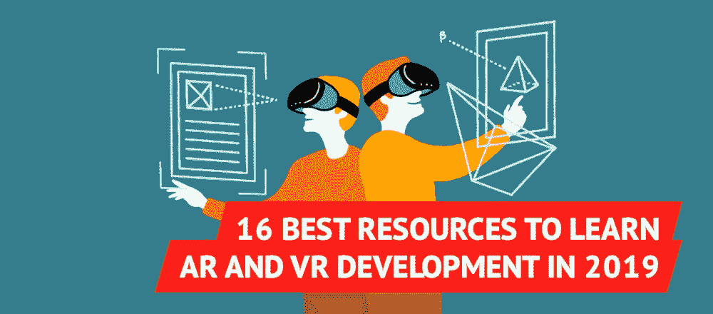

# 2019 年学习 AR 和 VR 开发的 16 个最佳资源

> 原文：<https://medium.com/hackernoon/16-best-resources-to-learn-ar-and-vr-development-in-2019-a4fceea6281c>

*在制作*[*【geek forge】*](https://geekforge.io/)*——有趣的编码任务的每日列表——时，我们研究了几个可以让你学习 AR 和 VR 开发的来源，我们认为与你分享这个列表是个好主意。*

增强现实和虚拟现实对大多数人来说都是一个谜，直到 [Pokémon GO](https://www.engadget.com/2018/09/12/pokemon-go-users/) 向我们展示了 AR 如何扩展游戏功能，以及 [Oculus](https://www.wareable.com/vr/why-oculus-go-won-vr-ar-innovation-2018-6850) 如何将耳机从一个愚蠢的设备转变为一个无限的游乐场。

目前，娱乐似乎是这项技术的主要用途，但随着时间的推移，它将对许多其他领域变得越来越重要，如外科手术训练、远程教育或军事和太空训练。在这些领域中的任何一个成功的实现都可能在技术使用的历史上留下重大的凹痕。

根据最近的一些[研究](https://www.applause.com/blog/virtual-reality-hobby-developers-vision-mobile)，少数有勇气尝试 AR 和 VR 开发的开发者只是将其作为一种业余爱好。为了让技术变得足够成熟来处理我们社会的实际问题，我们需要更多有奉献精神的人。我想在这方面帮你一把，并提供一份精心挑选的最佳资源清单，它不仅能让你起步，还能让你超越“仅仅是爱好”的阶段。

## 1)[Coursera 增强现实入门](https://www.coursera.org/learn/augmented-reality)

本课程将教授您使用混合和增强现实(MAR)技术开发移动应用程序的基础知识。

## 2) [在中央课堂上介绍增强现实和 ARCore](https://www.classcentral.com/course/coursera-introduction-to-augmented-reality-and-arcore-11596)

本课程将教你增强现实(AR)的基础知识，以及如何使用 ARCore 构建增强现实体验。

## 3) [来自 GeekForge 的 AR 和 VR 编码任务每日邮件列表](https://geekforge.io/)

可以独立解决任务，也可以和社区讨论。这是你学习新技术的最好方式，同时也是你完成任务的最好方式。

## 4)[Udemy 上 Unity 增强现实初学者指南](https://www.udemy.com/augmented_reality_with_unity/)

通过集成 ARKit 和 ARCore for iOS 和 Android，学习使用 Wikitude 创建移动 AR 应用程序。

## 5)[AR&Coursera 上的视频流媒体服务新兴技术](https://www.coursera.org/learn/ar-technologies-video-streaming)

本课程的目标是教授最先进的 AR、Skype 和 YouTube 多媒体产品和服务中使用的所有重要技术。

## 6) [在 Udemy 的 Unity IoTAR 中使用增强现实的物联网](https://www.udemy.com/internet-of-things-using-augmented-reality-and-unity-iotar/)

本课程使用粒子光子上的 Vuforia 和 Unity 教授物联网的实用 AR。

## 7)[uda city 虚拟现实简介](https://www.udacity.com/course/introduction-to-virtual-reality--ud1012)

本课程是为刚接触虚拟现实并希望了解虚拟现实技术原理的学生设计的，包括光学、显示、立体视觉、跟踪和主要硬件平台。

## 8) [虚拟现实如何在 edX 上工作](https://www.edx.org/course/how-virtual-reality-works-2)

通过用 WebVR 编写简单的 VR 程序，了解虚拟现实技术的工作原理。

## 9)[Skillshare 上的 VFX 和虚拟现实理论基础](https://www.skillshare.com/classes/VFX-and-Virtual-Reality-Theory-Basics/1846162574)

这门理论课程将帮助你很好地理解虚拟现实是如何与视觉特效(VFX)行业联系在一起的。

## 10)[Lynda.com 虚拟现实基金会](https://www.lynda.com/CAD-tutorials/Virtual-Reality-Foundations/574683-2.html)

加入 3D 艺术家克莱格·巴尔对虚拟现实的概述:它是什么，它用在哪里，以及虚拟现实的未来是什么。

## 11)[Lynda.com 开发者虚拟现实概述](https://www.lynda.com/Software-Development-tutorials/Virtual-Reality-Overview-Developers/601787-2.html)

在这个课程中，学习如何开始为 VR 开发。Michael House 为您提供了使用 Google VR for Android 解决许多不同 VR 项目所需的知识和技能。

## 12) [虚拟现实书籍:亚马逊以人为中心的虚拟现实设计](https://www.amazon.com/VR-Book-Human-Centered-Virtual-Reality-ebook/dp/B01JV1LAZW)

这本书关注的是虚拟现实的人的因素，而不是技术实现。

## 13) [虚拟现实内幕:亚马逊虚拟现实行业指南](https://www.amazon.com/Virtual-Reality-Insider-Guidebook-Industry/dp/0990999920)

这本书采用了一种实用的方法，描述了虚拟现实领域的现状，以及该领域正在进行的不同产品和研究。

## 14) [虚拟&LinkedIn 的 3D 增强现实](https://www.linkedin.com/learning/virtual-augmented-reality-for-3d-weekly)

在这个每周系列中，3D 艺术家和专家克莱格·巴尔探索了不同种类的沉浸式现实。

## 15) [在 edX 上创建虚拟现实应用](https://www.edx.org/course/creating-virtual-reality-vr-apps-2)

了解在 Unity 3D 中开发您自己的专业 VR 应用程序的工具和技术。

## 16) [虚拟现实 TED 在 YouTube 上演讲](https://www.youtube.com/results?search_query=virtual+reality+ted+talks)

在这些演讲中，你会发现虚拟现实体验如何影响培训和发展、医疗保健，甚至我们自己的自我认知。

虚拟现实是一项新兴技术。虽然许多其他技术在早期已经找到了他们的专家，但开发者仍有空间在 AR 和 VR 领域占据一席之地。你想成为这个领域的专家之一吗？你可以从一个视频课程、一本书开始，或者在 GeekForge 上注册自己的日常任务。该起床做点什么了！