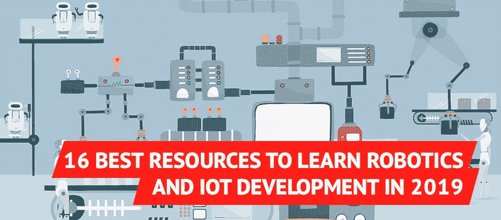

# 2019 年学习机器人和物联网开发的 16 个最佳资源

> 原文：<https://medium.com/hackernoon/16-best-resources-to-learn-robotics-and-iot-development-in-2019-847bb93c9bd9>

*在制作*[*【geek forge】*](https://geekforge.io/)*——有趣的编码任务的每日列表——时，我们研究了几个可以让你学习机器人和物联网的来源，我们认为与你分享这个列表是个好主意。*

虽然第一台智能设备可以追溯到 1982 年(一台[可口可乐自动售货机](https://thefutureofsmart.wordpress.com/2014/10/04/the-first-iot-device-a-coke-machine/))，但机器人和互联网供电的电器几十年来一直被认为是科幻小说。直到今天，将近四分之一的美国家庭拥有智能音箱。一个人形机器人索菲亚甚至在沙特阿拉伯获得了公民身份。

机器人和物联网，从开发者的角度来看，只不过是硬件能力更强的计算机。如果你由于缺乏物理知识或所需设备所需的财务投资而故意忽视它的创新，你很快就会发现，如今你可以学习所有的基础知识，而根本不需要金钱投资。

为了向你证明这一点，我创建了一个最佳资源列表，你可以用它来开始你的旅程，了解现在已经发生的最重要的技术创新之一:从无人机送邮件到冰箱[订购](https://www.theverge.com/2016/1/5/10708380/samsung-family-hub-fridge-mastercard-app-groceries-ces-2016)食物和无人驾驶汽车！

## 1) [麻省理工学院机器人简介](https://ocw.mit.edu/courses/mechanical-engineering/2-12-introduction-to-robotics-fall-2005/)

本课程提供了机器人机制、动力学和智能控制的概述。

## 2) [CS223A —斯坦福大学机器人简介](https://see.stanford.edu/Course/CS223A)

本课程以标准的讲课、阅读和习题集的形式呈现。

## 3) [来自 GeekForge](https://geekforge.io/) 的机器人和物联网编码任务每日邮件列表

可以独立解决任务，也可以和社区讨论。这是让你学习新技术并建立你已完成任务的文件夹的最好方法。

## 4) [在 edX 上介绍自主移动机器人](https://courses.edx.org/courses/course-v1:ETHx+AMRx+1T2015/5b151c51e8bf47c29d97f8a12369df17/)

本课程的目标是提供开发在复杂环境中自主行动的移动机器人所需的基本概念和算法。

## 5) [亚马逊介绍自主移动机器人](https://www.amazon.com/Introduction-Autonomous-Mobile-Intelligent-Robotics/dp/0262015358/)

这本书向读者介绍了移动机器人的基础知识，包括机械、运动、感觉、知觉和认知层。

## 6) [机器人力学与控制，edX 第一部分](https://www.edx.org/course/robot-mechanics-control-part-i-snux-snu446-345-1x)

本课程提供了机器人力学和控制的数学介绍，这些机器人可以用运动链来建模。

## 7) [亚马逊的机器人运动原理](https://www.amazon.com/Principles-Robot-Motion-Implementations-Intelligent/dp/0262033275)

这篇文章反映了在过去的十年里动态和非完整系统发生的巨大进步。

## 8) [美国宇航局的机器人联盟项目](https://robotics.nasa.gov/links/resources.php)

补充国家(机器人)技术专家和专业知识的供应。

## 9)[Coursera 的机器人专业](https://www.coursera.org/specializations/robotics)

了解开始机器人职业生涯的基础。通过编程机器人在危机管理等情况下的表现来获得经验。

## 10) [物联网基础:LinkedIn 基础](https://www.linkedin.com/learning/iot-foundations-fundamentals)

在本课程中，从技术角度了解什么是物联网及其工作原理。

## 11)[Coursera 的物联网开发者指南](https://www.coursera.org/learn/developer-iot)

本课程是开发和部署物联网解决方案的入门级介绍。

## 12) [物联网—在 Skillshare 进行在线自学](https://www.skillshare.com/classes/Internet-of-Things-Online-Self-Learning/2060012399)

本课程将帮助您获得足够的物联网知识。

## 13) [物联网与云艾莉森](https://alison.com/course/internet-of-things-and-the-cloud)

本课程将快速教会你关于云计算和物联网整合的最重要的细节，这将为你的计算机编程生涯提供坚实的推动力。

## 14) [物联网安全:全景图](https://www.pluralsight.com/courses/security-internet-of-things-big-picture)

本课程将向您介绍物联网领域普遍存在的基本风险，以及评估和减轻这些风险所需的技能和技术。

## 15) [低级软件安全:YouTube 上的攻击与对策](https://www.youtube.com/watch?v=ZLZkf8FVcsU)

本模块通过示例介绍常见的低级安全问题和解决方案。

## 16) [机器人 TED 演讲](https://www.ted.com/topics/robots)

这些 TED 演讲提供了精彩的演示和严肃的想法，关于我们与机器人不断发展的关系。

机器人还没有像科幻电影想象的那样出现，但智能设备独立思考在今天绝对是现实。你想推出下一款能让我们生活更轻松的设备吗？你可以从视频课程、YouTube 系列或者在 GeekForge 上注册日常任务开始。什么都比整天坐以待毙强。