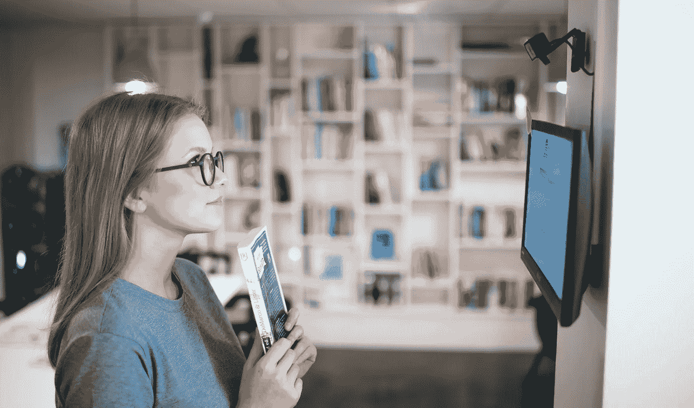

# 你不知道的面部识别的 18 个惊人用途

> 原文：<https://medium.com/hackernoon/18-surprising-uses-of-facial-recognition-you-didnt-know-existed-af18244ac88>

Image source: helmes.com

技术的新进步导致了面部识别技术的广泛使用。越来越多的企业和组织正在使用技术，因为它速度快，需要最少的用户交互。它主要用于安全目的。许多使用这种技术的企业和家庭都试图确保只有经过授权的人才能进入特定区域或访问某些设备。

但是你会惊讶地发现这项技术的许多其他用途。这里有一些你可能不知道存在。

# 寻找失踪人员

面部识别系统使用数据库添加失踪人员的照片。当有可能匹配时，该系统向执法者发出警报

# 早期威胁检测

美国海关官员使用面部识别技术检查护照的有效性。联邦调查局也有一个检查可疑人员的系统。

美国有警察可以用他们的手机检查嫌疑人的身份。他们可以用这些照片与已知罪犯的数据库进行交叉比对。

# 自动乱穿马路罚款

在中国，警察在公共场所佩戴配备人脸识别技术的眼镜。当配备人脸识别的监控技术识别出乱穿马路的人时，他们会被自动罚款并通过短信通知。

# 图书借阅/图书馆

一家公司创造了一个内置人脸识别的图书借阅图书馆系统。系统扫描持有借书的员工并更新其数据库。同样的解决方案可以用于公共或学校图书馆，使借阅过程更快、更令人兴奋。

# 充满信心的银行业务

面部识别为 ATM 交易增加了一层安全保障。

这是为了验证持卡人的身份。

西班牙和中国最近引进了具有人脸识别功能的自动取款机。这使得客户无需使用银行卡就可以从账户中提取现金。只有时间才能证明面部扫描是否会很快取代 ATM 卡的使用。

# 赌场当场抓获骗子

赌场使用面部识别来识别潜在的骗子。他们还使用该系统跟踪黑名单上的赌徒。这种安全措施使得算牌更加困难。

# 体育和娱乐活动

面部识别技术在音乐会和体育比赛中的需求越来越大。这部分是由于公共活动中的恐怖袭击事件越来越多。面部识别系统可以检查观众是否有犯罪记录。

一些场所使用系统信息向常客提供更好的交易。

出席的名人也可以用这项技术检测出来。

# 带自拍的网购

人脸识别可以验证使用智能手机进行在线购物的人的身份。系统在核实其数据库中的买方信息后确认交易。

# 零售店

一些零售店开始在其服务中使用面部识别技术。顾客可以通过扫描面部来支付他们的商品。然后，系统将照片与客户数据库中的账户联系起来。一些商店也使用这种技术来检测商店扒手。该系统还可以检测出过去有过不良行为的人。

# 酒吧罚款

有几家酒吧开始使用人脸识别软件。这使得他们能够发现使用假身份证购买酒精和香烟的青少年。这阻止了未成年人饮酒和使用非法物质。

# 饭店

肯德基在中国的一家分店使用人脸识别技术接受付款。顾客通过对着装有该技术的屏幕微笑来付款。系统检查其数据库，并要求输入电话号码以进行额外的安全检查。

# 医院

中国的一家医院使用人脸识别来接受医疗账单的支付。个人需要创建一个初始配置文件供系统使用。

# 学校

英国有些学校已经采用人脸识别技术来跟踪出勤情况。这项技术也被用来确保课堂秩序。该系统还可以检测对学校构成潜在威胁的外来人员。这可能会防止未来的枪支袭击。

# 智能汽车

新一波的汽车现在配备了人脸识别软件。这使得车辆只有在识别出驾驶员后才能启动。该系统包括检查驾驶员警觉程度的安全功能。

# 酒店预订

已经有酒店使用人脸识别扫描回头客。系统检索客人的个人资料和偏好。这使得酒店工作人员能够给予客人更加个性化和热情的问候。

选择有人脸识别技术的酒店。这些售货亭向客人发放房间的钥匙卡。

# 约会网站

由于社交媒体，在网上寻找潜在伴侣已经变得流行起来。一些约会网站现在提供面部识别来匹配具有相似属性的人。虽然有些网站报道了非人类比赛的投诉:)

# 机场登机

几个机场在运营中引入了面部识别。这使得行李托运和登机过程更加方便。

该系统使用乘客的护照照片与数据库进行核对。只有当系统中有匹配时，才允许乘客值机和登机。

# 识别宠物！

面部识别也用于识别你的宠物品种。这种能力也使得寻找失踪的宠物成为可能。

**总之**

人脸识别远非完美。不同的面部表情和光线条件可能会影响软件的准确性。

这项技术只有在拍摄对象面向前方时才能正常工作。太远的物体也可能变得系统难以识别。但是人工智能和面部识别的进步仍在继续发展。这些发展将解决不准确之处。

越来越多的应用是为面部识别开发的**。**选择只受限于你的想象力和技术不断增强的能力。