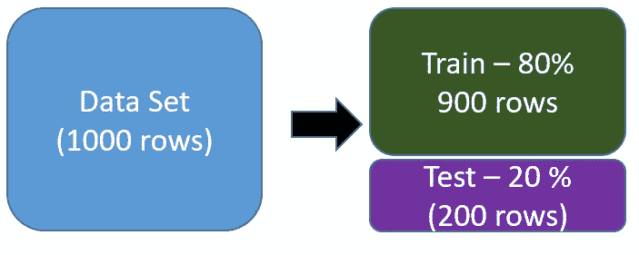
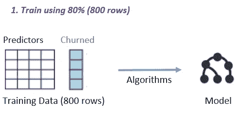
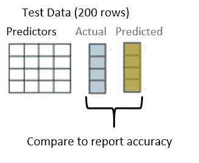

# 训练预测分析模型时要避免的两个新手错误

> 原文：<https://medium.com/hackernoon/2-rookie-mistakes-to-avoid-when-training-predictive-analytics-models-ecc570be123a>

预测分析的工作原理是学习应用程序历史数据中存在的模式，然后使用这些模式来预测未来的结果。当你输入不同结果的数据时，你就训练了算法——通过将它们与实际结果进行比较来定期测量预测的准确性是很重要的。

**在训练你的预测分析模型时，小心这两个新手的错误:**

# 错误#1:在用于训练的相同数据上测量准确性

假设你正在使用 2017 年和 2018 年的客户流失数据来训练你的预测分析模型。如果你然后将这些预测与你在 2017 年和 2018 年看到的实际结果进行比较，这就好比在实际考试之前看到一份考试的副本。您将在测试中胜出，您的预测分析模型也是如此。

为了正确地训练您的模型，您需要将您的数据分成两组:训练数据和测试数据。使用训练数据来训练模型，并且仅在测试数据上测试准确性(该算法在训练期间从未看到)。还有其他技术，比如交叉验证等，我将在本文中跳过

在这个客户流失示例中，您可以使用 2017 年的数据进行训练，以测试模型并根据 2018 年的数据测试预测。或者，假设您的数据集中有 1000 行。使用 80%的数据(800 行)对 20%的数据(200 行)进行定型和测试。。关键是，你正在寻找的测量精度的数据不应该被算法看到。

现在，您既有 200 行测试数据的实际结果，也有使用培训步骤中的模型预测的 200 行结果。你可以比较这两者来衡量准确度。

如果 200 行中有 160 行被正确预测，那么您的预测模型的准确性是 160/200，即 80%的准确性。

# 错误 2:未能认识到数据不平衡

数据不平衡是任何预测分析难题的重要组成部分，并且您无法在标准准确性评估中衡量它。数据不平衡会导致预测模型出现错误偏差。

让我们以欺诈检测为例。假设你 95%的交易不是欺诈性的。如果你的算法将 100%的交易标记为“非欺诈”，它仍然有 95%的正确率。一个 95%准确的算法可能看起来很可靠——但它仍然有 5%的时间是错误的，在欺诈的情况下，这 5%可能会让银行破产。

如您所见，数据中的不平衡会导致有偏差的预测模型。这是难题的一个重要部分，在标准的精度度量中没有被捕获。这就是我们需要处理其他指标的地方，比如敏感性、特异性等，我们可能会在后续文章中涉及到。