# 20 个值得关注的最佳网页设计和开发博客

> 原文：<https://medium.com/hackernoon/20-best-web-design-and-development-blogs-to-follow-e740c825d5b>

Website Design & Development (Photo Credit: Unsplash)

## **1。粉碎弹匣**

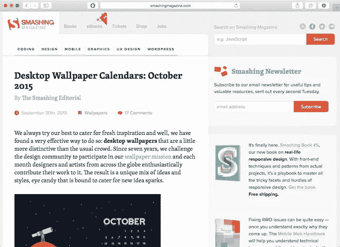

Smashing Magazine 博客解释了与网页设计和开发相关的不同主题。它们包括排版，HTML 和 CSS，网页设计等等。你需要买一张非常棒的会员卡，这样你才能获得一系列电子书。这个博客信息量很大，网络专业人士不能忽视。这个网站对想要掌握前端 web 开发的人非常有用。

## **2。网页设计师仓库**

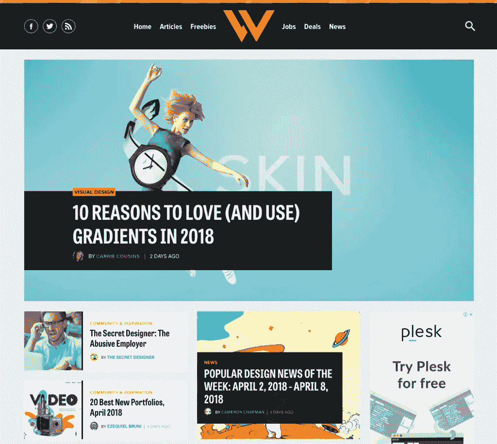

Web Designer Depot 博客提供以下服务:

*   自由职业活动
*   易接近
*   用户体验
*   设计

这个博客有最好的作家，他们为客户提供优质服务。大多数作家是真正的设计师，因此你有一个优质服务的保证。

## **3。站点点**

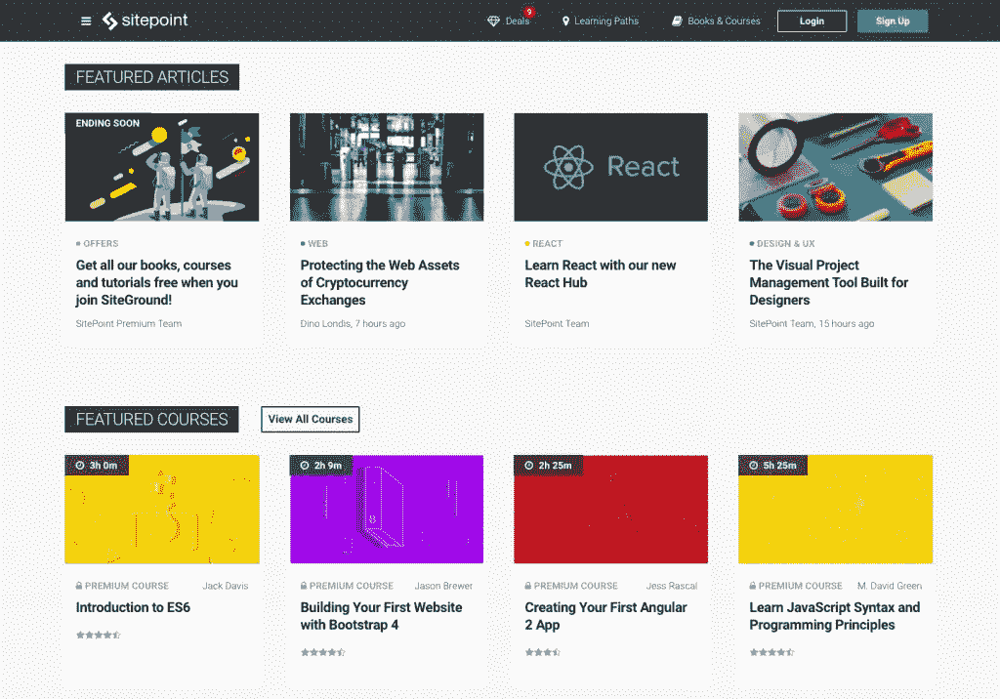

SitePoint 博客为有志成为开发者、产品创造者、设计师和程序员的人提供学习机会。它包含以下主题:

*   Java Script 语言
*   引导程序
*   高级 CSS
*   有角的

如果你想提高你的编码技能，那么你需要注册一门课程。这个博客也提供广告服务。

## **4。导师**

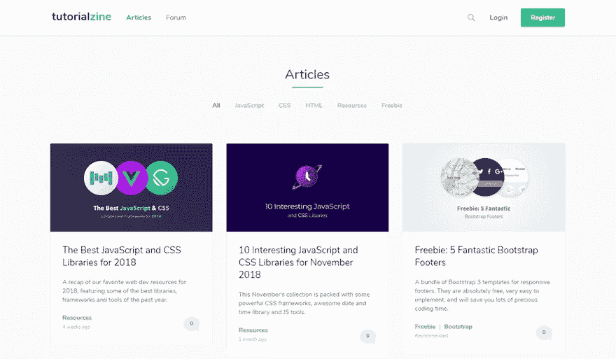

Tutorialzine 博客为读者提供高质量的教程和文章。它提供完全免费的文章。以下是本博客的主题:

*   半铸钢ˌ钢性铸铁(Cast Semi-Steel)
*   Java Script 语言
*   超文本标记语言

他们还提供重要的免费赠品和资源。要阅读这个博客上的所有文章，你需要每周订阅 DevAwesome。这份时事通讯有图书馆和编程新闻。

## **5。Webpagefx**

Webpagefx 博客是为搜索引擎优化，网页设计师和网页开发人员。在这个面向网络专业人士的博客中，有许多与网页设计和开发相关的教程。作者是专业网站设计者和开发者。他们会在两到五天内发布新内容。内容非常有教育意义，尤其是对那些想要提高技能的新网页设计者和开发者。博客通常发布可读性很强的内容。

## **6。Speckyboy**

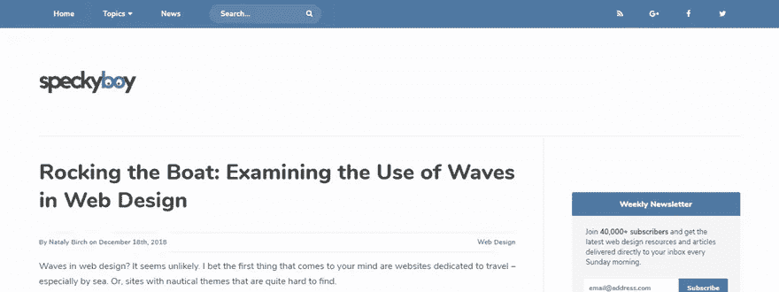

Speckyboy 博客是关于 UX 设计，JavaScript，CSS 和其他有用的技术。博客也涵盖了用户和设计师之间存在的任何重要关系。它提供了关于网络技术变化的深刻信息。前端开发人员可以获得至关重要的信息，尤其是来自行业的最新消息。

## **7。大卫·沃尔什**

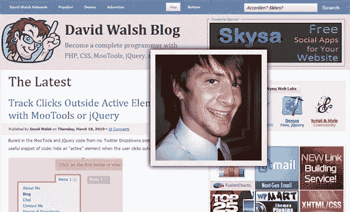

David Walsh 个人博客总是专门针对 web 发布不同后端技术和前端技术的文章。

## **8。Onextrapixel**

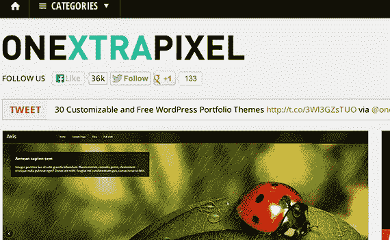

Onextrapixel 博客始终专注于网站的设计和开发。这个博客的内容是互补的意思，在一天结束的时候，他们有一个目标，那就是创建最好的网站。这个博客提供教程、文章和许多其他有用的资源。这个博客讨论的主要话题包括社交媒体、CSS、设计、工具包、图形和 WordPress。你会在这个博客上找到关于 HTML5 和其他文章的有用提示。

## **9。Mockplus 博客**

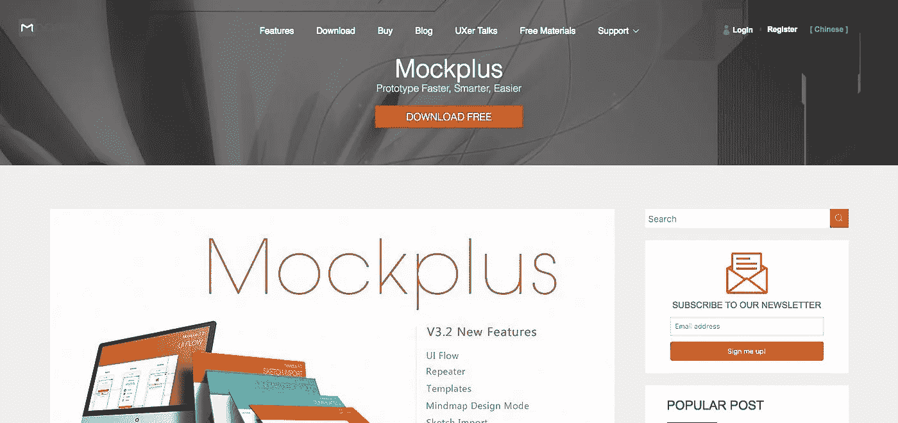

Mockplus 博客关注原型工具。这个博客有丰富的资源和其他网页设计模板，有助于网页开发。虽然这个博客的重点是原型，但它的内容激励了许多 web 开发人员。阅读博客可以成为网站开发者的基础，尤其是从原型设计开始。

## **10。Github**

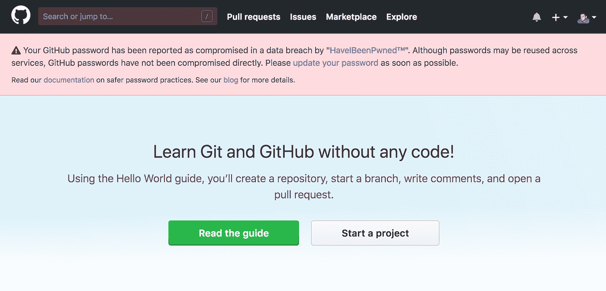

Github 平台是用于代码托管的。你通过与公众分享你的代码来邀请他们参与。您从不同的开发人员那里获得代码提交，然后共享他们的工作成果。这个博客的好处是你可以从其他开发者那里学习想法。此外，你可以学习其他开发者的代码，从而共同进步。

## **11。诺佩**

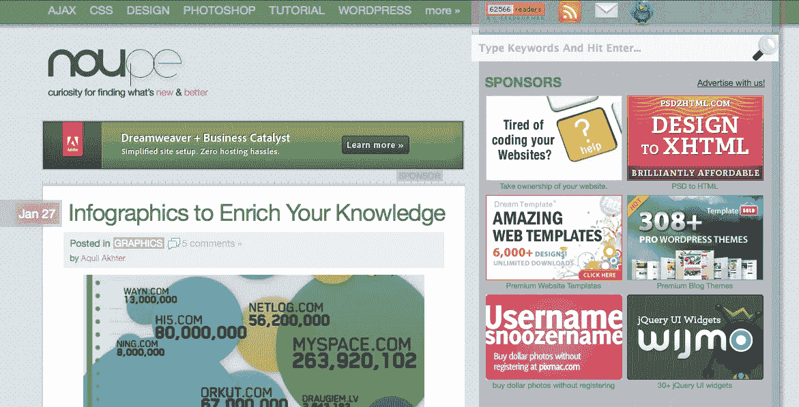

Noupe 博客专注于独立网络开发。它还关注语言开发和教程的分类。它有网页设计者和开发者使用的最新工具和教程。它涵盖了设计的不同方面，包括 JavaScript 网页设计和图形，CSS 和广告。

## 12。设计小屋

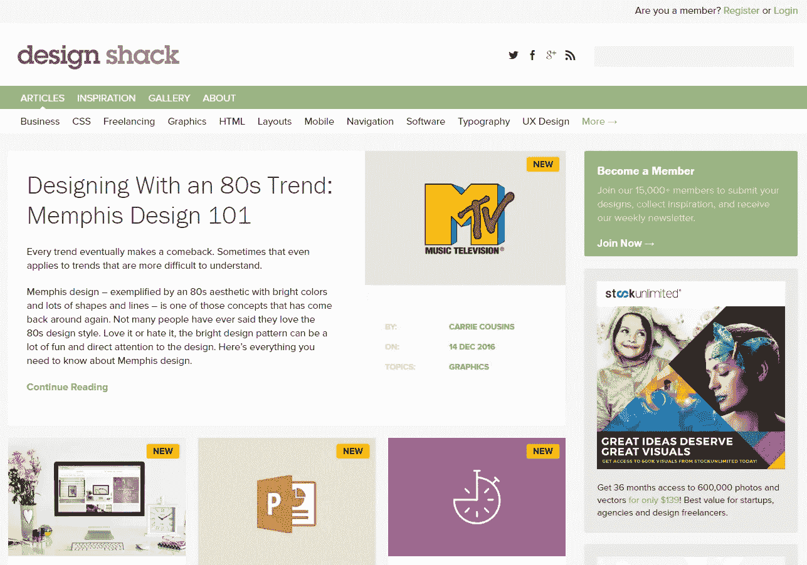

Design Shack 是一本面向网页开发者和设计师的杂志。该网站提供印刷、商业、网页设计和平面设计方面的出版物。它也发表关于如何在这个行业工作的文章。它有可用的资源来帮助你创作[最佳网站设计](https://dev.to/sandeepsinghmehta/5-ways-to-have-a-more-appealing-website-design-2a5h)作品。

## **13。CSS 作者**

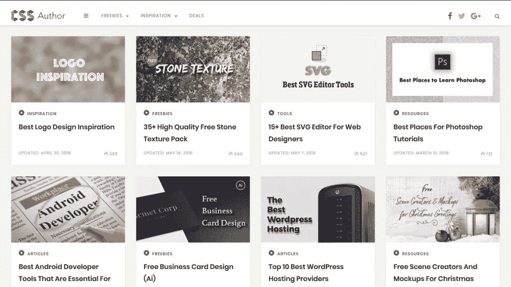

CSS 作者网站充满了免费的东西，如壁纸，模板和图标。这个博客提供免费的 PSD 设计资源、日常设计灵感、教程、文章和新的[网站设计趋势](https://hackernoon.com/where-web-designing-is-going-in-2019-a12c6ac59441)。你可以从不同的关于网页设计和开发的分享文章中学到新的技能和技术。

## **14。设计模式**

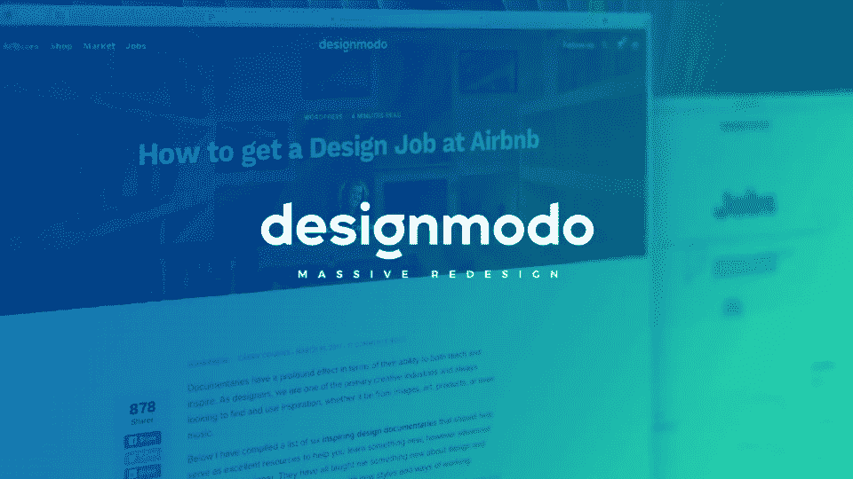

Designmodo 网站专注于不同主题的文章，如教程、编码、灵感、设计和 WordPress。这个博客也参与了网站开发者电子邮件的创建。同时也提供 Designmodo 工作和 Designmodo 市场服务。

## **15。网页设计分类账**

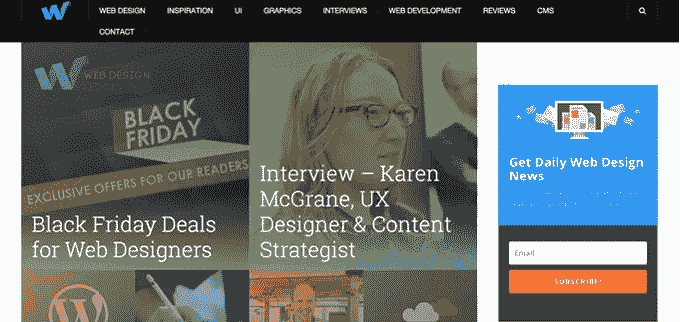

Web 专业人员撰写本出版物，主要面向 web 设计人员和开发人员。网页设计是为企业，可穿戴设备，手机和投资组合。它还提供了以下主题:

*   用户界面
*   网页开发，如 JavaScript 和 PHP
*   制图法

## 16。创意博客

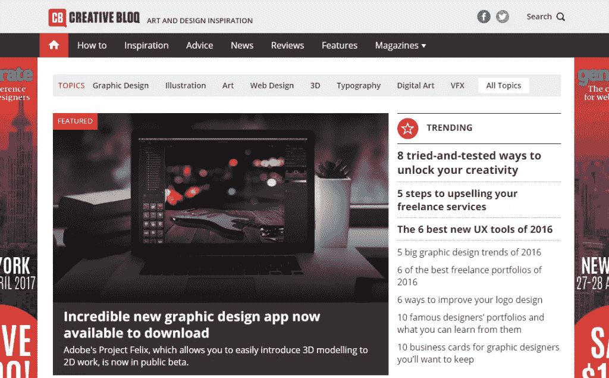

Creative Bloq 为网页和平面设计师、传统和 VFX 艺术家以及 3D 艺术家提供建议和灵感。观众可以从 Creative Bloq 获得最好的创意作品。你也可以从这个网站获得有见地的信息，尤其是关于网页设计的当前趋势。以下是本网站的主要主题:

*   java 描述语言
*   UX
*   半铸钢ˌ钢性铸铁(Cast Semi-Steel)
*   三维建模
*   后轮驱动

## **17。下一张网**

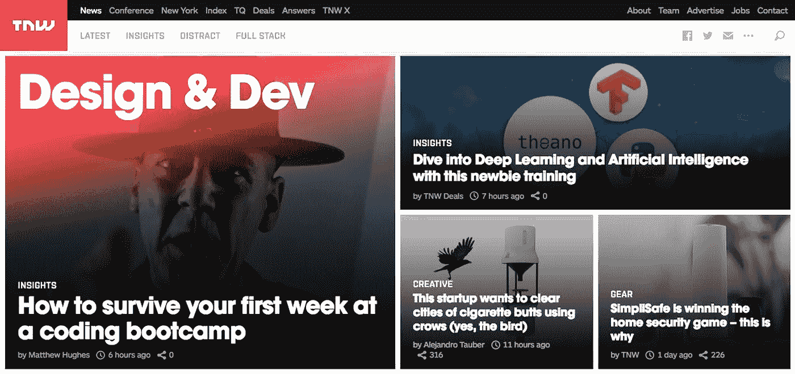

这个网站的重点是让人们深入了解技术世界。它是为了宣传这次会议而特意创建的。以下是这个网站的支柱

*   TNW 会议
*   收件人和索引
*   智能平台
*   TNW 新闻

## **18。Hongkiat**

这个博客的重点是设计和灵感内容。它还关注技术。他们还提供教程、工具推荐和技术。它对网页开发者和设计者、博客作者和图形设计者都是有用的信息。

## 19。Tuts+网页设计

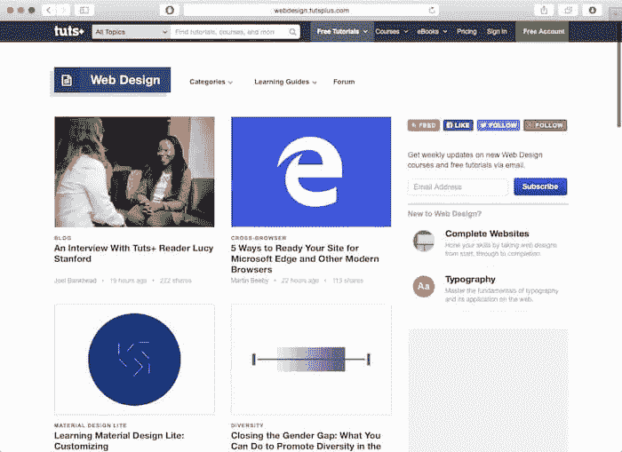

它有学习指南和教程，你可以用来学习如何设计一个网站。它包括以下内容:

*   UX 运动设计公司
*   商业
*   前端开发
*   易接近

## **20。Tuts+代码**

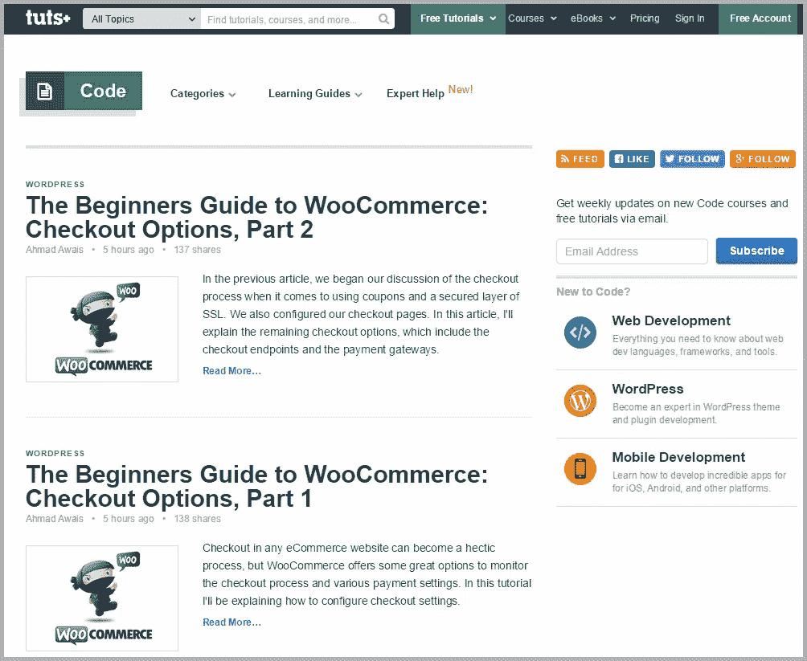

Tuts+ code 是一个学习中心，提供课程、教程和电子书来帮助你学习网页设计。它涵盖以下主题:

*   商业
*   网页设计
*   视频和照片
*   编码

作为一个设计师和开发者，你应该有一个学习的心态。只有通过学习，你才能成为专家。上面讨论的 20 个网页设计和开发博客将帮助你提高你的技能。

**作者简介**

[**Sandeep Mehta**](https://www.sandeepmehta.co.in/services/freelance-website-designer-delhi/)**是一位拥有 5 年以上经验的自由网站设计师、网站开发者和 SEO 专家。大多数情况下，我喜欢写我通常创造的不同的工作经验，案例研究和最新的网站设计趋势，这对观众是有用的。**