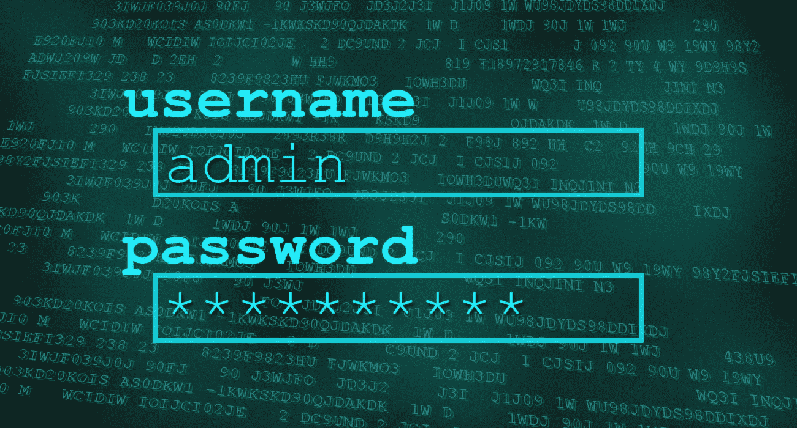
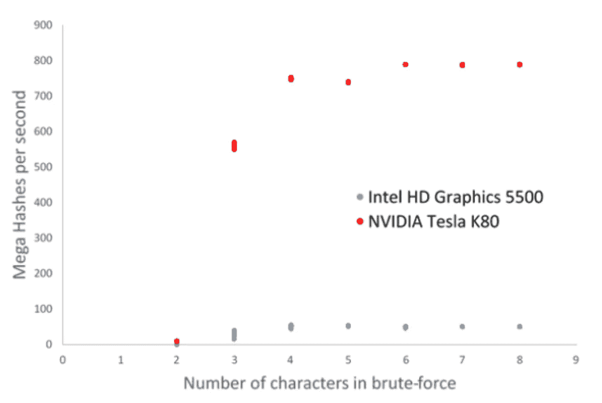
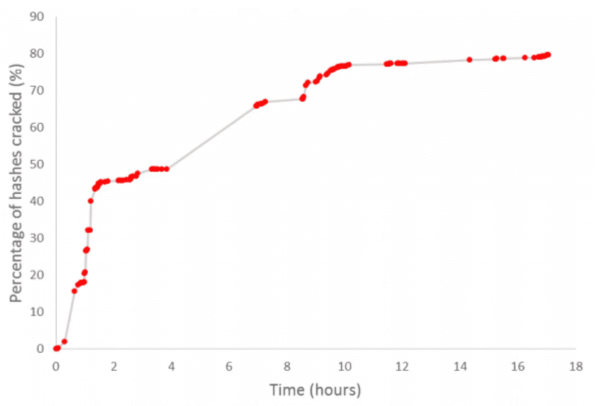

# 20 小时，1800 万美元和 1100 万美元的密码被破解

> 原文：<https://medium.com/hackernoon/20-hours-18-and-11-million-passwords-cracked-c4513f61fdb1>

## 轻松破解密码

多年来，我一直对密码提供的安全性以及攻击密码保护账户的方法感兴趣。所以我想看看普通的开发者在没有专业知识的情况下如何成功破解数百万个密码。

道德黑客攻击:本实验中使用的真实世界的密码被黑客攻击并在网上泄露，黑客不是我本人。这些密码现在可以在网上免费获得。像这样对泄露的密码进行虚拟攻击，使我们能够教育个人他们的密码所提供的保护，因此可以帮助他们免受真正的攻击。在开展工作之前，我从泄露的文件中剔除了所有个人身份信息。**

人们使用密码来保护网上的几乎所有东西:从电子邮件到银行账户，再到加密交易账户。虽然许多网站现在提供双因素身份验证(“2FA”)的使用，但这通常没有公开或强制执行，大量网站仍然根本不提供 2FA。因此，提供的安全密码对于保护人们的身份和金钱至关重要。

自然，密码背后存储的价值激发了许多针对密码的攻击。你可以阅读大量关于复杂密码破解算法的研究论文，这些算法使用复杂的概率和机器学习技术，可以破解超过 90%的密码。

虽然这些算法有多好令人害怕，但它们感觉不像是对普通人群的非常现实的威胁——有多少人真正知道如何进行这些攻击？他们为什么要针对我？！因此，我决定研究一种更加现实的攻击:攻击者知道如何创建 AWS 实例(或其他云实例)，并可以在其上运行一些开源软件。

如果你已经知道密码散列法，请跳过“*背景简介:存储密码”*。如果你知道针对哈希的离线攻击，请跳过*‘背景简介二:攻击哈希’*。

## 简要背景:存储密码

当登录到受密码保护的应用程序时，*出现*的事件顺序如下:

1.  用户输入密码(密码将被发送以供批准)
2.  将输入的密码与记录的密码进行比较
3.  如果匹配，则授予访问权限

然而，像这样传输和存储密码是非常不安全的。为了增加安全性，许多系统(尽管遗憾的是不是所有系统)实际上将用户密码的'*散列'*'存储在数据库中，而不是密码本身。你可以把散列想象成密码不可逆的混乱；如果攻击者发现了密码的散列，他们就不能逆转发现密码本身的过程。

当用户在这样的系统中输入密码时，事件的实际顺序如下:

1.  用户输入密码
2.  *哈希(密码)*在本地计算并传输哈希
3.  将该散列与记录的散列进行比较
4.  如果匹配，则授予访问权限

## 简要背景 II:强力散列

在使用散列的系统中，如果攻击者设法得到了密码数据库，他们仍然看不到用户的密码。针对此类系统的攻击无法通过反转散列来找到相应的密码，因此会如下进行:

1.  猜密码
2.  计算这个猜测的散列值
3.  将它与真正的哈希进行比较
4.  重复步骤 1–3，直到找到匹配项

这听起来相当耗时，但是对于一台可以并行猜测数千个密码的机器，你可以想象事情开始加速。

# 袭击

## 软件

我用的软件叫 Hashcat，是一个高级的密码恢复工具，被誉为*“世界上最快的密码破解者”*。Hashcat 是[开源的](https://github.com/hashcat/hashcat)，可以从他们的[网站](https://hashcat.net/hashcat/)下载源代码和二进制文件，并且有一个广泛的 [wiki 指南](https://hashcat.net/wiki/)到这个工具。可以肯定地说，你不必成为使用它的专家。

## 五金器具

我在 Nvidia Tesla K80 上运行 Hashcat，这是一款具有 4992 个核心的 GPU，你可以在 AWS 上以每小时 0.90 美元的价格租用(P2.xlarge)。我从查看 K80 的哈希功能开始，只是为了看看它与标准的内置笔记本电脑 GPU 相比如何。

K80 的速度是普通英特尔显卡的 16 倍。K80 每秒可以计算大约 8 亿次 SHA-256 散列……也就是说每小时将近 3 万亿次。

## 密码

如前所述，我运行攻击的密码是被一个攻击者在网上泄露的。在这次攻击中，有超过 1400 万个密码被泄露，所有这些密码都是由真实世界的用户创建的。我不会提供密码的链接——没有必要不必要地分享它们——但是我很容易通过谷歌搜索找到它们。

## 我攻击的逻辑

虽然 Hashcat 允许您执行简单的暴力攻击(尝试指定长度的每一个可能的密码)，但是它们也有用于稍微复杂一些的攻击的命令。众所周知，大多数人的密码都是基于一个单词，形式多样:

*   只是一个词(可能有不同的大写)——**密码**
*   一个单词后面跟着一些数字/符号——**猴子！**或**咖啡 12**
*   应用了' *leet speak'* 的单词— **p4ssw0rd** 或 **f4c3b00k**
*   多个单词粘在一起— **是不安全的**

真是太巧了…如果你能在一个文件中提供一个单词列表，Hashcat 内置了不同的模式，可以猜测:

*   每一个字
*   附加了每个可能的数字/符号的每个单词
*   应用了指定规则的每个单词(即“用 0 替换每个 0”)
*   每个单词组合粘在一起

所以我下载了一个包含数百万英语单词的字典文件，用于我的攻击。

从那里你可以得到一点更通用的东西，指定 Hashcat 应该尝试的“掩码”。这意味着，你可以尝试“6 个小写字母后跟 2 个数字”的所有密码，而不是告诉 Hashcat 尝试“所有长度为 8 的密码”——这是 7 万亿种不同的组合。

## 那么这次攻击效果如何呢？

老实说，这比我想象的要成功得多。实际上非常成功…

*   2 小时:48%的密码被破解
*   8 小时:将近 70%被破解
*   20 小时:超过 80%已经被破解

## 行动呼吁

我来总结一下。

> 20 个小时。每小时 0.90 美元。那只是 18 美元。1400 万个密码中有 80%被破解。

让它深入人心。

太吓人了。真的很吓人。人们*需要*来使他们的密码更加安全。用“0”替换“o”，用“3”替换“e”*不会使您的密码安全。在单词末尾添加数字和符号也不行。太容易预测了。*

我不是安全专家——我不能给你一些规则，让你可以遵循，使密码不可破解。正是人们遵循可预测的规则才使得这些密码如此容易被破解。不可预测。或者更好的是，使用像 [LastPass](https://www.lastpass.com/) 或 [1Password](https://1password.com/) 这样的密码管理器，让你变得不可预知。