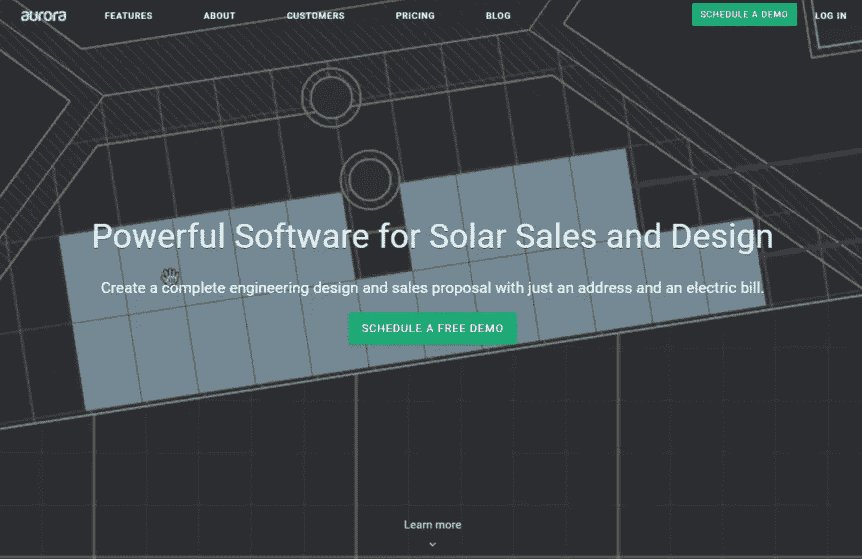

# Aurora Solar 的 2000 万美元 A 轮增长战略

> 原文：<https://medium.com/hackernoon/20-million-series-a-growth-strategy-with-aurora-solar-835007515e9c>

今天我们有一个有趣的创业公司。他们的名字是 [Aurora Solar](https://www.aurorasolar.com/) ,他们最近因在首轮融资中筹集了 2000 万美元而在新闻中引起轰动。

我给了[这篇 Techcrunch 文章](https://techcrunch.com/2019/02/04/aurora-solars-computer-generated-installation-maps-pull-in-a-20m-series-a/)一个快速阅读，并浏览了一下他们的网站，我必须说，我印象深刻。

他们产品的价值是显而易见的。他们解释得很好。他们的产品与市场的契合度似乎坚如磐石……主要是因为他们为市场设计了产品。

乍一看，我怀疑他们的下一阶段增长更多地取决于[产品/渠道契合度](https://brianbalfour.com/essays/product-channel-fit-for-growth)而非其他。这个价值一亿美元的问题是，追求什么样的最佳增长渠道？

# 在我们深入讨论之前，让我们回顾一下我在他们网站上找到的一些指标和工具。

# 网站流量:

Similarweb 显示他们每月的网站流量大约是 10 万次/月。太棒了。

# 这是我能够找到的插件、标签和像素的列表:

*   段
*   Sumome
*   轮毂点
*   谷歌优化
*   Linkedin 像素
*   脸书像素
*   优化地
*   混合面板
*   热罐
*   缓冲器
*   Hubspot 聊天
*   Pinterest 标签
*   Reddit 标签
*   对讲机
*   Zendesk
*   字体

其中一些是多余的，所以我猜他们在做了一点试验后循环使用工具。很高兴看到这一点。

从这个列表中可以看出，他们使用了很多合适的工具，并且拥有一支相当现代化的营销团队。那很好。

他们还购买了集客营销，这从他们使用 HubSpot 可以看出。这反映在他们强大的内容营销的努力。

我认为这是朝着正确的方向发展，他们应该在 2019 年加倍关注这一渠道。

这些标签的另一个好处是，他们可能会在谷歌广告、LinkedIn、脸书、Pinterest 和 Reddit 上发布广告。我也认为这是正确的举措。

总的来说，这是营销工作和工具的一个很好的基础。

# 接下来，这里是他们社交活动的简要总结

*   推特上有几千名粉丝
*   Linkedin 上有 2000 名粉丝
*   Youtube 上有 600 个 subs，视频上有像样的 traciton，更重要的是，他们有一个视频库，包括客户评价、产品演示等等
*   脸书上的 1k 粉丝

这是我在 15 分钟内收集的所有数据的大致概述。那么，让我们进入一些渠道思路和建议。我在他们的网站上也有几个推荐。

# 渠道理念:

## 谷歌广告视频(Youtube)广告

他们有一个很好的视频内容库来做广告，绝对应该利用这一点。

我希望通过内容营销和谷歌搜索广告，看到关键词定位的 Youtube 广告与他们定位的关键词相似。

视频广告很便宜，而且覆盖面很广。这将是一个非常划算的方式来花费他们的新资本，并达到大量的观众。

## 分层脸书视频外观和重新定位观众

这是我第一次在付费流量的艺术上听到的一个强有力的策略，如果你没有听说过的话，这是一个很好的播客。

它是这样工作的。

您将脸书受众设置为 A)与您的客户/潜在客户列表相似的受众，以及 B)基于您的网站 pixel 的目标受众。

从那里，你用一个漏斗顶端的视频来瞄准所有观众，旨在吸引观众中感兴趣的人。

例如，一个客户故事或行业专业知识片段将非常有用。

接下来，你只根据观看了你的第一个视频 50%以上的人来建立视频互动受众。

在购买者的旅程中，向这些观众提供视频。例如，案例研究和证明。

接下来，你重复播放*视频中 50%参与度的观众。*

向第三类受众发送漏斗底部视频，如产品演示和使用案例示例。

这种策略的目标是利用视频观众引导人们进行产品教育，并使你的观众合格。

## 一般情况下重定目标

我没有注意到像 AdRoll 或 PerfectAudience 这样的重定目标工具的像素。

他们可能正在本地运行脸书重定目标，但无论哪种方式，我都希望扩展到一个重定目标工具，其中也包括更广泛的库存和显示目标。

## LinkedIn 广告

我怀疑他们已经在根据我找到的像素运行这些了。

一定要保持下去。我认为他们的目标人物角色是以关键词和职位为目标的。

## 出站电子邮件

任何时候，LinkedIn 都是一个可行的渠道，这是一个很好的赌注，出站电子邮件是一个低成本的变化。

值得测试。

## 谷歌太阳能关键词搜索广告

我猜他们已经在这里投放广告了。

最好的关键词可能是这样的:

*   “太阳能电池板软件”
*   “太阳能电池板安装工具”
*   “商业太阳能装置”
*   等等。

## 坚持内容营销

他们的内容营销是一流的，显然是基于他们的网站流量。这里唯一要做的就是保持或加倍输出。

## 会议/活动

我怀疑这个行业有很多高质量的会议和活动。

太阳能电池板是可触摸的实物。制造商和供应商的贸易展似乎会自然而然地出现。

任何这样的活动对这些人来说都是完美的。

他们应该赞助，买一个摊位，举办庆功宴，设法得到电子邮件列表，等等。行业内的所有事件。

在投资回报率上下大赌注。

## 成长秘诀/各种想法

**社区建设。**太阳能安装公司和承包商——当然是脸书，可能是 LinkedIn。

我认为，如果他们能够建立一个自己的社区，帮助安装人员和承包商建立业务，并相互学习和向专家学习，将会释放出很多价值。

**改进定价策略** —我不喜欢两层和模糊的企业级。

也没有任何种类的可变单位来增加每个客户/用户的收入。

Hubspot 就是一个很好的例子。他们每月收取软件的基本费用，向你追加销售功能，并根据你数据库中的联系人向你收取费用。

我认为这些家伙可以从我们的男孩汤姆的 [SaaS 定价策略](https://tomtunguz.com/pricing-summary/)中学习一页，并提升他们的定价游戏。

当然，我们都知道更高的 ARPU 和 LTV 意味着更高的可接受的 CAC 成本…这是客户获取前端和后端的主要增长水平。

好的。综上所述，让我们继续过去的渠道策略。

# 网站改进:

以下是我认为他们可以在网站上改进的一些地方的简要列表。

对豆腐和豆腐内容的特别强调提供了更好的捕捉线索，教育买家沿着买家的旅程前进，并给他们的销售团队更多的工作。

*   将演示 CTA 与表单页面上的网上研讨会报价对应起来。当前不匹配。
*   添加豆腐/豆腐内容优惠和销售线索磁铁，以更好地利用 HubSpot。似乎所有的 CTA 目前都在进行演示。
*   案例研究和证明很棒——多收集一些。Esp。视频
*   在定价页面上添加购买能力

# 后续步骤:

1.  他们的领导团队应该首先研究定价策略。这是我看到的最大的增长杠杆，因为它允许更广泛的可接受的 lead gen 战略。现在解决这个问题是一个好主意，这样营销团队就可以对渠道和活动做出决定。
2.  在此之后，我希望看到他们在内容营销方面努力开发销售线索磁铁。这也与电子邮件自动化相吻合。
3.  我真的很想在他们的视频内容上看到更多的广告。它很便宜，适合大量观众，而且他们已经有了适合它的内容。

总的来说。

在这一点上，它是所有关于运行快速实验和测试渠道和想法(就像这里写的)。

我看不出有什么巨大的机会错过了。

他们做的都是正确的事情。只是做的多，迭代的快。

*原载于 2019 年 2 月 5 日*[*andrewishimaru.com*](https://andrewishimaru.com/20-million-series-a-growth-strategy-with-aurora-solar/)*。*