# 2018 年:回顾《戴普夫妇的第一年:你知道和不知道的轶事》(上)

> 原文：<https://medium.com/hackernoon/2018-a-review-of-the-the-first-year-of-the-dapps-the-anecdotes-you-know-and-dont-know-part-i-a1707ab9e0f3>

*作者注:如果你还没有看过 Medium 上发表的* [*第一篇*](/loom-network/the-evolution-of-blockchain-games-and-a-peek-at-whats-to-come-fed884b75b3d) *DappReview，我们建议你先去看看。这本书很长，但绝对值得一读。不是说你现在不明白那篇文章里写了什么(那时候那篇文章相当新颖，甚至令人吃惊)，但是你会发现那篇文章和这篇文章的对比非常有趣。这是一种回顾预期和实际情况的方式。*

2018 年很特别，不仅仅是因为所谓的 Dapp 元年，还因为它与 2008 年的上一次金融危机有十年的差距。全球经济，到了 2018 年底，即将开始新一轮的诋毁(读作:资本主义恶性循环)。另一方面，这种系统性风险也为 Dapp 的首次亮相创造了一个完美的时机。换句话说，机遇源于低迷时期的生存焦虑。

三个因素共同让这个机会来到了现实生活中:寡头统治的传统游戏世界，基于区块链基础设施建设的急需的应用程序，以及最重要的是，中产阶级对财富保值的强烈需求。

**基于以上原因，人们慢慢开始加入新一波的 Dapp。不管愿不愿意，饥饿游戏开始了。**

2018 年 3 月 2 日， [DappReview](https://dapp.review) 发表了第一篇关于首发币竞争激烈和 Dapp 游戏潜在崛起的文章。在那一刻，我们已经认为注入基础设施的资金已经过多了。

> 事实证明，我们一开始是对的；然而，我们没有预料到这些天我们观察到的一切。

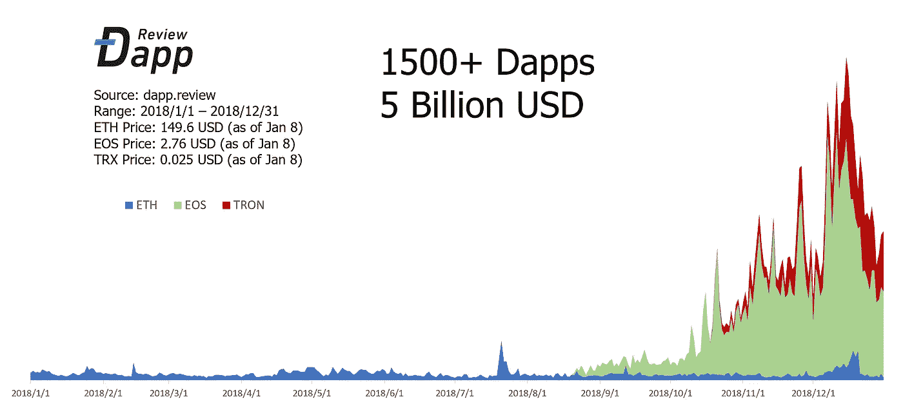

2018 年发生的总交易额接近 50 亿美元，其中 80%来自我们过去两个月详细分析的 EOS 和 TRON 上 Dapps 的爆发。

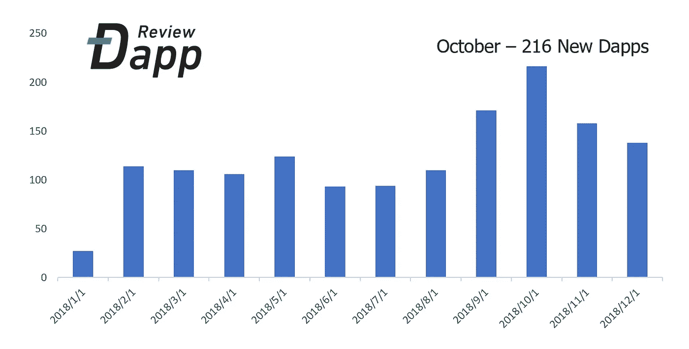

每月创建 100 多个新的 Dapps 尤其是在 10 月份，新 Dapps 的数量达到了 216 个的峰值。

在这篇由两部分组成的文章中，我们将逐月回顾全年，每部分 6 个月。

CryptoKitties 在 2017 年底打开了潘多拉魔盒。从那时起，他们再也没有被遗忘。同时，OpenSea 的 Alpha 版本上线。这是第一个不可替代代币的 DEX，或者说，是世界上第一个基于区块链的虚拟资产市场。

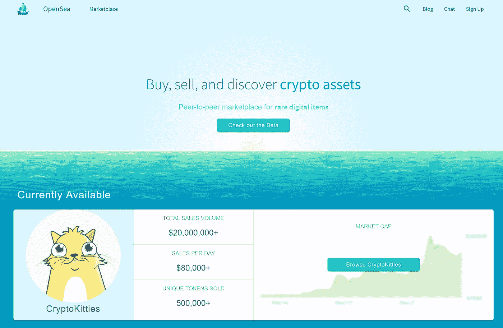

the first version of OpenSea

在 OpenSea 的第一个版本中，你只能在 CryptoKitties 和分散土地中交易资产，而现在你可以在平台上找到超过 50 个游戏的 NFT(并且这个数字还在不断增长)。

2018 年年中，OpenSea 获得了来自包括比特币基地在内的多家风险基金的 2M 种子投资。只有他的联合创始人和他自己，Devin Finzer 告诉涅槃资本，他们的跑道可以持续至少两年(注意:即使他们的办公室在下西区，哈德逊街)。因此，我们知道他们具有先发优势的现金流业务一直表现出色。

# 一月

1 月 16 日，隐名人上线。这是第一款在市场上广受欢迎的烫手山芋 dapp。与此同时，CryptoKitties 让 ERC721 标准资产变得流行起来:像**、【你唯一的独特资产】、【不可改变的不可改变的】、**这样的流行语到处流动，肯定了区块链带来的价值。

CryptoCelebrities

**没有真正的价值主张，所有的增长都只是投机泡沫。**例如，当用户 A 购买了一台 Crypto Obama，然后以 20%的溢价卖给用户 B 时，差价的绝大部分进了用户 A 的口袋，剩下的交易费进了开发者的腰包。

最后一轮之前谁来谁就有利可图。知道了这一点，很多人被名人所吸引；游戏能够在 1 月 27 日创下 12k+ ETH 的日交易量纪录。很快，各种型号完全相同的游戏以不同的呈现形式涌入市场。回顾过去，10 月和 11 月 EOS Dapps 的流行几乎是 1 月和 2 月发生的事情的重演。

到一月底，成千上万的花已经开放，然后枯萎。与此同时，以太机器人开创了一种新模式:**板条箱预售**。顶级的用户界面和稍微复杂一点的游戏设计吸引了大量的 Dapp 玩家。

EtherBots

3900 箱在不到两周的时间内销售一空。总销售额为 1100+ ETH。我们仍然记得板条箱售罄的那个下午，文森特去了一个传统游戏开发团队，并向他们描述了区块链支持的游戏的光明前景。

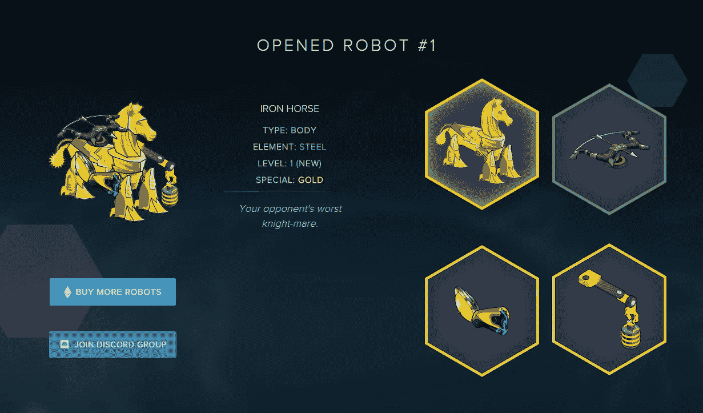

作为一家主流内容提供商，该团队对预售数据感到震惊(在两周内销售了超过 100 万美元，甚至没有完成游戏)，更不用说玩家必须通过所有障碍，包括 Metamask 钱包，购买加密货币，然后交易虚拟资产。要知道即使是最成功的游戏众筹也只有 30 万美元左右，传统游戏团队也很难不受影响。

后来的故事，我们都知道，是燃料游戏，开发以太机器人的同一个团队，创造了 GodsUnchained。由 Nirvana Capital、Continue Capital、比特币基地和黑脸田鸡风险投资公司投资的 Fuel Games 在 2018 年 5 月获得了种子轮投资，并拥有《GodsUnchained》更令人惊叹的预售数据。

# 二月

2 月 1 日，Crypto Countries 上线。虽然我们都应该知道这些烫手山芋游戏注定是短暂的，但 CryptoCountries 非常幸运地捕捉到了高峰。

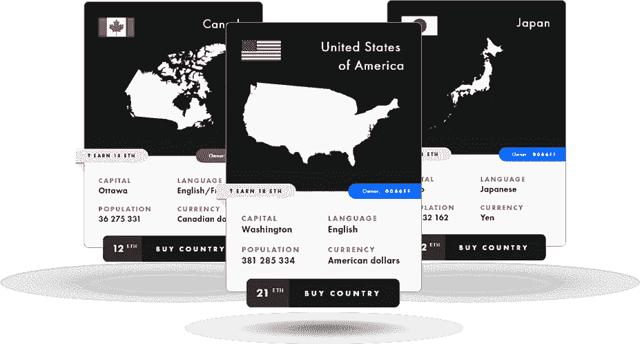

CryptoCountries

春节前后，CryptoCountries 创造了 45k+ ETH 的交易量。除了虚拟资产变成了国家之外，隐姓埋名者没有任何改变。

除夕子夜，CryptoCountries 让“中国”直播。从 3ETH 开始，每笔交易提价 20%。一个小时内，价格涨到了 200ETH。第二天早上人们醒来的时候，已经到了 639ETH。

任何理性的思考者都会很清楚，这个数字可能会在任何时候停止变化 CryptoCountries 的团队只是通过将发布时间安排在中国春节前后而比其他人做得更好。然而，赌徒们并不在乎这些——他们只知道一件事:只要你不是最后一个，你就能赚到钱。

然而，实际的执行过程或多或少是技术性的。为什么？在几秒钟内，可能有数百名玩家试图玩同一个 ERC721。谁能得到它？*当然，这取决于你点击的速度(lol)，但同样重要的是你愿意支付多少汽油价格。*前者决定交易开始的时间，而后者决定你对矿工的优先程度。换句话说，你是否有钱支付 100 Gwei。

这些无脑烫手山芋游戏的关键是气体战争——只有极客有钱人才能赢。然而，除了瑞士联邦理工学院的矿工(当时)，没有人能真正摆脱这种风险。

那些早期开发者显然受益于先发优势。DappReview 有一个估算:CryptoCountries 的开发者收获了 1200+ETH 的毛利，然而只花了 2 周的时间开发。鉴于 1000 美元的 ETH 价格，我们都可以计算出他们赚了多少。

***与此同时，烫手山芋游戏也在 Dapp 界创造了一个行话——“Shill”。***

> 通过先令，有人进入了一个新开发的 Dapp，购买了某些资产，然后在 Discord 这样的更大的社区中积极地推广 Dapp。

更有影响力的 kol 通常受益最大。一个著名的领导者“菲尔”骗过了每一个骗局，但散户交易者仍然非常愿意为这场庞氏骗局买单。例如，加密国家困住了相当多的玩家，包括一些大玩家。我们知道有人被困的最大数量是超过 2000 ETH。

很快，第一个中国 Dapp 社区成立了。中国第一部 Dapp *以太水浒传*在农历新年后的第二天上线。主角宋江也高达 50 eth…整个二月几乎被各种烫手山芋游戏淹没:绘画、表情符号、兰博基尼、马、卷饼，甚至色情明星。这完全是一场由高纯度空气支持的你能想象到的泡泡盛宴。

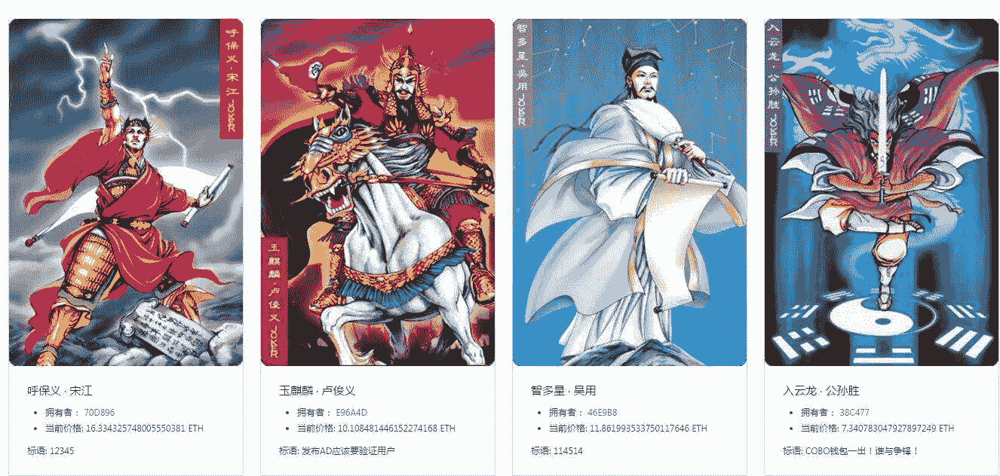

*Ether Water Margin*

尽管如此，炒作曲线变得越来越短，从两周到三天到一小时，最后到没有时间。

# 三月

2018 年 3 月 2 日，我们发表了第一篇社论。我们希望不仅仅是一个信息渠道；我们想和大家分享我们自己的观点。三月份两周后，我们推出了第一个版本的网站，只有以太坊和 200+dapp。今天，在我们的页面上，我们有六个不同的公共链和 2000 多个 Dapps 及其数据分析；世界上还没有人做到过。

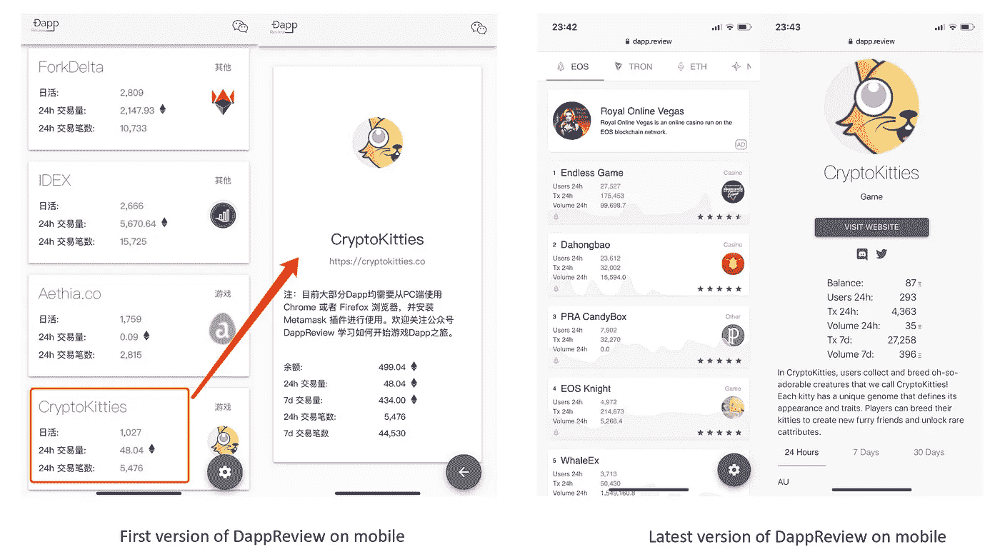

三月中旬，瑞士联邦理工学院。小镇拉开预售序幕。这可能是继以太机器人成功之后第二个相当成功的预售。销售总额超过 1000ETH。

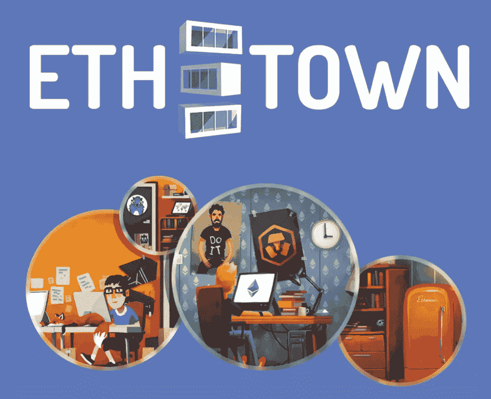

由传统游戏开发团队 On5，ETH 开发。小镇有一些高质量的设计。玩家们都很期待这个游戏，尤其是他们可以自定义的英雄。然而，这款游戏让玩家们等了四个月才最终推出。我们将在下一篇文章中回到这个游戏。

一年一度的游戏开发者大会(GDC)于三月底在旧金山举行。这一次，金恩带来了一件大事:它宣布与发动机行业的老大哥 Unity 建立战略合作伙伴关系。金恩 SDK 将允许 Unity 开发者在线创建和管理他们的虚拟资产；这些资产可以在金恩的钱包里安全地存储和交易。

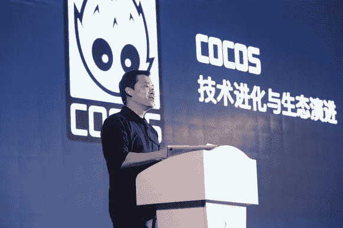

与此同时，中国最大的游戏引擎 Cocos 在北京举办了自己的敌无双，标志着其在区块链探索的开始。通过其自己的基础设施 Cocos-BCX，Cocos 为开发人员提供了一整套开发环境来运行测试和发布。在会议上，我们看到了钱包、账户和资产交易系统。

很快，由于担心错过，其他引擎都跟随 Unity 和 Cocos 的脚步。

三月底，一个叫 Peepeth 的 Dapp 上线了。这可能是第一个连锁社交媒体。类似于你发微博的 Twitter，Peepeth 允许人们“窥视”。

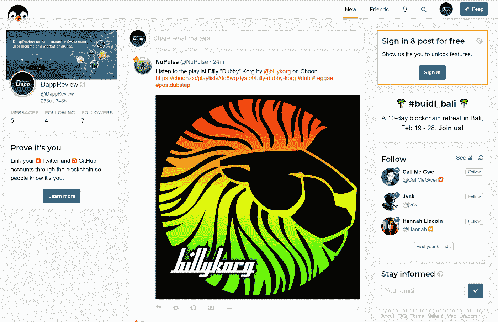

Peepeth 的特别之处在于它的反审查功能，任何窥视都不会被删除。不过“偷窥”并不是免费的:每 15 个偷窥者必须打包成一个块，费用取决于打包的速度，介于 0.000028 ETH 和 0.000330 ETH 之间(0.018-0.18 美元)。同样，一个人可以用 ETH 奖励任何窥视。

# 四月

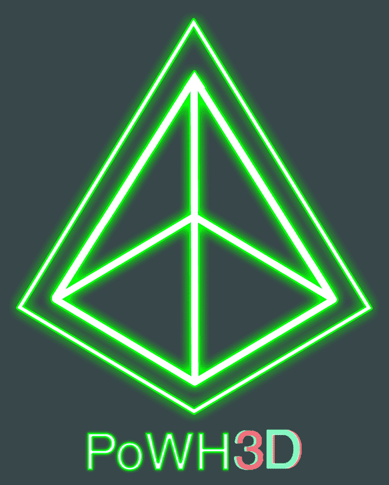

一个巨大的欺诈事件惊动了整个 Discord Dapp 社区——这一切都始于一个低调但交易量很高的庞氏 Dapp，“PoWH 3D”。《PoWH 3D》早在 2 月份就上线了，它的排名也逐渐上升到了榜首。余额一度接近 20000ETH(当时相当于~ 730 万美元)，DAU 的峰值接近 3000。(这个 Dapp 是 Team Just 创建的；大部分人是 7 月份才通过 Fomo3D 认识他们的)

“PoWH 3D”的想法起源于早期的 PoWH 项目。它是这样运作的:玩家可以用 ETH 购买代币；每笔交易收取 10%的手续费。所有这些费用将根据代币持有者的持有量按比例在他们之间重新分配。这种机制激励玩家 HODL 他们的代币和发展更多的新玩家。只要有更多的新玩家和老玩家留下来，每个人都可以得到红利。换句话说，这个游戏本质上是一个庞氏游戏。

一周之内，无数 POXX 游戏蹦了出来:PoWH(弱手证明)一出现，就有 PoWL(弱腿证明)、PoWC、PoWD、PoSB、PoJ、PoWTF 等等……

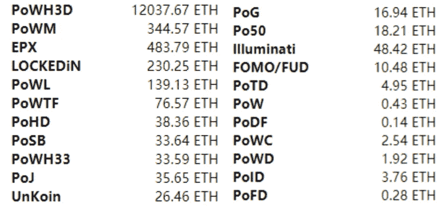

此外，克隆的成本非常低:你只需要复制代码。一些项目只是简单地将变量从 1%更改为 99%，甚至没有更改代码旁边的注释。4 月 7 日，所有不和谐的频道都被《泡沫的力量》的推荐链接清洗了:投机者和庄家都准备好了。

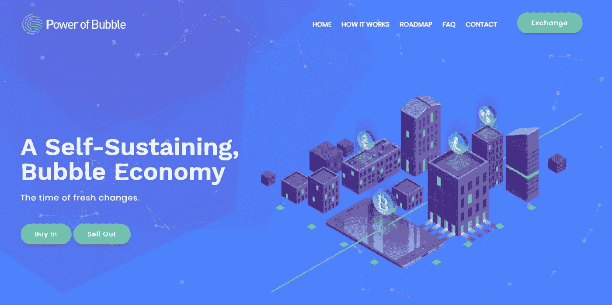

2018 年 4 月 8 日上午 10 点，起跑钟声响起。不到 10 分钟，那份智能合约的余额就涨到了 200ETH。*然而玩家们逐渐嗅到了一些可疑之处:智能合同甚至不是开源的。*

很快，Discord 上质疑游戏的声音越来越大，突然安静下来——频道被删除了。人们都疯了，他们立即开始出售代币或收回他们的 ETH——没有任何效果。是的，这个游戏是个骗局。**几分钟后，227 ETH 全部从智能合约中转出……人们再也找不到主办方了。**

这些庞氏骗局并没有持续多久。4 月 14 日，一款名为 EtherGoo 的游戏上线。所有 Dapp 爱好者都涌入尝试，当然以太坊网络又堵了。在一天多的时间里，完成了 40000 多笔交易。多有趣的休闲游戏啊——会上瘾的！

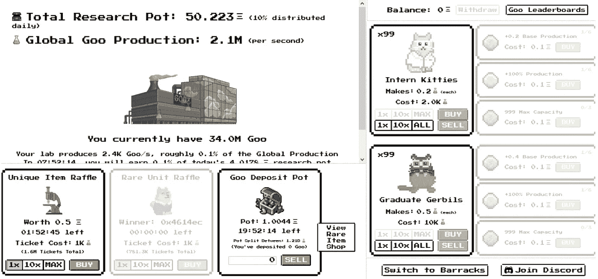

以太网拥有闲置游戏的所有优点——它可能是第一款成功的区块链闲置游戏:

*   免费的 Goo token 和工厂的生产环境降低了进入门槛。人们可以在没有任何复杂理解的情况下玩这个游戏；
*   战斗动物和 PVP 模式使游戏更具战略性和互动性；
*   更不用说分红时间表和抽奖了。我们有没有提到这两个组件是吸引主要区块链游戏玩家的显而易见的东西？

最近，克隆版本 TronGoo 出现在 Tron 上。许多人认为“这是经典的”，然后试了一试(或一些)，甚至我们自己。

# 五月

在五月的第一周，DappReview 注意到 Nebulas 开始了它的第一个 Nebulas Dapp 激励计划。这次开发者竞赛可能是迄今为止奖励金额最大的一次:总共 46 万 NAS。按照 5 月 4 日的汇率，大约是 480 万美元。

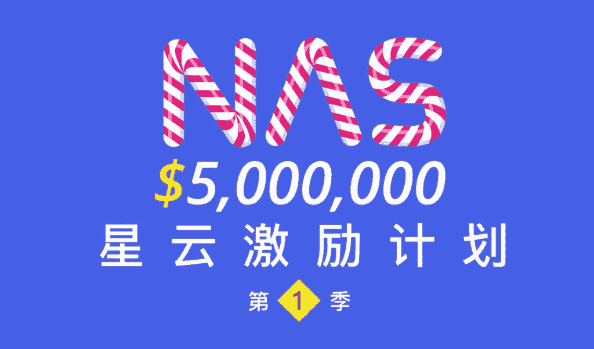

DappReview 很快研究了规则和程序官方指南。在经历了开发过程之后，我们确信这个项目是有意义的和有成效的。在两个月的时间里，*我们的 DappReview 开发者社区贡献了超过 170 个通过官方批准的 Dapps。在这些开发人员中，我们有一等奖、三等奖、月度奖的获得者，还有其他 10 个团队获得了最佳表现奖。DappReview 也成为该计划中最大的开发者社区，并在两个月中获得月度推广奖。*

激励计划是对高质量 DApps 和开发者的广泛筛选过程。通过这个机会，一些伟大的独立游戏展示了他们不同的风格。

在开发者聊天小组中，我们每天都会看到几千个对话。这可能是 2018 年技术型聊天群最活跃的两个月。很多后端开发者甚至在这次比赛后把前端学得很好。

然而，遗憾的是，由于缺乏开发者社区和用户社区的持续维护，Nebulas Dapp 生态系统并没有像预期的那样发展壮大。

**到目前为止，涅槃资本认为观察所有正在发生的事情并了解开发商是一件有趣的事情。然而，从投资者的角度来看，并不是很多游戏都值得投资，即使是六个月后**(我们将在后面提到文森特和梅宝在 11 月的一次谈话，关于如何定义人们愿意为之付费的优秀独立游戏)。部分原因是因为基础设施的限制，但更重要的是，高质量的内容还没有被吸引到区块链平台(如果他们可以很容易地从一个可用的大平台赚钱，为什么要在这个早期阶段费心呢？)

 [## 区块链游戏的演变和未来展望

### 以下是来自 DAppReview 的 Vincent Niu 的客座博文。中文原文发表于 5 月 11 日。

medium.com](/loom-network/the-evolution-of-blockchain-games-and-a-peek-at-whats-to-come-fed884b75b3d) 

五月的第二周，Vincent 决定为他的著名作品[《区块链游戏的演变》和《一瞥未来》](/loom-network/the-evolution-of-blockchain-games-and-a-peek-at-whats-to-come-fed884b75b3d)通宵工作，该作品在 Medium 上获得了 2700 多次掌声。那可能是当时关于区块链和游戏最全面、最有见地的文章之一，当时世界上很少有人认真对待 Dapp。就像我们在开头提到的，我们的读者在回顾了这一整年后再回头看那篇文章会很有趣——甚至我们自己也对文森特的一些远见感到惊讶。我们很高兴人们开始认识到那篇文章的价值，但更重要的是，越来越多的人正在打破认知上限。

## 与此同时，我们注意到更多有趣的 Dapps。以下是一些例子:

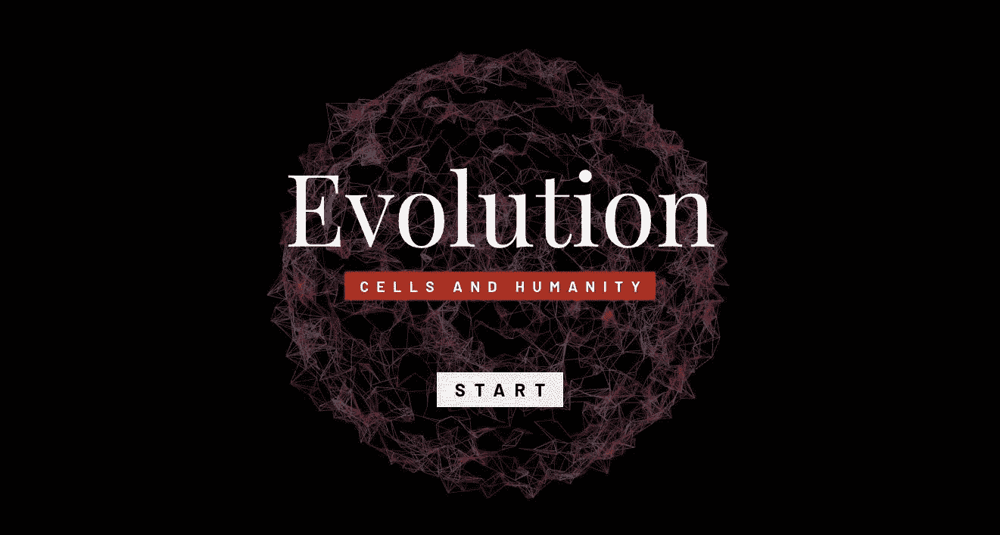

**1。小吴《细胞进化》。**不是闲散游戏，也不是庞氏骗局，《细胞进化》可能更好地称为益智游戏:对于个人游戏部分，游戏是闭源的，更像是沙盒；对于世界游戏，它是部分开源的。通过可以被公开看到的生存逻辑，人们可以解开个体模式中的变形之谜。这样的机制对于区块链游戏来说是一个很酷的探索方向。

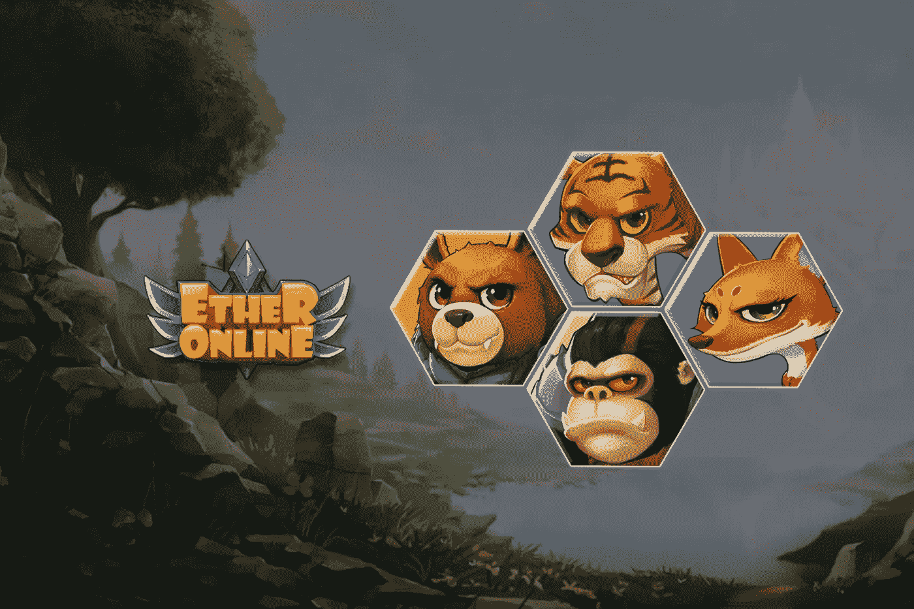

**2。以太在线。**我们可以很有把握地说:在五月之前，没有游戏的智能合约比 CryptoKitties 更复杂。以太网在线可以被认为是第一个。这个游戏更类似于早期的一些网页游戏(对于大多数 Dapps 来说，这绝对是一种赞美)。大多数游戏都是在链条上完成的——所以游戏肯定更复杂(也更分散),但用户等待时间更长(也就是用户体验更差)。一个要点是，完全链上部署不是最佳解决方案，至少在基础设施仍处于早期阶段的现在不是。

**3。以太养虾场。每个月都不可避免地有一些流行的主题——农场游戏是五月的主题。这一类最早的版本叫以太虾场。这个游戏是另一个空闲的游戏:开始时每个用户可以要求 300 只免费的虾，每只虾每天产一个卵，卵最终会长成虾。玩家可以在自由市场交易他们的鸡蛋。是的，即使是这么简单，游戏还是被炒作了。就像以前一样，各种各样的骗子出现了，青蛙农场、鱼农场、蚂蚁农场……以太坊网络，当然又一次堵塞了。这些游戏除了动物的种类之外，彼此没有什么区别——总之，是非常简单的无聊游戏。**

# 六月

为什么 2018 年有那么多不眠之夜？区块链，还有世界杯。6 月，数十家足球博彩公司突然出现。然而，他们中的大多数没有很好的用户界面(阅读:看起来粗糙)，也没有有趣的游戏机制。结果，不用说，这些游戏并没有获得世界杯本身那么多的人气，比赛结束后就立刻销声匿迹了。

有一次，文森特认识了一位前暴雪员工鲁迪，他后来成为神话游戏的联合创始人。本月初，Vincent 被邀请到 Unity 上海总部；作为世界上的老大哥引擎，Unity 对“区块链+游戏”能带来什么仍然持保守态度。然而，从 Nirvana Capital 的信息来源，我们知道 Unity 的领导已经为硅谷的相关项目提供了一些天使支票。它传达了一个信息，尽管作为一个组织，Unity 决定采取更谨慎的方法，但领导们至少对探索潜力很感兴趣。

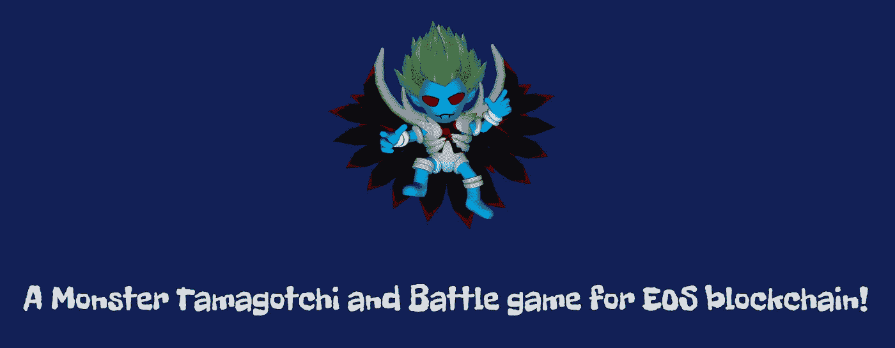

MonsterEOS

6 月中旬，EOS Mainnet 终于上线了。超级节点选举几乎感觉像一个全球性的社会实验。EOS RAM 泡沫有点掩盖了第一个 EOS DApp——MonsterEOS——诞生的令人兴奋的消息。确切地说，Dapp 可能应该被称为演示，或迷你可行产品(MVP)，因为游戏中的功能真的很少。如果我们回到这一点，我们很难预测 EOS Dapps 的爆炸式增长。

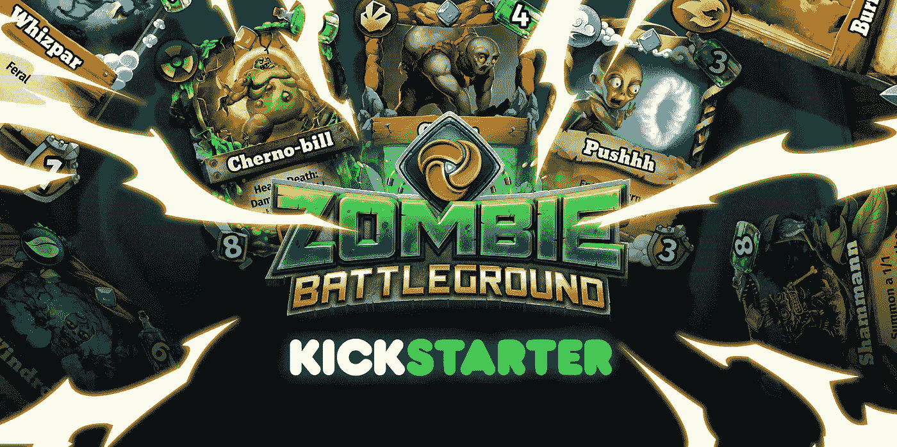

与此同时，Loom Network 在区块链推出的首款卡牌游戏在 Kickstarter 上开始预售，两个月内众筹了 32 万美元。同时，ETH。Town 是一个我们很久没有听到消息的 Dapp，它发布了另一个迷你游戏，试图为其 7 月份的 alpha 版本赢得一些人气。

**回顾 2018 年的前 6 个月，更像是以太坊的一场个人秀。不可否认，大多数 Dapp 非常简单；尽管如此，你很难忽视新的游戏玩法和机制出现的速度有多快。让我们期待下半年的回顾吧。**

*这篇文章由 Vincent Niu 撰写，于 2019 年 1 月 15 日首次发布在 DappReview 微信频道上。编辑并翻译姜@* [*涅槃之都*](http://nirvana.capital) *。*

更多阅读—

 [## 80 天内突破 12 亿美元

### 黯淡资本市场中令人不安的 EOS 生态系统

medium.com](/dappreview/beyond-the-1-2-billion-usd-in-80-days-b7f5a478e760)  [## 用户不多，矿工不太弱——看似繁荣的 EOS 世界背后的阴暗面

### EOS Dapp 生态系统上的用户、矿工、搅拌者的深度数据分析。对 Dapp Devs 收入和未来的见解

medium.com](/dappreview/users-not-so-many-miners-not-too-weak-the-dark-side-behind-the-seemingly-prosperous-eos-world-6c13dd11457f)  [## Dapps 数据洞察:成交量下降 60%，Dapps 死了吗？

### 为了回答朋友们的这些问题，我们把这个简单的片段放在一起；有了数据，你就知道什么…

medium.com](/dappreview/dapps-data-insights-volume-down-60-did-dapps-die-48acdf910df6) 

**关于 DappReview:**

[DappReview](https://dapp.review/) 是全球最大的 Dapp 平台，追踪 6 个公链的数据，拥有超过 2500 个 Dapps 数据。我们提供准确的 DApp 数据、用户洞察和市场分析。

作为致力于区块链技术和 dapp 的领先媒体之一，DappReview 提供关于新 dapp 和行业见解的专业评论。我们的大部分文章都是中文的，但是我们会翻译一些有特色的文章并在媒体上发表。

我们和中国所有主要的区块链媒体和钱包都有合作。我们还为开发商和 DApp 公司提供财务顾问服务和公关/营销解决方案。

网址:[https://dapp.review/](https://dapp.review/)
推特:[https://twitter.com/dapp_review](https://twitter.com/dapp_review)

**关于涅槃资本**

[Nirvana Capital](http://nirvana.capital) 是一家总部位于旧金山/北京的区块链基金，专注于初级市场投资和技术与经济前沿理念的探索。它的创始合伙人也是以太坊的早期支持者。为了将彻底改变社会生产和劳动关系的生态系统与底层社区结合起来，涅槃资本为其投资组合项目提供端到端的强大支持，包括战略/运营和资源匹配方面的咨询。