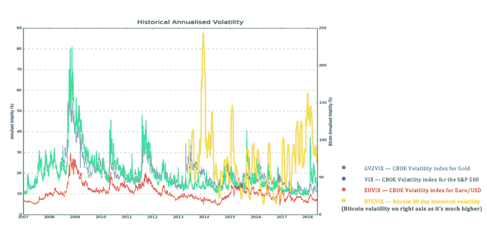
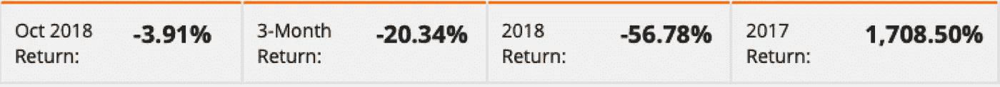
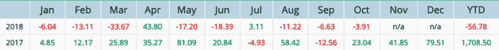
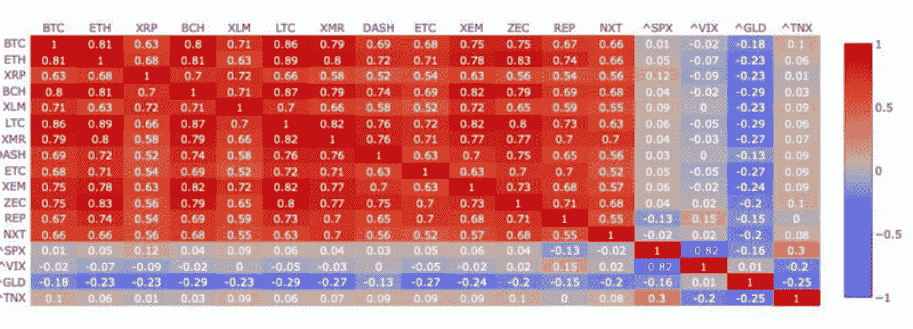
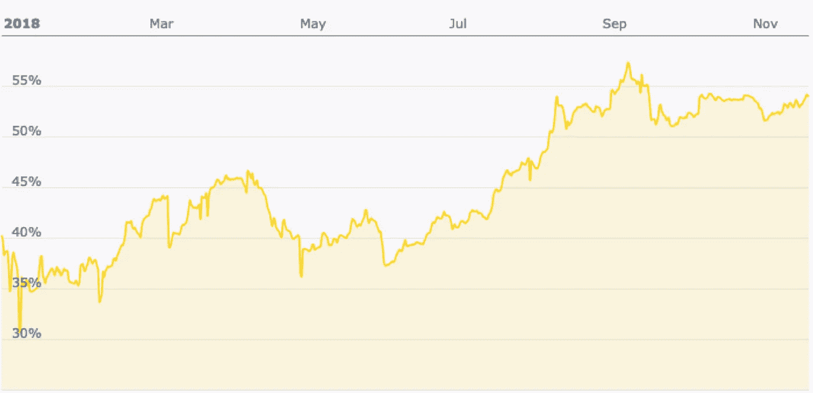
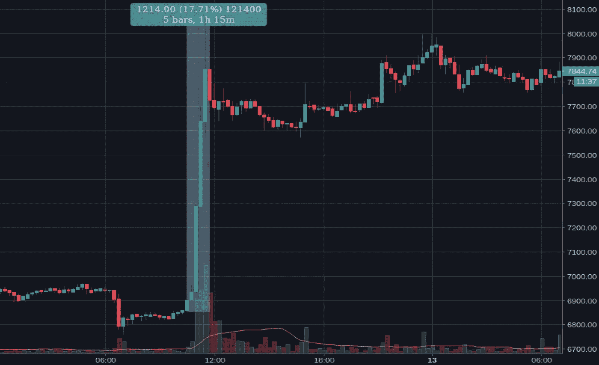
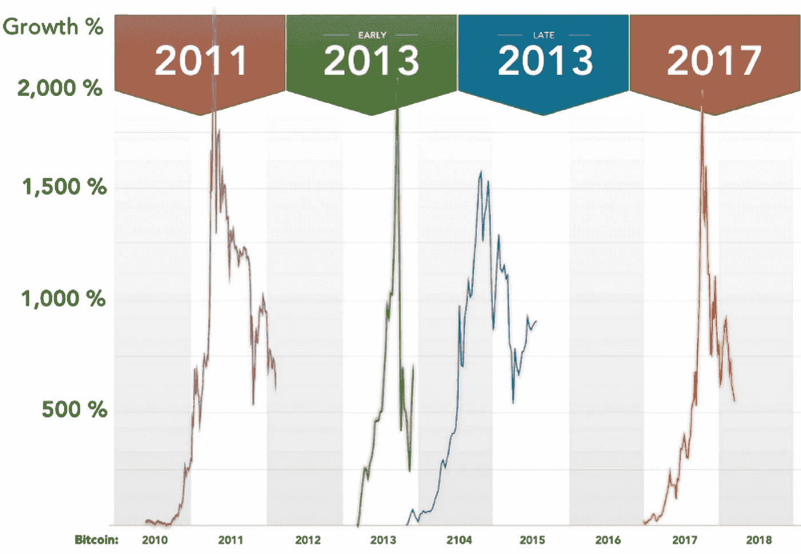
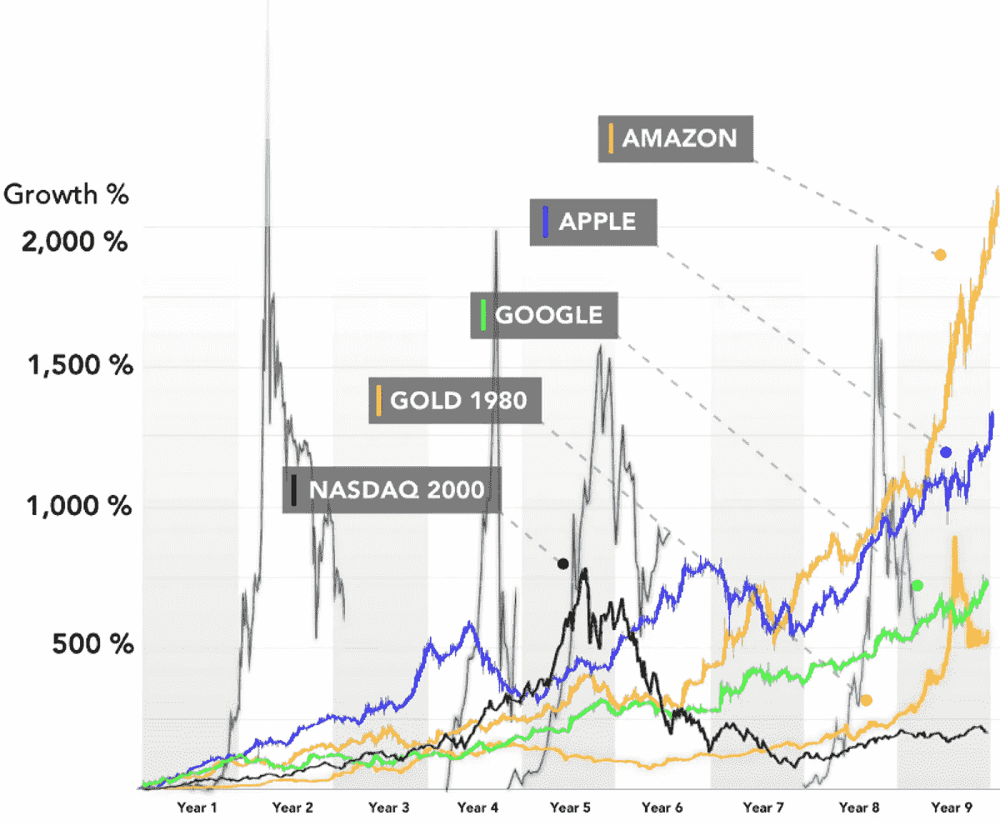
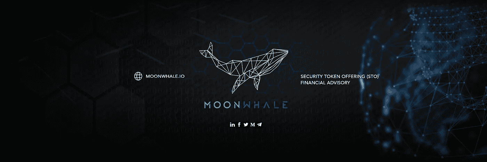

# 2018 年:加密基金的衰落

> 原文：<https://medium.com/hackernoon/2018-the-downfall-of-crypto-funds-9d7a2642dc96>

> “过去的业绩不是未来业绩的可靠指标”

加密对冲基金是一个更大的加密基金集团的一部分，包括那些基于风险资本和私募股权的基金。根据这项研究，目前所有类别共有 622 只加密基金，其中 303 只是加密对冲基金，资产不到 40 亿美元。一半的基金位于美国，在澳大利亚、中国、马耳他、瑞士、荷兰和英国有多个基金成立。今年 2018 年。2017 年是创建加密对冲基金的好年头。回报丰厚。

在牛市中表现很难吗？

另一方面，2018 年，许多加密货币都出现了大幅下滑。这些硬币在大多数加密对冲基金中占很大比例。所谓的“多元化投资组合”或“一揽子风险调解”表现不佳。投资者的资金仍然紧张，除非亏本出售。由于 2018 年年初至今的回报率为-56.78%，投资者考虑在这一具有破坏性的高增长技术领域中进行替代选择。

Average Crypto Hedge Fund returns

Historical Monthly Performance (%)

# 加密货币具有投机价值。

现在，大多数人应该知道，由于强相关性，大多数代币和硬币随着[比特币](https://hackernoon.com/tagged/bitcoin)的表现而波动。此外，由于平均占有 50%的总加密市场份额，比特币无疑是整体行为的主导驱动力。此外，加密是一个年轻的资产类别，随着它的成熟，可能会继续不稳定。即使是股票的波动性，目前 VIX 的波动性为 13.4%，与比特币的波动性相比也完全相形见绌，比特币的波动性为 70%(低于今年早些时候的 150%)。

总市值从 2017 年初的 183 亿美元上升到 2018 年初的 6130 亿美元，增幅超过 3000%。加密货币市场正在快速变化，为投资者带来了巨大的机会，进而也为投资经理带来了巨大的机会。但是，希望通过投资积极管理的对冲基金来利用市场低效率的个人需要警惕和披露相关风险。

Crypto Correlation Matrix

Bitcoin Dominance

Volatility: 12th Apr 2018 — A move of $1200 within an hour

Bitcoin Crashes (or bubble bursts or correction)

Some context for the know-it-all

# 减损措施

由于 2017 年从历史高点回调了 70%至 90%,大多数加密基金去年很可能不会收取任何绩效费，尽管它们采取了“复杂的对冲策略”或自动重新平衡功能。

这意味着他们在 2018 财年的剩余时间里有三个(第四个)选择:

1)筹集新资本，

2)安然度过市场，希望 2018 年更好，

3)关闭基金

4)或者改变策略。

> "加密货币不能像传统资产一样被分析."

创业公司或公司中没有与价格相关的实物或股份。您的代币的估价是基于对未来需求的预期，因此很容易受到情绪变化的影响。

对冲基金是最常见的数字资产基金类型，但风险资本加密基金正在迅速推出，现有的科技/金融科技风险投资公司正在扩大对区块链初创公司的投资，并推出自己的区块链基金。投资科技初创公司——而不是仅仅依赖现有加密资产的价格升值——为投资者服务最具破坏性、高增长的市场，未来价值数万亿。

# 2019 年:哪一年？

我们正在接近 1 月底，已经有很多关于今年对加密货币意味着什么的预测。一些人声称这可能是安全令牌产品(STO)的一年，一些人说这可能是大规模采用最终发生的一年。

我对此事的想法是，2019 年可能是监管机构最终为加密货币或区块链项目的蓬勃发展建立基础设施的一年。道路是漫长的，但没有什么可以阻止创新。这可能是有史以来人类提供的最稳定的增长。

*资料来源:加密基金研究、Eurekahedge、Sifr Data、羊驼证券*

我希望你喜欢这篇文章！请在下面留下任何反馈。让我们祝愿 2019 年更加美好。:)

# **关于作者**

**Iliya Zaki 是**[**moonwale Ventures**](https://moonwhale.io)**的营销和业务开发主管。**

Moonwhale Ventures 是一家 [STO 金融咨询公司](https://moonwhale.io/investment-platform/#third)，为公司提供关于 STO 进程&结构的战略建议，以及代币发行，包括其项目的生命周期管理和二级市场参与。Moonwhale 还在建立一个端到端证券令牌(STO)投资平台，该平台将迎合寻求投资 STO 项目的投资者，以及寻求通过 STO 筹集资金以资助业务扩张或新企业的公司。

欲了解更多信息，请访问:[月鲸 STO 解决方案](https://moonwhale.io/investment-platform/#third)

[推特](https://twitter.com/MoonwhaleBV) | [领英](https://www.linkedin.com/company/moonwhalebv) | [脸书](https://www.facebook.com/MoonwhaleBV/) |

