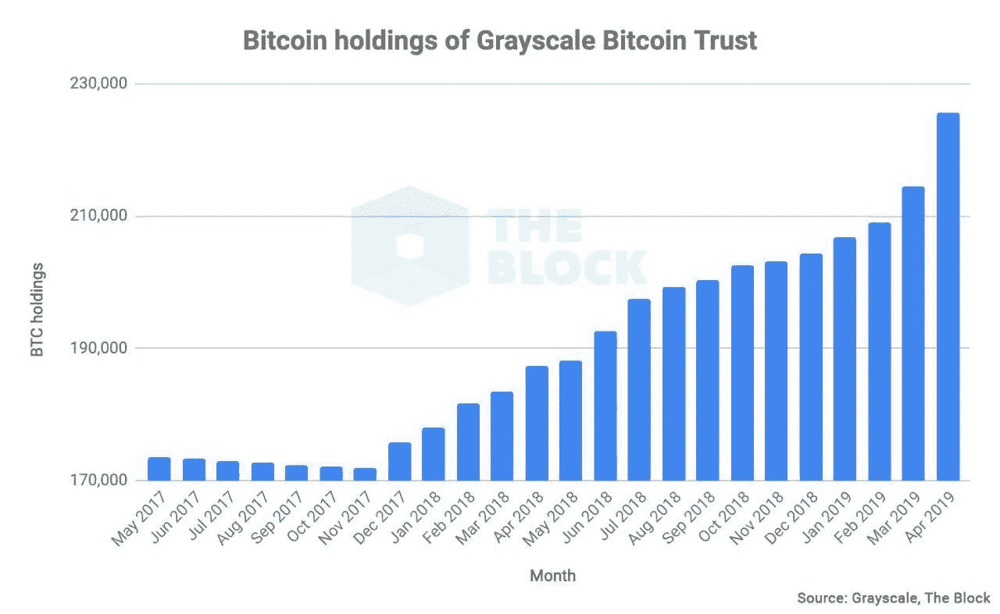
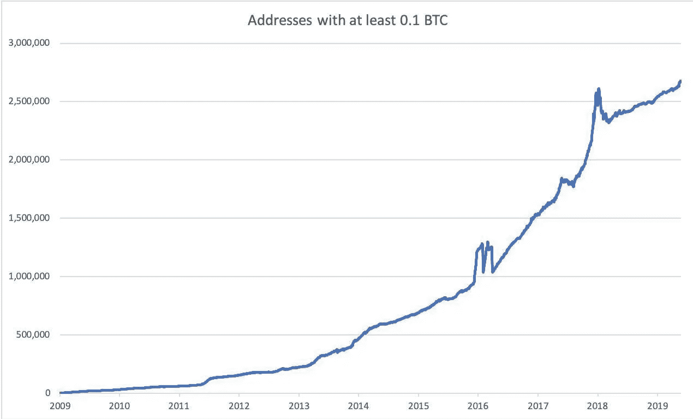
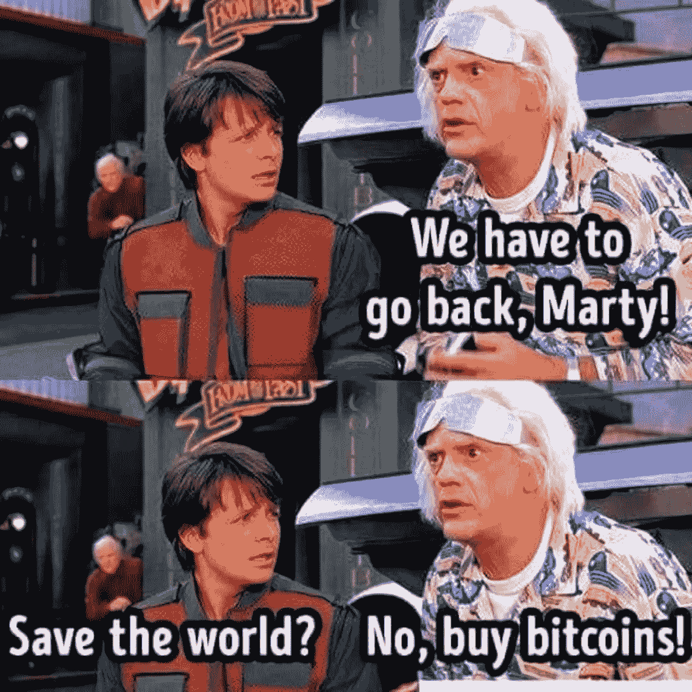
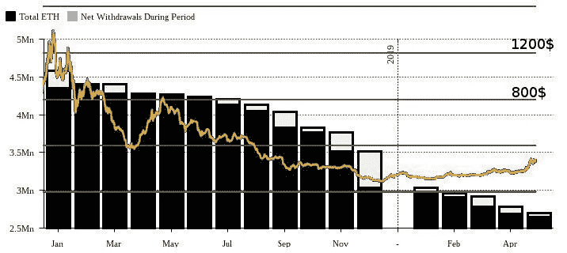
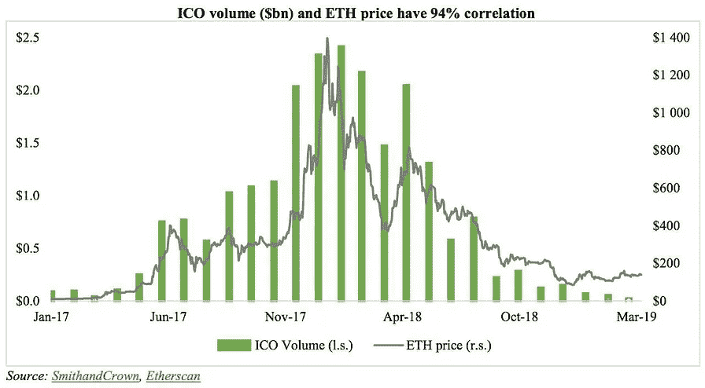
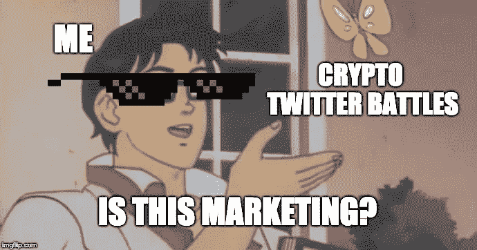

# 2018 vs 2019。如何在没有巨大风险的情况下投资 Crypto？

> 原文：<https://medium.com/hackernoon/2018-vs-2019-how-to-invest-in-crypto-without-a-huge-risk-38c14200e2d8>

Photo by [Dmitry Moraine](https://unsplash.com/@wildbook?utm_source=unsplash&utm_medium=referral&utm_content=creditCopyText) on [Unsplash](https://unsplash.com/search/photos/invest?utm_source=unsplash&utm_medium=referral&utm_content=creditCopyText)

去年许多投资者亏损后，市场一蹶不振，许多人不相信比特币的增长，直到它大幅飙升至 8000 美元。

那时，当去年的新来者正在积极销售他们的密码时，鲸鱼来到了市场。他们的购买几乎持续到冬季密码结束，现在他们拥有大量的比特币。

比如灰度基金积极投资加密货币；在此期间，它设法增加了相当大数量的比特币。

225638 BTC owned by Grayscale customers, it’s over 1.3% of all bitcoins in circulation today. The company’s assets in Bitcoins have continuously grown since December 2017, i.e., throughout the downturn in the market. By [The Block](https://www.theblockcrypto.com/).

与此同时，统计数据显示，比特币地址的总数已经增加，并且正在稳步增加。当然，地址越多，对加密货币越感兴趣。

Addresses with at least 0.1 bitcoins on their wallets reached a historical maximum.

# ICO 结束

这结束了失败的创业公司的时代，那些想要快速获利的人“得到了全部”市场现在正在自我清洗，新的主要参与者正在到来:[克](https://techcrunch.com/2018/01/08/telegram-open-network/)(电报)[全球币](https://www.theinformation.com/articles/facebook-plans-outside-foundation-to-govern-cryptocurrency)(脸书)等。

投资者对加密货币变得更加谨慎。他们更喜欢了解创始人，团队在 crypto 之前做了什么，等等。当然，如果你是一家加密初创公司，想要获得投资，难度会更大。

对 IEO(首次公开募股)日益增长的兴趣也要求交易所在上市前对项目进行研究。毕竟交易所作为担保人，他们也有损失的(至少是声誉)。

# 加密市场 2k18 vs 2k19

Come on! I know that you would like it!

2018 年标志着比特币和其他加密货币的下一场葬礼。许多 ICO 很快卖掉了以太坊，希望至少能得到些什么…

ICO’s reserves are predictably moving towards zero, and the price of Ethereum (ETH) shows signs of support.
Dynamics of reserves ICO — Diar, data on volume — coin360.

正如你在图表上看到的，在对 ICO 的兴趣下降后，以太坊的价格下降了。而且，以太坊现在有了一个优秀的竞争对手——[BNB。](https://www.binance.com/en/use-bnb)

## 秘密营销

我还想指出营销是如何变化的。不再可能快速制作一些加密频道/网站并立即销售广告…不，它不再工作了。

所有营销 ICO 机构消失了🤷‍♂️.许多秘密的 YouTube 博主和其他业内名人也消失了，但一旦价格上涨，每个人都记得比特币。

禁令…谷歌、脸书、推特等大型广告商禁止在广告中提及加密货币… [**然而**](https://www.forbes.com/sites/darrynpollock/2019/05/09/facebook-relaxes-ban-on-crypto-advertising-as-it-prepares-for-its-entry-into-the-market/) …

Come on, I know how much you spend on crypto marketing… Meme by [imgflip.com](http://imgflip.com)

## 新手和专业人士的新工具

当然，专业投资者从股票市场带来了工具，例如:

*   加密指数— [**CIX100**](https://cix100.com/) 和 [**Huobi10**](https://www.hbg.com/de-de/markets/hb_index/) **。**
*   [**ETF**](https://cfe.cboe.com/cfe-products/xbt-cboe-bitcoin-futures) (交易所交易基金)
*   交易机器人(选择交易机器人时要小心)。

## 结论

2019 年新的趋势会是各大玩家的职业工具，因为现在游戏会按照他们的规则走。他们有可能进行相当大的操纵来再次鉴别一个新的市场。

不要忘记多样化你的密码组合。祝你好运！

感谢您的关注！