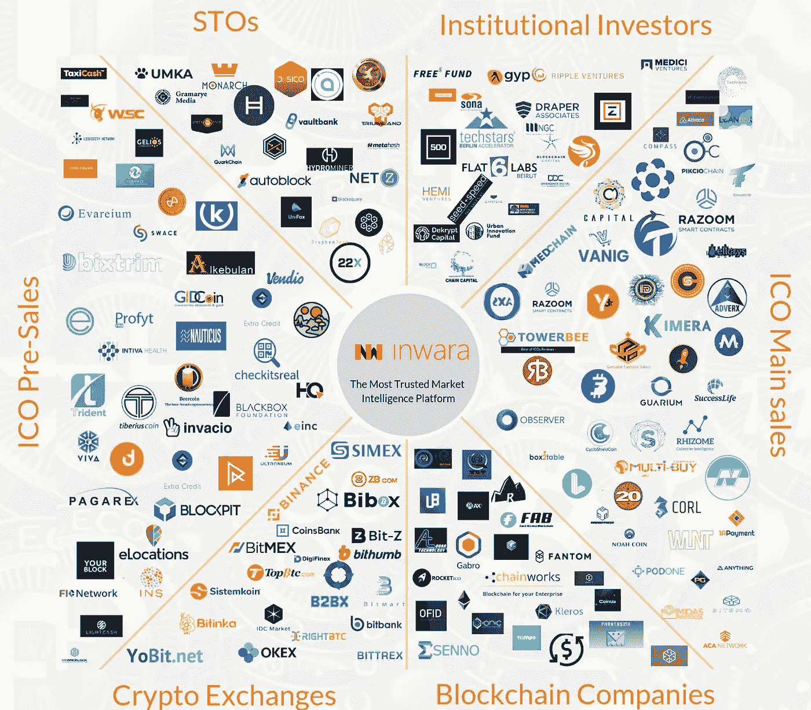
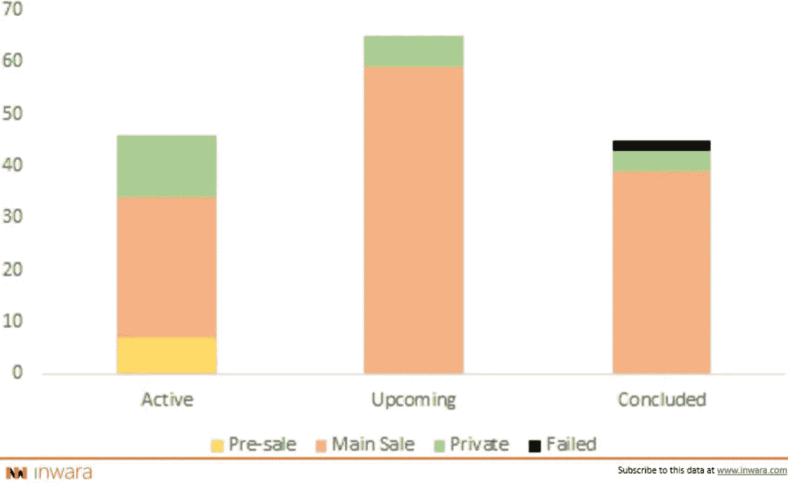
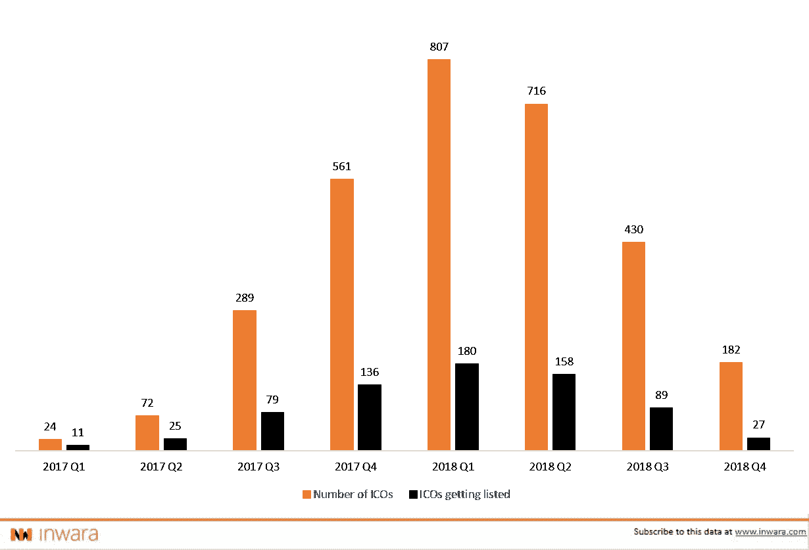

# 2018 年对 sto 来说是好事，但对 ico 和比特币坦克来说是挑战

> 原文：<https://medium.com/hackernoon/2018-was-good-for-stos-but-challenging-for-icos-bitcoin-tanks-ff240dff279e>

*InWara 基于机构级 ICO/VC 数据提供深刻的分析，为零售和机构投资者提供对该领域当前趋势和发展的清晰评估。*

*免责声明:这不是财务建议。更多详情请访问* [*条款与条件。*](https://www.inwara.com/disclaimer)

> [下载完整的 40 页年报](https://www.inwara.com/report/annual-report-2018?utm_source=2018hacker&utm_medium=2018hacker&utm_campaign=2018hacker)

牛市大约持续到 2017 年底，为已经在加密市场领域上市其 ico 的创始团队创造了前所未有的财富。比特币价格飙升至历史最高水平，几乎飙升至接近 2 万美元，涨幅惊人，超过 2000%[查看这个数字]。然而，在 2018 年，市场自我修正，在短短一个月内损失了约 60%的总总市值[查看这个数字]。

在专家的呼声中，支持和反对市场已经成熟。2018 年 1 月初，[伯克希尔·哈撒韦](http://www.berkshirehathaway.com/)董事长兼首席执行官沃伦·巴菲特表示，“就加密货币而言，一般来说，我几乎可以肯定地说，它们将会有一个糟糕的结局，”这一年并不是一个好兆头。反驳的理由主要基于这样一个事实:包括对冲基金在内的传统基金管理公司正面临来自投资者的压力，他们质疑自己为何错失了 10 倍的回报。

快进一年，当专家们的预测开始转向南方时，亿万富翁投资者和比特币牛市[蒂姆·德雷珀](https://twitter.com/TimDraper?ref_src=twsrc%5Egoogle%7Ctwcamp%5Eserp%7Ctwgr%5Eauthor)声称他坚持自己最乐观的价格预测——到 2023 年达到 25 万美元。

在索赔和反诉中，比特币在 2018 年底仍处于 4K 以下的水平。市场已经知道并面临过许多类似泡沫的情况，并且已经度过了这一阶段。许多乐观主义者将比特币的暴跌比作亚马逊在过去 20 年里的多次暴跌。

> 尽管资本市场的发展不利，但事实仍然是，区块链是一种技术，它会留在这里，随机应变，提高市场的效率和透明度！！

在对区块链未来的主张和反主张中，人们不能不注意到市场正在成熟，正在走过恐惧、不确定性和怀疑的 FUD 阶段。

今年加密货币领域的一个关键发展是 sto(安全令牌产品)的出现，这一势头正在增强，而 ico(初始硬币产品)的数量正在减少。

> [下载完整的 40 页报告](https://www.inwara.com/report/annual-report-2018?utm_source=2018hacker&utm_medium=2018hacker&utm_campaign=2018hacker)

# 在 ico 减少的情况下，证券代币发行(sto)获得了增长势头

sto 类似于 ico，只是投资者不只是购买代币，而是被授予对公司有形资产如股票或债券的所有权。

[Source: InWara’s Annual Report 2018](https://www.inwara.com/report/annual-report-2018?utm_source=2018hacker&utm_medium=2018hacker&utm_campaign=2018hacker)

sto 是美国证券交易委员会(SEC)委托的注册证券，它使管理团队在很大程度上对法律和投资者负责。在监管框架的支持下，sto 提供资产支持，这是散户和机构投资者的必备条件。

随着越来越多的 ICO 骗局在 2018 年成为新闻，机构和散户投资者都开始对 ICO 失去信心。到目前为止，社区正在探索的一个成功的替代方案是 STOs。

> 尽管比特币价格暴跌，但推出的 ico 数量却很高！

与 2017 年相比，2018 年推出了大量 ico。美国的 ico 数量最高，同比增长 60%。另一方面，在英国和新加坡，ico 的数量几乎增加了两倍，达到 200 个左右。除了俄罗斯的 ico 数量保持稳定之外，爱沙尼亚、德国和澳大利亚等国家的发射数量直线上升。

由于禁果对投资者来说太过诱人，中国的禁令实际上没有起到什么作用。2018 年来自中国的 ico 数量翻倍！总体而言，亚洲密码市场对 ico 的需求很高，而且还在增长。

[Source: InWara’s Annual Report 2018](https://www.inwara.com/report/annual-report-2018?utm_source=2018hacker&utm_medium=2018hacker&utm_campaign=2018hacker)

> [下载 40 页的完整报告](https://www.inwara.com/report/annual-report-2018?utm_source=2018hacker&utm_medium=2018hacker&utm_campaign=2018hacker)

# 2018 年 ICO 上市数量下降-投资者被流动性差的代币套牢

[Source: InWara’s Annual Report 2018](https://www.inwara.com/report/annual-report-2018?utm_source=2018hacker&utm_medium=2018hacker&utm_campaign=2018hacker)

交易所上市的 ico 数量大幅下降，2018 年上市的 ico 不到 20%。2018 年第四季度，只有 15%的 ico 在交易所上市，这对投资者构成了严重威胁，被代币卡住，没有提供流动性。

本研究的所有数据来源于 [InWara 的 2018 年年度报告](https://www.inwara.com/report/annual-report-2018?utm_source=2018hacker&utm_medium=2018hacker&utm_campaign=2018hacker)

完整的报告包括

*   ICO 景观 2018
*   STO 景观 2018
*   2018 年密码市场趋势分析
*   2018 年 ico、sto 和区块链公司中的私募基金
*   2018 年加密领域的并购

为了真正了解加密货币的前景，

> [立即下载 40 页的完整报告！](https://www.inwara.com/report/annual-report-2018?utm_source=2018hacker&utm_medium=2018hacker&utm_campaign=2018hacker)

