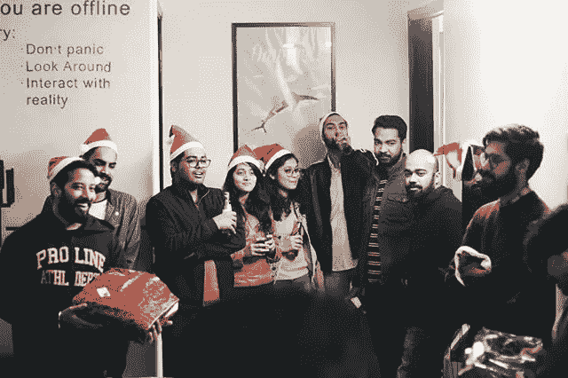

# 公元 2019 年:准备起飞

> 原文：<https://medium.com/hackernoon/2019-ad-ready-for-takeoff-99e6fb8f308f>

1961 年 5 月 25 日，当时的美国总统约翰·肯尼迪设定了一个国家目标:实现载人登月并返回地球。经过几次历史性的尝试，他的目标在 1969 年 7 月 20 日实现了，阿波罗 11 号的指挥官尼尔·阿姆斯特朗走下登月舱的梯子，登上了月球表面。

> 人类花了 8 年的不懈努力、牺牲、坚持和资金才安全登陆月球。

虽然火箭背后的努力和创业背后的努力没有可比性，但下面的图片很常见:

当我回顾过去的岁月，一切都变得有意义了。以下是 2018 年的一两件事:

> 当你犯了错误，你应该做的只有三件事:承认错误，从中吸取教训，不要再犯。

# 2018:清算之年

说实话，我们进入 2018 年，从 2017 年的垮台开始，经历了一段坎坷的旅程，每天，我们都在不懈地努力，以最快的速度将我们的想法付诸实施。其中很多都失败了，但我们最终在 Q1 早期完成了一个项目，并由此产生了一个内容平台，现在已经跻身于美国**350 强**网站之列。为了客观地看待问题，这里还有一些统计数据:

*   一个月内在**投放了 15 亿份广告**——这几乎是美国人口的 5 倍。
*   达到超过**1500 万读者**，平均每月在平台上超过**200 万浏览量**。
*   与领先的出版物合作，如 **CNN、BBC、雅虎新闻、Fox、**和许多其他联合我们的内容。

除了我们的媒体部门，经过几个月的内部 R&D，我们还在第三季度初推出了一款突破性的广告产品，完全基于视频。时至今日，它已被全球领先的出版物所采用，并为其广告生态系统做出了巨大贡献。以下是围绕它的一些统计数据:

*   一个月内在全球播放超过 **1B 视频**。
*   在不到一个月的时间里，在我们所有的流媒体服务器上传输了超过 1.5 的数据。
*   每月直接接触超过 5 亿独立用户。

总体而言，我们设法从 2017 年的严重打击中恢复过来，并实现了低 **XX 百万美元的年收入。**

以上都不是一朝一夕的事——它需要数月的辛劳、不眠之夜和无数杯咖啡才能实现。当它最终到来时，我们已经忙得顾不上注意了。我们仍然在努力推动事情向前发展，并在 2019 年扩大到目前的 10 倍。只有一个咒语:

> 去吧。或者不要。没有尝试。

我们已经为[起飞](https://hackernoon.com/tagged/takeoff)做好了准备，并以新的能量、热情和勇气为 2019 年感到兴奋。

我们在 [Zero1 Inc](http://z1.co) 的团队从 2017 年末的不到 10 人发展到 2018 年的超过 35 人。我们花了几个月的时间才找到合适的人选，即使在今天，我们也在寻找有才华、有奉献精神的人加入竞争，推动事情向前发展。创业公司最重要的竞争优势是速度。其他的都是次要的。而速度与时间成反比。这就是为什么我们学会最珍惜的东西实际上是时间。

我们更像是一支军队——我们寻找的是士兵，那些能在最短时间内完成不可能任务的人。能够挑战现状，不接受拒绝的人。技术、人力资源、销售、数字营销、数据分析和广告运营等不同领域的人。

> 请通过以下方式联系我们:hr@z1.co，告诉我们您的故事——我们可能会看到协同效应，并立即与您联系。