# 2019 区块链第二层解决方案回顾

> 原文：<https://medium.com/hackernoon/2019-blockchain-layer-2-solution-review-d00385147396>

## 可扩展性解决方案的对比审查

供稿:[我们为什么需要第 2 层解决方案？](https://medium.com/u/a25c87f4ace2#1cee)

*   [比特币—闪电网](#71f4)*   [ETH 结垢解决方案——Caspar vs . Plasma vs . Sharding](#2b7a)*   [第二层解决方案评审](#2f47)*   [第二层代币经济学](#0f56)*   [参考](#fc5c)

# 1.为什么我们需要第 2 层解决方案？

区块链技术很棒，在配置、编程和操作方面都相当复杂。为什么我们需要第 2 层解决方案？与传统的集中式解决方案相比，它主要针对区块链的每秒交易量(TPS)的 KPI。如下图所示【一个过时的图表但是很好的提出一个观点】Visa TPS 要求是每秒 47K 左右。如果你在看 11/11 淘宝节，TPS 可以达到每秒 100K 以上。因此，在区块链挑战传统的集中式解决方案之前，需要对 TPS 进行重大改进。这被称为“可销售性问题”。

在区块链技术中，有一个**不可能三角形**，指的是安全性、可扩展性和去中心化。你只能实现三个中的两个，而不是全部。Ripple (XRP)被认为是一种集中式解决方案，可以实现理想的安全性和 TPS。

已经有一些协议项目在解决可伸缩性问题，下图展示了第 2 层解决方案领域的一些竞争者。

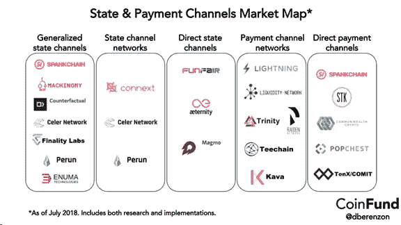

# 2.比特币——闪电网络

如在区块链网络上观察到的，当前的平均交易价值是每笔交易大约 50 美元，交易费用是每笔交易 20 美元。这意味着 40%的交易成本。此外，大约需要一个小时(即 6 个区块来确认交易)因此，比特币核心开发者开发了一个闪电网络来提高区块链的 TPS。

**闪电网络**是一种“第二层”支付协议，运行在区块链的加密货币(如比特币)之上。它实现了参与节点之间的快速交易，并被吹捧为比特币可扩展性问题的解决方案。

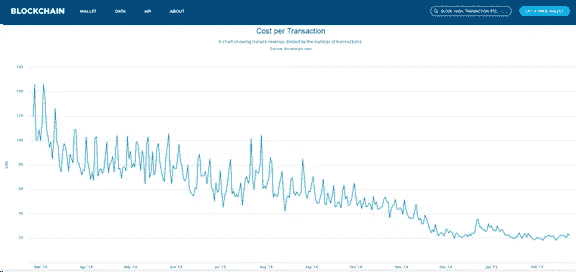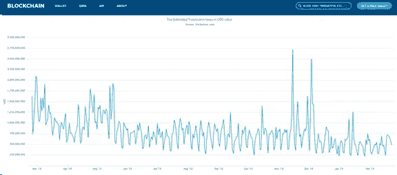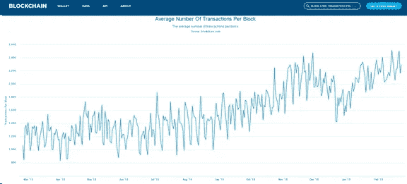

# 3.ETH 结垢解决方案— Caspar 与血浆和碎片

类似于以太坊，已经有不同的提议来解决可伸缩性问题，主要包括

*   Casper — Casper 指的是以太坊计划已久的共识算法 proof-of-stage。因此，它有望比目前的工作证明系统更节能、更平等。

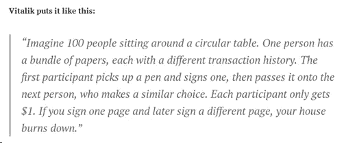

*   等离子—等离子是另一个以太坊扩展解决方案，它涉及主区块链上的第二层智能合同。类似于分片，这种方法将意味着整个网络不必验证和广播每个合同交易。理论上，Plasma 将用一个对等网络取代服务器群，在这个对等网络上，用户以可扩展和分散的方式共同运行 DApps。

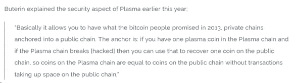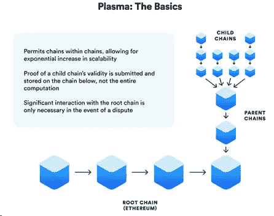

*   分片——分片基本上将数据划分到多个服务器上，而不仅仅是一个服务器上[类似于并行计算]。Buterin 在 Reddit 上阐述道:本质上，在这个向外扩展的过程中，分类账将会被分割。

“这是一个基于分支选择规则的机制(的一部分)的概念证明，该机制说明了如何通过专门的随机信标和碎片阻塞时间<10 seconds.”

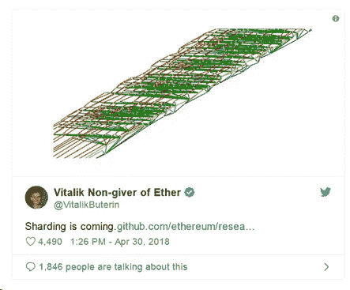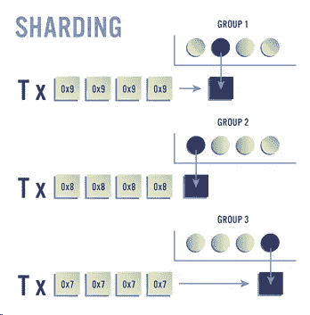

# 4\. Layer 2 Solution Review

BTC and ETH community are large enough to develop their own scalability solutions. What about other blockchain platforms? Who will solve their scalability issues? There come the following Layer 2 Solutions.

Layer 2 Solutions do not aim to solve the problem but several types of scalability issues: some to scale payment, some are used for scaling smart contract, and some to do computation off-chain. The common idea is to move most of the work off-chain and use permissionless blockchain as anchors to ensure security.

This section overviews major Layer 2 Solutions as follows.

## State Channel

*   [Celer Network](https://github.com/Awesome-Layer-2/Awesome-Layer-2/blob/master/README.md#celer-network)
*   [连接下一个](https://github.com/Awesome-Layer-2/Awesome-Layer-2/blob/master/README.md#connext)
*   [反事实](https://github.com/Awesome-Layer-2/Awesome-Layer-2/blob/master/README.md#counterfactual)
*   [游乐场](https://github.com/Awesome-Layer-2/Awesome-Layer-2/blob/master/README.md#funfair)
*   [闪电网](https://github.com/Awesome-Layer-2/Awesome-Layer-2/blob/master/README.md#lighting-network)
*   [流动性网络](https://github.com/Awesome-Layer-2/Awesome-Layer-2/blob/master/README.md#liquidity-network)
*   [Machionmy](https://github.com/Awesome-Layer-2/Awesome-Layer-2/blob/master/README.md#Machionmy)
*   [马格莫](https://github.com/Awesome-Layer-2/Awesome-Layer-2/blob/master/README.md#Magmo)
*   [秒差距](https://github.com/Awesome-Layer-2/Awesome-Layer-2/blob/master/README.md#parsec)
*   [Perun](https://github.com/Awesome-Layer-2/Awesome-Layer-2/blob/master/README.md#perun)
*   [Pisa](https://github.com/Awesome-Layer-2/Awesome-Layer-2/blob/master/README.md#pisa)
*   [雷电网络](https://github.com/Awesome-Layer-2/Awesome-Layer-2/blob/master/README.md#raiden-network)
*   [屁股链](https://github.com/Awesome-Layer-2/Awesome-Layer-2/blob/master/README.md#spankchain)
*   [精灵](https://github.com/Awesome-Layer-2/Awesome-Layer-2/blob/master/README.md#sprites)
*   [三位一体](https://github.com/Awesome-Layer-2/Awesome-Layer-2/blob/master/README.md#trinity)

## 侧链

*   [阿拉克里斯](https://github.com/Awesome-Layer-2/Awesome-Layer-2/blob/master/README.md#alacris)
*   Livepeer
*   [织机网络](https://github.com/Awesome-Layer-2/Awesome-Layer-2/blob/master/README.md#loom-network)
*   [MATIC 网络](https://github.com/Awesome-Layer-2/Awesome-Layer-2/blob/master/README.md#matic-network)
*   奥米塞戈
*   [血浆](https://github.com/Awesome-Layer-2/Awesome-Layer-2/blob/master/README.md#plasma)
*   [早教网](https://github.com/Awesome-Layer-2/Awesome-Layer-2/blob/master/README.md#poa-network)
*   [斯卡莱](https://github.com/Awesome-Layer-2/Awesome-Layer-2/blob/master/README.md#skale)

## 离链计算

*   [AlphaWallet](https://github.com/Awesome-Layer-2/Awesome-Layer-2/blob/master/README.md#alphawallet)
*   [Oraclize](https://github.com/Awesome-Layer-2/Awesome-Layer-2/blob/master/README.md#Oraclize)
*   完全
*   TEEX
*   [蜕变](https://github.com/Awesome-Layer-2/Awesome-Layer-2/blob/master/README.md#Transmute)
*   TrueBit

## 研究所

*   [终结实验室](https://github.com/Awesome-Layer-2/Awesome-Layer-2/blob/master/README.md#finality-labs)
*   [L4](https://github.com/Awesome-Layer-2/Awesome-Layer-2/blob/master/README.md#l4)

# 4.1 国家频道

## Celer 网络

**Celer Network** 是第一个**非连锁运营网络**，采用连贯的技术和经济架构，为区块链带来互联网级别的可扩展性。Celer Network 可横向扩展至每秒数十亿次链外交易，无信任、分散且私有。它包含一个分层架构，每层都有重大的技术创新:

*   灵活支持简单支付之外的广义链外 dApp 状态转换的通道构造套件，具有最小资金锁定的类似侧链的通道，等等；
*   有史以来第一个*可证明是最佳的*状态路由算法，事务吞吐量比最先进的解决方案高 15 倍；
*   一个离链操作系统，它极大地简化了各种平台上离链应用程序的开发和使用。

此外，Celer Network 提出了一种原则性的链外加密经济学设计，以平衡为实现可扩展性而做出的权衡**。**

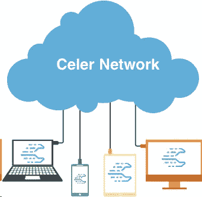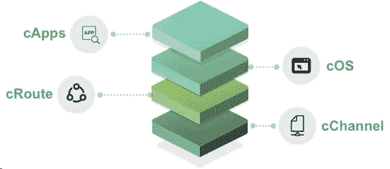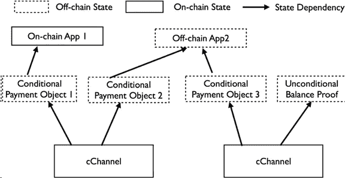

## 反事实

以太坊没有伸缩性，开发者很难在以太坊上应用像状态通道这样的第二层技术。因此，我们需要更好的 ETH 开发工具，Counterfactul 是一个开源项目，可以直接解决这个问题。目标是让开发者在 ETH 上使用状态通道构建他们的应用程序变得容易。这里是[网站](https://counterfactual.com/)上的项目， [github](https://github.com/counterfactual) 上的代码。

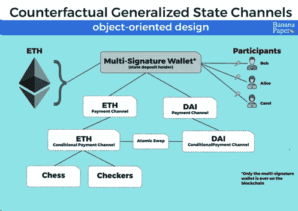

## 4.1.3 [磁性材料](https://github.com/Awesome-Layer-2/Awesome-Layer-2/blob/master/README.md#Magmo)

该框架旨在只支持回合制游戏，其移动不依赖于时间或渠道外部的数据。虽然这看起来有限制性，但许多国家频道用例都属于这一类:两人策略游戏(如国际象棋、五子棋、石头剪刀布)、可证明公平的机会游戏(如骰子、轮盘赌)、支付频道以及许多其他应用都可以构建在该框架之上。

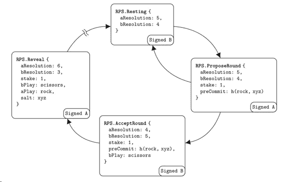

## 4.1.4 [Perun](https://github.com/Awesome-Layer-2/Awesome-Layer-2/blob/master/README.md#perun)

基于加密货币的虚拟支付中心(【http://eprint.iacr.org/2017/635】309[)。这引入了通道虚拟化的概念，作为使用基于哈希锁定的交易通过中介路由支付的替代方案。渠道虚拟化的主要优势在于，一旦虚拟渠道建立，无需与中介互动即可进行支付。这降低了费用和延迟，同时提高了可用性。](http://eprint.iacr.org/2017/635)

## 4.1.5 [国际学生评估项目](https://github.com/Awesome-Layer-2/Awesome-Layer-2/blob/master/README.md#pisa)

Pisa 专注于可用于构建任何应用程序(如支付、拍卖、董事会投票、游戏)的通用状态通道。核心贡献是一个新的协议，用于雇佣一个新的第三方代理，称为托管人。该托管器旨在帮助缓解国家渠道中的一个新假设，即要求每个参与方保持在线(与区块链同步)。[斜塔救援]

# 4.2 侧链

## 4.2.1 织机网络

你可能没有听说过 Loom Network，但你可能听说过 Cryptozombies，它教你使用 ETH 平台开发游戏。什么是织机网络？is Loom Network 正在构建一个基础设施平台来帮助以太坊扩大规模。

它允许开发人员运行大规模应用程序，并且是第一个在生产中投入使用的以太坊扩展解决方案。

简而言之，你可以把织机网络想象成以太坊之上的 EOS。

## 4.2.2 自动网络

Matic Network 致力于解决可扩展性和可用性问题，同时不损害去中心化和利用现有的开发者社区和生态系统。Matic Network 是现有平台的离线/侧链扩展解决方案，为 Dapps 用户功能提供可扩展性和卓越的用户体验。

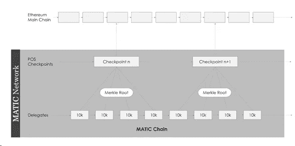

# 4.3 离线计算

## 转化

这是一个分散应用(dApps)开发框架，用于管理 DApp 逻辑和依赖关系，包括 Truffle、TestRPC (Ganache)、Web3、ETH 上的 IPFS。

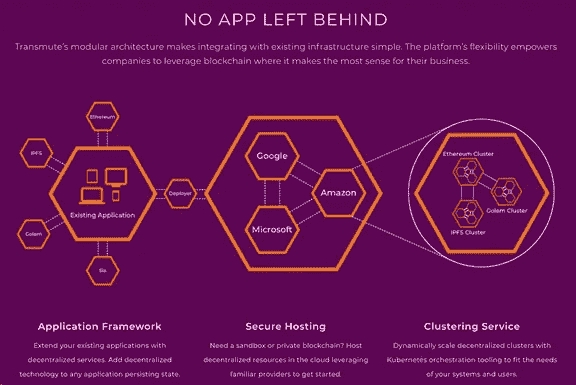

## TrueBit

Truebit 是一种帮助以太坊离线进行繁重或复杂计算的技术。这使得它不同于状态通道和等离子体，后者对于增加以太坊区块链的总事务吞吐量更有用。Truebit 不会让我们做更多的交易，但它会让基于以太坊的应用程序以一种仍然可以被主链验证的方式做更复杂的事情。

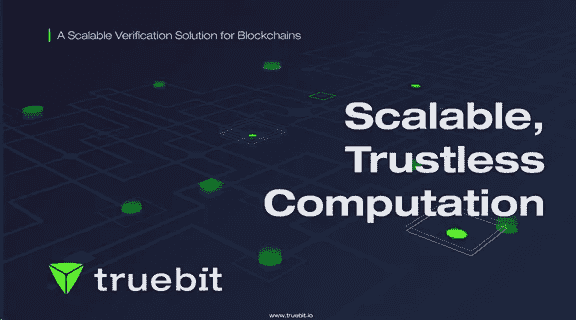

## 阿尔法钱包

AlphaWallet 由一群区块链爱好者、该领域的专家和商业专业人士创建，他们相信这项技术将影响全球数十亿人，并愿意为以太坊社区做出贡献。AlphaWallet (STORMBIRD PTE。LTD .)加入 EEA，帮助改进技术并支持以太坊在企业中的采用。

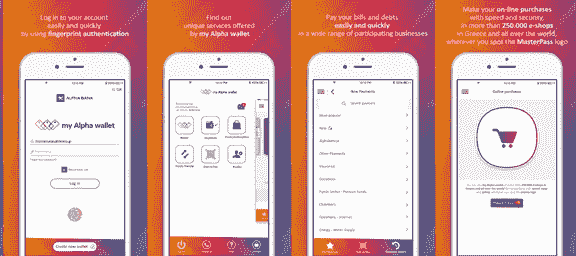

# 5.第二层令牌经济学

正如 Fred Ehrsam、Elad Gil、Vitalik Buterin 和许多其他人所观察到的那样，由于第二层解决方案不会将令牌用于任何公用事业目的，因此对核心协议创新和第二层基础设施的经济激励太低。因此，在这些领域资助项目的代币模型不幸地被过度使用了。

现有的外链解决方案经常受到一些批评，对他们的密码经济建设。这种批评的原因主要是因为由这种项目发行的代币除了用于未来可能的服务的支付媒介功能之外一无所有。这种批评的主题往往是“这种代币模式只是没有稳定价值的礼品卡！”、“如果我们可以用 X(此处插入你最喜欢的加密货币)支付，为什么还需要支付令牌？”，“你只是为了有代币而发代币！”。这份名单还在继续，意见也越来越苛刻。

Celer Network 尝试构建一个外链令牌经济学。他们创造了一个经济的概念，以确保充足和稳定的流动性+安全和灵活的可用性。为了“平衡”上述权衡，我们设计了 cEconomy，它具有如下三个紧密相连的组件。这可能是迄今为止围绕第 2 层解决方案最深入的令牌经济学设计。更多信息可以在[这里](/celer-network/celer-network-off-chain-crypto-economics-13999b11e635)找到。

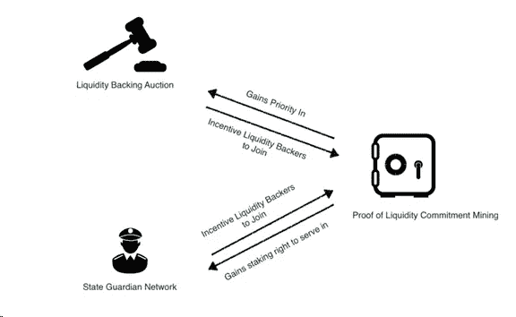

*   **流动性承诺证明(PoLC)** —为了维持一个繁荣的链外运营网络，我们需要持续“锁定”Celer Network 中丰富而稳定的流动性。PoLC 是第一个对此进行激励的机构。它就像一个打桩协议。为了参与其中，人们可以将他们的闲置流动性(简单来说就是 ETH)承诺(锁定)到一个“哑箱”，称为抵押承诺合同(CCC)，持续一段时间。
*   **流动性支持拍卖(巴丽)** —巴丽是流动性难题的后半部分。巴丽让国有渠道服务提供商能够通过“大众借贷”获得流动性。实质上，一个国有渠道服务提供商在 Celer Network 上启动了一个巴丽，在一定时间内“借入”一定数量的流动资金。
*   **州守护网(SGN)** —州守护网是一个特殊的*紧凑型侧链*，用于在用户离线时“守护各州”。CELR 代币持有者可以将他们的 CELR 押入 SGN，成为国家监护人。用户可以在任何时候向 SGN 提交自己的状态，支付一定的费用，要求监护人在一定时间内保护状态，以防她离线。基于状态散列和“责任分数”,随机选择多个监护人来负责该状态。

# 免责声明:

所有关于项目的信息都来源于在线资料，并不一定反映项目的当前状态。这里的信息不构成任何投资建议或任何投资的后果。

# 参考

*   [https://medium . com/@ Dennis _ z/2018-区块链即服务-baas-platform-review-part-I-a 5483321 DFB 8](/@dennis_z/2018-blockchain-as-a-service-baas-platform-review-part-i-a5483321dfb8)
*   [https://en.wikipedia.org/wiki/Lightning_Network](https://en.wikipedia.org/wiki/Lightning_Network)
*   [https://medium . com/future sin/ether eums-Casper-and-sharding-new-design-14014 e83d 55 f](/futuresin/ethereums-casper-and-sharding-new-design-14014e83d55f)
*   [https://www . news BTC . com/2018/05/03/can-Casper-plasma-and-sharding-elevate-ether eum-to-new-highs/](https://www.newsbtc.com/2018/05/03/can-casper-plasma-and-sharding-elevate-ethereum-to-new-highs/)
*   [https://blog . iqoption . com/en/how-do-Casper-plasma-and-other-ether eum-upgrades-works/](https://blog.iqoption.com/en/how-do-casper-plasma-and-other-ethereum-upgrades-works/)
*   [https://medium . com/l4-media/generalized-state-channels-on-ether eum-de 0357 F5 FB 44](/l4-media/generalized-state-channels-on-ethereum-de0357f5fb44)
*   [https://medium . com/state channels/state-channel-applications-1f 170 e 7d 542 e](/statechannels/state-channel-applications-1f170e7d542e)
*   https://medium . com/celer-network/celer-network-bring-internet-scale-to-every-区块链-b8f3c9a2d270
*   [https://medium . com/celer-network/celer-network-off-chain-crypto-economics-13999 b11e 635](/celer-network/celer-network-off-chain-crypto-economics-13999b11e635)
*   https://steemit.com/dapp/@sansteem/transmute-framework
*   【http://hackingdistributed.com/2018/05/22/pisa/ 
*   [https://medium . com/state channels/introducing-the-force-move-games-framework-for-state-channels-b 32 DD 953 c 13 f](/statechannels/introducing-the-force-move-games-framework-for-state-channels-b32dd953c13f)
*   [https://ethresear . ch/t/perun-virtual-payment-and-state-channel-networks/1685](https://ethresear.ch/t/perun-virtual-payment-and-state-channel-networks/1685)
*   [https://medium . com/loom-network/everything-you-need-to-know-on-loom-network-all-in-one-place-updated-regularly-64742 BD 839 Fe](/loom-network/everything-you-need-to-know-about-loom-network-all-in-one-place-updated-regularly-64742bd839fe)
*   [https://medium . com/matic-network/what-is-matic-network-466 a2 c 493 AE 1](/matic-network/what-is-matic-network-466a2c493ae1)
*   [https://medium . com/l4-media/making-sense-of-ether eums-layer-2-scaling-solutions-state-channels-plasma-and-true bit-22cb 40 DCC 2 f 4](/l4-media/making-sense-of-ethereums-layer-2-scaling-solutions-state-channels-plasma-and-truebit-22cb40dcc2f4)
*   [https://medium . com/true bit/developing-with-true bit-an-overview-86a2e 3565 e22](/truebit/developing-with-truebit-an-overview-86a2e3565e22)