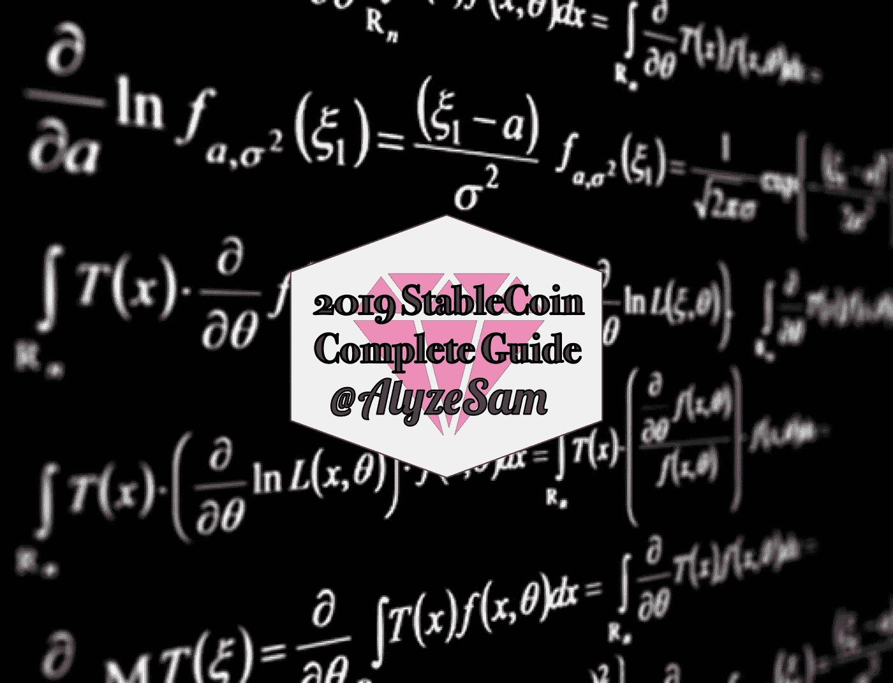
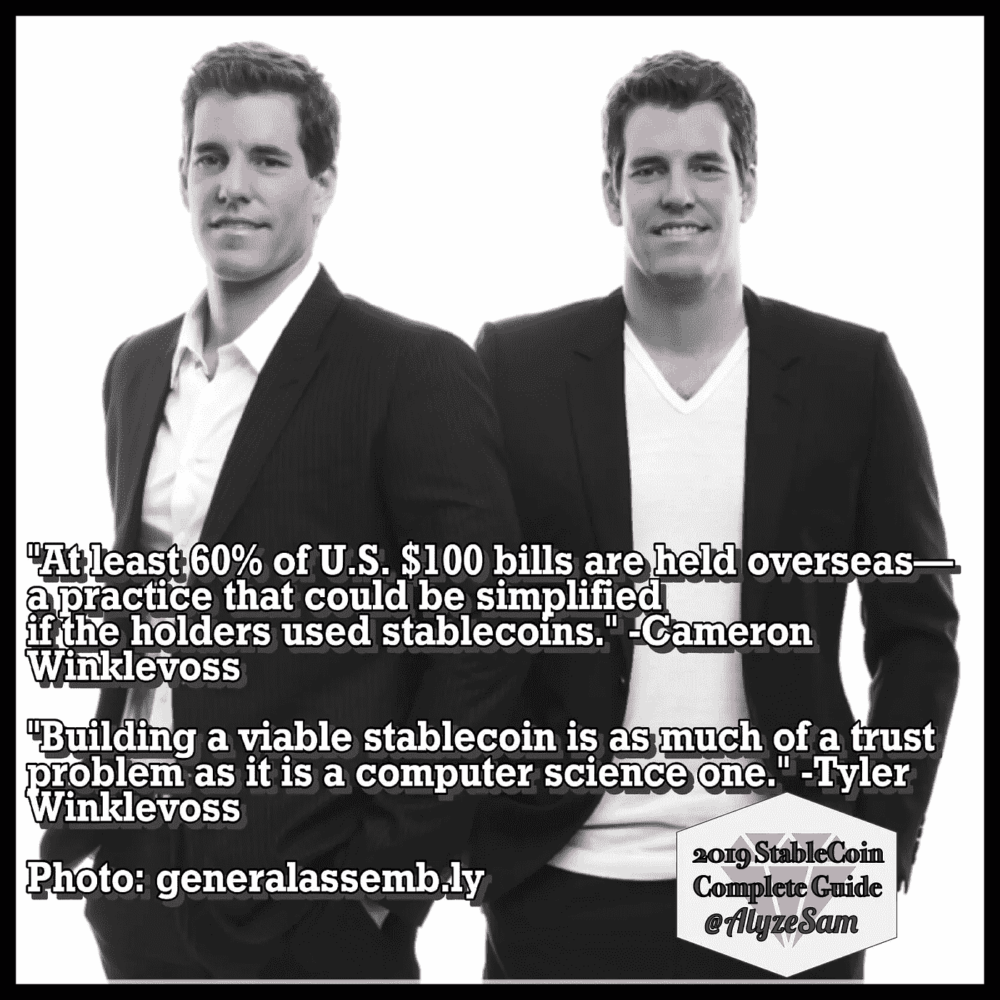
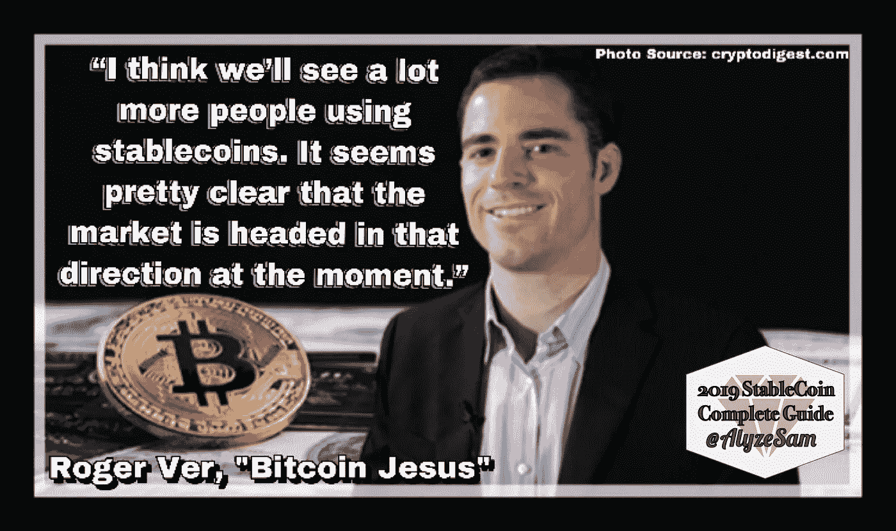
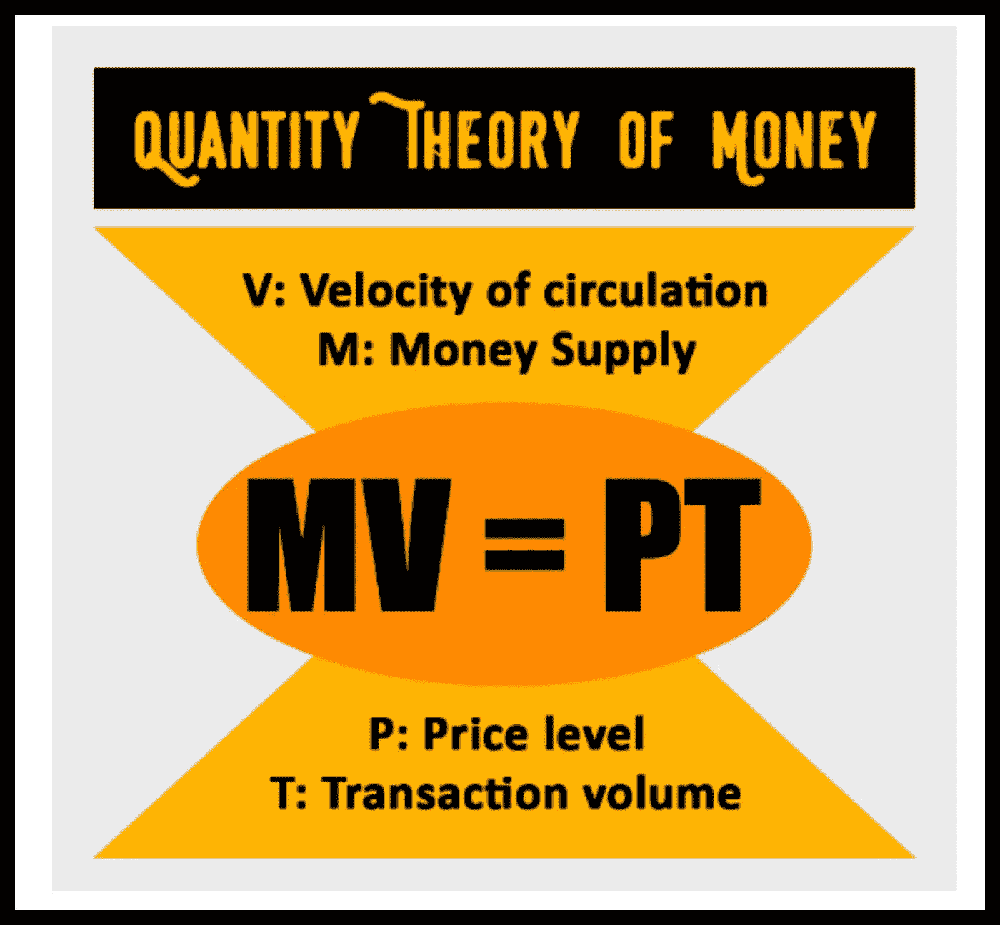
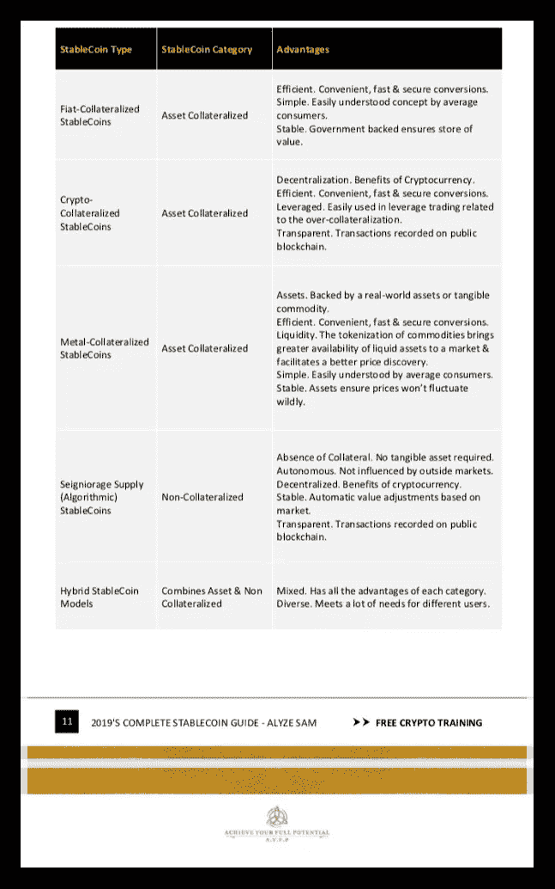

# 2019 年完整版稳定币指南 1/7

> 原文：<https://medium.com/hackernoon/2019-complete-stablecoin-guide-3f77896fb4ad>

## 第一章

在[的**凯尔·雷亚**创作工作室](https://creativecastlestudios.com)完成图形的时候，请欣赏我书中的短片！

# 什么是稳定币？

## 定义

简单来说，*a****stable coin****是一种与另一种资产挂钩的加密货币。*或者，一种完全与中央实体无关的全球数字货币。StableCoin 允许安全、便捷的交易，没有传统加密货币的高波动性，有助于加密货币的实际应用。

## 马厩的历史

虽然中本聪希望比特币被用作电子现金，但这种世界上第一种加密货币很少被用作日常交易的媒介。相反，波动性和高费用使许多加密货币不适合日常交易，因此更多地被用作长期投资。

## StableCoins 提供加密货币的所有好处，包括:

*   **密码安全**
*   **以数字方式转移资产的能力**
*   **快速交易**

稳定币的概念正式出现在第一版 [MasterCoin](https://medium.com/u/297d8215cbd?source=post_page-----3f77896fb4ad--------------------------------) 的 2012 年文档中。创始人声称 [Master Coin Inc](https://medium.com/u/5d13dbe4f3fd?source=post_page-----3f77896fb4ad--------------------------------) 协议*将允许加密货币与稳定的传统资产*绑定(**[**简史**](https://blog.omni.foundation) **)****

**直到 2015 年， **Tether Limited** 才发布了第一款完全成熟的 StableCoin。**系绳或 USDT** 与美元 1 : 1 挂钩。第二年，欧洲的一个模拟公司创造了 EURT。**

**2016 年 1 月，一位[以太坊](https://medium.com/u/d626b3859bc9?source=post_page-----3f77896fb4ad--------------------------------)平台投稿人，旨在打造稳定币， [Digix](https://medium.com/u/319ba551e007?source=post_page-----3f77896fb4ad--------------------------------) 道。 **DigixDAO** 有 **DGD** 代币支付与 **DGX** 不同的操作。批评指出，这不是一个稳定的硬币，与资产不是黄金有关，而是与 DigixDAO 的声誉和他们的数字版黄金有关。**

**2018 年带来了近三十个 StableCoin 项目，为 ICO 和 pre-ICO 做准备，许多人预计这一数字将在 2019 年呈指数级增长。**

# **目的和需求**

## **StableCoins 试图完成的目标。**

*   ****在外汇交易中的加密货币交易对之间创造稳定性**。**
*   **目标是在市场不稳定时使投资组合多样化。**
*   **渴望被用于**日常交易，**像菲亚特一样毫不费力。**
*   **帮助**采用**数字货币。**
*   **形成新的、**更好的金融生态系统**。**
*   **通过**最小化当前加密货币市场波动**来协助**投资预测**。**
*   **为全球提供稳定的货币，保护那些受恶性通货膨胀困扰的人。**

****

**In Photo; [Tyler Winklevoss.](https://medium.com/u/b10b3e1d983e?source=post_page-----3f77896fb4ad--------------------------------) [Cameron Winklevoss.](https://medium.com/u/6887991a6bc7?source=post_page-----3f77896fb4ad--------------------------------)**

## **稳定的竞争优势**

*   ****隐经济的好处。** *费用低廉。安全交易。有些或完全匿名。***
*   ****稳定**。*资产支持。***
*   ****区块链技术利用**。这个分类账系统带来了安全性、透明度和责任性。**
*   ****简单的**。*系统对于法币和数字货币用户来说很容易理解。***
*   ****收养中的艾滋病**。*从法定货币到加密货币使用的可接受桥梁。***
*   ****智能合约**。*用于保护投资中的所有利益相关方。***
*   ****规定**。*菲亚特-涉事流程。***

## **稳定的缺点**

*   ****集中式**。*挫败加密货币的目的。***
*   ****需要第三方**。*需要实体的信任。***
*   **需要外部审计。 *确保资产入账*。**
*   ****减去投资回报**。交易者和投资者寻求其他方式来获取经济利益。**
*   ****缺乏教育**。*新技术和新工艺的大规模采用需要时间。***
*   ****条例**。*菲亚特-涉及的流程。***
*   ****示例** : *与现实世界资产相关的稳定收入，例如:菲亚特，黄金，玉米，油，糖，钻石，小麦，糖。稳定的资产支持加密货币是任何消费者日常使用的伟大数字货币。***

## **特别有用的例子；**

*   ****固定收益投资**。资产管理变得简单。**
*   ****贷款支付**。具有“智能合同”好处的金融贷款。**
*   ****普通支付。**日常交易。**
*   ****经常性支付**。抵押贷款，租金，订阅。**

****

**[Roger Ver](https://medium.com/u/6d5e25448edf?source=post_page-----3f77896fb4ad--------------------------------)**

# **评估稳定系数的关键因素**

## **投资稳定的货币时，明智的做法是考虑几个关键因素；**

*   **可审计性。如果没有完全分散，用户是否有权审计系统的财务基础以确认抵押品？**
*   ****抵押**；担保品已定义。提供资产作为债务将被偿还的保证。“StableCoin 术语中使用‘抵押品’或‘抵押’时，它是借款人用来从发行人处获得贷款的资产。StableCoin 背后的抵押品是什么？**
*   ****回退方法。发生系统故障时有什么程序？资产会发生什么变化？哪些法规保护用户？****
*   ****成长**。这个生态系统有稳定的稳定性吗？**
*   ****保养**。总成本是多少？当高管理成本和过高费用存在时，生态系统失去效率，从而有市场波动的风险。**
*   ****钉住**；StableCoins 通常由实体“钉住”。Investopedia 指出，“钉住汇率制是央行的公开市场操作，旨在通过固定汇率来稳定本国货币与另一国货币的汇率。”**
*   ****可赎回性**；用户并不总是能够用他们的代币兑换基础资产，在投资之前应该知道这一点。**
*   ****稳定方法**。这是一项稳定投资的根本原因是什么？存在哪些保障和风险？**
*   ****透明度**。如果在集中式系统上，用户是否可以打开和查看分类帐？**

# **哪里找稳定；“货币数量论”**

**许多稳定货币白皮书声称，他们的加密货币是基于' ***货币数量理论*** '设计的，以控制货币供应，保持价格稳定为目标。**

**显示的信息图被命名为“***”***费雪方程。埃尔文·费雪和。米尔顿·弗里德曼(Milton Friedman)在 20 世纪根据 17 世纪古典经济学家流行的正统理论发展了这个方程，“T4”*“货币数量理论”***

## **单纯；**

> ****货币供应量乘以流通速度等于；价格水平乘以交易量。(M x V = P x T )****

****

> ***如果 M 翻倍而 V 和 T 保持不变，那么 P 理论上会翻倍；因此，每个货币单位的价值将会减半。***

**大多数著名的经济学家都认为“ ***”费雪方程式“在长期使用中是有效的。因此，根据 17 世纪以前的理论，经济学家认为稳定的货币将通过增加或减少货币供应来维持价格稳定。*****

**基于这一概念，StableCoin 可以保持稳定，因为如果加密货币的价值低于某一价格点，其用户就会迫使加密货币报废，从而减少代币的总供应量，从而稳定其价值。如果代币的价值超过某个价格点，用户就会增加供应，以保持加密货币的公平市场价值。**

**作为一个古老的理论，*货币数量论*存在一些问题一个例子是；假设 v 和 T 长期不变。因此，M 和 P 完全成正比。这是一种智能设计，因为这一理论是基于一种先进的经济结构发展起来的，这种经济结构假设货币流通速度和交易是一致的。**然而**，区块链项目变化迅速，技术还处于初级阶段，因此很难计算代币流通速度和交易量，并假设它们是恒定的。考虑到 V 和 T 是变量，可能是时候在费雪方程中加入更多的变量了。**

# **批评和引用**

**[Vitalik Buterin](https://medium.com/u/587a00dbce51?source=post_page-----3f77896fb4ad--------------------------------) ，在一篇 2014 年[以太坊](https://medium.com/u/53296029c4bd?source=post_page-----3f77896fb4ad--------------------------------)的文章中指出，“ ***是稳定价值资产所必需的*** *？鉴于人们对“区块链技术”的高度兴趣，加上我们在主流世界看到的许多人对“比特币这种货币”的不感兴趣，或许稳定货币或多种货币体系取而代之的时机已经成熟。届时将会出现多种不同类别的加密资产:用于交易的稳定资产，用于投资的投机资产，比特币本身很可能成为一种通用后备资产的独特* ***谢林点，类似于黄金的当前和历史功能。*****

****

**[Miko Matsumura EvercoinNews Miko Matsumura](https://medium.com/u/f329efb8f613?source=post_page-----3f77896fb4ad--------------------------------)**

**加州大学伯克利分校的计算机安全研究员， [Nicholas Weaver](https://medium.com/u/7c5d30f71cfa?source=post_page-----3f77896fb4ad--------------------------------) 写道，StableCoin Tether 是"*通过允许客户在不同加密货币之间切换来隐藏资金流动的主要工具。简而言之，它们代表了一个重大问题*。**

**Monax 的创始人普雷斯顿·伯恩(Preston Byrne)写道:“*菲亚特世界盯住资产的例子给我们上了一堂实物课，告诉我们为什么不要试图盯住汇率:因为你无法继续盯住汇率，除非你有能力补贴你与市场的意见分歧。”*后来声明，StableCoins 是*“一种技术神奇的想法，即加密货币可以告诉市场它的价格应该是多少，而不是市场决定加密货币的价格应该是多少。*”**

**分布式稳定硬币旨在实现比特币等加密硬币的特性(抵制审查的数字交易)和美元或黄金等传统金融资产的价格稳定性。这些系统不同于 Tether 等代币，在 Tether 等代币中，一个实体控制着一个美元抵押品池，最终使系统集中化，因此容易被当局关闭。”**

****

**[Matthew Leising Everipedia](https://medium.com/u/ff45a4363f3?source=post_page-----3f77896fb4ad--------------------------------)**

**[Nick](https://medium.com/u/f9970c430c6c?source=post_page-----3f77896fb4ad--------------------------------) Szabo 表示，央行可能很快转向加密货币来支撑储备，**金融巨头**2019 年 1 月 9 日报道。“*例如，在某些情况下，央行无法信任外国央行或政府持有的债券。已经开发的一个解决方案是让瑞士政府为您保管它——这不是信任最小化的解决方案。瑞士政府本身也受到政治压力的影响，因此一个更加信任最小化的解决方案是加密货币。”***

**泰勒·文克莱沃斯和泰勒·文克莱沃斯[比特币](https://medium.com/u/b10b3e1d983e?source=post_page-----3f77896fb4ad--------------------------------) ( **BTC** )看涨者和加密货币交易平台**双子星**的创始人表示*稳定货币和令牌化证券将为数字货币空间带来光明的未来*。这对双胞胎在 2019 年 1 月 14 日**财富**专注于加密的新闻片段 **The Ledger** 的采访中发表了他们的言论… *Cameron 进一步指出，现在至少有 60%的 100 美元钞票被海外持有，区块链上的美元将显著重塑全球货币市场。《T21》于 2019 年 1 月 14 日[发布。](https://medium.com/u/69c95f043525?source=post_page-----3f77896fb4ad--------------------------------)***

# **稳定存款的类型:资产抵押与非抵押**

## **定义资产抵押债券。**

**大多数国家使用的社会公认的货币被称为'*法币*，字面意思是'*不用努力就能创造出来的东西。直到 1971 年，世界货币都是由黄金支撑的。在印刷货币之前；钻石、白银、黄金、土地、地产和其他商品被用作易货交易的手段。从资产担保货币到当前法定货币体系的转变使得中央银行、政府、金融技术专家、私人实体和经济专家有了资产担保货币的概念。这些特定的 StableCoins 的目的是将区块链上的稳定资产标记为数字货币，以实现快速、安全和稳定的日常交易。该类别中的稳定币**应**保证以 1 : 1 稳定币兑换其基础资产。***

## **定义非抵押资产。**

**一种观点认为，菲亚特没有任何有形资产的支持，因此；为什么加密货币只应该有作为资产支持货币的价值？一种相反的观点认为，货币只需要有一个公认的“价值”就能成功。**非抵押稳定债券**作为一种媒介被创造出来。*这类数字货币没有任何“真实世界”或加密货币资产的支持；而是通过用户对保持某个值的期望来保持值*。目前唯一著名的**非抵押**方法是[铸币税供给(算法)稳定货币模型。](/@alyzesam/seigniorage-supply-algorithmic-stablecoins-w-complete-list-e1c98db3b9da)**

****

# **每个类别都细分了**

**我将在每个部分发布我的电子书的短片。我把稳定的硬币分成了三个不同的类别。三个是***，****一个是 ***非抵押*** ，剩下一组是 ***混合型*** 类别。这是希望对我们所有人有一个更简单的理解。***

***首先是*资产抵押债券、* ***法定抵押债券*** *。*我的[中](https://medium.com/u/504c7870fdb6?source=post_page-----3f77896fb4ad--------------------------------)刊是[这里](/@alyzesam/fiat-collateralized-stablecoins-68a63b042cbb)。***

***第二，**加密担保资产**。那篇文章可以看[这里](/@alyzesam/crypto-collateralized-stablecoins-w-complete-guide-74e261f34b1b)。***

***然后我们稍微改变了一下，参观了唯一的*非抵押稳定币*类别，**铸币税供应(算法)稳定币模型**。在这里享受对未来货币模型[的描述。](/@alyzesam/seigniorage-supply-algorithmic-stablecoins-w-complete-list-e1c98db3b9da)***

***接下来是一个简单易懂的类别，属于*资产抵押*集团；**金属抵押债券**列出了一长串有前景的项目[点击这里](/@alyzesam/a-simple-understanding-to-metal-collateralized-stablecoins-with-2019-complete-guide-626acf59e10d)。***

****敬请期待更多更新！如果你觉得这篇文章很有帮助，并愿意为我们的分散教育工作捐款，ETH 在这里接受:0x f 32 cc 9 FBA 17 f 389 f 734 e 7 aacacdfb 39 ba 7029 c 18****

******

# ***结束。***

## ***Alyze Sam 2019 年完整 StableCoin 指南的第 1/10 部分***

***这是一本即将出版的电子书的小“短片”的结尾。请继续关注，并帮助一位试图为区块链和科技新闻社区的女性服务的女士。怎么会？***

## ***说说你的想法。***

***‍I've 在过去的 11 年里一直是临终关怀护士！***

*   ***我**错过了什么**？***
*   ***你**会加什么**？***
*   *****你个人对 StableCoins 有什么看法**？***
*   *****我正在正确地工作吗**(可能不是！哈哈！)***

***我很乐意与大家进行专业的讨论、合作和交流。**喜欢任何反馈**，积极的和消极的；因为我在这里只是为了提高和教育自己/他人。***

# ***那么，我们如何才能互惠互利呢？***

## ***💻让我们在社交媒体上联系📱***

***-@ [LinkedIn](http://linkedin.com/in/AlyzeSam/)***

***-@ [instagram](http://instagram.com/AlyzeSam/)***

***-@ [脸书](http://facebook.com/AlyzesAntidote/)***

***-@ [推特](http://twitter.com/@AlyzeSam)***

******

# ***特别感谢我的新闺蜜兼同事里克·桑切斯 C137 书呆子马修。***

## ***你可以在这些地方找到这个提供免费教育的聪明的傻瓜球；***

***-@ [LinkedIn](http://linkedin.com/in/m-Bardel/)***

***-@ [instagram](http://instagram.com/MattyB3/)***

***-@ [Twitte](http://twitter.com/@MattyB3) r***

******

***[Matthew Bardeleben](https://medium.com/u/eb58c7ceaa96?source=post_page-----3f77896fb4ad--------------------------------)***

# ***接下来会发生什么？***

## ***三月的最后一周，谁会在阳光明媚的加州旧金山？***

***我将于 3 月 27 日在@DeloitteUS 的@blockchainSoTO Exec-Only SF 会议上发表演讲！w/@ Securitize @ DispatchLabsIO @ Truebitprotocol @ Aperture _ RE & more！***

***这是一个私人事件，但如果你感兴趣，给我或 TheBlockchainSociety.ca 大声喊出来。(我给你五折券！)***

***我希望你能收听。韦斯·威廉姆斯，凯尔·雷亚和我一起“公路旅行”。拍戏。这对每个人来说都会很有趣。呵呵***

***[德勤政府](https://medium.com/u/d658d8774e67?source=post_page-----3f77896fb4ad--------------------------------)、[派遣](https://medium.com/u/10c0c9c56456?source=post_page-----3f77896fb4ad--------------------------------)、[硬币与密码](https://medium.com/u/88ecffe5cb1?source=post_page-----3f77896fb4ad--------------------------------)、 [CryptoCentral.io](https://medium.com/u/84b549028bd?source=post_page-----3f77896fb4ad--------------------------------) 、[神盾](https://medium.com/u/94d01998d9cb?source=post_page-----3f77896fb4ad--------------------------------)、 [Jakub](https://medium.com/u/78b6281cf144?source=post_page-----3f77896fb4ad--------------------------------) 、[德勤数字美国](https://medium.com/u/d240cb36c972?source=post_page-----3f77896fb4ad--------------------------------)***

******

# ***来源***

*** [## 密码世界对“稳定密码”趋之若鹜——这里是你需要知道的关于它们的一切

### “Stablecoins”是目前加密领域最热门的东西，有超过 50 个项目正在开发中。“稳定币”是一种…

www.google.com](https://www.google.com/amp/s/amp.businessinsider.com/crypto-stablecoins-explained-bitcoin-ethereum-fintech-2018-9)  [## 稳定币指数

### Stablecoin Index 是一个开源工具，用于跟踪和比较各种 Stablecoin 项目。

stablecoinindex.com](https://stablecoinindex.com/projects/)  [## 一个完整的 A-Z 的稳定硬币-比特币新闻

### 今年，稳定的资本激增，以至于很难跟踪所有的资本。为了补救…

news.bitcoin.com](https://news.bitcoin.com/a-complete-a-z-of-stablecoins/)  [## 为什么你应该避免把稳定的收入作为投资

### 今天双子座推出双子座美元。这种加密货币与美元挂钩，但建立在区块链之上，所以…

www.forbes.com](https://www.forbes.com/sites/simonmoore/2018/09/10/why-you-should-avoid-stablecoins-as-investments/amp/)  [## 什么是稳定币？完整列表和指南——有点贪婪

### 什么是稳定币？完整的列表和指南快速内部导航:密码行业在过去三年中确实有所增长…

www.abitgreedy.com](https://www.abitgreedy.com/stable-coins/)  [## Crypto 中排名前 6 的 Stablecoins

### 稳定的硬币正迅速成为加密货币中的圣杯，有望成为在动荡时期储存价值的避风港…

medium.com](/@kingsleyadvani/the-top-6-stable-coins-in-crypto-e6f53e9b03be)  [## 什么是 Stablecoins？它们真的是解决方案吗？

### 我们都是 HODL 加密货币，不是吗？但是你有没有试过把它们花在商品和服务上而没有第二…

coinsutra.com](https://coinsutra.com/stablecoins/)  [## 密码市场上最好的稳定密码

### 谈论一个令人兴奋的加密类型是我写这篇文章的原因。这种类型的密码的 USP 不同于…

coinsutra.com](https://coinsutra.com/best-stablecoins/)  [## 一个完整的 A-Z 的稳定硬币-比特币新闻

### 今年，稳定的资本激增，以至于很难跟踪所有的资本。为了补救…

news.bitcoin.com](https://news.bitcoin.com/a-complete-a-z-of-stablecoins/)  [## 2019 年将是 Stablecoins - CoinDesk 的大年

### 当前稳定硬币发行的浪潮是当前基础加密资产熊市的结果，导致…

www.coindesk.com](https://www.coindesk.com/2019-will-be-a-big-year-for-stablecoins)  [## 密码世界对“稳定密码”趋之若鹜——这里是你需要知道的关于它们的一切

### “Stablecoins”是目前加密领域最热门的东西，有超过 50 个项目正在开发中。“稳定币”是一种…

www.businessinsider.com](https://www.businessinsider.com/crypto-stablecoins-explained-bitcoin-ethereum-fintech-2018-9)  [## 罗伯特·萨姆斯

### 阅读罗伯特·萨姆斯关于密码经济学的所有帖子

cryptonomics.org](https://cryptonomics.org/author/paralogical/)  [## 如何让“stablecoin”稳定？

### 在 2017 年飙升 1，300%以上后，比特币和其他替代货币被广泛认为是投机资产。但是对于许多预言密码…

hackernoon.com](https://hackernoon.com/how-to-make-a-stablecoin-stable-cf105ca2c708)  [## 稳定硬币指南:稳定硬币的类型及其重要性

### 本指南介绍了加密货币市场中不同类型的稳定货币及其在加密货币市场中的重要性

masterthecrypto.com](https://masterthecrypto.com/guide-to-stablecoin-types-of-stablecoins/)  [## Stablecoins - Multicoin 资本概述

### 自从我涉足密码学以来，稳定密码一直是我最感兴趣的领域之一。我第一次知道比特币是在……

多重资本](https://multicoin.capital/2018/01/17/an-overview-of-stablecoins/)  [## 密码行业在稳定密码的未来上下了大赌注

### 当商家开始引入比特币和类似的数字货币作为他们的支付方式之一时，他们很快…

www.ccn.com](https://www.ccn.com/crypto-industry-is-betting-big-on-the-future-of-stablecoins/)  [## 2018 年稳定资本状况

### VariabL CCO Nathan Sexer 对稳定的数字资产进行了详尽的研究，并解释了为什么它们对新兴市场至关重要

media.consensys.net](https://media.consensys.net/the-state-of-stablecoins-2018-79ccb9988e63)  [## 寻找稳定的加密货币

### 特别感谢 Robert Sams 对铸币股份的开发以及对如何正确评估……

blog.ethereum.org](https://blog.ethereum.org/2014/11/11/search-stable-cryptocurrency/)  [## 分析 4 种稳定的共现——共现

### 在传统股票市场被认为是灾难性的价格波动每天都在发生…

coindiligent.com](https://coindiligent.com/analysis-types-of-stablecoins)  [## 了解三种类型的稳定图标

### 稳定币是一种加密资产，具有保持价格稳定的机制。鉴于…的不稳定性

coincentral.com](https://coincentral.com/types-of-stablecoins/)  [## 加密先驱尼克·萨伯:央行可以求助于加密来支持储备

### 加密货币先驱 Nick Szabo 认为，在地缘政治不确定性上升的情况下，各国央行可能很快会转向…

cointelegraph.com](https://cointelegraph.com/news/crypto-trailblazer-nick-szabo-central-banks-could-turn-to-crypto-to-support-reserves)  [## 文克莱沃斯双胞胎相信稳定的、标记化的证券是密码创新的未来

### 泰勒和卡梅隆·文克莱沃斯曾说过，稳定的债券和令牌化的证券将为…

cointelegraph.com](https://cointelegraph.com/news/winklevoss-twins-believe-stablecoins-tokenized-securities-are-future-of-crypto-innovation)  [## 比特币交易指南:区块链新闻和加密货币评论

### 比特币是一种基于区块链分布式账本技术的加密货币。比特币是一种点对点的电子现金…

bitcoinexchangeguide.com](https://bitcoinexchangeguide.com/)  [## 比特币论坛-索引

### 比特币论坛-索引

比特币论坛-Indexbitcointalk.org](https://bitcointalk.org/)  [## 区块链和技术领域的职业生涯

bit.ly](http://bit.ly/2OhSm0Z)  [## Coinspeaker -区块链、加密货币、金融科技、ICO、STO 和物联网新闻。

### 关于比特币、以太坊、XRP 和加密货币、区块链技术、ICO、STO、FinTech、物联网的最新消息…

www.coinspeaker.com](https://www.coinspeaker.com/)  [## 最新比特币、区块链和以太坊新闻

### Cointelegraph 关于密码行业的最新消息。关于比特币，以太坊，区块链，采矿，…

cointelegraph.com](https://cointelegraph.com/)  [## 协同情报——加密经济的数据层

### 跟上新加密经济的实时市场数据，以便做出更好的投资决策。

www.cointelligence.com](https://www.cointelligence.com/)  [## 更敏锐的洞察力。更明智的投资。

### 股市基础想知道股市到底是怎么运作的？这本指南将教你一些基本知识。最佳经纪人…

www.investopedia.com](https://www.investopedia.com)  [## 维基百科(一个基于 wiki 技术的多语言的百科全书协作计划ˌ也是一部用不同语言写成的网络百科全书ˌ 其目标及宗旨是为全人类提供自由的百科全书)ˌ开放性的百科全书

### 维基百科是一个免费的在线百科全书，由世界各地的志愿者创建和编辑，由维基媒体托管…

www.wikipedia.org](https://www.wikipedia.org/)***