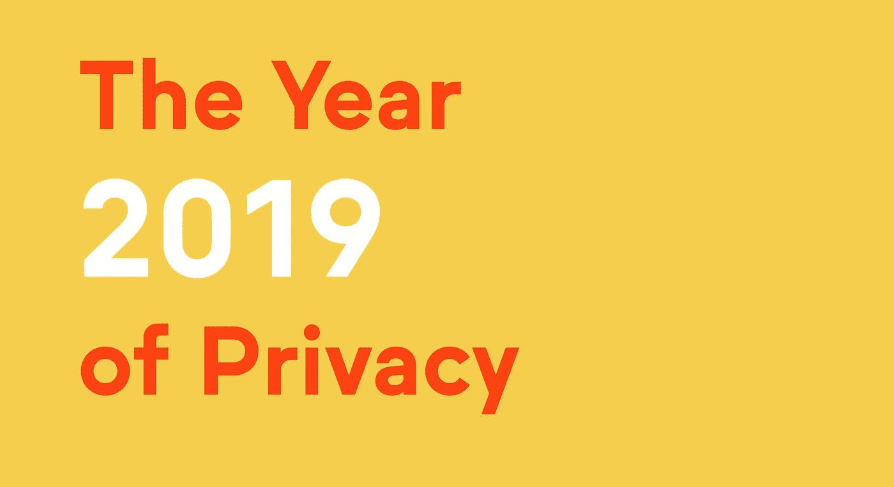

# 2019 年将是隐私年

> 原文：<https://medium.com/hackernoon/2019-is-the-year-of-privacy-1cbef3746673>

今年，人们对隐私的担忧日益加剧。

随着数据收集能力的提高和公司收集空前数量的用户数据，数据泄露的规模、频率和影响也同样扩大了。这些破坏降低了消费者的信任度，并导致政府审查的增加，是数据保护不足和对数据共享和使用限制不足的结果。

随着数据价值的上升，在使用数据和保护隐私之间取得平衡将变得越来越重要。如果做不到这一点，就会产生数据孤岛，从而大大降低数据对创新和社会福利的价值。新兴的隐私保护技术有助于提供双赢的解决方案，提供前所未有的用户隐私保护，同时支持新的数据应用。

区块链提供透明度，但不提供隐私:在当前的区块链平台上，交易和数据是公开可见的。隐私保护技术与区块链相结合，可以实现新的分散式应用程序，在保护数据的同时，为用户提供对数据使用方式的透明度和控制。这些*隐私优先的应用*将有助于恢复消费者的信任，创造一个良性循环，促进数据驱动应用的发展。

我们认为，2019 年将出现隐私优先应用的巨大转变，这是由三个相辅相成的趋势推动的:用户控制自己隐私的需求增加，新隐私法规的推出，以及隐私保护技术的进步。

# 用户会要求隐私

数据泄露和隐私侵犯在 2018 年升级。包括脸书和谷歌在内的大型科技公司因未能保护用户数据而遭受批评，从银行到零售，几乎每个行业都遭受重大数据泄露。

剑桥分析公司丑闻表明，依赖于用户数据收集和货币化的商业模式是一种微妙的平衡行为，往往会使企业的利益与其服务的用户发生冲突。这一事件提醒人们，对于许多互联网服务来说，在使用服务和放弃个人隐私之间是有权衡的。

这些问题导致公众对收集用户数据并将其货币化的组织的不信任感增强。它提高了对当前数据保护不足的认识，导致许多人放弃使用产品和服务，担心他们的数据会被出售或滥用。

2018 年我们看到了这种趋势的迹象。随着用户开始抗议滥用他们数据的公司，像#DeleteFacebook 这样的活动以病毒般的速度传遍互联网；苹果公司首席执行官蒂姆·库克称隐私是一项“基本人权”，引发了人们对“数据-工业复合体”危机的担忧。

许多迹象表明，2019 年将是一个转折点，届时消费者将集体*要求*隐私保护和控制其数据使用方式的能力，并将选择退出不提供这种服务的服务。

# 隐私法规将成为现实

2018 年，欧盟《通用数据保护条例》(GDPR)正式出台，以加强消费者隐私保护。

这种趋势正在扩展到其他国家和美国的各个州。将于 2020 年生效的加州消费者隐私法是最严格的州级保护措施之一，要求收集用户信息的公司负责任地使用这些信息，并在数据使用方面向消费者提供透明度。

美国联邦政府的监管已经在收紧，很可能会出台更多的法规。2018 年，谷歌首席执行官桑德尔·皮帅和脸书创始人马克·扎克伯格都被国会传唤，回答有关他们公司数据做法的问题。越来越多的政府审查和巨额罚款的风险将促使其他公司积极主动地保护隐私。

监管政策的这一转变将迫使隐私保护不足的公司采取行动。采取强有力的隐私保护将是一种生存需求，而不是一种奢侈。对于绝大多数收入和增长依赖于利用用户数据的技术公司来说，及时部署新的隐私保护解决方案至关重要。

# 隐私保护技术成为一种可行的解决方案

好消息是，2018 年隐私增强技术的研发取得了重大进展。零知识证明和同态加密等加密技术见证了区块链社区越来越多的研发活动，他们认为隐私对于支持和推动许多新的区块链应用至关重要。

虽然这些加密技术很重要，但它们还不能用于一般的应用。零知识证明和同态加密可能非常慢，比本机执行慢几千到几百万倍。

我们认为基于硬件的方法因此至关重要，2019 年将会看到基于硬件的安全计算方法的兴起，包括基于硬件的加密技术加速以及可信硬件。

专用硬件，如专用集成电路，可以提高加密技术的性能，使简单的应用触手可及。另一项被称为*可信硬件*的技术将进一步扩展安全计算的应用领域。

可信硬件提供了一个名为 *secure enclave* 的安全执行环境，允许以接近本地的速度执行代码，同时将数据和代码与机器上运行的其他软件(包括操作系统)隔离开来。可信硬件将在保护隐私的同时，允许大规模执行复杂的工作负载，从而在区块链上实现广泛的新应用。

世界上最大的芯片组制造商已经在从服务器到笔记本电脑的产品中提供安全的 enclave 芯片组。2018 年，几家主要的云提供商开始提供对云中安全飞地的访问，进一步提高了这项技术的可用性。

此外，2018 年发布的 [Keystone](https://keystone-enclave.org/) secure enclave 标志着第一个以开源形式提供的通用安全 enclave 框架。这一里程碑将降低开发具有安全飞地的芯片组的障碍，加快采用速度，并加快安全硬件技术的研究。

[差分隐私](/oasislabs/what-data-privacy-means-for-blockchain-31639b25fb67)是另一项有前途的技术，它提供了强大的、正式的隐私保证。去年，差分隐私实用技术的研究活动有所增加。

这些技术在与区块链结合时尤其有效。2018 年的数据泄露事件使消费者越来越怀疑不透明的集中式解决方案。上述技术可以为区块链增加隐私，提供透明度和隐私的理想组合，而不依赖于中心方。

2019 年将是隐私年。这三种力量——用户意识和关注度的提高、监管政策的变化以及隐私技术能力的提高——的融合将会使隐私问题变得更加突出，并开创一种隐私优先应用的新模式。

*了解更多关于*[*Oasis Labs*](http://www.oasislabs.com)*:*

*   *发邮件至*[*info@oasislabs.com*](http://info@oasislabs.com)
*   *Oasis Devnet 的文档:*[*https://docs . Oasis cloud . io*](https://docs.oasiscloud.io/)
*   *绿洲快讯:*[*www.oasislabs.com/community*](http://www.oasislabs.com/community)