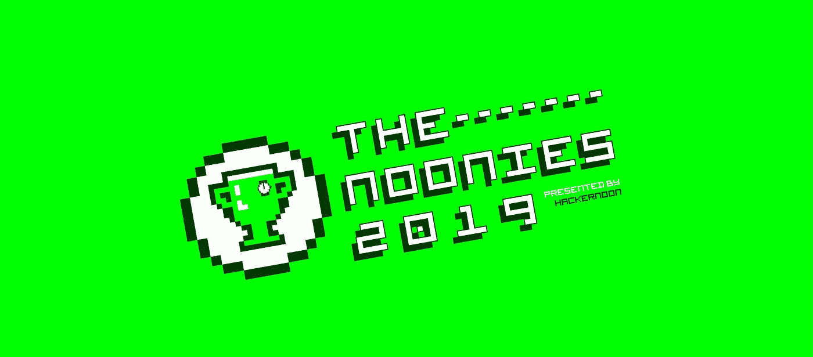

# 🏆2019 年 Noonies 获奖者揭晓

> 原文：<https://medium.com/hackernoon/2019-noonies-winners-announced-32841dcda30e>

## 黑客正午奖

*你*[投了](https://hackernoon.com/hacker-noon-awards-and-the-winners-of-the-2019-noonies-are-mg61306w) *。你* [*推文*](https://twitter.com/search?q=%23noonies&src=typed_query&f=live) *。你黑了平台作弊。*

## ***noones——科技行业最环保的奖项；由 Hacker Noon 与***[***Stream***](https://bitly.com/2NYm3t5)***合作打造——旨在表彰 2019 年及以后互联网中最好和最差的人和产品。***

超过 55，000 张**选票** — **投给了 457 位诺贝尔奖提名者** — **横跨 50 个奖项类别，**我们非常激动地宣布这些享有盛誉的奖项 *—* 的获胜者，其中只有两个奖项因不真实的投票行为而受损！

> “中午了！非常感谢[社区](https://community.hackernoon.com/)花时间投出 55k+的选票，确定了 Hacker Noon 奖的获奖者，”Hacker Noon 首席执行官兼创始人 David Smooke 说。
> 
> “真有趣。很高兴看到社区为他们最喜欢的 Noonie 提名者做了他们的案例。总的来说，我们也很高兴在定制投票技术上有所尝试。我们期待为互联网如何管理、排名和分发内容做出更多贡献。”

## 🥇 [**现在查看所有 NOONIES 获奖者**](https://hackernoon.com/hacker-noon-awards-and-the-winners-of-the-2019-noonies-are-mg61306w) 🥇

## 感谢所有参加我们第一个年度奖项 Noonies 2019 的[黑客 Noon](hackernoon.com) [社区](community.hackernoon.com)成员。

***带着对我们牛逼赞助商的特殊呐喊，***[***stream . io***](https://bitly.com/2NYm3t5)***。Stream 构建可扩展 feeds，活动流&聊天；它们简单而强大的 API 被一些最大最流行的应用程序所使用。***

我们期待着明年更大更好的中午。

[回到互联网](http://hackernoon.com)，

黑客正午编辑团队🔏

[hackernoon.com](http://hackernoon.com)