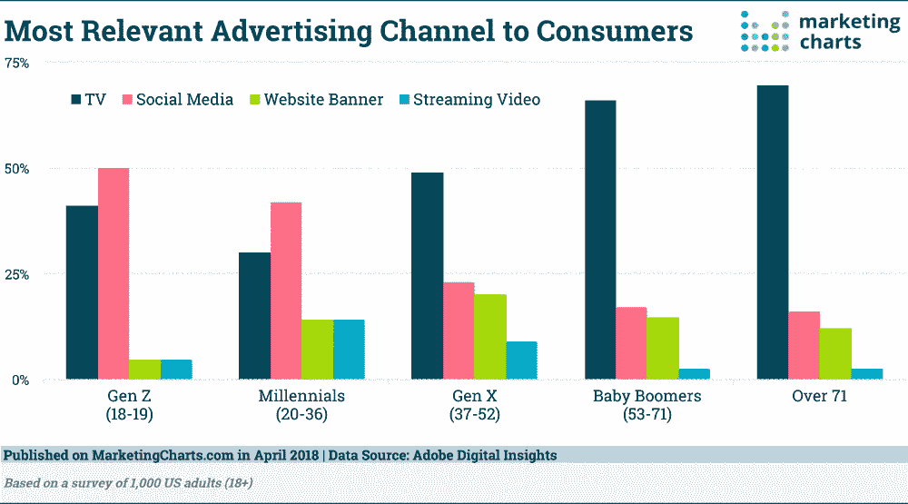
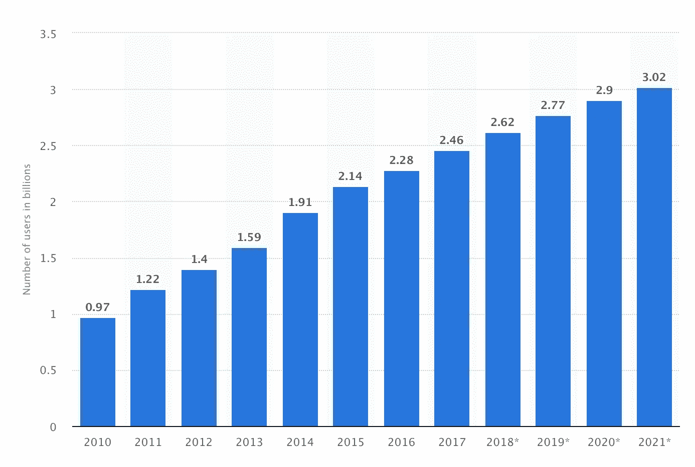
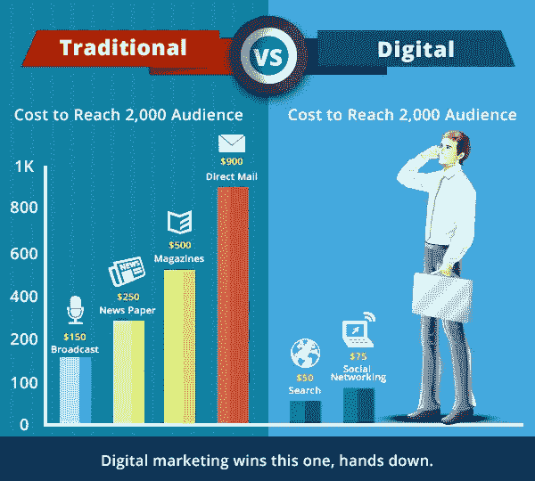
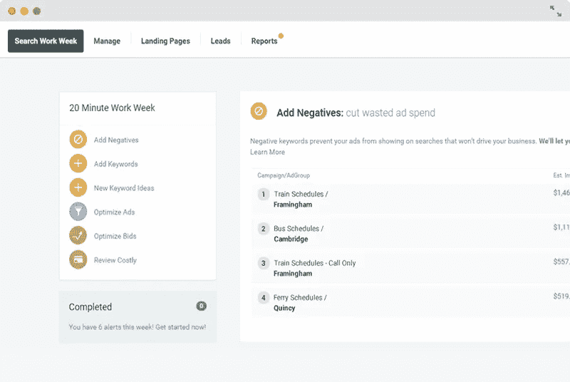
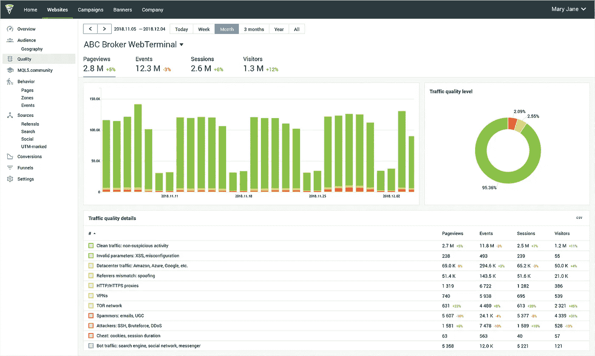

# 营销人员的 2019 年技术趋势:你的目标有多精确？

> 原文：<https://medium.com/hackernoon/2019-tech-trends-for-marketers-how-finely-tuned-is-your-targeting-f782502ff928>

## "如果你试图和每个人交谈，你不会接触到任何人."

视频可能已经杀死了电台明星，但当谈到 21 世纪的营销时，社交媒体已经牢牢地瞄准了所有的前辈。

令人吃惊的是，就在一代人之前，电视广告在有效接触目标受众方面是无可争议的王者。移动图像的自由，加上根据广告时间表选择广告受众的能力，解放了习惯于将广告压缩到印刷媒体或 30 秒音频剪辑中的营销人员。

*(Shifting sands: Audiences under 36 have already begun to heavily favour digital approaches to advertising such as social media as opposed to the more traditional television-based campaigns. Image:* [*Marketing Charts*](https://www.marketingcharts.com/advertising-trends-83013)*)*

万维网的力量和可访问性已经明显改变了我们所接触到的广告渠道的类型。虽然老一代人仍有望在电视上看到 70%的广告，但千禧一代和 Z 世代将会看到近 50%的定向广告来自社交媒体平台。

在由 50 名领先的营销专业人士、卫报新闻和媒体首席数字官[组成的小组会议上，Tanya Cordrey 热衷于强调](https://www.theguardian.com/media-network/media-network-blog/2014/sep/29/technology-changing-marketing-digital-media)尽管这个行业正在快速发展，但“真正有助于建立忠诚度和情感的品牌的创造力和激情是营销没有改变的地方。那些你仍然需要的东西，但营销的几乎所有方面都发生了非常巨大的变化。”

近年来，变革之风席卷了许多具有传统根基的行业，但很少有行业像营销一样如此迅速地适应了数字时代。显然，Cordrey 前面提到的来自行业专业人士的创造力和激情已经在寻找快速解决破坏性力量的方法中熠熠生辉。让我们更深入地了解一下 digital 的美丽新世界:

# 传统营销后的生活

数字时代融入营销世界的速度给全世界的决策者带来了巨大的挑战。[筹款组织 Just Giving](https://www.theguardian.com/media-network/media-network-blog/2014/sep/29/technology-changing-marketing-digital-media) 的首席营销官 Charles Wells 说:“未来营销人员面临的最大挑战不是如何提高技能，而是如何适应这个机器，以及我要努力成为哪个齿轮？”

威尔斯的话似乎有些不祥——好像数字机器是一只难以驯服的可怕野兽——但营销人员有前所未有的机会来调整他们的营销活动，以便更直接地吸引用户——更重要的是，在大约 15 年前被认为不可能的水平上与他们接触。

约翰·霍尔在为《福布斯》撰稿时解释道，现代营销取决于“从我到你”的转变

在过去，营销活动被迫变得更加一般化，更加注重与大众受众“交谈”,而不是真正与他们互动。“在过去，品牌会开发一个想法或信息，并推出给每个人和他们的母亲看，不管那些接收者是否真的想看，”霍尔阐述道。

今天，技术使品牌和营销人员能够创建活动和[内容，以迎合更多小众受众，而基于社交媒体的平台则让企业有机会准确衡量特定营销方法的总体接受程度。](https://hackernoon.com/3-tips-to-automate-content-marketing-to-drive-the-best-results-4e0cd8bab72d)

Twitter、脸书和 Instagram 等基于社区的数字空间在营销人员和他们的受众之间架起了一座桥梁，在这里参与的机会比比皆是。一个羽翼未丰的营销活动现在可以收到来自[近 30 亿社交媒体用户](https://www.statista.com/statistics/278414/number-of-worldwide-social-network-users/)的焦点小组的即时反馈，让决策者有充足的时间做出必要的调整和制定未来的策略。

*(Chart showing the number of social media users worldwide. Image:* [*Statista*](https://www.statista.com/statistics/278414/number-of-worldwide-social-network-users/)*)*

考虑到活跃在万维网上的用户数量，以及现在可以按需获得的几乎深不可测的大数据范围，公平地说，互联网已经成为目标营销历史上最有影响力的工具。我们不再被千篇一律的活动所束缚，这些活动旨在吸引尽可能多的潜在客户，而不具体吸引他们的任何特征。

霍尔总结道:“人们更加关注受众想要什么，以及他们喜欢如何接收信息、参与内容和与品牌合作。营销人员需要倾听受众的心声，并与他们真诚互动，他们需要按照受众的要求去做。技术可以提供帮助。”

# 市场活力

Alexa 的营销经理珍妮弗·耶斯贝克有一个哲学“在营销中，如果你试图和每个人交谈，你就无法接触到任何人。”

在过去的营销世界里，在合适的受众面前定位一项活动是一件棘手的事情。通过对他们阅读的出版物和消化的传统媒体进行有根据的猜测，他们花费了一小笔财富试图接触尽可能多的潜在客户。

由于数字时代的力量，我们现在可以根据庞大的人口统计网络，将内容、广告、行动号召直接放在我们试图接触的人面前，包括:年龄、性别、教育、婚姻状况、种族、宗教、政治信仰、个性、生活方式、职业、地区、国家和居住地等许多因素。

*(It’s never been easier to reach large audiences for less. Image:* [*Seriously Simple Marketing*](https://seriouslysimplemarketing.com/traditional-vs-online-marketing/)*)*

与传统营销形式相比，在网上吸引受众的成本可能非常低，但数字营销活动的真正价值来自于击中精确目标受众的能力。这确保了你的营销不会浪费在无动于衷的观众或读者身上，并最大限度地增加了你的活动机会，从而提高销售额和点击率。

像 Alexa 这样的组织允许决策者根据营销人员认为他们的目标受众是谁来打造他们自己的“买家角色”。买家角色需要对你的潜在买家的人口统计数据以及他们的影响力和购买决策进行一些反思。一旦营销人员创建了买家角色，Alexa 就可以在直接吸引他们之前，找到他们的目标受众在网上的确切位置。

[谷歌广告](https://ads.google.com/home/)是另一个精准定向营销的优秀工具。通过利用谷歌的大量功能，你不仅可以决定在为你的企业做广告时如何去当地或全球[做广告](https://hackernoon.com/testing-an-mvp-with-google-ads-and-analytics-8c605297aecd)，还可以精确地计算出如何为你的活动做预算——基于你的公司将收到的估计点击和呼叫。然而，大多数活动甚至还没开始就失败了。知道如何优化和有针对性地开展营销活动，对于降低成本、实现回报最大化至关重要。

像 Wordstream 这样的工具专注于优化谷歌和脸书的广告。

*(Image:* [*Wordstream*](https://www.wordstream.com/ppc-keyword)*)*

最后，很少有比通过脸书商业更有战略目标的营销工具。据估计，脸书拥有 23 亿用户，是一个强大的营销目录。通过该公司的可扩展选项，您可以将您的活动建立在获得更多受众参与、呼叫或点击的基础上，并根据人口统计、位置、兴趣、行为和/或联系等因素，将您的活动置于脸书用户的眼皮底下。

营销世界可能已经变得面目全非，但在 2019 年，微调你的活动以在你选择的预算内准确地接触到你想要的人从未如此容易。

# **观众适应**

现代营销也不一定要完全向外看，你自己的商业网站完全有可能传达多种个性，以吸引一系列不同的访问者，即使他们正在浏览同一个领域。

像 [Finteza](https://www.finteza.com/en) 这样的工具使网站所有者能够深入[流量](https://hackernoon.com/if-you-were-starting-from-scratch-in-2019-with-no-budget-what-would-you-do-to-gain-traffic-for-9196472e9d5e)分析，为网站管理员提供流量质量数据，然后可以用来优化不同的转化漏斗。

*(Showing traffic quality details. Image:* [*Finteza*](https://www.finteza.com/en/marketing-resources/5-traffic-details)*)*

你想在接下来的一个月里鼓励日本游客下载你的新 iOS 应用吗？你是否渴望向来自英语国家的观众推销你早期的黑色星期五销售价格？您是否刚刚在巴西推出了您的服务，并希望向他们展示介绍性产品？现在完全有可能为任何人修改你的网站。

简单地对普通观众说话的日子已经过去了。

欢迎来到精调目标营销的美丽新世界。