# 移动应用和网站的 22 个最佳汉堡菜单示例

> 原文：<https://medium.com/hackernoon/22-best-hamburger-menu-examples-for-mobile-apps-and-websites-a4fb9e97dcfe>

我们有 CSS/HTML、Bootstrap 和 Codepen 中的前 22 个汉堡菜单示例，可以帮助您建立一个功能完善、结构合理的网站和应用程序。

无论是浏览网页还是移动页面，我们都可以很容易地找到通常位于 UI 左上角的三重栏图标。它被称为“**汉堡菜单**，因为它模仿了三明治的形式，具有超级简单的设计和外观。

然而，由于不同的原因和场景，它得到了广泛的普及和争议。为了说明这一点，我们将列出汉堡菜单的利弊，并提供最受推荐的**汉堡菜单示例**和备选方案，为您提供评估标准，帮助您找到最合适的设计方案。

# 网站上的汉堡菜单是什么？

在网络上，汉堡菜单是一个图标，当点击它时会打开一个导航菜单。这种菜单是一堆类似汉堡包的三条水平线——上面的小圆面包、肉饼和下面的小圆面包。这样就叫了很多东西，像“热狗”、“配菜”、“煎饼”等等。它直到 2009 年才被广泛使用，这些年来已经变得不可靠了。

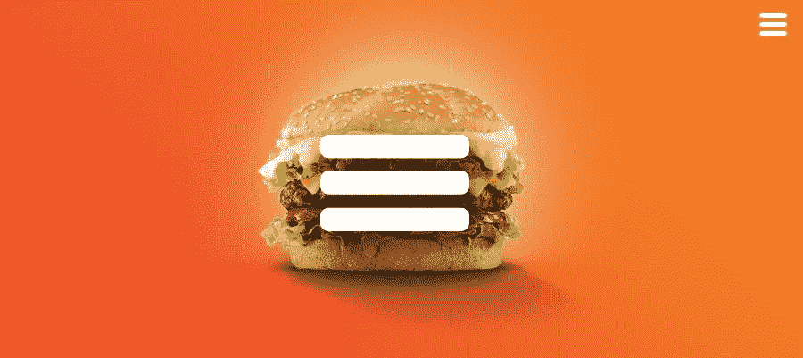

# 网络上汉堡菜单的优点:

**它通常很容易辨认。这实际上是一个普遍理解的符号，不需要翻译成其他语言。**

**它提供直接导航访问。**用户无需点击屏幕或滚动浏览所有内容，即可进入所需部分。

**让导航和 UI 更加清晰。**通过显示主导航并将二级选项转移到隐藏的侧菜单，让用户专注于核心功能，这也是你希望他们看到的。

# 网络上的汉堡菜单骗局:

它不是一次点击，因此点击率相对较低。

有点难以发现，并使其内部的功能显得不那么重要。

# 汉堡菜单应该在左边还是右边？

事实上，这个问题很难给出一个明确的答案，因为它应该根据您的需求和设计目的进行相应的调整。举几个例子，建议把它放在右边，这样更容易点击，因为大多数人都是右撇子，右上角比左上角更容易接触到。

此外，建议将其移至左侧，因为它完全符合[谷歌材料设计指南](https://material.io/design/guidelines-overview/)(其中右侧的图标是与应用程序相关的操作，菜单图标打开溢出菜单，包含设置、反馈等菜单项。).

# Android 或 iPhone 中的汉堡菜单是什么？

在 Android 中，汉堡菜单是当你从屏幕的右边缘或左边缘滑动 finder 时出现在屏幕上的滑动菜单。同时，当你点击动作栏中的 3 栏按钮时，它就会显示出来；在 iPhone 中，它与默认的后退按钮完全相同，你可以将它们挤在一起。

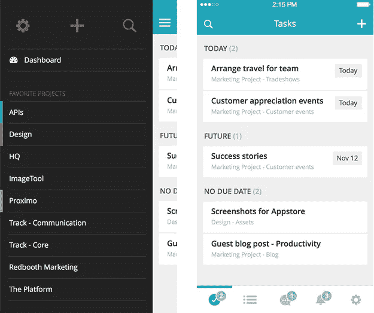

# 手机上的汉堡菜单专家:

它有助于将所有东西整齐收纳。

它一目了然，不需要用户从头开始学习。

它提供了更好的可用性，帮助用户更快、更容易地到达期望的目的地。

# 手机上的汉堡菜单骗局:

[使用 Mockplus 构建更快、更智能、更简单的原型](https://www.mockplus.com/?hmsr=blogm)

[免费上手](https://www.mockplus.com/?hmsr=blogm)

它可能会与 iOS 上的导航按钮冲突。

很难够到，尤其是当它位于屏幕顶部时。

# 前 22 个汉堡菜单示例

对于一个网站或应用程序，毫无疑问，创建一个简单但有用的功能菜单来导航即将到来的访问者。别担心，我们已经准备了简单的汉堡菜单示例，带有可用性和动画，为您提供所有需要的服务。

# 使用 CSS 的汉堡菜单

众所周知，汉堡菜单可以触发滑动抽屉导航，这对于响应式设计非常有用。如果你想找到新的方法将这三行动画合成一个整洁的 X，请参考下面的 CSS 汉堡菜单。

# 1.[用 JS 和 CSS 全屏汉堡大菜单](https://www.cssscript.com/demo/fullscreen-hamburger-mega-menu/)

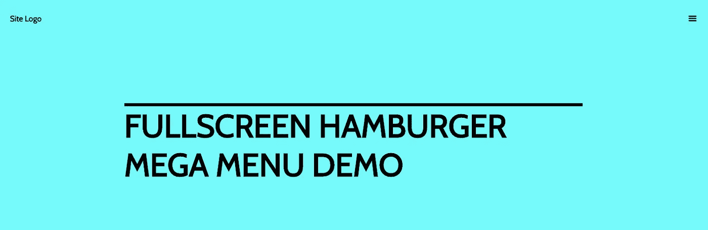

# 2.[纯 HTML/CSS 中的 8 个汉堡切换动画](https://march08.github.io/animated-burgers/)

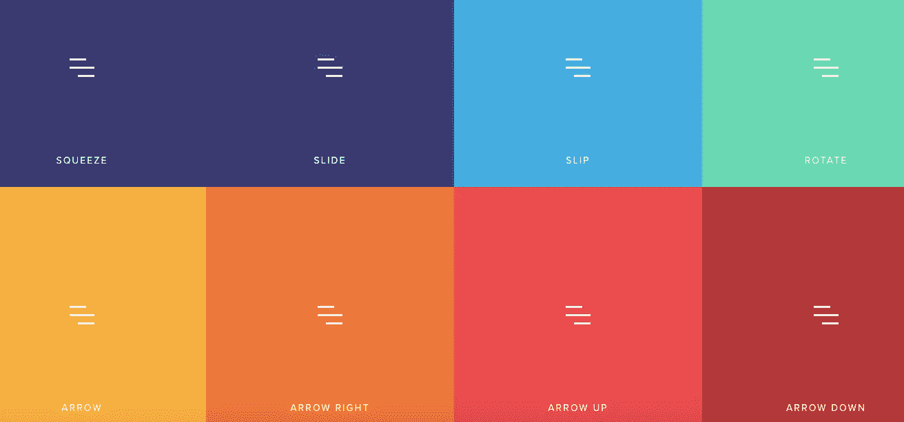

# 3.[CSS 和 JavaScript 菜单切换按钮转换](https://tamino-martinius.github.io/ui-snippets-menu-animations/)

# 4.[用纯 HTML/CSS 变形全屏汉堡菜单](https://www.cssscript.com/demo/morphing-fullscreen-hamburger-menu-pure-htmlcss/)

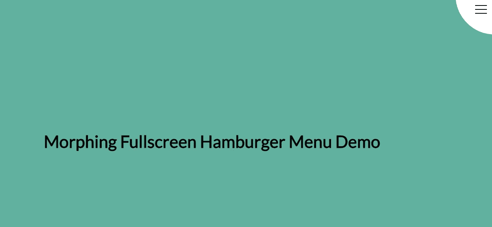

# 5.[基于 CSS Flexbox 的响应式导航](https://www.cssscript.com/demo/css-flexbox-based-responsive-navigation/)

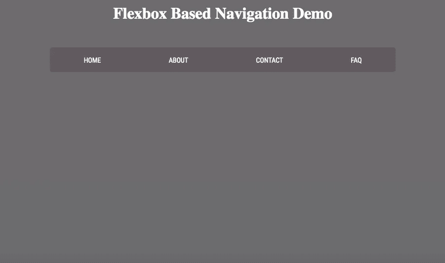

# 使用 Bootstrap 的汉堡菜单

以下是强烈推荐的自助汉堡菜单，你可以在下面找到广泛使用的左自助汉堡菜单。

# 6.[引导导航菜单模板](https://mobirise.com/bootstrap-menu/bootstrap-navigation-menu-template.html)

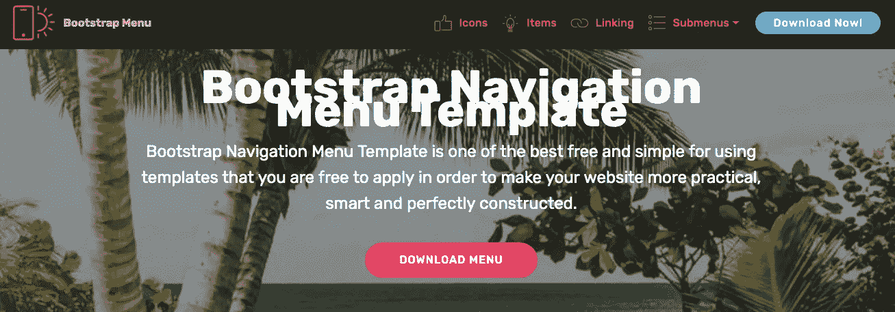

7 .**。** [**自举响应式菜单带子菜单**](https://www.mockplus.com/mobirise.com/bootstrap-menu/bootstrap-responsive-menu-with-submenu.html)

# 8.[自举手风琴菜单](https://mobirise.com/bootstrap-menu/bootstrap-accordion-menu.html)

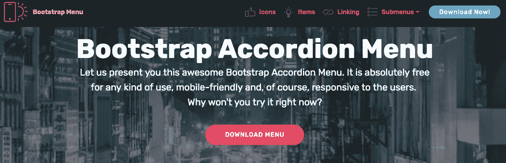

**9。** [**引导导航菜单**](https://mobirise.com/bootstrap-menu/bootstrap-nav-menu.html)

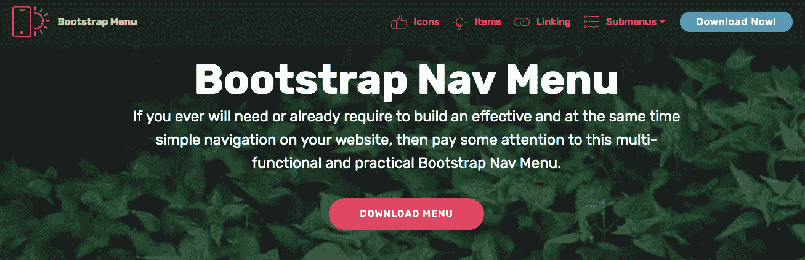

**10。** [**自举折叠菜单**](https://www.mockplus.com/mobirise.com/bootstrap-menu/bootstrap-collapse-menu.html)

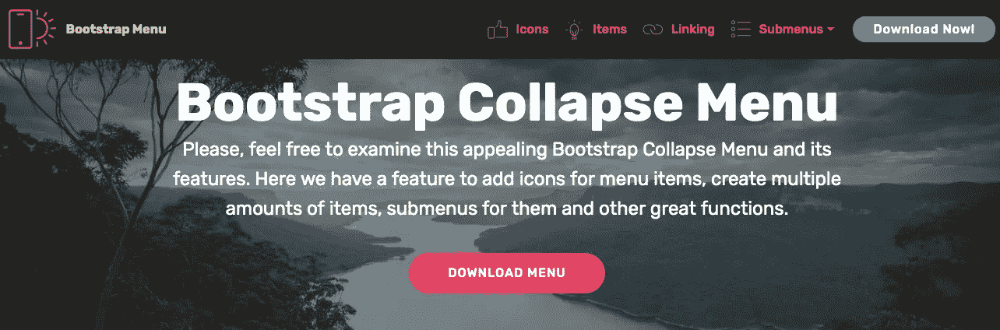

# Codepen 上的汉堡菜单示例

# 11.迈克尔·斯马特的汉堡奶酪菜单

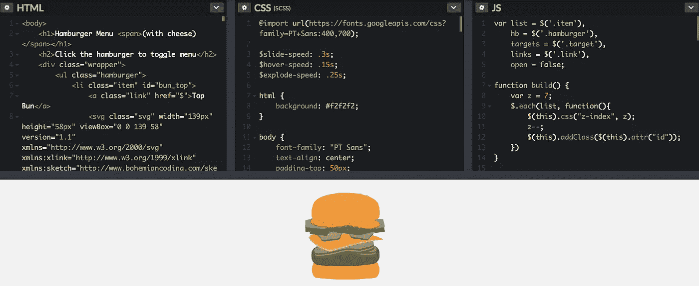

# 12.亚历克斯·柯文的原子菜单

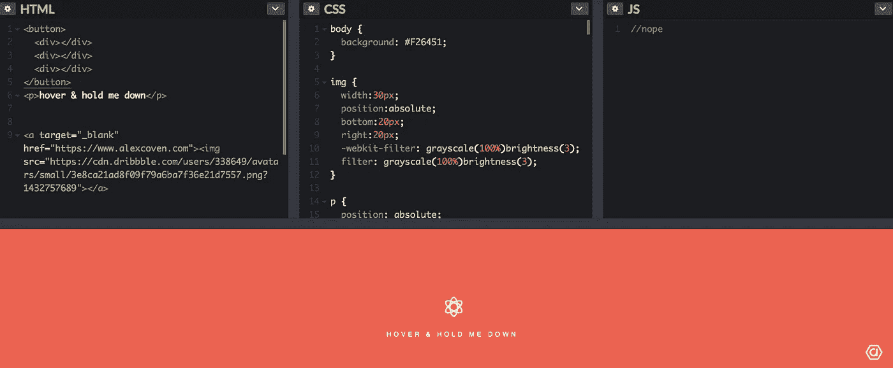

# 13.[塔米诺·马丁尼乌斯切换菜单](https://codepen.io/Zaku/pen/vcaFr/)

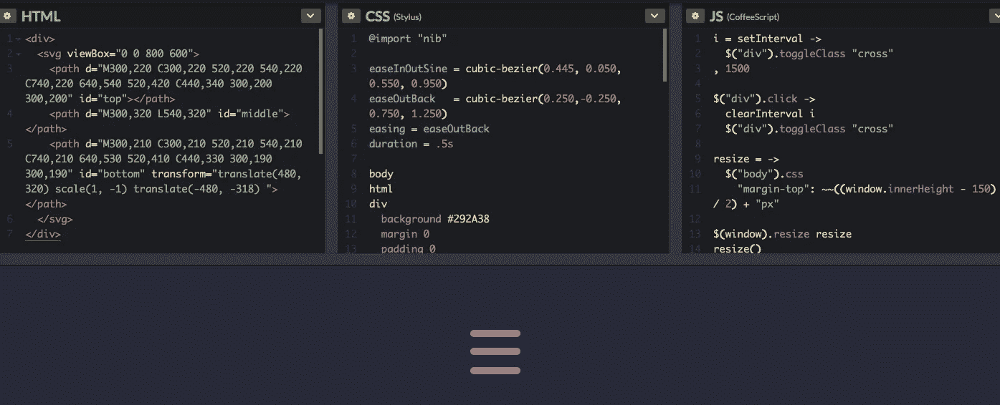

# 14.[杰西·考奇绘制的汉堡过渡图](https://codepen.io/designcouch/pen/hyFAD/)

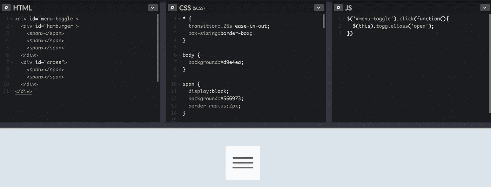

# 15.格雷厄姆·威尔斯顿的《霜冻》

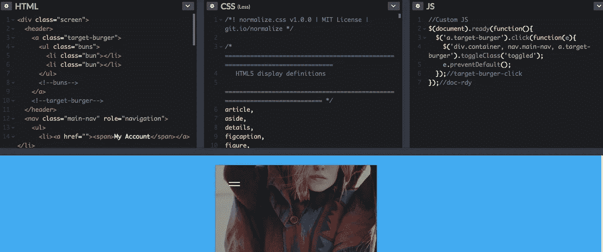

# 16.[Brenden palm er 的纯 CSS 全屏导航菜单](https://codepen.io/brenden/pen/VLjKMQ/)

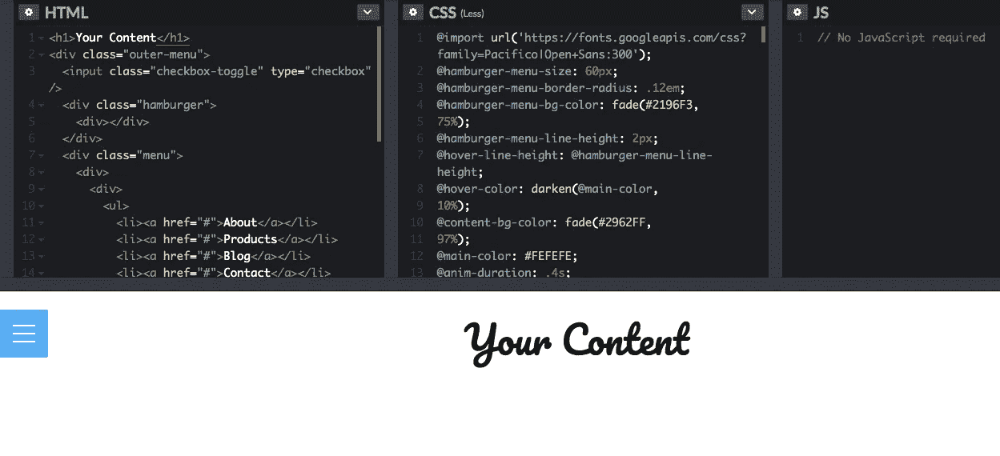

# 17.史蒂文·法布尔的动画汉堡

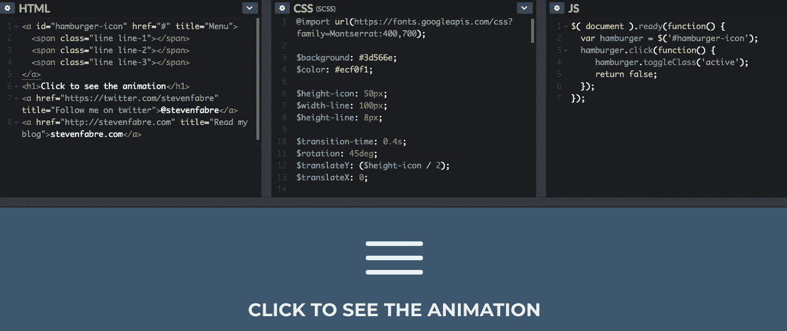

# 18.[BJack 的另一个顶级菜单](https://www.mockplus.com/codepen.io/BJack/pen/alGCs/)

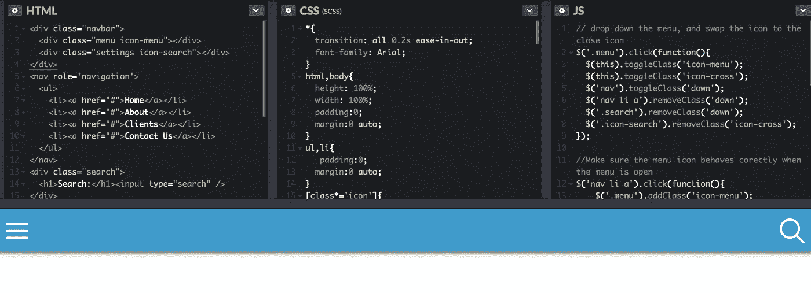

# 19.由梵持打开-关闭。TR

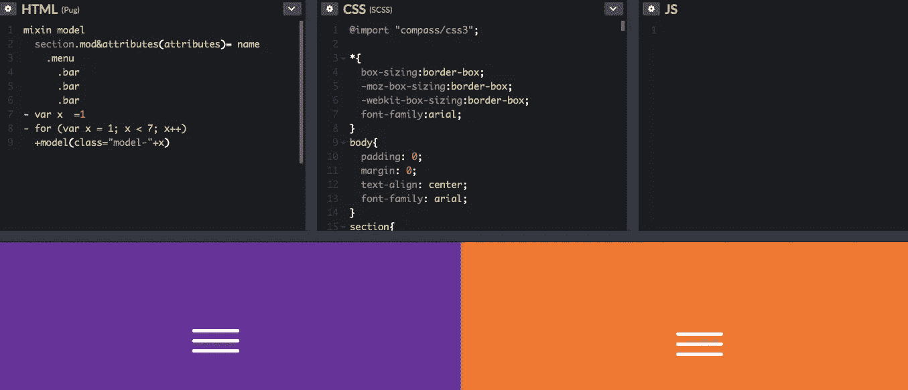

# 20. [CSS3 Only Hamburger 作者:Dawid Krajewski](https://codepen.io/DawidKrajewski/pen/GgErVO/)

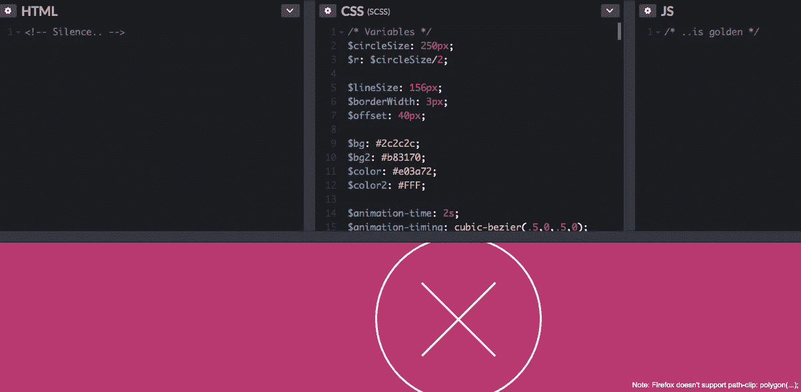

# 21.马修·拉德纳的动画汉堡菜单

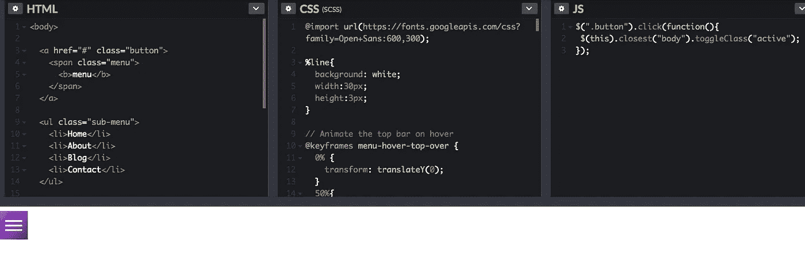

# 22.[塞尔吉奥变形汉堡](https://codepen.io/sergioandrade/pen/onkub)

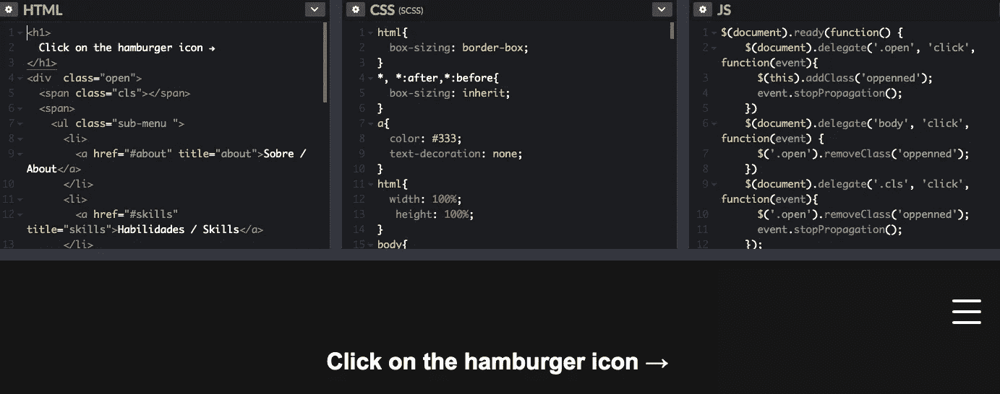

# 汉堡菜单选择

毫无疑问，汉堡菜单是对流行的 UI 元素的片面抨击，它已经被纳入到我们的网站或应用程序中。并且有许多顶级应用程序以这样或那样的形式使用它，以充分利用它的优点并尽力避免其缺点，从而实现它们的最终目标:

# 选项卡式菜单

如下，如果你的网页或应用程序中有少量独立的部分，并希望确保用户可以在不同部分之间快速切换，那么选项卡式菜单将是你的最佳解决方案。这里有一个用 Mockplus 做的例子供你参考:

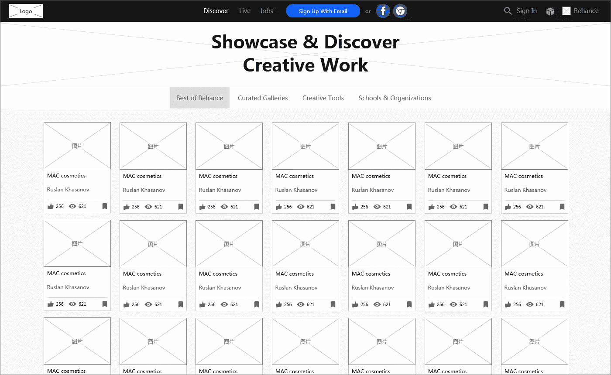

# 带有“更多”选项的选项卡

当菜单中有超过 5 个标签时，可以将超过 4 个标签的其他标签作为下拉菜单放入“更多”选项中。这里有一个 [Mockplus](https://www.mockplus.com/) 的例子供你参考:

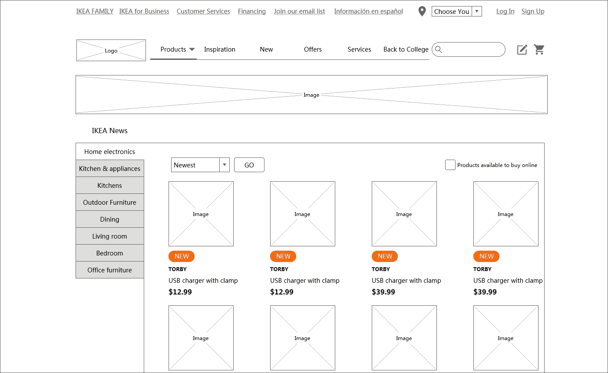

**浮动汉堡菜单，以及可以适合屏幕宽度的菜单。**

顺便说一句，除了快速原型制作工具，另一个一体化在线设计协作和移交工具 [**Mockplus iDoc**](https://idoc.mockplus.com/?hmsr=menu) 也是一个很好的设计工具，用于您的产品团队评论和讨论菜单/导航设计，创建原型，管理设计文档，交流，协作和移交自动标记，资产和规格的设计。

 [## Mockplus iDoc |在线设计协作工具和设计移交

### iDoc 是面向 UI 设计师和前端开发者的在线设计协作工具。它连接您的设计…

idoc.mockplus.com](https://idoc.mockplus.com/?hmsr=menu) 

# 结论

总而言之，汉堡菜单不好也不坏，你需要确保它是你设计的正确决定。此外，您可以运行 A/B 或用户测试来预测用户行为，并考虑/采用替代方案来帮助访问者获得效率和速度。希望以上汉堡菜单的例子能给你启发！