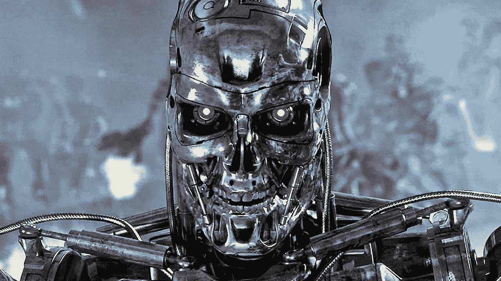

# 28 年前，我们被奴役的预言被预言了——而我们仍然没有听进去

> 原文：<https://medium.com/hackernoon/28-years-ago-it-was-predicted-and-we-are-not-listening-652c0be46df7>

> “未知的未来就在前方，我第一次满怀希望地面对它。因为如果一台机器，一个终结者，能够了解人类生命的价值；也许我们也可以。”—莎拉·寇娜

当我第一次听到这句话的时候，我还是个孩子，我们竟然认为机器有感情，这真是令人震惊。更有趣的是，这句话中提到人类不珍惜生命。

那时我并不是《终结者》的忠实粉丝，老实说，我仍然不是最大的追随者，然而，这部电影的结尾部分甚至在几年后的今天都深深地印在了我的记忆中。

《终结者》之后几年，《黑客帝国》的第一部电影上映了，从第一次开始，我就被整个概念、世界、角色和问题吸引住了，尽管从未停下来思考这部电影背后的一些推理，只是想，“伙计，太酷了！”

没有文字信息，只是整个概念对我来说是令人兴奋的，部分原因是我对编程感兴趣，老实说，试图变得“不同”，因为，你知道，在那个年龄成为 Neo 感觉很好，我不打算撒谎，现在仍然如此！

我已经看过《黑客帝国》很多遍了，但直到这些天我才真正思考过它对我来说意味着什么，或者我将如何把它与终结者联系起来。

我已经通勤上班一年多了。我大约需要 30 到 60 分钟才能到达那里，在此期间，我会听着金属音乐，阅读科技书籍，或者盯着城市的交通堵塞。我经常做的一件事就是在听音乐的时候观察其他人的行为，因为有时候这是一种让你的注意力从工作中转移出来的好方法，让你想些别的事情来改变一下。有一天我开始体验到，越多的人跳上火车，越明显的是一种特殊的行为:火车上的每个人都拿着他们的手机！我很震惊地看到每个人都几乎不眨眼地经历他们所看到的一切。最让我担心的是，我之前忽略了这一点，因为我一直在低头看手机。

你可能会想，现在是 2019 年，这种情况已经持续了几年，所以有什么大不了的？

对我来说，去年我的目标之一是更多地接触外部世界。这样做让我真正意识到它有多糟糕。我认为令人难过的是，从我强迫自己放下手机的那一刻起，我意识到这个世界是什么样子的，所有这些情况如何与至少落后于当前时代 20 年的电影深深联系在一起。

现在更常见的是，我发现自己在上下班途中观察他人，只是因为我想知道智能手机如何影响正常的人类行为。每天你都能看到人们撞到一起却不道歉的事情。父母如此沉迷于他们的手机，以至于忘记了看他们的孩子，夫妇们在整个 30 多分钟的车程中不会说一句话，去旅游景点有点像噩梦，特别是当每个人都想把同一张自拍发布到 Instagram 上的时候。

在 2019 年，我们可以说在软件开发方面有相当多的技术进步，所有这些都归功于我们一直连接的智能手机。总体而言，应用程序和工具正变得越来越智能，以向用户提供更深刻或更个性化的体验，但它们中没有一个甚至接近创造出如此聪明的东西，以至于将或可能超越人类(至少目前没有)。

由于智能手机，人类正在脱离其真正的本性，最棒的是，它不需要机器有自我意识、感觉或思考，而是需要一群聪明、勤奋的开发人员。我们更喜欢通过有限的语音信息联系，而不是真正的交谈。我们打断了真实的对话来阅读别人发给你的短信。我们更关心的是不知名的民间猫，而不是在我们面前寻求建议的朋友。我们寻求与“我们关心”的人建立更多的联系，这种联系是无意义的或肤浅的。我们太在乎别人如何看待我们的“完美”生活，而这一切都更容易实现，这要感谢我们日常喜爱和使用的应用程序。

从设计上来说，人类是一个社会物种，在我看来，尝试寻找联系或寻找一种让我们的社交更简单的工具是很自然的。但是我们“社交”的方式并不是最好的方式。如果我们更关心数字世界而不是现实世界，我们的现实很容易被一种想法取代，这种想法不一定是事实，只是我们想看到的。我们正在挖掘自己的坟墓，并允许控制机制。我们是造成这些情况的人，如果我们不改变这一点，我们将整天坐在椅子上，脸上贴着屏幕(瓦力？)，还是已经发生了？

像《黑客帝国》、《终结者》或这一类型的任何其他电影都是指这样一个时代(在一个虚构的[未来](https://hackernoon.com/tagged/future)中),那里有一台机器接管，我们人类被他们的意志所奴役。即使他们的主要论点略有不同，他们似乎都同意这样一个事实:为了这个世界，控制人类是最好的。

从目前的情况来看，指责我们是自己的恶魔的理由似乎很有道理， ***我们该怎么做才能改变这种状况呢？***