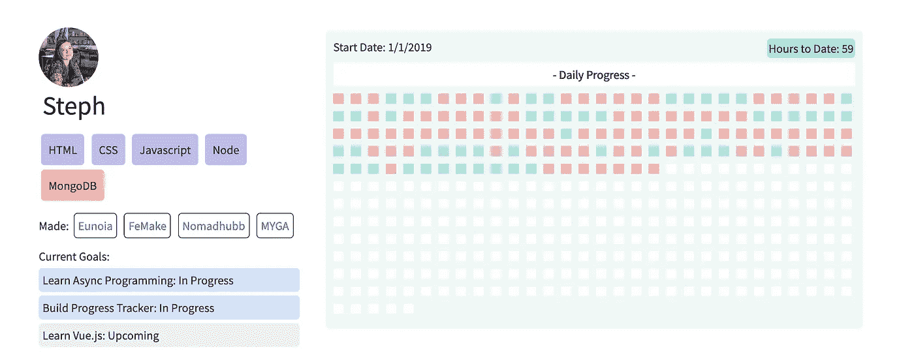
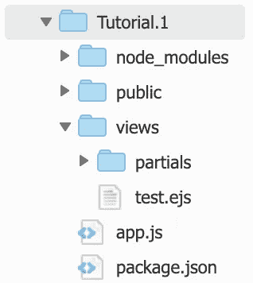
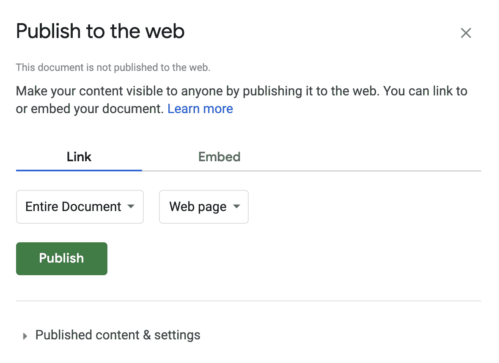
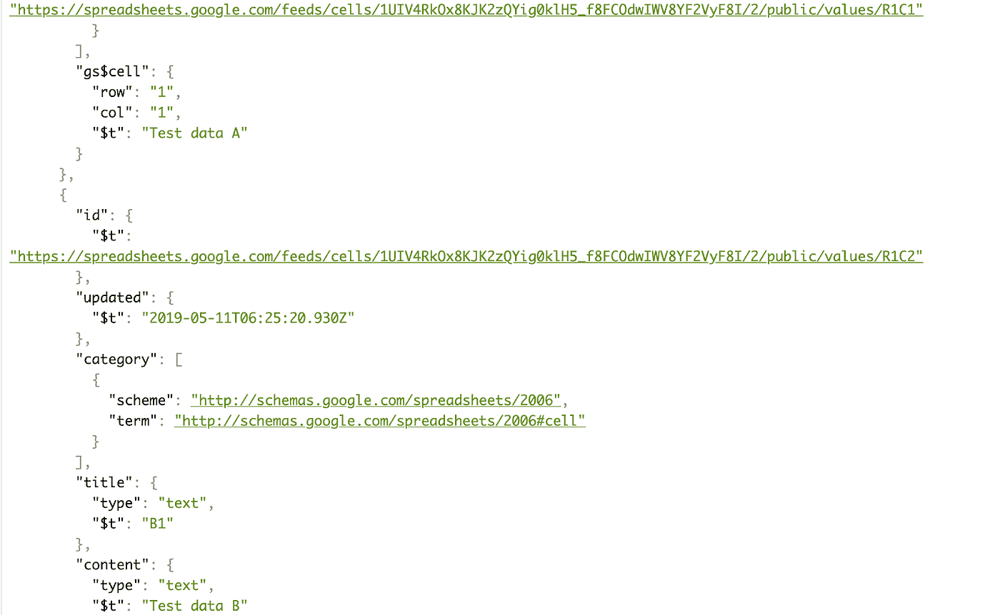
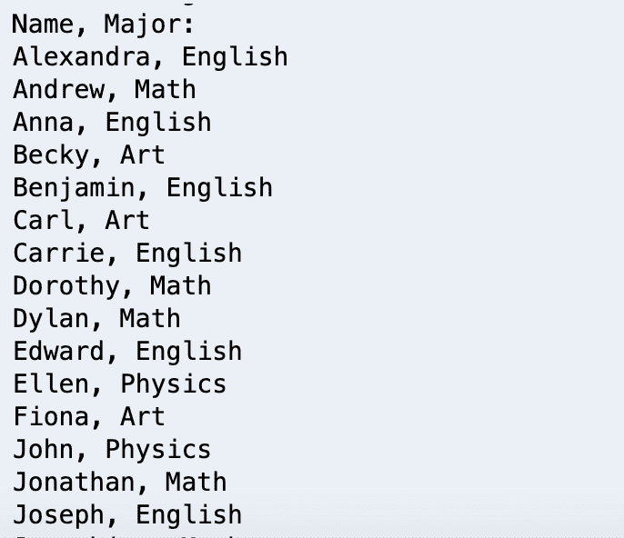
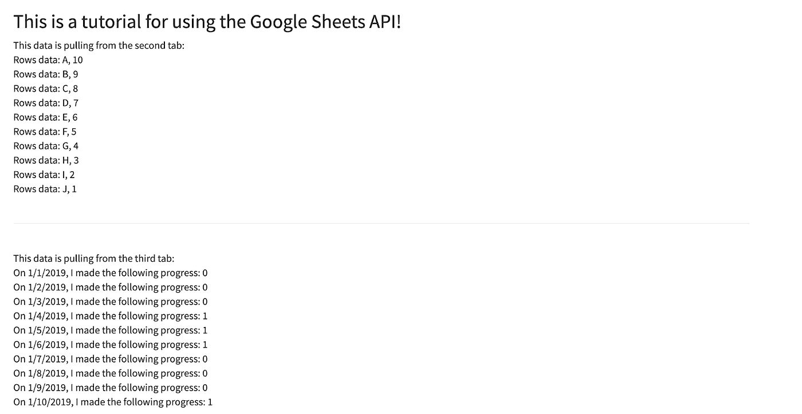

# 在 Node.js 中使用 Google Sheets API 的 3 种方法:教程

> 原文：<https://medium.com/hackernoon/3-approaches-for-using-the-google-sheets-api-in-node-js-a-tutorial-ebf276f0ad32>

*最初发布于*[*https://blog . steph Smith . io/tutorial-Google-sheets-API-node-js/*](https://blog.stephsmith.io/tutorial-google-sheets-api-node-js/)*。*


在学习编码一年后，我最近发现自己进入了异步 Javascript 的领域。

在过去的几个月里，我一直在努力学习这门语言的这个组成部分，并且不得不重温我已经学过很多次的[课程的部分内容。即使这样做了，我仍然感到很失落，不知道如何获取信息并将其转化为可操作的东西。](https://www.udemy.com/modern-javascript/)

在我最近对这些材料的回顾中，我意识到唯一能让它真正坚持下去的方法就是用它来创造一些东西。所以，我决定通过开发一个叫做[进程页面](https://progression.page)的工具来测试我的知识。在创建这个应用程序时，我确实觉得能够更好地利用异步工具箱中的工具。

Progression Page 是一个帮助人们跟踪和可视化他们学习编码的日常进展的工具，所以本着帮助他人学习的精神，我决定分享这个教程，以激励他人使用 Google Sheets 作为他们的数据库来创建迷你应用程序。

# 使用谷歌工作表作为数据库

**我在谷歌表单上追踪我做的每一件事**。我说的一切，就是一切。

我跟踪我锻炼的频率，我看了多少本书，我学习编码的频率，等等。我这样做是为了让自己负责任，因为我相信量化进展是“success"﹣not”的重要前兆，不仅在我的“工作生活”中，而且在所有方面。

由于跟踪我的努力对我的个人进步至关重要，当别人不这样做时，我总是感到惊讶，尤其是当缺乏跟踪往往会导致这样的结果时:


An all too frequent outcome of people’s journey learning to code.

我希望有一个地方，人们可以很容易地公开记录他们的编码进度，这样人们就可以对他们负责。这正是[前进页面](http://progression.page)所做的；它允许每个成员在谷歌表单中记录他们的日常进展，包括他们正在学习的内容、学习时间和学习频率，以及他们的技能、目标等。这些信息直接从表单中提取并显示在网页上。



Example of Progression Page output, with all data pulled directly from a Google sheet.

Progression Page 是人们使用 Google Sheets 作为数据库的众多例子之一。例如， [Sheet2Site](https://www.sheet2site.com/) 利用 Google Sheets 作为从活动到产品再到招聘信息的数据库。尽管使用工作表作为数据库肯定有缺陷。它的美妙之处在于，您(和其他人)可以根据需要轻松查看、编辑和缩放信息。考虑到这一点，我迫不及待地想看看人们用这项技术在指尖创造了什么。

# 前言

在开始之前，我想先说明一下，我的代码可能不是“最佳”的，或者没有按照它应该的那样进行重构。记住，我还是个 n00b(我们不都是吗？).

作为一个开发新手，在担心应用程序的可伸缩性或完美性之前，我专注于创建有用的东西。

我还应该提到，这篇文章是专门为那些使用 Node.js 的人创建的，尽管我确信它可以为其他后端量身定制。我不会从头开始介绍设置 Node.js/Express.js 应用程序的步骤，因此它实际上是为那些熟悉基础设施的人准备的。

本文将讨论的内容:

*   如何在 Node.js 中认证 OAuth2
*   如何通过 3 种方法连接 Google Sheets API with Node 来创建 Google 电子表格数据库
*   如何将 API 中的数据集成到 Express.js 应用程序中

事情说明本文将**而非**过一遍:

*   如何设计或部署网页
*   如何从头开始使用 Node.js 或 Express.js
*   如何跨其他后端语言使用 API

# 入门指南

首先，您应该有一个初始化了 npm 的基本节点应用程序。

从这里开始，您需要安装将用于该应用程序的软件包:

*   快速(用于呈现动态页面)
*   请求(用于发出 HTTP 请求)
*   fs(用于 Google API)
*   readline(用于 Google API)
*   Google API(用于 Google API)

```
npm install express ejs request gs readline googleapis@39 --save
```

确保在索引文件的顶部正确地要求了这些依赖项，如下所示。

```
var express    = require("express"), 
fs             = require('fs'), 
readline       = require('readline'), 
{google}       = require('googleapis'), 
request        = require('request'), 
app            = express();
```

从这里开始，您还应该将视图引擎设置为 ejs，以便程序识别正在呈现的 EJS 文件，而无需每次都定义文件扩展名(即:您可以轻松地调用`res.render('test'`而不是`res.render('test.ejs')`)。

```
app.set("view engine", "ejs"); 
```

# 在 Node.js 中设置路线

由于这个特定的应用程序将把提取的数据发送到一个网页，我们首先需要设置为这个应用程序服务的路由。首先，这可以是一条标准路径，我们将把它指向`test`子目录，呈现出`test.ejs`。我将为教程的每一部分编辑这个端点。

```
app.get("/test", function(req, res){ 
     res.render('test') 
});
```

# 设置呈现的页面

您需要创建一个视图目录来存放您的 EJS 文件。我还设置了一些我在节点应用程序中使用的其他东西，这些东西对于开始并不重要，但是对于本教程之后的其他步骤是必需的，比如添加样式。

*   我添加了页眉和页脚部分，尽管这些并不是每个应用程序都需要的。如果您不知道这些是什么，只需确保您的 EJS 文件像普通 HTML 文件一样包含所有必需的信息，如 DOCTYPE 和`<head>`部分。
*   我添加了一个公共目录来存放支持站点的样式和其他文件。为了让应用程序识别这个目录，在任何路由之前需要下面一行。

```
app.use(express.static(__dirname+"/public"));
```

一旦你采取了这些步骤，你的目录应该看起来像这样！



此时，您应该已经为我们的节点应用程序准备好了核心依赖项，所以我们可以开始使用 API 了！

# 将 Node.js 链接到 Google Sheets

本教程的大部分内容将是如何连接 Google API。有多种方法可以连接到 API，我将分享三种方法:

*   通过 V3 的 Google Sheets HTTP 请求
*   带有 OAuth2 的 Google Sheets API v4
*   谷歌开发者控制台和谷歌电子表格包

欢迎您使用下面的任何方法，并跳到对您最有帮助的方法。在开始之前，我应该提到我会鼓励大多数应用程序使用 v4，原因如下:

**使用 v3 HTTP 方法的理由:**

*   它更容易设置

**使用 v4 的理由:**

*   v3 最终会被弃用
*   使用 v3 方法需要发布电子表格
*   使用 v3 方法只允许读取，不允许写入
*   在 v3 方法中，您依赖于制表符的顺序
*   在 v3 方法中，您的请求灵活性较差
*   v4 中的输出更清晰

# 方法 1:通过 V3 的 HTTP 请求

迄今为止，可以说访问 API 最简单的方式是通过 [v3](https://developers.google.com/sheets/api/v3/) 。

这个版本提供了一个端点，只需访问指定的 URL，就可以返回单个 JSON 中的所有信息。要使用这种方法，只需执行以下步骤:

1.  转到您的电子表格，然后单击文件→发布到 Web



1.  选择要从中提取数据的文档部分。这些**必须发布**以便通过此方法提取数据。
2.  利用这个 URL 结构访问数据，用工作表中的正确信息替换`SPREADSHEET_ID`和`TAB_NUMBER`:

[https://spreadsheets . Google . com/feeds/cells/spread sheet _ ID/TAB _ NUMBER/public/values？alt=json](https://spreadsheets.google.com/feeds/cells/SPREADSHEET_ID/TAB_NUMBER/public/values?alt=json)

例如，下面的 URL 将返回第一个图像中的信息，第二个图像中描述了一个 JSON:[https://spreadsheets . Google . com/feeds/cells/1 uiv 4 rkox 8 kjk 2 zqyig 0 klh 5 _ f 8 fcodwiwv 8 YF 2 yf8 I/2/public/values？alt=json](https://spreadsheets.google.com/feeds/cells/1UIV4RkOx8KJK2zQYig0klH5_f8FCOdwIWV8YF2VyF8I/1/public/values?alt=json)

此外，如果您从末尾移除`?alt=json`,您将接收到 XML 格式的数据。


Example data input in Google Sheets.



Example data output when accessing the v3 endpoint.

如果我们想通过节点而不是浏览器发出请求，我们可以利用本教程开始时安装的请求包。如果你从未使用过请求包，你可以[在这里找到文档](https://www.npmjs.com/package/request)。下面是将在 URL 处的节点中运行的代码示例:domain.xyz/v3,呈现页面并传入可在`test.ejs`文件中使用的响应对象。

```
app.get("/v3", function(req, res){ // Defining the request URL var options = { 
          url: 'https://spreadsheets.google.com/feeds/cells/1UIV4RkOx8KJK2zQYig0klH5_f8FCOdwIWV8YF2VyF8I/2/public/values?alt=json' 
     } // Using the request package to pull the information using the options object defined above request(options, callback) // Callback function logging the request body in the console if it was successful function callback(error, response, body){ 
          if (!error && response.statusCode == 200) {              
               console.log(body); // Rendering test express file while passing in the response object to be used. 
          res.render('test', {response: response}) 
     } else { 
          console.log(error) 
     } 
     } 
}
```

在编写回调函数(以及本教程的后续部分)时，要记住一件非常重要的事情，就是确保回调响应对象的命名不同于在`app.get()`中定义的响应。换句话说，它们必须是独立变量，否则你会出错。在上面的例子中，第一个响应对象名为“res”，而回调中的对象名为“response”。你可以用任何你认为合适的方式称呼他们，但是一定要确保你们彼此独立。

回到前面概述的限制，我应该提到，尽管 v3 API 很容易使用，但我建议继续学习如何利用 API 的 v4。

除了 v3 要求您的数据是公开的、不允许对电子表格进行任何写入以及您的请求灵活性较低之外，最引人注目的问题可能是 v3 将在未来的某个时候被 Google 弃用，因此现在转移到更可靠的解决方案是值得的。

# 方法 2:使用 V4 的 OAuth2

让我们从 v4 开始吧！这一节将教你通过 Google 提供的方法来使用 v4(没有任何第三方包)。

Google 已经为如何开始与 Sheets API 的 v4 集成提供了很好的文档。他们提供了大多数后端语言的快速入门指南，包括 PHP、Python、Ruby、.NET，Go，Java，Go，当然还有 [Node.js](https://developers.google.com/sheets/api/quickstart/nodejs#step_3_set_up_the_sample) 。
您将在快速入门部分看到需要遵循的四个步骤。你可以直接按照谷歌提供的[这个页面](https://developers.google.com/sheets/api/quickstart/nodejs#step_3_set_up_the_sample)上的说明去做，但是我在下面留了一些指导性的注释。

# 步骤 1:打开 Google Sheets API

*   一旦您启用了 API，您将获得一个客户机 ID 和客户机秘密，以后可以在 API 控制台中对其进行管理。出于这种认证的目的，您只需要 credentials.json 文件，该文件应该保存在您的工作目录中(即:您运行`app.js`或`index.js`的任何地方)。

# 步骤 2:安装客户端库

*   如果您遵循了本教程前面的步骤，您将已经安装了依赖项。

# 步骤 3:设置示例

*   如果您遵循了本教程前面的步骤，您将已经需要 app.js 或 index.js 文件顶部的依赖项。现在，您可以将代码从快速入门页面复制到工作节点文件中。关于谷歌提供的代码的一些说明:

**认证**

函数`fs.readFile()`实际上通过调用`authorize()`函数，使用您的`credentials.json`文件中的信息来启动认证过程。

测试代码被设置为在认证时调用`listMajors()`作为回调函数，这一点我们稍后会更改。

```
fs.readFile('credentials.json', (err, content) => { 
     if (err) return console.log('Error loading client secret file:', err); // Authorize a client with credentials, then call the Google Sheets API. 
     authorize(JSON.parse(content), listMajors); 
});
```

为了执行身份验证，有一组实际运行该过程的函数。`authorize()`和`getNewToken()`函数是预定义的，可以移动到节点文件的底部，甚至可以从另一个文件中导出。没有必要乱搞下面的代码，它实际上可以放在你的路由之外，以便清理你的代码。

```
function authorize(credentials, callback) { 
     const {client_secret, client_id, redirect_uris} = credentials.installed; 
     const oAuth2Client = new google.auth.OAuth2( 
          client_id, client_secret, redirect_uris[0]); // Check if we have previously stored a token.
     fs.readFile(TOKEN_PATH, (err, token) => { 
          if (err) return getNewToken(oAuth2Client, callback);
          oAuth2Client.setCredentials(JSON.parse(token));
          callback(oAuth2Client); 
     }); 
} function getNewToken(oAuth2Client, callback) { 
     const authUrl = oAuth2Client.generateAuthUrl({ 
          access_type: 'offline', 
          scope: SCOPES, 
     }); 
     console.log('Authorize this app by visiting this url:', authUrl); 
     const rl = readline.createInterface({ 
          input: process.stdin, 
          output: process.stdout, 
     }); 
     rl.question('Enter the code from that page here: ', (code) => {
           rl.close(); 
           oAuth2Client.getToken(code, (err, token) => { 
           if (err) return console.error('Error while trying to retrieve access token', err); 
           oAuth2Client.setCredentials(token); 
           // Store the token to disk for later program executions 
           fs.writeFile(TOKEN_PATH, JSON.stringify(token), (err) => { 
           if (err) return console.error(err); 
           console.log('Token stored to', TOKEN_PATH); 
      }); 
      callback(oAuth2Client); 
      }); 
      }); 
}
```

**测试节点**中的 API 调用

Google 提供的最后一个函数`listMajors()`实际上是用来定义使用 API 操作什么信息的函数。

ListMajors 目前从 Google 设置的预定义电子表格(id = ' 1 bximvs 0x ra 5 nfmdkvbdbzjgmuuqptlbs 74 ogve 2 upms ')中提取。在这种情况下，代码被设置为从范围 A2:E 中提取，您会注意到在 response.data.values 对象中返回的数据。

listMajors 函数(或者你把它改成的名字)是对原始认证函数的回调，这个函数将是你存放你的`res.render()`和发送数据到你的网页的地方。稍后将详细介绍。

```
function listMajors(auth) { 
     const sheets = google.sheets({version: 'v4', auth});
     sheets.spreadsheets.values.get({ 
          spreadsheetId: '1BxiMVs0XRA5nFMdKvBdBZjgmUUqptlbs74OgvE2upms', 
          range: 'Class Data!A2:E', 
}, (err, res) => { 
          if (err) return console.log('The API returned an error: ' + err); 
          const rows = res.data.values; 
          if (rows.length) { console.log('Name, Major:'); 
          // Print columns A and E, which correspond to indices 0 and 4\. 
               rows.map((row) => { 
               console.log(`${row[0]}, ${row[4]}`); 
          }); 
     } else { 
          console.log('No data found.'); 
     } 
}); 
}
```

# 步骤 4:运行示例

*   在节点应用程序的命令行中，运行`node .`，这将提示您授权访问。当您授予访问权限时，您可能会注意到在您的目录中创建了一个`token.json`文件。不要删除这个文件，因为它是用来记住这个特定的应用程序已被验证。

现在，通过在终端中运行您的`app.js`文件，您应该能够测试出一切是否设置正确。当这种情况发生时，你应该看到从`listMajors()`打印到控制台的数据如下。



Example output from the listMajors() function.

# 定制 API 调用

现在您已经在应用程序中设置了身份验证层，是时候实际使用 API 了！如上所述，这意味着您将定制回调函数，目前是`listMajors()`。

为了提取数据，您将继续使用`sheets.spreadsheets.values.get()`，或者如果您希望提取多个部分，您可以使用`sheets.spreadsheets.values.batchGet()`功能。这两种方法的文档可以在以下位置找到:

*   [spreadsheets.get](https://developers.google.com/sheets/api/reference/rest/v4/spreadsheets/get)
*   [spreadsheets . values . batch get](https://developers.google.com/sheets/api/reference/rest/v4/spreadsheets.values/batchGet)

先说前者。

**获取数据**

对于这种情况，您将只编辑 listMajors 函数中的一些内容，因为它已经用`get()`方法设置好了。为清晰起见，我将其重命名为`datapull()`，并做了以下调整:

1.  将电子表格 ID 更改为我的电子表格 ID
2.  编辑区域以仅提取我想要的单元格(' tab2！A1:本例中为“A10”)
3.  设置我命名为“rows”的响应对象
4.  通过`res.render`调用将数据从 rows 对象传递到 express 文件中

```
app.get("/v4-get", function(req, res){ // Authorization 
fs.readFile('credentials.json', (err, content) => { 
     if (err) return console.log('Error loading client secret file:', err); // Authorize a client with credentials, then call the Google Sheets API. 
     authorize(JSON.parse(content), datapull); 
}); // Callback function pulling data 
function datapull(auth) { const sheets = google.sheets({version: 'v4', auth}); // Pulling the data from the specified spreadsheet and the specified range 
var result = sheets.spreadsheets.values.get({ // (1) Changed spreadsheet ID 
     spreadsheetId: '1UIV4RkOx8KJK2zQYig0klH5_f8FCOdwIWV8YF2VyF8I', // (2) Changed the range of data being pulled 
     range: 'tab2!A1:A10', 
}, (err, response)=>{ 
     if (err) return console.log('The API returned an error: ' + err); // (3) Setting data for daily tracking 
       const rows = response.data.values; // (4) Rendering the page and passing the rows data in res.render('test', {rows: rows}) 
     }); 
}
```

**获取批量数据**

如果您需要从电子表格中提取多个部分，您可以保持大部分代码不变，用`.batchGet()`替换`.get()`，同时对请求进行以下更改:

1.  更新函数为`batchGet()`函数
2.  将“范围”更新为复数“范围”，同时输入要抓取的一系列单元格
3.  将每个范围的输出设置为常数
4.  将输出数据组织成两个数组
5.  在传递两个数组时呈现 express 文件(在本例中为“rows”和“data”)

对于这种情况，您将只编辑 listMajors 函数中的一些内容，因为它已经用`get()`方法设置好了。为了清晰起见，我把它重新命名为`datapull()`，并做了如下调整:

```
app.get("/v4-batch-get", function(req, res){fs.readFile('credentials.json', (err, content) => { 
     if (err) return console.log('Error loading client secret file:', err); 
     // Authorize a client with credentials, then call the Google Sheets API. 
     authorize(JSON.parse(content), datapull); 
}); function datapull(auth) { 
const sheets = google.sheets({version: 'v4', auth}); // (1) Updating function to use batchGet() 
      var result = sheets.spreadsheets.values.batchGet({
      spreadsheetId: '1UIV4RkOx8KJK2zQYig0klH5_f8FCOdwIWV8YF2VyF8I', // (2) Updating "range" to "ranges" and inputting the series of cells to grab within the array ranges: ['tab2!A2:A12', 'tab2!B2:B12', 'tab3!A2:A', 'tab3!B2:B'] 
}, (err, resp)=>{ 
     if (err) return console.log('The API returned an error: ' + err); // (3) Pulling first two ranges into arrays - data format changes from.values to .valueRanges[range defined above].values const rows1 = resp.data.valueRanges[0].values; 
     const rows2 = resp.data.valueRanges[1].values; // Pulling last two ranges into arrays- same data format as above
     const data1 = resp.data.valueRanges[2].values; 
     const data2 = resp.data.valueRanges[3].values; // (4) Organizing the data output into two arrays: rows and data
     const rows = [rows1, rows2] 
     const data = [data1, data2] // (5) Rendering the page and passing both the rows and data arrays through 
     res.render('test', {rows: rows, data:data})       }); 
     } 
});
```

很明显，希望在 v4 中使用`.get()`和`.batchGet()`方法能够让您对希望发出的请求有更多的控制。Google API 通过 v4 支持许多其他方法，包括通过和`[batchUpdate()](https://developers.google.com/sheets/api/reference/rest/v4/spreadsheets.values/batchUpdate)`方法编写的能力。记住这一点，让我们进入使用 Google API 的最后一种方法，它利用了第三方包。

# 方法 3: Node.js OAuth2 — Google 开发人员控制台和 npm google 电子表格包

最后一种方法利用了 google 开发人员控制台和一个名为 google-spreadsheet 的第三方 npm 包，可以说它比 Google 文档中概述的功能要干净得多。为了利用这种方法，第一步是安装 google-spreadsheet，并在您的文件顶部要求模块:

```
npm install google-spreadsheet var express       = require("express"), 
fs                = require('fs'), 
readline          = require('readline'), 
{google}          = require('googleapis'), 
request           = require('request'), 
GoogleSpreadsheet = require('google-spreadsheet'), 
creds             = require('./client_secret.json'), 
app               = express();
```

通过这种方法实现身份验证需要几个管理步骤。

1.  转到[谷歌开发者控制台](https://console.developers.google.com/apis/dashboard)并导航到 API 部分。你应该会看到一个仪表盘。
2.  单击“启用 API”或“库”,这将带您进入可以连接的服务库。搜索并启用 Google Sheets API。
3.  转到凭据并选择“创建凭据”。
4.  选择“服务帐户”并继续创建此服务帐户。你想叫它什么都可以。
5.  在“角色”下，根据您要授予的访问权限级别，选择“项目”>“所有者”或“编辑”。
6.  选择 JSON 作为密钥类型，然后单击“创建”。这应该会用您的凭证自动下载一个 JSON 文件。
7.  将这个凭证文件重命名为`client_secret.json`，并将其复制到您的工作目录中。
8.  最后的行政步骤是**超级重要的**！获取您的凭证文件中的“客户电子邮件”,并在您工作的表单中授予对该特定电子邮件的访问权限。你可以点击电子表格左上方的“分享”，然后将该电子邮件粘贴到字段中，启用“可以编辑”。如果不这样做，在尝试提取数据时会出现错误。

为了测试代码是否有效，我们可以开始使用 API！下面是一些示例代码，它们有效地验证并从所标识的电子表格的第二个选项卡中获取数据。我已经记下了身份验证发生的位置、请求的内容以及响应返回的位置。

在测试时，请确保查看控制台中的输出，它将记录错误或响应对象。如果您得到一个 403 错误，这意味着在设置身份验证时可能出错了。

```
app.get("/google-spreadsheet", function(req, res){ // Identifying which document we'll be accessing/reading from var doc = new GoogleSpreadsheet('1UIV4RkOx8KJK2zQYig0klH5_f8FCOdwIWV8YF2VyF8I');// Authentication doc.useServiceAccountAuth(creds, function (err) { // Getting cells back from tab #2 of the file 
doc.getCells(2, callback) // Callback function determining what to do with the information function callback(err, rows){ // Logging the output or error, depending on how the request went
     console.log(rows) 
     console.log(err) // Rending the test page while passing in the response data through "rows". Can access specific data points via: rows[i]._value
     res.render('test', {rows:rows}) 
     } 
     }); 
});
```

有了这个包，开始写电子表格也变得更加容易。例如，您可能希望每天向电子表格中写入您的进度。下面是一个如何实现这一点的示例:

```
app.get("/google-spreadsheet", function(req, res){ // Identifying which document we'll be accessing/reading from 
var doc = new GoogleSpreadsheet('1UIV4RkOx8KJK2zQYig0klH5_f8FCOdwIWV8YF2VyF8I'); // Authentication 
doc.useServiceAccountAuth(creds, function (err) { // Adding a row in tab #4 with the date and the number 1
doc.addRow(4, { date: "=today()", progress: "1" }, callback) function callback(err) { 
     if(err) { 
          console.log(err); 
     } else { 
           console.log('You added your progress for the day.')      // Rendering test page 
     res.render('test') 
     } 
} 
}); 
});
```

从这里，你可以利用[谷歌电子表格包](https://www.npmjs.com/package/google-spreadsheet)的文档中的功能。

# 将 Google Sheets 数据库连接到 Express

希望最后几节有助于确定可以用来连接、验证和从 Google API 提取数据的不同方法。利用数据库生成实时使用该信息的网站/应用程序的最后一步是将数据传递给渲染的 EJS 文件。

此时，您应该已经设置了一些从 API 获取所需数据的路线。您可以自由地使用您选择的任何路线，以便将该数据传递到您选择的 express 文件(通过您的`res.render()`调用)。在 express 文件本身中，您可以通过 [EJS(嵌入式 javascript)标签](https://ejs.co/)来利用这些数据。

这些标签允许您以内联方式或者在 HTML 旁边呈现 Javascript。例如，如果您从一个将数据作为“数据”和“行”传递给 express 文件的`batchGet()`函数中提取数据，您可以使用 EJS 标签循环遍历您的数据并直接打印到页面上。

输入(从[文件](https://docs.google.com/spreadsheets/d/1UIV4RkOx8KJK2zQYig0klH5_f8FCOdwIWV8YF2VyF8I/edit?usp=sharing)中提取):

```
<% include partials/header %> <div class="container"> 
     <h2>This is a tutorial for using the Google Sheets API!</h2>      <div>This data is pulling from the second tab:</div>       <!--Looping through the 'rows' array and printing the output within the EJS tags--> 
      <% for(i=0; i<10; i++) { %> 
      <div > 
      Rows data: <%= rows[0][i] %>, <%= rows[1][i] %> 
      </div> 
      <% } %> <br> 
      <hr> 
      <br> <div>This data is pulling from the third tab:</div> <!--Looping through the 'data' array and printing the output within the EJS tags--> 
<% for(i=0; i<10; i++) { %> 
<div > 
     On <%= data[0][i] %>, I made the following progress: <%=data[1][i]%> 
</div> <% } %> 
</div> <% include partials/footer %>
```

输出(从 EJS 文件渲染):



一旦你建立了正确的数据库链接，你就可以自由地设计页面风格和添加额外的功能，就像任何其他的 HTML 页面一样，因为 EJS 本质上是嵌入了 Javascript 的 HTML。

# 通话完毕

我希望所提供的信息为您理解如何发出请求以及如何在 Node/Express 应用程序中嵌入请求提供了足够的基础。您将不得不考虑建立您可能需要的数据结构的个人方法，但是方法仍然是相同的。

如前所述，Google API 提供了多种从 Google 电子表格中访问数据的方法，我鼓励您使用最适合您需求的方法。我还鼓励您深入研究文档，了解更多可用的解决方案。我真的很兴奋看到你创造的东西，一如既往，如果你在学习过程中有任何问题，请随时给我发消息。

*原载于 2019 年 5 月 12 日*[*https://blog . steph Smith . io*](https://blog.stephsmith.io/tutorial-google-sheets-api-node-js/)*。*